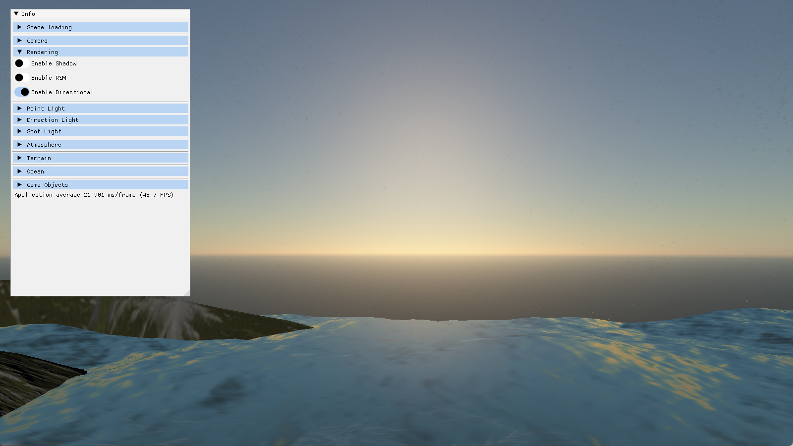
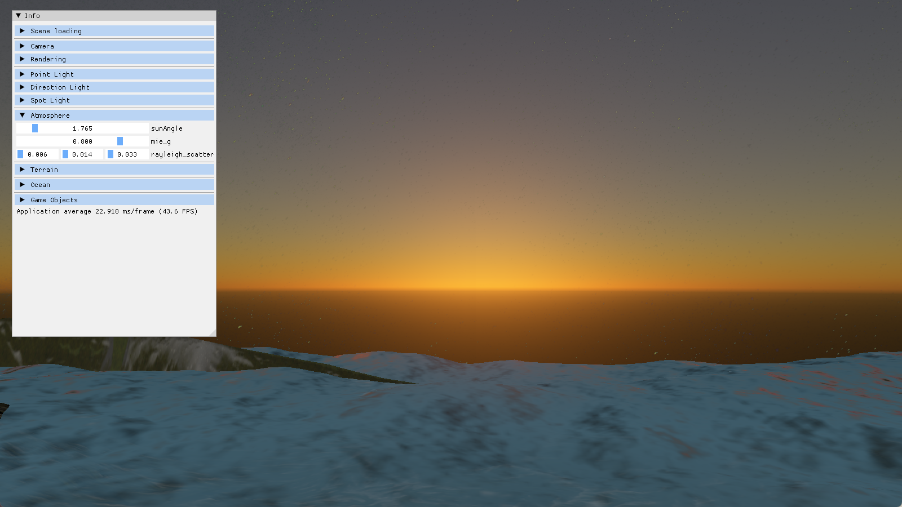
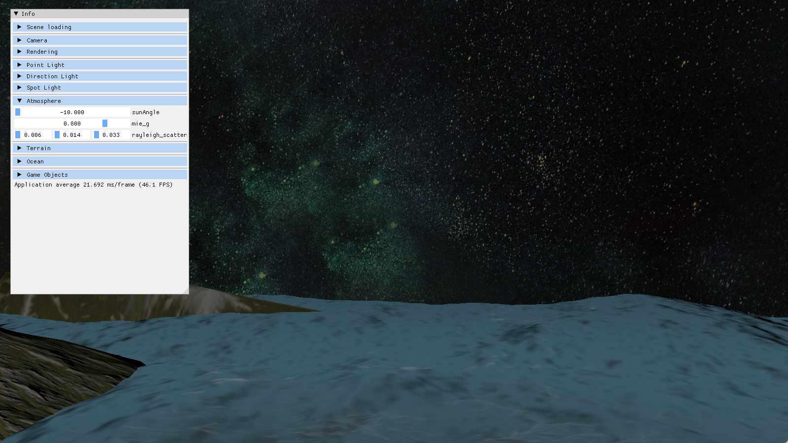
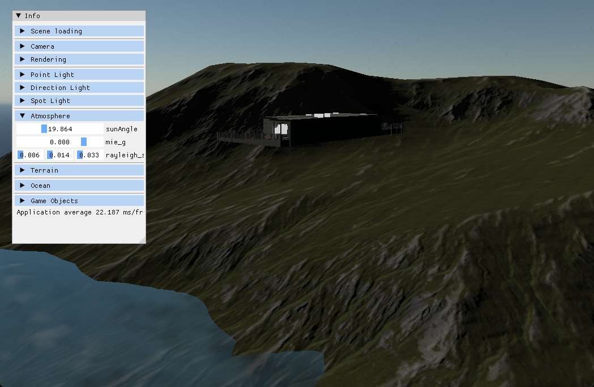
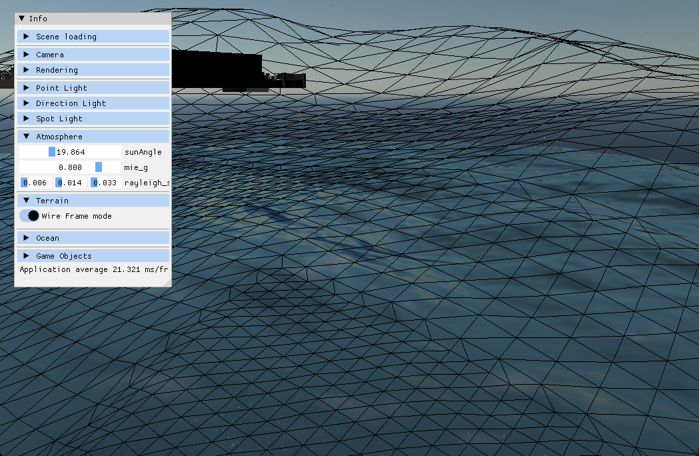
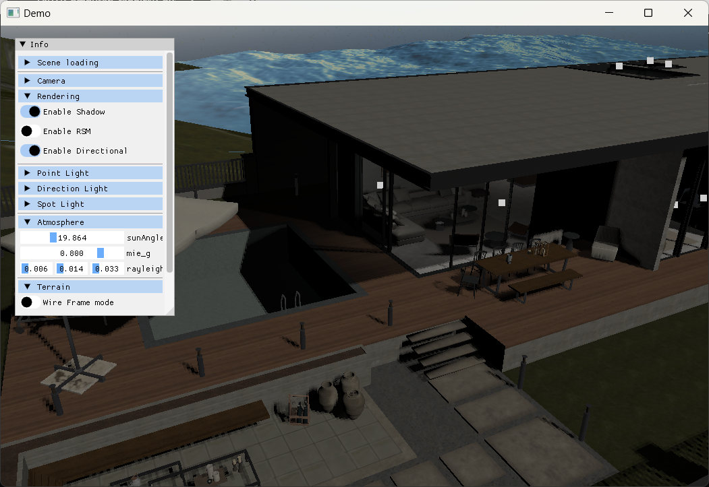
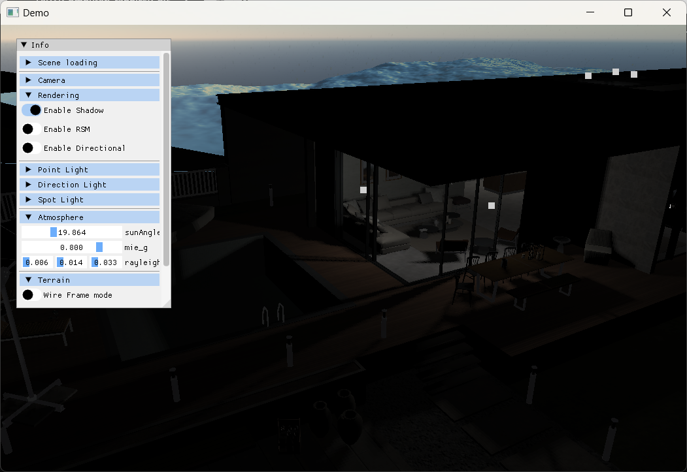
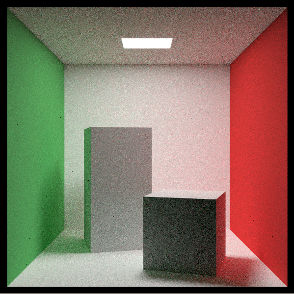

# Scene Renderer

Scene Renderer is a group project of Computer Graphics Course in Tongji University.

It is a renderer based on modern opengl, focusing on natural  and in-door scene rendering.

## Feature

### Rendering

* Physically based skies
* Volumetric cloud
* PCSS soft shadows
* PBR Material
  * isotropic
  * anisotropic
  * clear coat
  * estimation of sss (gdc 2011: fast approximation)
* Reflective shadow maps
* Realtime Ocean
* Procedural Terrain
  * quad tree lod powered by GPU driven pipeline (GDC 2018)
* Deferred Pipeline
* [ ] auto exposure

### Render System

* multi thread model loading
* asset loading from json files
* component based system

### Modern Opengl

* improve datashader storage buffer + uniform buffer
* use compute shader to accelerate computation
  * quad tree traversal & mesh generatioin in procedural terrain
  * IFFT in ocean surface generation
  * Transmission map & sky-view lut computation in sky rendering

## Gallery

+ Sky & ocean
  
  
  
+ Terrain
  
  
+ House
  
  
+ Path tracing component 
  

## Control

use `w a s d` to move, use `e q` to move up and down, hold `shift` to accelerate. 

hold `mouse right button` to look around. 

## 3rd party dependencies

+ assimp 5.0.1
+ opengl32.lib
+ glfw3
+ IrrXML
+ yaml-cpp

## Group Members

* [zyw](https://github.com/SleepinWei)
* [jyx](https://github.com/1696762169)
* [ljw](https://github.com/XiaoXKKK)
* [zzl](https://github.com/qbdl)
* [ckx](https://github.com/Moondok)
* [lkj](https://github.com/qbdl)
