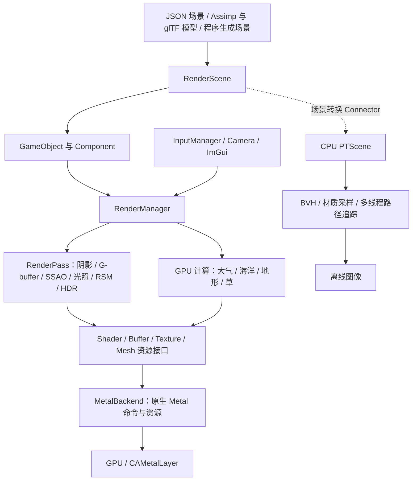
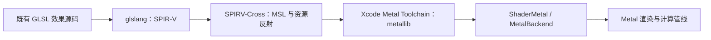

# Scene Renderer

一个用于学习和实验的 C++ 图形渲染项目，起源于同济大学计算机图形学课程小组作业。项目把**实时光栅化渲染、自然场景的 GPU 计算和独立的 CPU 路径追踪**放在同一套代码中，用可运行的场景展示材质、光照、阴影和几何生成之间的关系。

macOS 默认使用原生 **Metal**：资源创建、计算、绘制、曲面细分、ImGui 和呈现都在 Metal 上执行，不创建 OpenGL 上下文。原 OpenGL 后端仍可通过 CMake 选择。迁移过程和实现细节见[中文 Metal 迁移说明](doc/metal.md)。


## 快速运行

需要 macOS、Xcode（含 Metal Toolchain）、CMake、Python 3.9+ 和 Homebrew：

```sh
brew install glfw assimp yaml-cpp glslang spirv-cross
cmake -S . -B build -DSCENERENDERER_METAL=ON -DCMAKE_BUILD_TYPE=Release
cmake --build build -j 8
./build/Scene-Renderer --demo
```

所有运行命令均从**项目根目录**执行。`--demo` 自动生成材质、天空、海洋、地形和草；仓库未包含历史 `asset/` 资源包，配置场景缺失时也会回退到此演示。Cornell 风格场景、Bunny 和 Helmet 可直接运行，Sponza 与 San Miguel 需单独下载。

```sh
python3 tools/fetch_gi_assets.py
./build/Scene-Renderer --classic sponza
./build/Scene-Renderer --classic san-miguel
```

下载脚本获取上游模型、校验 SHA-256，并选取运行所需的 OBJ、MTL、纹理和原始说明。Sponza 压缩包约 78 MB，San Miguel 约 536 MB（511 MiB）；后者选用上游低面数版本，导入后仍有约 **562 万个三角形**，首次加载需要较长时间和较多内存。大型模型及下载缓存不提交到 Git，截图、下载清单和代码随仓库提供。资源归属和使用条件见[场景资源说明](samples/README.md)。

## 场景与效果

下面的图片均由本项目在 Apple M4 上以 **960 × 720** 离屏渲染输出，使用真实导入的模型与纹理。GI 场景使用统一的 PBR 材质近似，以太阳方向光和大气天空作为直接光照及 RSM 反弹的来源；曝光、相机及光源配置见 [MetalClassicScenes.cpp](src/metal/MetalClassicScenes.cpp)。

### Sponza：中庭与多层拱廊

使用 Frank Meinl / Crytek 的 Sponza 模型：262,267 个三角形、25 个导入网格。中庭、彩色布帘和阴影区域适合观察间接光照及材质表现。图中为本项目设置的灯光，不是上游参考渲染的复现。

| RSM 关闭 | RSM 开启 |
| --- | --- |
|  |  |

### San Miguel：植物、喷泉与庭院

使用 Guillermo M. Leal Llaguno 的 San Miguel 场景及上游改进版本，导入 281 个网格、5,617,451 个三角形。保留桌椅、树木、花盆、喷泉及原始材质贴图；叶片使用透明裁切与双面绘制，阴影和 RSM 通道也采用相同的裁切规则。

| RSM 关闭 | RSM 开启 |
| --- | --- |
|  |  |

两组对照保持相机、曝光、直接光照、天空 IBL 和 SSAO 一致，只切换 RSM。`*-direct.png` 文件名表示 RSM 关闭，画面仍包含环境光和环境遮蔽。默认强度为 1，RSM 在色调映射前使 Sponza 的平均 RGB 亮度增加 **9.26%**，San Miguel 增加 **3.00%**。这些数值衡量当前固定视角的增量，不代表与参考 GI 的准确度。它近似局部的一次漫反射间接照明，有限采样会产生噪声，且不提供完整间接遮挡、多次反弹或焦散。

<details>
<summary>查看太阳与天空各自的间接光贡献</summary>

下面仅显示 RSM 一次反弹，经相同曝光和色调映射输出；不叠加直接光或天空 IBL。

| 场景 | 太阳反弹 | 天空反弹 |
| --- | --- | --- |
| Sponza |  |  |
| San Miguel |  |  |

</details>

实现、原有问题、能量公式、15 项 GPU 数值测试和 Xcode 捕获方法见[中文 RSM 说明](doc/rsm.md)。界面可独立切换太阳／天空反弹、查看纯间接光，并调整正交覆盖范围、采样半径和采样数。

### Cornell 风格场景、Bunny 与 Helmet

| 场景 | 展示内容 | Metal 实际渲染 |
| --- | --- | --- |
| Cornell Box 风格 | 自行生成红绿侧墙、两个箱体和顶灯面板；PBR、点光源阴影、SSAO、RSM、HDR。顶灯面板的自发光外观与实际点光源照明分别处理，另有弱补光；不是原始 Cornell 测量基准。 |  |
| Stanford Bunny | 官方 PLY 网格，展示白色非金属、金色金属和蓝色非金属三种材质。 |  |
| Damaged Helmet | Khronos glTF 示例，使用原始底色、法线、金属度／粗糙度和 AO 纹理；资源包含非商业使用要求。 |  |

```sh
./build/Scene-Renderer --classic cornell
./build/Scene-Renderer --classic bunny
./build/Scene-Renderer --classic helmet
```

## 高清海洋与透明水体

海洋使用 **1024×1024 主 FFT、256×256 短波 FFT 和 513×513 水面网格**。主频谱表现长波，独立短波补充细小波纹；水面读取场景太阳和线性 HDR 天空，使用 Fresnel／GGX 光照及基于 Jacobian 的泡沫。

新增按水深计算的屏幕空间折射、RGB Beer–Lambert 吸收和近似单次散射，表现浅水透射及背光浪尖。GUI 可调吸收、散射、折射和短波细节。算法修复、数值测试、开关对照与限制见 [FFT 海洋与透明水体修复记录](docs/ocean-fft-and-rendering-review.md)。

| 高清海面 | 浅水透射与散射 |
| --- | --- |
|  |  |

截图为 1920×1080 原生 Metal 渲染；浅水场景中的材质球和底面用于观察透射。散射与折射是实时近似，尚未实现体积多次散射、焦散或屏幕外折射。

```sh
./build/Scene-Renderer --classic ocean
./build/Scene-Renderer --classic ocean-clear
./build/Scene-Renderer --render-gallery img/metal ocean
./build/Scene-Renderer --render-gallery img/metal ocean-clear
```

综合 `--demo` 使用 512×512 主 FFT，专用海洋场景使用上述高清配置。

## 整体系统设计

项目按场景、渲染调度、资源和 GPU 后端分层。`GameObject` 通过组件组合变换、网格、材质、灯光和自然场景逻辑；`RenderScene` 收集对象与相机，`RenderManager` 管理着色器、相机／光照缓冲区及各个渲染通道。


```mermaid
flowchart TD
    A[JSON 场景 / Assimp 与 glTF 模型 / 程序生成场景] --> B[RenderScene]
    B --> C[GameObject 与 Component]
    C --> D[RenderManager]
    I[InputManager / Camera / ImGui] --> D
    D --> E[RenderPass：阴影 / G-buffer / SSAO / 光照 / RSM / HDR]
    D --> F[GPU 计算：大气 / 海洋 / 地形 / 草]
    E --> G[Shader / Buffer / Texture / Mesh 资源接口]
    F --> G
    G --> H[MetalBackend：原生 Metal 命令与资源]
    H --> J[GPU / CAMetalLayer]
    B -. 场景转换 Connector .-> K[CPU PTScene]
    K --> L[BVH / 材质采样 / 多线程路径追踪]
    L --> M[离线图像]
```

当前实时路径保留 GL 风格的资源调用作为迁移边界，由 Metal 后端实现对应行为。它让既有组件和着色算法继续复用；CPU 路径追踪有自己的相机、几何、材质和积分器，独立于实时渲染通道。

### 一帧如何生成

默认延迟路径按以下顺序执行，部分通道可在界面中关闭：

1. 更新相机、灯光缓冲区，执行场景组件的 GPU 计算，例如大气 LUT、海洋 FFT、地形 LOD 与草分布。
2. 渲染方向光级联阴影和点光源阴影，为后续光照提供可见性信息。
3. 将不透明对象写入 G-buffer，记录位置、法线、底色及材质参数，并计算 SSAO。
4. 延迟光照读取 G-buffer，合成 PBR 直接光照和环境光；绘制需要前向着色的对象及天空。
5. 可选 RSM 在太阳方向的正交投影中生成位置、法线和太阳＋天空反射功率贴图；全屏读取 G-buffer，按接收表面材质采样并加入一次间接光照。无太阳和大气时可回退到聚光灯。
6. 拷贝不透明 HDR 场景，绘制包含折射、吸收和散射的水面；统一进行 HDR 曝光和色调映射，最后绘制 ImGui 并呈现。

独立前向路径使用 `DepthPass → BasePass → PostPass`，其中相机空间的前后表面深度用于近似 SSS。渲染通道的实现集中在 [RenderPass.cpp](src/renderer/RenderPass.cpp)，调度入口为 [RenderManager.cpp](src/system/RenderManager.cpp)。

### 着色器构建与 Metal 执行


```mermaid
flowchart LR
    A[既有 GLSL 效果源码] --> B[glslang：SPIR-V]
    B --> C[SPIRV-Cross：MSL 与资源反射]
    C --> D[Xcode Metal Toolchain：metallib]
    D --> E[ShaderMetal / MetalBackend]
    E --> F[Metal 渲染与计算管线]
```

[compile_metal_shaders.py](tools/compile_metal_shaders.py) 在构建期完成转换和接口适配，运行时直接加载 `.metallib` 及 JSON 反射信息。后端负责缓冲区与纹理绑定、渲染附件、计算调度、管线缓存和同步。原几何着色器的分层阴影绘制改为主机端分别提交六个立方体面或五个级联切片；细分路径先用计算处理控制点与细分因子，再绘制原生 Metal 曲面片。

## 渲染技术

| 技术 | 实现与用途 | 当前边界 |
| --- | --- | --- |
| PBR 与材质变体 | 底色、法线、金属度、粗糙度、AO；各向异性、清漆层、近似 SSS、细分位移 | 延迟路径支持各向同性 PBR，其余变体走前向路径；SSS 是实时近似 |
| 延迟与前向渲染 | G-buffer 解耦几何与光照，前向路径处理特殊材质，HDR 合成后色调映射 | 尚未实现自动曝光 |
| 阴影 | 方向光级联阴影、PCSS 软阴影、点光源立方体阴影 | 通过阴影贴图近似可见性 |
| SSAO | 屏幕空间采样核与噪声纹理，增强接触处的遮蔽 | 不包含屏幕外几何的信息，不等同于 GI |
| RSM | 太阳方向正交投影；太阳辐照度＋大气天空漫反射 LUT；每纹素反射功率、显式采样 PDF、G-buffer 全屏合成；支持聚光灯回退 | 单个投影仅记录最近表面，天空入射未计算遮蔽；局部一次漫反射反弹，可能漏光、有采样噪声 |
| 大气与 IBL | Rayleigh、Mie 与臭氧吸收；透射率、多重散射、天空视图和卷积 LUT | 使用大气天空环境，不是完整的场景反射探针系统 |
| FFT 海洋与水体 | 共轭 Phillips 频谱、归一化二维 IFFT、主波与短波叠加、法线与 Jacobian 泡沫；深度折射、RGB 消光、近似单次散射与 HDR 光照 | 周期有限海面；折射限于屏幕空间，散射厚度是近似；不是流体求解器 |
| 地形与草 | GPU 四叉树 LOD、队列、间接调度与绘制；GPU 草分布和实例化 | 当前验证使用程序生成资源 |
| 模型导入 | Assimp、glTF；GI 示例增加 OBJ/MTL 材质、透明遮罩与高度图转法线 | OBJ 的传统材质参数近似转换为 PBR，玻璃／水不做真实折射 |
| CPU 路径追踪 | 球、三角形、矩形、基础漫反射／金属／介质材质、BVH、重要性采样和多线程 | 实时场景转换仍不完整，网格材质转换为白色 Lambertian，不能作为实时 PBR 的完整参考解 |

### CPU 路径追踪

`src/PT/` 包含独立的光线、相交结构、材质采样、BVH 和积分器。`Connector` 可从实时场景提取部分几何并构建 `PTScene`；离线渲染按采样次数与最大反弹深度运行，输出 `out.ppm`。此模块仍在 CPU 上执行，本次 Metal 迁移没有加入 GPU 路径追踪。

历史 Cornell 效果（100 spp，最大深度 10）：


## 目录与模块

| 路径 | 职责 |
| --- | --- |
| `src/main.cpp` | 程序入口、命令行、窗口与主循环 |
| `include/component/`、`src/component/` | GameObject 组件、网格、灯光、大气、海洋和地形逻辑 |
| `include/renderer/`、`src/renderer/` | 场景、材质、纹理、渲染通道 |
| `src/system/` | 渲染、输入、资源与界面管理 |
| `src/buffer/` | 顶点、索引、统一与图像缓冲区接口 |
| `src/metal/` | 原生 Metal 后端、着色器加载、自检、经典场景与 OBJ 导入 |
| `src/shader/` | PBR、阴影、RSM、SSAO、大气、海洋和地形等效果源码 |
| `src/PT/` | CPU 路径追踪与实时场景转换 |
| `tools/` | 着色器转换及可复现的资源下载脚本 |
| `samples/`、`img/metal/` | 示例资产与来源清单、本项目生成的截图 |
| `doc/metal.md`、`doc/rsm.md` | 中文 Metal 迁移说明与太阳／天空 RSM 实现、验证说明 |
| `docs/ocean-fft-and-rendering-review.md` | 海洋 FFT、高清波纹、透明与散射的修复和验证记录 |

## 命令与操作

| 命令 | 用途 |
| --- | --- |
| `--demo` | 自动生成的功能演示，无需历史资产包 |
| `--classic <name>` | 选择 `cornell`、`bunny`、`helmet`、`sponza`、`san-miguel`、`ocean` 或 `ocean-clear` |
| `--frames <N>` | 窗口渲染 N 帧后退出 |
| `--render-gallery <目录> core` | 离屏生成三个随仓库提供的基础示例 |
| `--render-gallery <目录> gi` | 生成两个 GI 场景、RSM 开关对照及纯间接光／太阳／天空贡献图 |
| `--render-gallery <目录> <场景名>` | 仅生成指定场景 |
| `--render-gallery <目录>` | 生成基础示例；两个 GI 模型均已下载时也生成 GI 示例 |
| `--metal-self-test` | Metal GPU 正确性自检 |

`W/A/S/D` 移动，`E/Q` 上下移动，按住 `Shift` 加速；按住鼠标右键调整视角。ImGui 用于修改渲染选项和场景参数。上述经典场景、离屏画廊与 GPU 自检命令用于 Metal 构建。

重新生成 README 中的 GI 截图：

```sh
MTL_DEBUG_LAYER=1 MTL_SHADER_VALIDATION=1 ./build/Scene-Renderer --render-gallery img/metal gi
```

## 构建、验证与限制

基础测试无需大型 GI 模型；下载完成后可启用额外的 GI 场景测试：

```sh
MTL_DEBUG_LAYER=1 MTL_SHADER_VALIDATION=1 ctest --test-dir build --output-on-failure

cmake -S . -B build -DSCENERENDERER_METAL=ON -DSCENERENDERER_GI_TESTS=ON
cmake --build build -j 8
MTL_DEBUG_LAYER=1 MTL_SHADER_VALIDATION=1 ctest --test-dir build --output-on-failure

./build/Scene-Renderer --demo --frames 3
```

GPU 自检包含 22 项海洋数值测试、5 项水体光学测试和 15 项 RSM 能量与合成测试，并覆盖着色器库加载、计算结果读回、材质、曲面细分、天空、海洋、地形、草、阴影、SSAO/RSM，以及前向 HDR/SSS 深度。画廊测试覆盖连续切换场景，读回 HDR、法线和天空 LUT，检查非空输出与 NaN／Inf；这些是渲染正确性检查，不是与物理参考图像的误差测试。

已在 Apple M4 上使用 Metal API 与着色器校验进行验证。当前没有跨 GPU 性能对比；Metal 后端采用单命令队列并等待每帧完成，尚未优化为多帧并行提交。大规模 OBJ 导入仍需较多 CPU 内存与启动时间。

`Cloud` 当前只有声明，没有体积云实现。自动曝光、GPU 路径追踪和完整的实时场景到 CPU PBR 转换尚未实现；历史资产缺失也限制了原场景的视觉回归。Sponza 和 San Miguel 展示当前渲染器的能力，不代表已经实现完整 GI。

旧 OpenGL 后端可使用独立目录构建：

```sh
cmake -S . -B build/opengl -DSCENERENDERER_METAL=OFF
cmake --build build/opengl -j 8
```

依赖包括 GLFW、Assimp、yaml-cpp，以及随仓库提供的 GLM、ImGui、stb、tinygltf 和 glad 等。Metal 额外需要 Xcode Metal Toolchain、glslang、SPIRV-Cross；OpenGL 构建需要平台 OpenGL 库。

## 历史效果与项目成员

<details>
<summary>查看历史场景截图（不作为本次 Metal 渲染结果）</summary>

| 场景 | 效果 |
| --- | --- |
| 头盔 |  |
| 天空与海洋 |    |
| 地形与 LOD |   |
| 室内 |   |

</details>

原课程项目成员：[zyw](https://github.com/SleepinWei)、[jyx](https://github.com/1696762169)、[ljw](https://github.com/XiaoXKKK)、[zzl](https://github.com/qbdl)、[ckx](https://github.com/Moondok)、[lkj](https://github.com/qbdl)。模型、纹理及第三方代码的权利归各自作者；请阅读[资源归属与许可](samples/README.md)，尤其是非商业及研究／教育使用限制。
