# Scene Renderer

一个用于学习和实验的 C++17 图形渲染项目，起源于同济大学计算机图形学课程小组作业。项目把**实时光栅化渲染、自然场景的 GPU 计算和独立的 CPU 路径追踪**放在同一套代码中，用可运行的场景展示材质、光照、阴影和几何生成之间的关系。

实时渲染通过统一 **RHI** 支持原生 **Metal** 与 **Vulkan**，macOS 默认 Metal。默认编辑器、特殊材质、阴影、RSM、大气、FFT 海洋、地形/草、计算细分、TSAA 和 ImGui 均走新路径；默认构建不编译旧 Metal GL 兼容桥。OpenGL 保留桌面兼容路径；macOS OpenGL 4.1 不支持这些计算效果，OpenGL 4.3+ 的计算路径尚未迁移。实现、验收和剩余平台边界见 [RHI 重构计划](docs/rhi-refactor-plan.md)，历史 Metal 迁移见 [旧迁移说明](doc/metal.md)。


[快速运行](#快速运行) · [经典场景](#场景与效果) · [天空与太阳](#大气天空与太阳) · [海洋与水体](#高清海洋与透明水体) · [虚拟纹理地形](#虚拟纹理地形) · [系统设计](#整体系统设计) · [技术与限制](#渲染技术) · [验证](#构建验证与限制)

项目的主要实验内容包括 PBR 材质及特殊材质、太阳／天空驱动的 RSM 间接光照、大气散射、高清 FFT 海洋与透明水体、高度与材质 Virtual Texture 地形／草和 TSAA。编辑器可实时调整相机、灯光及效果参数；离屏画廊提供固定时间、固定视角的真实渲染图和开关对照。CPU 路径追踪用于独立的离线实验。

## 快速运行

以下命令从**仓库根目录**执行。首次运行可直接使用程序生成的 `--demo`、`--classic sky`、`--classic ocean` 或 `--classic terrain`，无需下载大型场景。

### macOS：原生 Metal

需要 macOS、Xcode（含 Metal Toolchain）、CMake、Python 3.9+ 和 Homebrew：

```sh
brew install glfw assimp yaml-cpp glslang spirv-cross
cmake -S . -B build -DSCENERENDERER_RHI_BACKEND=Metal -DSCENERENDERER_LEGACY_METAL=OFF -DCMAKE_BUILD_TYPE=Release
cmake --build build -j 8
./build/Scene-Renderer --demo

# 单独查看自然场景
./build/Scene-Renderer --classic sky
./build/Scene-Renderer --classic ocean
```

### Vulkan

Vulkan 主后端需要 Vulkan SDK、GLFW 3.4、Assimp、yaml-cpp、glslangValidator 与 spirv-cross。macOS 使用 MoltenVK；可通过 `Vulkan_INCLUDE_DIR` / `Vulkan_LIBRARY` 指定 SDK 位置。

```sh
cmake -S . -B build/vulkan -DSCENERENDERER_RHI_BACKEND=Vulkan -DCMAKE_BUILD_TYPE=Release
cmake --build build/vulkan -j 8
./build/vulkan/Scene-Renderer --demo
ctest --test-dir build/vulkan --output-on-failure
```

macOS 上也可以在 Metal 构建中同时编译 Vulkan，再通过启动参数选择：

```sh
cmake -S . -B build -DSCENERENDERER_RHI_BACKEND=Metal -DSCENERENDERER_VULKAN_PROTOTYPE=ON
cmake --build build -j 8
./build/Scene-Renderer --demo --backend Vulkan
```

原生编辑器默认主逻辑／渲染双线程，`--single-thread` 可切换同步对照。`--forward` 使用完整场景的前向光照；`--frames N` 有界运行，`--time 8` 固定海洋/草时间，`--size 800x450` 与 `--resize 640x360` 用于窗口回归，`--frames-in-flight 1` 可对照默认的 3 个在途提交。`--screenshot path.ppm` 保存包括 UI 的最后一帧。`--render-gallery directory core` 保存无 UI 的经典场景 PNG。本机 Metal 回归启用 API／Shader Validation；Vulkan／MoltenVK 通过 GPU 数值测试验证。本机没有 Khronos validation layer，不能把这些结果视为 Vulkan layer 验证；对 MoltenVK 开启 MetalTools 的已知阻塞组合由 CTest 单独关闭。

### 示例资源

`--demo` 自动生成材质、天空、海洋、地形和草；仓库未包含历史 `asset/` 资源包，配置场景缺失时也会回退到此演示。Cornell 风格场景、Bunny 和 Helmet 可直接运行，Sponza 与 San Miguel 需单独下载；高清海洋和透明浅水场景由程序生成，可直接运行。

```sh
python3 tools/fetch_gi_assets.py
./build/Scene-Renderer --classic sponza
./build/Scene-Renderer --classic san-miguel
```

下载脚本获取上游模型、校验 SHA-256，并选取运行所需的 OBJ、MTL、纹理和原始说明。Sponza 压缩包约 78 MB，San Miguel 约 536 MB（511 MiB）；后者选用上游低面数版本，导入后仍有约 **562 万个三角形**，首次加载需要较长时间和较多内存。大型模型及下载缓存不提交到 Git，截图、下载清单和代码随仓库提供。资源归属和使用条件见[场景资源说明](samples/README.md)。

## 场景与效果

下面的实时效果图已使用本项目的**新 RHI／原生 Metal** 在 Apple M4 上重新生成：经典场景与天空为 **960 × 720**，海洋为 **1920 × 1080**。每张图独立清空 TSAA 历史并累积 16 帧，导入场景使用真实模型与纹理。GI 场景使用统一的 PBR 材质近似，以太阳方向光和大气天空作为直接光照及 RSM 反弹的来源；当前曝光、相机及光源配置见 [ClassicScenes.cpp](src/renderer/rhi/ClassicScenes.cpp)。

### Sponza：中庭与多层拱廊

使用 Frank Meinl / Crytek 的 Sponza 模型：262,267 个三角形、25 个导入网格。中庭、彩色布帘和阴影区域适合观察间接光照及材质表现。图中为本项目设置的灯光，不是上游参考渲染的复现。

| RSM 关闭 | RSM 开启 |
| --- | --- |
|  |  |

### San Miguel：植物、喷泉与庭院

使用 Guillermo M. Leal Llaguno 的 San Miguel 场景及上游改进版本，导入 281 个网格、5,617,451 个三角形。保留桌椅、树木、花盆、喷泉及原始材质贴图；叶片使用透明裁切与双面绘制，阴影和 RSM 通道也采用相同的裁切规则。

| RSM 关闭 | RSM 开启 |
| --- | --- |
| 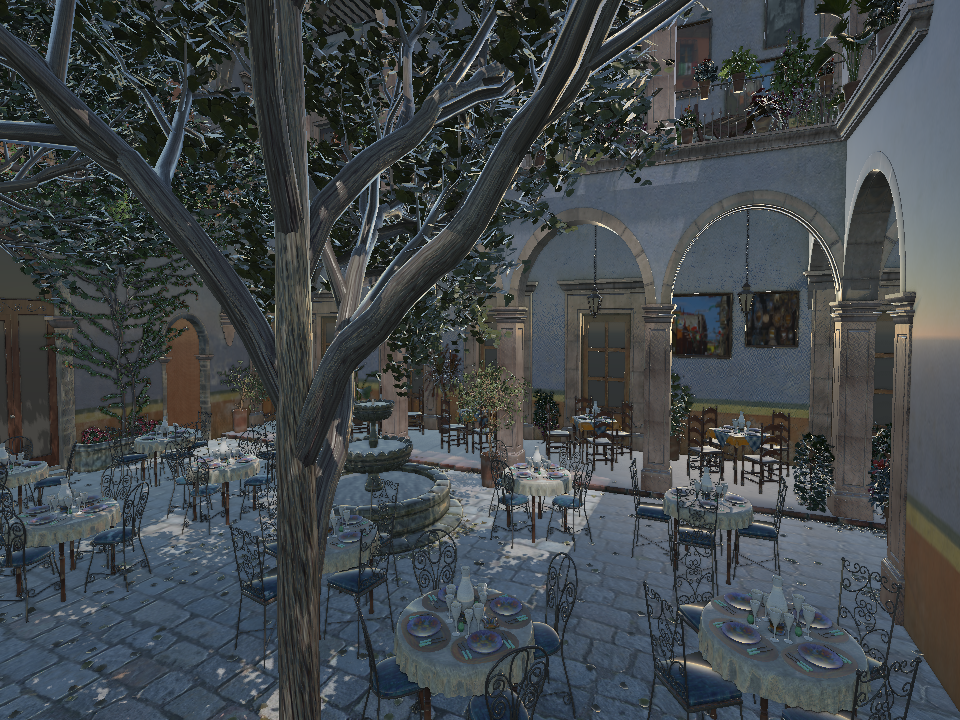 |  |

两组对照保持相机、曝光、直接光照、天空 IBL 和 SSAO 一致，只切换 RSM。`*-direct.png` 文件名表示 RSM 关闭，画面仍包含环境光和环境遮蔽。默认强度为 1，RSM 在色调映射前使 Sponza 的平均 RGB 亮度增加 **5.62%**，San Miguel 增加 **3.01%**。这些数值衡量当前固定视角的增量，不代表与参考 GI 的准确度。它近似局部的一次漫反射间接照明，有限采样会产生噪声，且不提供完整间接遮挡、多次反弹或焦散。

<details>
<summary>查看太阳与天空各自的间接光贡献</summary>

以下几何表面仅显示 RSM 一次反弹，经相同曝光和色调映射输出，不叠加表面的直接光或天空 IBL；背景天空和自发光表面仍保留。

| 场景 | 太阳反弹 | 天空反弹 |
| --- | --- | --- |
| Sponza | 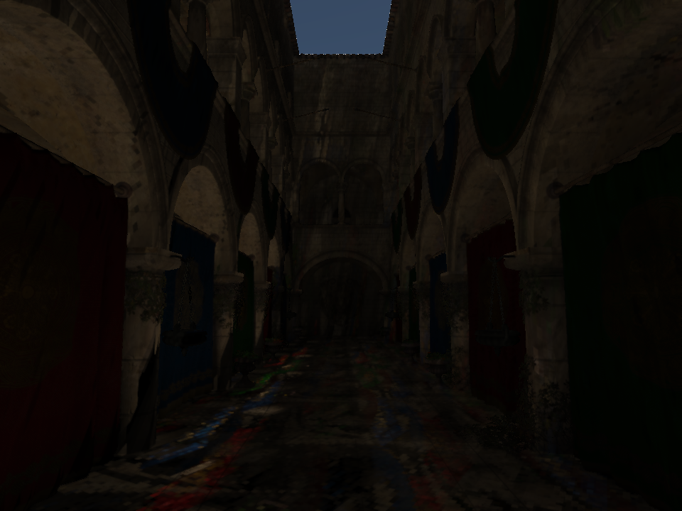 | 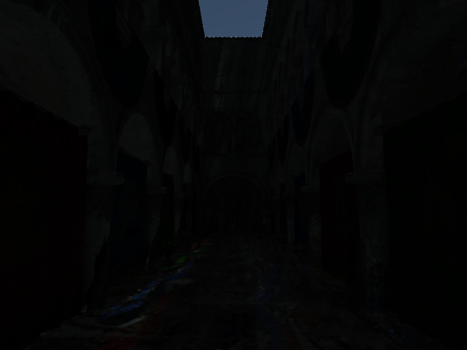 |
| San Miguel | 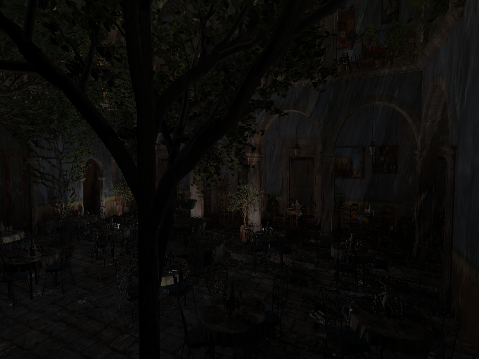 | 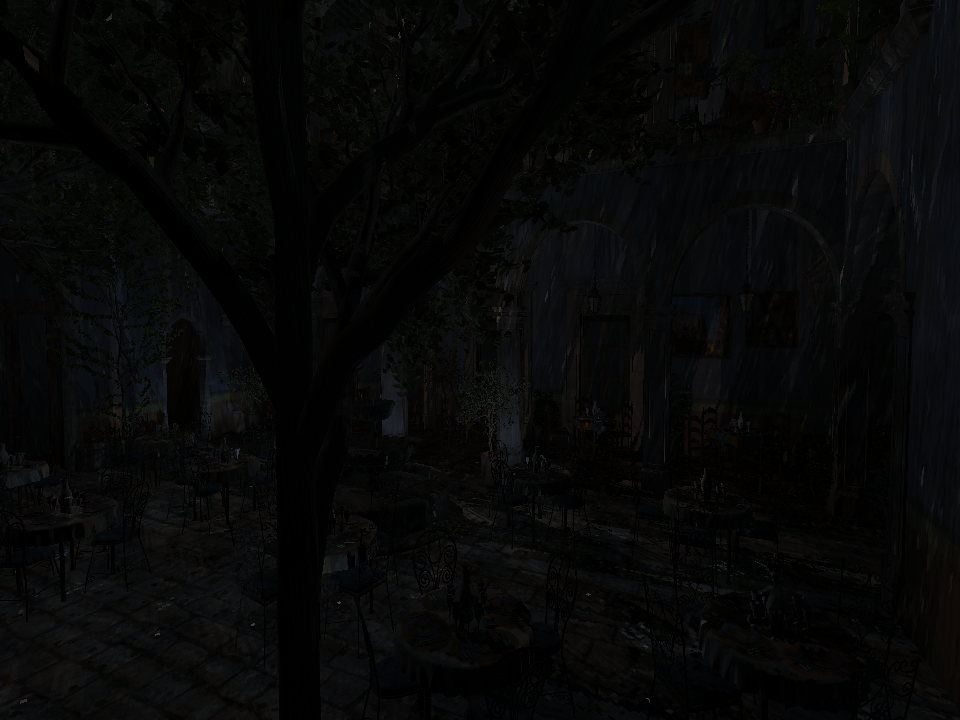 |

</details>

实现、原有问题、能量公式、历史 GPU 数值测试和 Xcode 捕获方法见[中文 RSM 说明](doc/rsm.md)。界面可独立切换太阳／天空反弹、查看纯间接光，并调整正交覆盖范围、采样半径和采样数。

### Cornell 风格场景、Bunny 与 Helmet

| 场景 | 展示内容 | Metal 实际渲染 |
| --- | --- | --- |
| Cornell Box 风格 | 自行生成红绿侧墙、两个箱体和顶灯面板；PBR、点光源阴影、SSAO、RSM、HDR。顶灯面板的自发光外观与实际点光源照明分别处理，另有弱补光；不是原始 Cornell 测量基准。 | 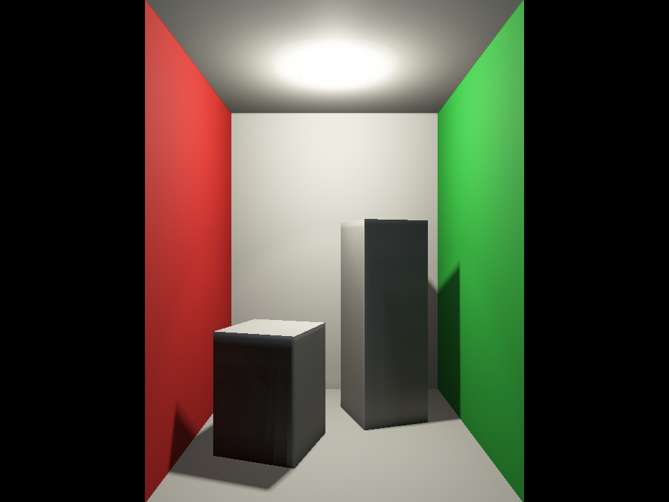 |
| Stanford Bunny | 官方 PLY 网格，展示白色非金属、金色金属和蓝色非金属三种材质。 |  |
| Damaged Helmet | Khronos glTF 示例，使用原始底色、法线、金属度／粗糙度和 AO 纹理；资源包含非商业使用要求。 |  |

```sh
./build/Scene-Renderer --classic cornell
./build/Scene-Renderer --classic bunny
./build/Scene-Renderer --classic helmet
```

## 大气天空与太阳

天空使用 Rayleigh／Mie 散射、臭氧吸收和各向同性高阶散射近似，按相机的米制海拔计算透射率与地平线。**太阳盘在背景片元中解析绘制**，其真实角半径独立于天空 LUT 分辨率；默认角直径约 0.573°。大气顶层的太阳辐照度同时驱动天空、PBR、RSM 和海洋，直接光乘大气透射及地球遮挡，日落时逐渐变红、衰减，太阳盘完全被地球遮住后不再提供直接照明，天空散射仍可保留暮光。

| 白天天空 | 太阳特写 | 地平线日落 |
| --- | --- | --- |
|  |  |  |

GUI 可修改太阳仰角、方位、角半径、多次散射强度、地面反照率与海平面。第一盏启用的方向光是太阳来源，面板与灯光保持同步。太阳盘不写进 IBL LUT，避免与直接方向光重复计算；显示、材质、RSM 和海面共享球面采样编码。实现、历史问题、能量公式和 Metal／Vulkan 回归数值见 [天空与太阳修复记录](docs/sky-and-sun-review.md)。

```sh
./build/Scene-Renderer --classic sky
./build/Scene-Renderer --render-gallery img/metal sky
```

太阳盘使用 `L = E_top × T / (π × sin²(radius))`，增大角半径同时降低盘内辐亮度，保持总能量一致。零散射回归中，半径加倍后的离散总能量变化约 **0.62%**；极小角半径触发 RGBA16F 的 65000 显示上限时会损失能量，具体边界见修复记录。

`sky` 画廊还输出 10° 太阳和 -5° 暮光；纯天空示例没有地表几何，地球遮挡部分为暗色。RGB 光强尚未做绝对光度标定，当前不包含云、星空或自动曝光。

## 高清海洋与透明水体

海洋使用 **1024×1024 主 FFT、256×256 短波 FFT 和 513×513 水面网格**。主频谱表现长波，独立短波补充细小波纹；水面读取场景太阳和线性 HDR 天空，使用 Fresnel／GGX 光照及基于 Jacobian 的泡沫。

`--classic ocean` 默认展示波涛汹涌的深海：28 m/s 风速、1.8 倍高度和更陡的浪峰，配合压缩区域的白沫及透亮浪尖。GUI 可继续调整风速、`HeightScale` 与 `Choppiness`；`ocean-clear` 保留较平缓的浅水配置。

水体采用按水深计算的屏幕空间折射、RGB Beer–Lambert 吸收和近似单次散射，表现浅水透射及背光浪尖。GUI 可调吸收、散射、折射和短波细节。算法修复、数值测试、开关对照与限制见 [FFT 海洋与透明水体修复记录](docs/ocean-fft-and-rendering-review.md)。

| 高清大浪海面 | 浅水透射与散射 |
| --- | --- |
|  |  |

截图为 1920×1080 原生 Metal 渲染，开启 TSAA 并累积 16 帧；浅水场景中的材质球和底面用于观察透射。散射与折射是实时近似，尚未实现体积多次散射、焦散或屏幕外折射。

```sh
./build/Scene-Renderer --classic ocean
./build/Scene-Renderer --classic ocean-clear
./build/Scene-Renderer --render-gallery img/metal ocean
./build/Scene-Renderer --render-gallery img/metal ocean-clear
```

综合 `--demo` 使用 512×512 主 FFT，专用海洋场景使用上述高清配置。

<details>
<summary>查看短波、散射和透明水体的开关对照</summary>

主波、相机、曝光与时间保持一致，各图独立清空 TSAA 历史。深海对照分别关闭短波或散射；浅水对照同时关闭折射和散射，以显示透射路径的作用。

| 深海关闭短波 | 深海关闭散射 |
| --- | --- |
|  |  |

| 浅水透射与散射开启 | 浅水关闭折射与散射 |
| --- | --- |
|  |  |

</details>

## 虚拟纹理地形

地形高度图和五层 PBR 材质使用软件 **Virtual Texture**：固定物理 tile 缓存、mip 页表、祖先回退、边框过滤和区域上传。高度生成与草共用页采样；旧 float32 高度文件可直接按页读取，大场景可使用离线 pack，使高度和材质均无需在运行时完整解码。

GPU 四叉树有固定叶节点预算，耗尽时保留父节点。公共整数网格处理不同 LOD 的接缝，边界法线按实际差分跨度计算。默认网格从约 237.5 MiB 降至 19 MiB；8192² 虚拟尺寸下，网格与两套默认 VT 资源合计约 30.16 MiB，不包含草、阴影和其他渲染目标。

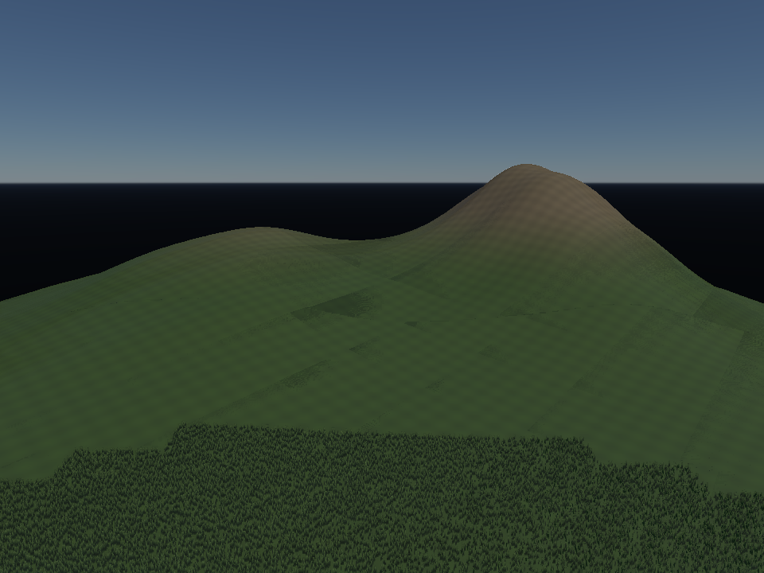

```bash
./build/Scene-Renderer --classic terrain
./build/Scene-Renderer --render-gallery img/metal terrain
```

示例由程序生成 1024² 高度与底色，无需额外下载；默认请求由 CPU 保守视锥预测，每帧限制页读取／上传数量。当前尚未加入后台 IO、GPU 屏幕反馈或高度 morph，快速移动时可暂时回退到粗 mip。离线分页命令、配置、修复记录与验证见 [地形 Virtual Texture 说明](docs/terrain-virtual-texture.md)。

<details>
<summary>查看同一视角的 LOD 网格</summary>

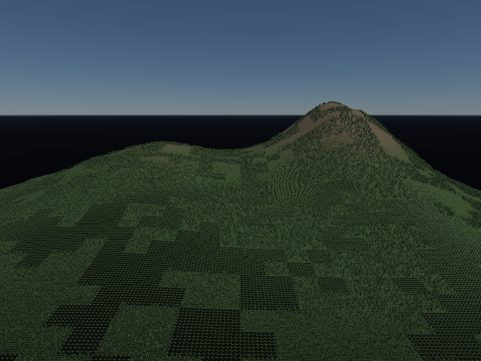

</details>

## TSAA 时域超采样抗锯齿

新 RHI 的完整场景渲染默认启用 TSAA，前向／延迟着色共用后处理。它使用 16 点 Halton 子像素抖动，在 HDR 色调映射前重投影并累积历史颜色。线性深度检查、YCoCg 邻域裁剪和自适应权重减少残影；海面使用前后两帧 FFT 位移生成运动信息，处理波浪自身运动。

GUI 的 `Enable TSAA` 可关闭此效果。场景切换、窗口尺寸、明显相机跳变以及太阳／大气参数变化会重置历史。当前 Metal 效果图均已重新生成，每张图运行 16 帧，静态表面累积 TSAA，各开关对照单独清空历史；当前动态地形／草使用 reactive 标记，不累积相关像素的历史；历史图片仍保留历史标记。具体设计、测试与边界见 [TSAA 实现说明](docs/tsaa.md)。

## 整体系统设计

项目按主逻辑、不可变场景快照、CPU 资产任务、渲染调度和 GPU 后端分层。主线程拥有 `RenderScene`、输入、相机和 ImGui，`SceneSnapshotBuilder` 准备可共享的 const CPU payload；独立 `RenderRuntime` 从有界队列消费快照，`SceneAdapter.resolve` 只在渲染线程创建 GPU 网格／材质和绘制包。`RenderManager` 保留编辑器设置及旧兼容调度。

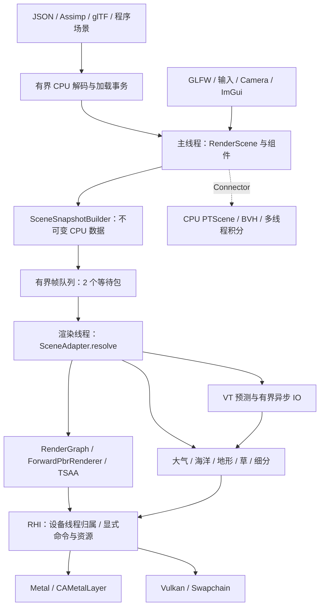
```mermaid
flowchart TD
    A[JSON / Assimp / glTF / 程序场景] --> J[有界 CPU 解码与加载事务]
    J --> B[主线程：RenderScene 与组件]
    I[GLFW / 输入 / Camera / ImGui] --> B
    B --> S[SceneSnapshotBuilder：不可变 CPU 数据]
    S --> Q[有界帧队列：2 个等待包]
    Q --> D[渲染线程：SceneAdapter.resolve]
    D --> E[RenderGraph / ForwardPbrRenderer / TSAA]
    D --> F[大气 / 海洋 / 地形 / 草 / 细分]
    D --> T[VT 预测与有界异步 IO]
    T --> F
    E --> G[RHI：设备线程归属 / 显式命令与资源]
    F --> G
    G --> H[Metal / CAMetalLayer]
    G --> V[Vulkan / Swapchain]
    B -. Connector .-> K[CPU PTScene / BVH / 多线程积分]
```

新 Metal／Vulkan 路径直接使用 RHI 的缓冲区、纹理、管线、资源绑定和命令列表。GL 风格组件字段仍用于读取历史场景数据，但原生 GPU 效果由 `src/renderer/rhi/` 调度；旧 `RenderPass` 与 Metal GL 兼容桥只属于保留的兼容路径。RHI 后端负责资源生命周期、状态转换、上传／读回、提交及呈现，支持多个在途帧；算法与 backend 分开，CPU 路径追踪保持独立。

### 一帧如何生成

1. 主线程收集相机、几何、材质、太阳及局部灯光，复制 GUI draw data，发布不可变快照；CPU jobs 准备新资产，渲染线程接纳有预算的上传并更新地形 LOD、草和细分。
2. 统一太阳状态和观察高度；按参数缓存或更新大气 LUT，更新海洋 FFT、位移、法线与泡沫。
3. `ShadowRenderer` 渲染方向光级联、点光源六面及聚光灯阴影；可选捕获太阳／天空 RSM 的位置、法线与反射功率。
4. 不透明对象写入 G-buffer，计算 SSAO；全屏合成 PBR、天空与 RSM；前向模式改用共享材质公式绘制场景。前后表面深度用于近似 SSS。
5. 拷贝不透明 HDR 场景，绘制排序透明材质与折射／吸收／散射水面，并生成物体和海面的运动信息。
6. TSAA 在 HDR 中检查深度、重投影与裁剪历史，然后统一曝光、色调映射，绘制 ImGui 并呈现。

组件通过 weak owner 避免对象引用环，网格／材质／组件使用稳定 ID 与内容版本。RenderScene 结构、组件注册表与 owner 私有，具体类型查询采用索引；增删组件自动维护灯光索引。Transform／Light／Camera 的核心参数、Mesh／Material 的容器与 MeshRenderer 设置均通过检查接口访问；几何及贴图槽修改自动更新内容版本，材质标量复用图片缓存。后台任务只提交 ID／值命令，由主线程限量执行，场景替换使旧入口失效。

资源缓存合并同 key 的解码；同设备普通 GPU 图片按内容共享，空闲 LRU 默认 64 MiB，sampler 独立。Loader 后台构建并验证完整 staging，经封存／future 移交后在主线程一次发布，CPU 构建失败保留旧场景。RHI buffer／texture 支持可选统一逻辑负载配额及逐次分配峰值统计；压力时回收空闲图片并等待退役资源。原生双线程编辑器在候选 GPU 帧超限时恢复缓存、保留上一张成功画面，并定时重试。VT 页通过有界 IO jobs 准备后由渲染线程上传，未完成页保持粗 mip 回退；有序 render graph 在记录前检查初始化及读写声明。线程归属、取消／退出、上传预算、单线程对照和剩余边界见 [Engine 多线程说明](docs/engine-multithreading.md) 与 [设计审查](docs/engine-design-review.md)。

`--forward` 在同一场景调度中改用前向材质光照，保留阴影、环境光、水体和后处理。核心实现见 [ForwardPbrRenderer.cpp](src/renderer/rhi/ForwardPbrRenderer.cpp)、[SceneAdapter.cpp](src/renderer/rhi/SceneAdapter.cpp) 与 [RenderManager.cpp](src/system/RenderManager.cpp)。

### 统一着色器构建

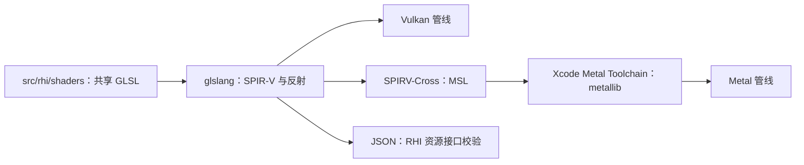
```mermaid
flowchart LR
    A[src/rhi/shaders：共享 GLSL] --> B[glslang：SPIR-V 与反射]
    B --> V[Vulkan 管线]
    B --> C[SPIRV-Cross：MSL]
    C --> D[Xcode Metal Toolchain：metallib]
    D --> E[Metal 管线]
    B --> F[JSON：RHI 资源接口校验]
```

[compile_rhi_shaders.py](tools/compile_rhi_shaders.py) 在构建期生成 `.spv`、Metal `.metallib`、反射信息和 OpenGL 可用的 shader 版本。运行时按后端加载二进制及接口描述，C++ 校验统一缓冲区布局与绑定。阴影由主机分别提交各级联／六面；细分使用共享 GPU 计算生成可绘制几何，使 Metal／Vulkan 复用同一效果代码。

## 渲染技术

| 技术 | 实现与用途 | 当前边界 |
| --- | --- | --- |
| PBR 与材质变体 | 底色、法线、金属度、粗糙度、AO；各向异性、清漆层、近似 SSS、细分位移 | 新 RHI 场景前向／延迟共享材质着色公式；SSS 使用前后表面深度近似厚度 |
| 延迟与前向渲染 | G-buffer 解耦几何与光照，完整场景可切换前向着色，HDR 合成后色调映射 | 尚未实现自动曝光 |
| 阴影 | 方向光五级联、点光源六面、聚光灯阴影 atlas；3×3 PCF 过滤 | 有限分辨率与深度偏移近似可见性；当前新 RHI 未实现 PCSS |
| TSAA | Halton 投影抖动、深度重投影、物体／海洋运动信息、HDR／YCoCg 历史裁剪与自适应累积 | 新 RHI 场景前向／延迟共用后处理；快速运动和透明表面仍可能模糊或拖影 |
| SSAO | 屏幕空间采样核与噪声纹理，增强接触处的遮蔽 | 不包含屏幕外几何的信息，不等同于 GI |
| RSM | 太阳方向正交投影；太阳辐照度＋大气天空漫反射 LUT；每纹素反射功率、显式采样 PDF、G-buffer 全屏合成；支持聚光灯回退 | 单个投影仅记录最近表面，天空入射未计算遮蔽；局部一次漫反射反弹，可能漏光、有采样噪声 |
| 大气与 IBL | 共享太阳状态、相机海拔、解析太阳盘；Rayleigh／Mie／臭氧、透射率、高阶散射近似、天空与 E/π 卷积 LUT | RGB 模型；太阳盘 HDR 上限 65000；未实现完整场景反射探针或环境遮挡 |
| FFT 海洋与水体 | 共轭 Phillips 频谱、归一化二维 IFFT、主波与短波叠加、法线与 Jacobian 泡沫；深度折射、RGB 消光、近似单次散射与 HDR 光照 | 周期有限海面；折射限于屏幕空间，散射厚度是近似；不是流体求解器 |
| 地形与草 | 高度／五层材质 VT、固定页缓存与祖先 mip 回退、有预算 GPU 四叉树、跨 LOD 拼接、间接实例草 | CPU 预测请求与有界异步 IO（原生编辑器）；无 GPU feedback／高度 morph；动态地形仍使用 reactive 时域路径 |
| 模型导入 | Assimp、glTF；GI 示例增加 OBJ/MTL 材质、透明遮罩与高度图转法线 | OBJ 的传统材质参数近似转换为 PBR，玻璃／水不做真实折射 |
| CPU 路径追踪 | 球、三角形、矩形、基础漫反射／金属／介质材质、BVH、重要性采样和多线程 | 实时场景转换仍不完整，网格材质转换为白色 Lambertian，不能作为实时 PBR 的完整参考解 |

### CPU 路径追踪

`src/PT/` 包含独立的光线、相交结构、材质采样、BVH 和积分器。`Connector` 可从实时场景提取部分几何并构建 `PTScene`；离线渲染按采样次数与最大反弹深度运行，输出 `out.ppm`。此模块在 CPU 上执行，独立于实时 RHI；当前没有 GPU 路径追踪。

历史 Cornell 效果（100 spp，最大深度 10）：

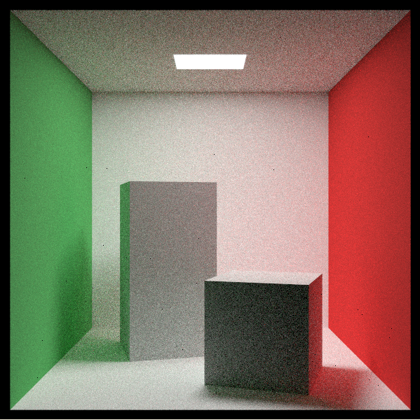

## 目录与模块

| 路径 | 职责 |
| --- | --- |
| `src/main.cpp` | 程序入口、命令行、窗口与主循环 |
| `include/component/`、`src/component/` | GameObject 组件、网格、灯光、大气、海洋和地形逻辑 |
| `include/renderer/`、`src/renderer/` | 场景、材质、纹理、渲染通道 |
| `src/system/` | 渲染、输入、资源与界面管理 |
| `src/buffer/` | 顶点、索引、统一与图像缓冲区接口 |
| `src/metal/` | 退役的 Metal GL 兼容桥及历史自检；默认构建不编译 |
| `src/rhi/shaders/` | 统一 PBR、阴影、RSM、SSAO、大气、海洋、地形及 TSAA shader |
| `src/renderer/rhi/`、`src/rhi/` | 效果调度、GPU 资源、原生后端与验证入口 |
| `src/shader/` | 旧 OpenGL / Metal 兼容路径效果源码 |
| `src/engine/`、`include/engine/` | 有界任务与帧队列、资源 cache、资产 ID、render graph 与渲染线程 |
| `src/PT/` | CPU 路径追踪与实时场景转换 |
| `tools/` | 着色器转换及可复现的资源下载脚本 |
| `samples/`、`img/metal/` | 示例资产与来源清单、本项目生成的截图 |
| `doc/metal.md`、`doc/rsm.md` | 中文 Metal 迁移说明与太阳／天空 RSM 实现、验证说明 |
| `docs/sky-and-sun-review.md` | 历史天空问题、新 RHI 太阳／大气修复、能量与 GPU 回归 |
| `docs/engine-multithreading.md`、`docs/engine-design-review.md`、`docs/engine-followup-fixes.md` | 主逻辑／渲染分离、资源事务与快照、GPU 图片共享与修复、设计评价及下一步 |
| `docs/engine-world-commands.md` | 私有组件注册表、线程封存移交、后台值命令与 RHI 统一资源配额 |
| `docs/engine-data-boundaries.md` | 核心数据私有化、资产移交、自动版本失效、参数校验与剩余边界 |
| `docs/engine-gpu-publication.md` | 内存压力回收、候选 GPU 缓存事务、失败画面保留与恢复、成本与验收 |
| `docs/tsaa.md` | TSAA 重投影、海洋运动信息、历史处理与截图复现 |
| `docs/ocean-fft-and-rendering-review.md` | 海洋 FFT、高清波纹、透明与散射的修复和验证记录 |

## 命令与操作

| 命令 | 用途 |
| --- | --- |
| `--demo` | 自动生成的功能演示，无需历史资产包 |
| `--classic <name>` | 选择 `cornell`、`bunny`、`helmet`、`sponza`、`san-miguel`、`sky`、`ocean`、`ocean-clear` 或 `terrain` |
| `--frames <N>` | 窗口渲染 N 帧后退出 |
| `--render-gallery <目录> core` | 离屏生成三个随仓库提供的基础示例 |
| `--render-gallery <目录> gi` | 生成两个 GI 场景、RSM 开关对照及纯间接光／太阳／天空贡献图 |
| `--render-gallery <目录> <场景名>` | 仅生成指定场景 |
| `--render-gallery <目录>` | 默认生成三个基础示例 |
| `--gpu-resource-budget-mib <N>` | 原生编辑器的 RHI buffer／texture 逻辑负载配额；默认 0 不限额；双线程编辑器超限保留成功画面并重试，冷启动失败仍报错；不含 driver heap 等隐式开销 |
| `--single-thread` | 原生编辑器同步对照；默认 Metal／Vulkan 使用独立渲染线程 |
| `--rhi-self-test` | 所选 RHI 后端的 GPU 正确性自检 |

`W/A/S/D` 移动，`E/Q` 上下移动，按住 `Shift` 加速；按住鼠标右键调整视角。ImGui 用于修改渲染选项和场景参数。经典场景和离屏画廊支持 Metal/Vulkan；同时编译两后端时加 `--backend Vulkan`。`--rhi-self-test` 同时支持 OpenGL 基础路径。历史 `--metal-self-test` 仅在显式启用 `SCENERENDERER_LEGACY_METAL` 时提供。

### 复现 README 图集

下载 GI 资源后，使用原生 Metal 构建生成全部当前效果图：

```sh
python3 tools/fetch_gi_assets.py
for scene in core gi sky ocean ocean-clear terrain; do
    MTL_DEBUG_LAYER=1 MTL_SHADER_VALIDATION=1 \
        ./build/Scene-Renderer --render-gallery img/metal "$scene"
done
```

`core` 输出 Bunny、Helmet、Cornell 及 Cornell 的 RSM 关闭图；`gi` 输出 Sponza／San Miguel 的 RSM 开关和三种间接光图；`sky` 输出五种太阳高度／视角；海洋命令同时输出短波、散射或透射对照。文件统一写入 `img/metal/`。Vulkan 构建可使用相同画廊命令，另选输出目录，并省略 Metal 验证环境变量。

## 构建、验证与限制

基础 CTest 无需大型 GI 模型。下载模型后可另外运行新 RHI 画廊：

```sh
MTL_DEBUG_LAYER=1 MTL_SHADER_VALIDATION=1 ctest --test-dir build --output-on-failure
ctest --test-dir build/vulkan --output-on-failure
./build/Scene-Renderer --render-gallery build/rhi/gallery-metal gi
./build/vulkan/Scene-Renderer --render-gallery build/rhi/gallery-vulkan gi
./build/Scene-Renderer --demo --frames 3
```

GPU 验证覆盖上传/异步读回、延迟释放、MRT、前向/延迟 PBR、SSS 深度、透明排序、三类阴影、SSAO、太阳/天空 RSM、大气 LUT、完整海洋 IFFT、地形/草的 VT 区域上传、页淘汰与回退、流式高度、网格预算和闭合接缝、计算细分及 TSAA。CPU 数值参考和限定的像素比较用于检查结果；编辑器测试同时覆盖真实 resize、UI 与窗口呈现。画廊提供实际模型和贴图的视觉回归，不以历史截图作为物理参考图像。

2026-10-03 Engine 多线程回归在 Apple M4/macOS 验收：Metal **11/11**、Vulkan/MoltenVK **12/12**；有界 CPU cache／job／帧队列、世界命令与 graph 测试在 ThreadSanitizer 下通过。本轮后续修复同时通过 OpenGL 兼容路径 **8/8**。包括主逻辑／渲染分离、加载事务、快照／GUI 隔离、场景结构／组件自动灯光索引、封存移交、旧世界／旧组件命令失效、混合 RHI 资源配额、GPU 图片共享／LRU 与 CPU 地址复用、上传等待保留资产、异步地形、窗口缩放与单线程对照；新增核心数据边界回归包含错误线程访问、非法参数保留、Camera／Mesh／Material 移交和材质标量／图片版本隔离，结果仍为 Metal 11/11、Vulkan 12/12、OpenGL 8/8。内存压力与 GPU 发布回归也通过以上三个后端；新增空闲图片回收、候选缓存回滚、窗口／海洋超限时像素保持及后续恢复验证，CPU RHI 压力回调测试通过 TSan。完整应用没有在 ThreadSanitizer 下验收。

2026-10-03 天空修复在 Apple M4/macOS 验收：Metal **8/8**、Vulkan/MoltenVK **9/9**，包含太阳角半径／能量、地平线及几何遮挡、控制同步、观察高度与极限参数。OpenGL 4.1 的历史 RHI 验收为 7/7，本轮未重复运行。Metal 开启 API/Shader Validation；本机没有 Khronos validation layer，Windows/Linux 与 OpenGL 4.3+ 尚未实机验收。Metal/Vulkan 使用单队列、最多三帧并行提交；单次吞吐测量和算法边界见 [RHI 重构计划](docs/rhi-refactor-plan.md)。大规模 OBJ 导入仍需较多 CPU 内存与启动时间。

`Cloud` 当前只有声明，没有体积云实现。自动曝光、GPU 路径追踪和完整的实时场景到 CPU PBR 转换尚未实现；历史资产缺失也限制了原场景的视觉回归。Sponza 和 San Miguel 展示当前渲染器的能力，不代表已经实现完整 GI。

旧 OpenGL 后端可使用独立目录构建：

```sh
cmake -S . -B build/opengl -DSCENERENDERER_RHI_BACKEND=OpenGL -DCMAKE_BUILD_TYPE=Release
cmake --build build/opengl -j 8
```

依赖包括 GLFW、Assimp、yaml-cpp，以及随仓库提供的 GLM、ImGui、stb、tinygltf 和 glad 等。Metal 额外需要 Xcode Metal Toolchain、glslang、SPIRV-Cross；OpenGL 构建需要平台 OpenGL 库。

## 历史效果与项目成员

<details>
<summary>查看历史场景截图（不作为本次 Metal 渲染结果）</summary>

| 场景 | 效果 |
| --- | --- |
| 头盔 | 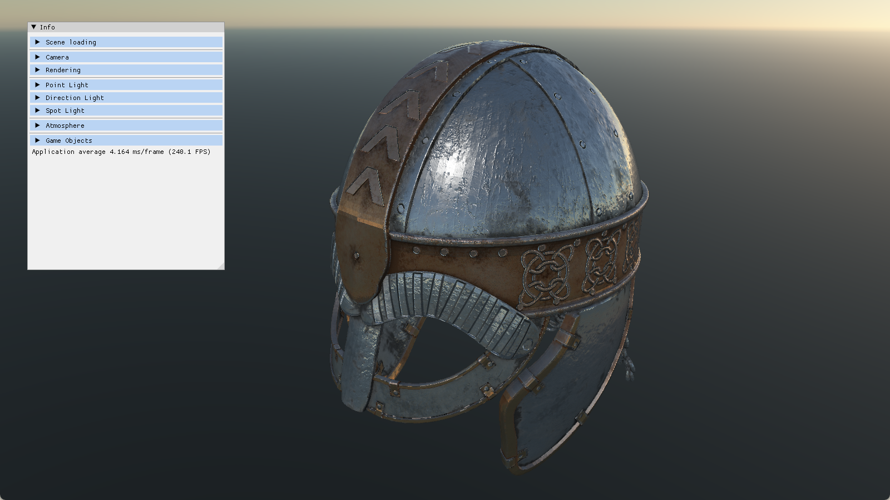 |
| 天空与海洋 | 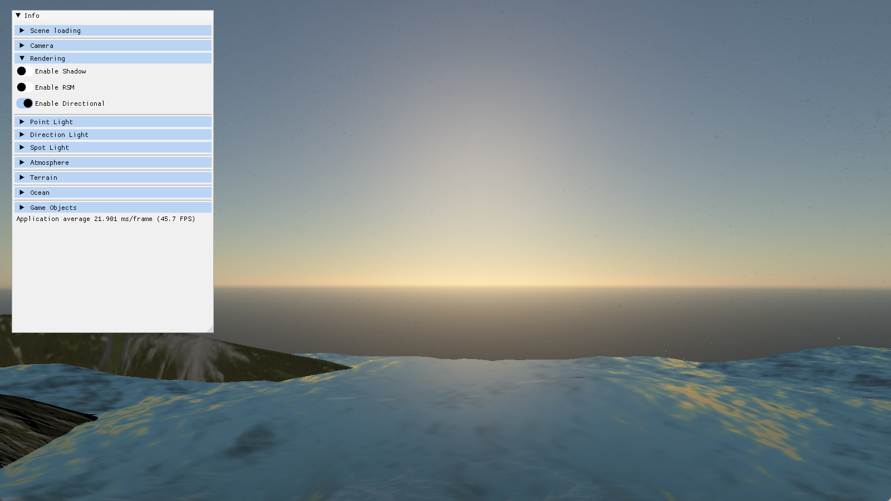 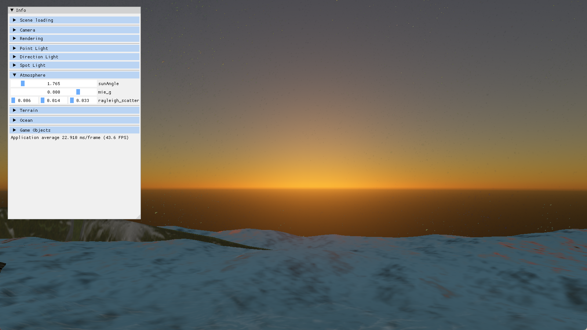 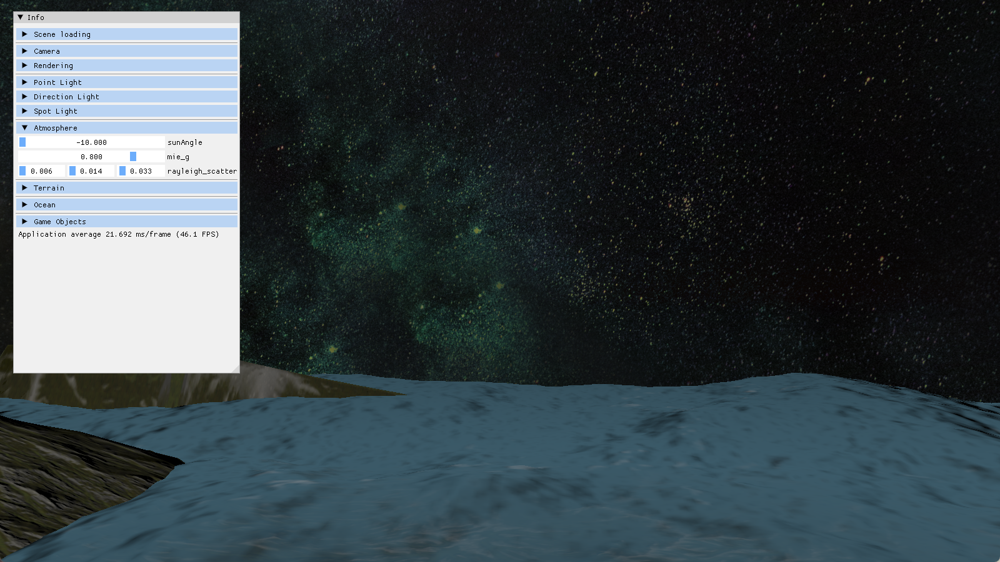 |
| 地形与 LOD | 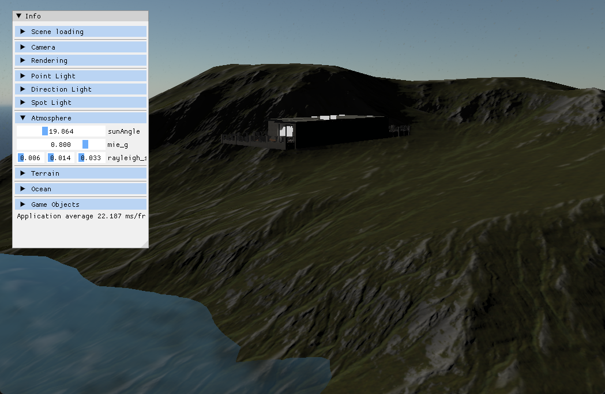 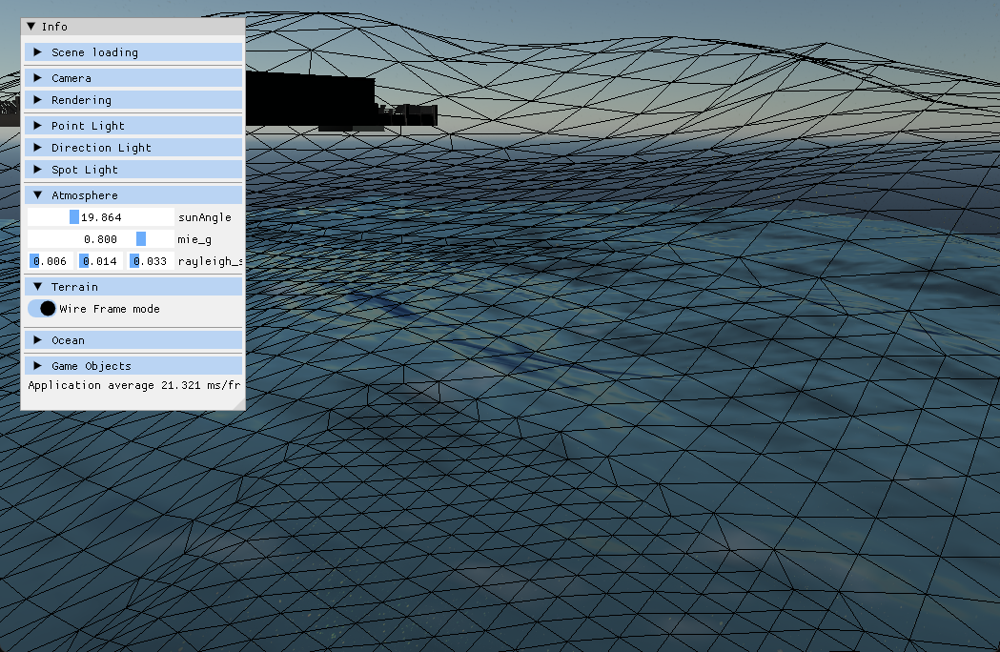 |
| 室内 | 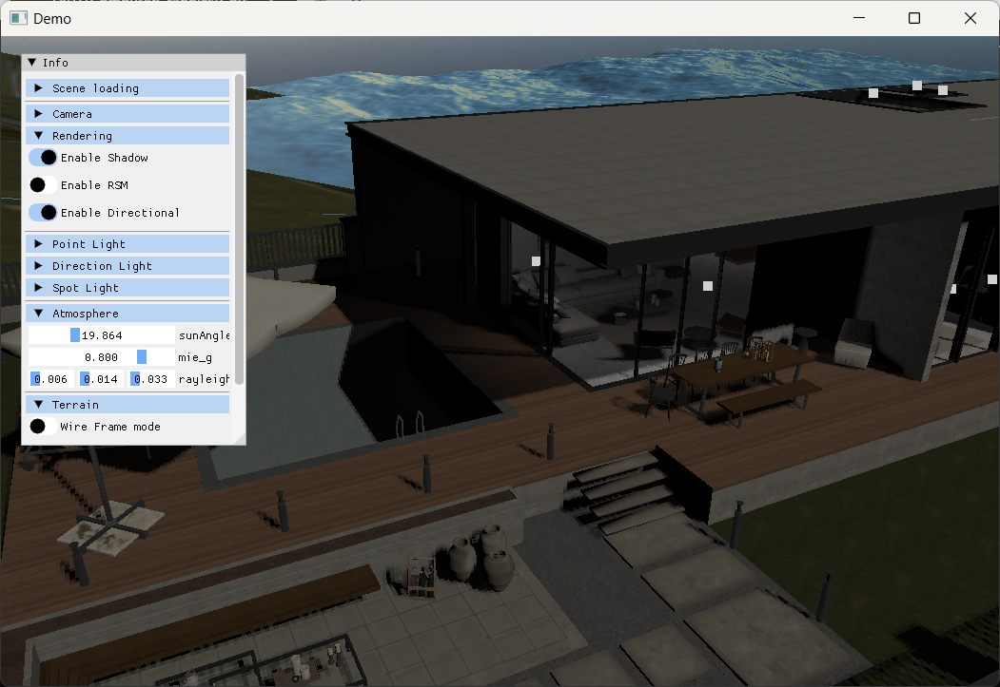 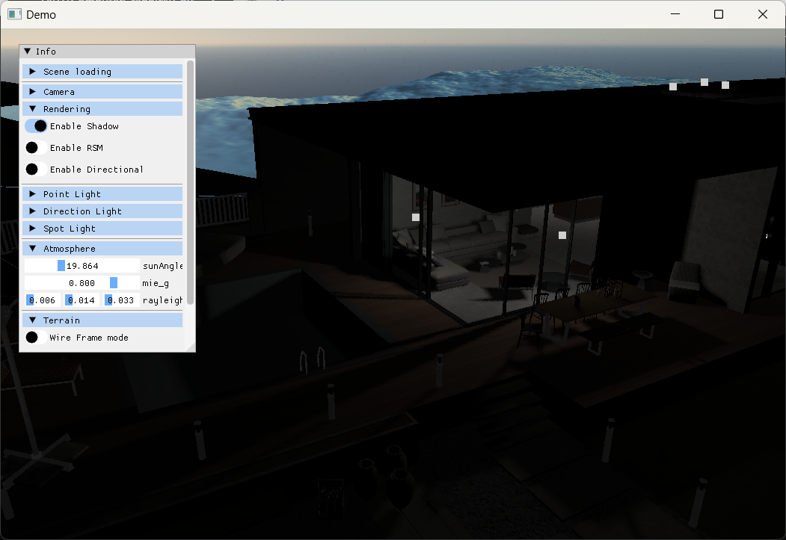 |

</details>

原课程项目成员：[zyw](https://github.com/SleepinWei)、[jyx](https://github.com/1696762169)、[ljw](https://github.com/XiaoXKKK)、[zzl](https://github.com/qbdl)、[ckx](https://github.com/Moondok)、[lkj](https://github.com/qbdl)。模型、纹理及第三方代码的权利归各自作者；请阅读[资源归属与许可](samples/README.md)，尤其是非商业及研究／教育使用限制。
