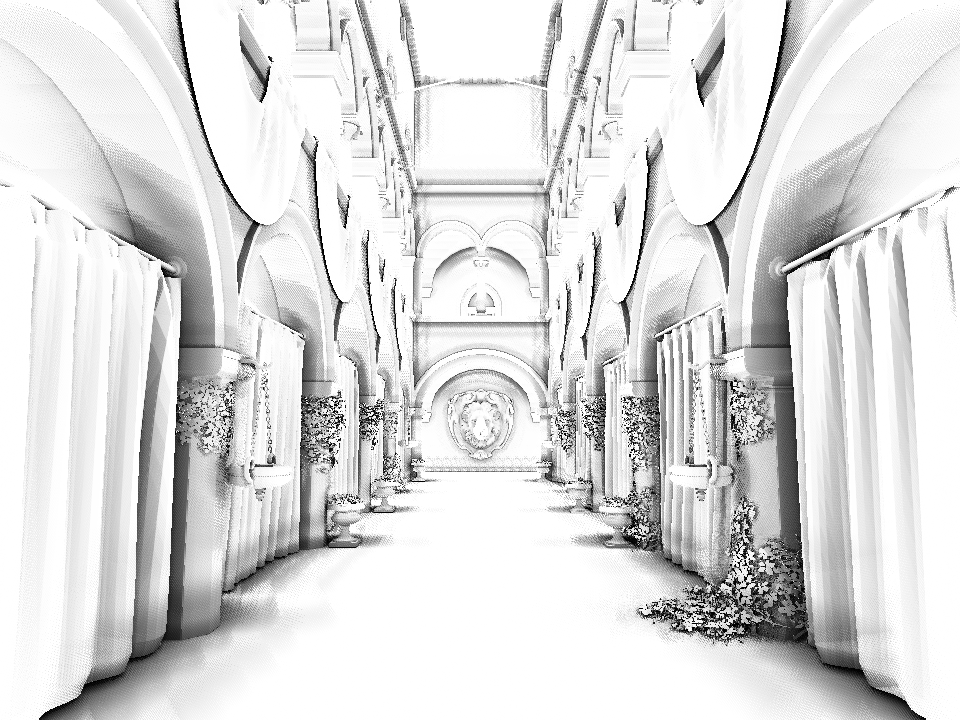
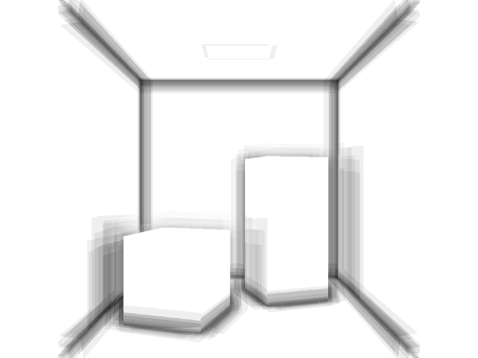
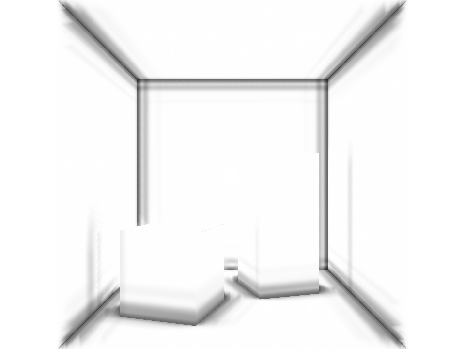

# 环境遮蔽 AO：审查与改进

2026-10-05。本次针对新 RHI 的 `PbrPath::Scene`，Metal／Vulkan 共用 GLSL。默认改为 **GTAO 思路的地平线积分 + 边缘保留空间滤波**，保留原 24 点 SSAO 供对照。它是本项目的简化实现，尚未与射线追踪 AO 做定量标定，不应理解为完整 XeGTAO 移植或已验证的 ground truth。

## 原算法与问题

原 `ssao.frag` 从位置和法线 G-buffer 重建视空间，在法线半球中固定取 24 个样本，投影到屏幕后比较采样深度，统计遮挡比例，再应用 `aoPower`。半径与 bias 使用世界单位。

| 原实现 | 影响 |
| --- | --- |
| 固定 24 点，无逐像素旋转 | 柱脚、墙角和拱廊的遮挡呈离散条带；直接增加采样数成本较高 |
| 范围衰减只比较视空间 Z 差 | 横向很远的物体也可能贡献遮挡，轮廓附近容易出现过宽的黑边 |
| 只用有效样本数作为分母 | 屏幕边缘和背景附近的样本集合变化可能使遮挡不稳定 |
| 使用法线贴图后的法线放置几何采样 | 无真实起伏的平面也可能因着色法线变化产生自遮挡 |
| 没有独立空间降噪 | 依赖最终场景 TSAA 掩盖条带；关闭 TSAA 时更明显 |
| AO 参数未加入场景历史 key | 切换半径或方法后可能混入旧 TSAA 画面 |

原合成方式只衰减环境光，直接光与 RSM 间接光另行计算。这部分保持一致。AO 是局部可见性近似，不能替代 GI，也不宜通过提高强度使整张画面变黑。

## 当前实现

```text
Opaque G-buffer：世界位置 + 着色法线
        ↓
短边单侧位置差分 → 几何法线
        ↓
旋转屏幕切片 → 双向地平线搜索 → 可见弧积分
        ↓
Raw AO（线性可见性）
        ↓
5×5 几何平面距离 / 着色法线引导滤波
        ↓
AO 对比度 → 环境光合成 → 场景 TSAA / tone mapping
```

- **地平线积分**：默认 4 个切片，每侧 4 步，共 32 个候选位置查询；另有几何法线重建访问。二次距离分布把更多样本放在接触附近，逐像素静态角度旋转减少固定条带。当前没有帧间旋转或独立 AO 历史。
- **真实空间范围**：使用完整 XYZ 距离拒绝半径外样本，末段平滑衰减。屏幕外及背景视作开放方向，不重复边界 texel。世界空间 bias 用于排除近共面误差。
- **几何法线**：左右／上下选较短的有效位置差分，避免跨深度断层；避免把法线贴图当成真实遮挡几何，退化位置才回退到着色法线。
- **积分归一化**：同一组有限切片的可见积分除以无遮挡积分，使孤立倾斜平面维持可见性 1。这是本实现的有限采样修正；并非照搬论文的全部推导与补偿项。
- **空间滤波**：5×5 权重联合像素距离、邻点离中心几何平面的距离和着色法线相似度。拒绝背景与半径外邻点；先滤线性可见性，再应用对比度，减少条带与颗粒而保留几何边界。
- **RHI 与状态**：`ao-raw → ao-filter → lighting` 声明读写依赖；前向／延迟场景共用最终 AO。原始和最终 attachment 均随 resize 重建。禁用及零半径清白；非有限／越界参数在提交前拒绝。开关、方法、品质和半径等参数全部加入 TSAA 历史 key。
- **线程设置**：主线程快照、预加载场景、同步渲染及画廊均传递同一组 AO 设置。

当前 RHI 只提供 RGBA 格式，所以 raw／filtered AO 均为 RGBA16F。新增 raw attachment 在 1080p 占约 **15.8 MiB**；这是提高质量的第一阶段，尚未完成带宽和半分辨率优化。

## 实际效果对照

以下均由本项目原生 Metal 渲染，960×720，固定时间 8 秒，半径 1、bias 0.025、power 1.5，默认 4×4 地平线搜索。**关闭 RSM 和 TSAA**，保留相同场景、材质、直接光、天空与曝光。每种模式固定渲染 16 帧，无时域累积；纯 AO 图来自当前帧最终可见性 attachment，包含 power 处理，白色为无遮挡。

| 原 24 点 SSAO：Sponza | 地平线 AO + 空间滤波：Sponza |
| --- | --- |
|  |  |

| 地平线 AO：未滤波 | 地平线 AO：边缘保留滤波 |
| --- | --- |
|  |  |

| AO 关闭：同一光照 | AO 开启：同一光照 |
| --- | --- |
|  |  |

| 原 SSAO：Cornell | 地平线 AO + 空间滤波：Cornell |
| --- | --- |
|  |  |

柱脚、拱廊的离散条带明显减少，接触遮挡更连续。滤波前的随机颗粒仍然可见，说明空间滤波有实际作用；单层屏幕空间数据在植物和薄布附近仍可能过遮挡。最终颜色图中改善幅度取决于环境光比例，直接照明强的区域不会因 AO 显著变暗。

[完整 Cornell 参数与统计](../img/ao/cornell-ao-metrics.json)／[完整 Sponza 参数与统计](../img/ao/sponza-ao-metrics.json)。几何像素平均可见性仅用于复现和回归；数值更低并不意味着质量更好。这次不报告独立 AO GPU 毫秒或与射线参考的误差。

## 参数与复现

原生 GUI 的 Ambient Occlusion 控制区提供方法、降噪、半径、bias、对比度与搜索品质。`enableSSAO` / `FrameData::ssao` 保留旧字段名，含义现在是总 AO 开关；`readSSAO()` 返回最终可见性，`readRawAO()` 返回对比度处理前的线性结果。

| 参数 | 默认值 | 调整方式 |
| --- | --- | --- |
| `aoHorizon` | true | false 切回原 24 点 SSAO |
| `aoDenoise` | true | 关闭可检查采样颗粒；legacy 也可使用新滤波 |
| `aoRadius` | 1 | 世界单位；0 禁用。过大会扩大屏幕空间失真 |
| `aoBias` | 0.025 | 世界单位；过大容易漏接触遮挡 |
| `aoPower` | 1.5 | 1 为线性可见性；提高会增强对比而非提高准确度 |
| `aoSlices` / `aoSteps` | 4 / 4 | 各 2–8；候选查询数为 `slices × steps × 2` |

从仓库根目录运行。先按 [构建与运行](getting-started.md)准备依赖，并下载 Sponza：

```bash
python3 tools/fetch_gi_assets.py --scene sponza
cmake --build build -j8
./build/Scene-Renderer --render-gallery build/ao ao --backend Metal
# 编译 Vulkan 后使用对应构建目录，backend 名区分大小写：
./build/vulkan/Scene-Renderer --render-gallery build/ao-vulkan ao --backend Vulkan
```

画廊导出两场景的 `off / legacy / gtao-raw / gtao` 颜色图、最终 AO 可见性 PNG 和参数 JSON。`gtao-raw` 表示关闭空间滤波；图中仍包含 power 处理，真正的线性 raw 值由 `readRawAO()` 获取。

## 验证

本次隔离构建使用已提交基线加本次 AO 文件，避免把工作区并行的 PT 改动混入提交。测试平台为 Apple M4，Vulkan 通过 MoltenVK。Metal 启用 API／Shader Validation；Vulkan 测试关闭 MetalTools 的阻塞组合，本机未安装 Khronos validation layer。

新增 GPU 回归覆盖：正面／倾斜／正交孤立平面与屏幕边缘保持无遮挡、法线贴图平面不自遮挡、近遮挡物降低接收面可见性、半径外物体不产生接收面黑边、滤波不污染背景、直接光不变而环境光衰减、前向／延迟 AO 一致、禁用／零半径清白、参数拒绝、65×49 奇数尺寸重建，以及方法／半径变化后 TSAA 输出等同清空历史的首帧。

验收：Metal 全套 **17/17** 通过，追加的最终 AO／TSAA GPU 回归单独复跑通过；Vulkan 构建全套 **18/18** 通过。一次 Metal GPU 回归与其他 GPU 任务并行时，在已有路径追踪测试阶段触发 60 秒上限，AO 断言已通过；随后单独完整复跑该 GPU 用例通过。工作区应用构建也已通过。

## 下一步顺序

1. **先建立误差和性能基准**：固定 Cornell／Sponza 接触与薄片视角，用同一几何和半径生成射线 AO 参考；记录 AO 两个 pass 的独立 GPU 时间、带宽、RMSE 和运动序列。当前图片证明条带减少，不能证明全场景准确度超过其他 AO 算法。
2. **深度预处理、层级搜索与单通道格式**：扩展 RHI 的 R16F／R32F 支持，改用线性深度重建位置，构建适合 AO 的 depth mip；远步查更粗 mip，降低全分辨率位置 G-buffer 查询成本。注意保守过滤，避免吞掉薄物体。
3. **半分辨率与边缘重建**：加入半分辨率 AO、深度／法线引导上采样及可选高品质全分辨率。先验收细柱、植物、轮廓和镜头运动，避免以帧率换明显漏遮挡。
4. **独立时域 AO**：接入运动向量、深度／几何法线拒绝、disocclusion 清除与历史裁剪，允许帧间样本旋转；与最终 TSAA 分开控制，验证快速相机和移动物体的拖影。
5. **可见性与光照细化**：评估薄片补偿／多层深度，输出 bent normal 改善方向性天空遮挡；漫反射和镜面环境光分开处理 specular occlusion，避免当前统一标量过度压暗光滑反射。
6. **屏幕之外的遮挡**：可用多视图深度、距离场或原生 ray query 补充屏幕外／背面信息。优先保留局部 AO 与 RSM 的职责，避免重复压暗已有间接光。

## 主要源码与参考

源码：`src/rhi/shaders/ssao.frag`、`ao-common.glsl`、`ao-filter.frag`，`src/renderer/rhi/ForwardPbrRenderer.cpp`，`SceneEffectsValidation.cpp`、`FeatureGallery.cpp`，`include/engine/RenderSettings.h` 与 `include/GUI.h`。

- [Practical Realtime Strategies for Accurate Indirect Occlusion（GTAO）](https://www.activision.com/cdn/research/PracticalRealtimeStrategiesTRfinal.pdf)：地平线搜索、可见性积分与实时近似。
- [Intel XeGTAO 官方实现与说明](https://github.com/GameTechDev/XeGTAO)：深度预过滤、mip 采样、主 AO pass、空间滤波及薄遮挡物启发式的工程取舍。本项目没有直接复制其完整 shader 或自动参数标定流程。
