# Blender 场景与仓库 Path Tracing

2026-10-05 接入两个官方 Blender 示例。渲染图由本仓库的 Metal PT 生成；Blender 仅用于离线读取 `.blend`、评估几何及烘焙材质颜色／world，不用于生成下面的最终 beauty 图。

| 场景 | 来源与作者 | 原始许可 | 当前用途 |
| --- | --- | --- | --- |
| Classroom | [Blender 官方](https://www.blender.org/download/demo-files/)，Christophe Seux | CC0 | 室内多次反弹、太阳／面积灯、集合实例和多材质 |
| Barcelona Pavilion | [Blender 官方](https://www.blender.org/download/demo-files/)，eMirage / Hamza Cheggour | CC-BY，官方页面未指定版本 | 建筑、薄玻璃、反射、水面和粒子实例压力 |

源归档地址与 SHA256 固定在 [资产清单](../samples/blender-assets.json)，署名及转换变更见 [资源声明](../samples/licenses/blender-scenes.txt)。大文件和导出包位于忽略的 `samples/assets/blender/`，不提交源模型到 Git。

## 场景包与复现

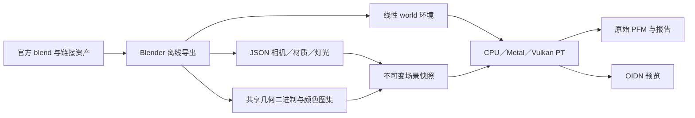

准备工具使用本机 Blender 4.5 LTS 或兼容版本；`--blender` 可传可执行文件的完整路径。正式渲染阶段无需安装 Blender。后台导出使用 `--disable-autoexec` 和 `--python-exit-code 1`；校验源 ZIP，保留链接库，导出失败明确返回错误。

```sh
python3 tools/prepare_blender_scenes.py --blender /path/to/blender
# 只获取原始资源：追加 --fetch-only。
# 图集质量：--atlas-size 512；默认 256。

for scene in blender-classroom blender-barcelona; do
  ./build/pt/Scene-Renderer --path-trace-gpu "$scene" \
    --pt-size 640x360 --pt-samples 256 --pt-bounces 24 --pt-fixed --pt-denoise \
    --pt-output "build/path-tracing/blender/${scene#blender-}"
done
# CPU：入口改为 --path-trace；Vulkan：使用其构建并追加 --backend Vulkan。

# 自定义 Blender 文件可直接导出并读取，无需增加经典场景工厂。
blender --background custom.blend --disable-autoexec --python-exit-code 1 \
  --python tools/export_blender_pt.py -- --output build/custom-pt
./build/pt/Scene-Renderer --path-trace-gpu custom \
  --pt-scene-file build/custom-pt/scene.json --pt-size 640x360 --pt-samples 256
```

`SceneRenderer.PT.v1` 包保存原始透视相机的 world／projection 矩阵，坐标从 Blender Z-up 转成 Y-up，不改变长度单位。调整输出宽高比时保留垂直视场；不包含景深或运动模糊。几何为 little-endian `PTMESH01` + 每顶点八个 float32（位置、法线、UV），按三角形连续排列；JSON 指向共享范围、材质和模型变换。CPU／Metal／Vulkan 使用共享几何 BLAS 和实例 TLAS；负行列式的绕序、非均匀缩放的逆转置法线、材质与介质身份按实例保存，不再展开顶点。

导出先把 evaluated depsgraph 的几何复制为独立数值，再进行烘焙，避免保留临时实例对象引用。当前评估图采用 Blender 的 viewport depsgraph，细分等级设为 render level；仍不是所有 render-only modifier／粒子设置的完整 Cycles 捕获。原相机、所选 scene、frame、源文件校验、灯光和转换诊断写入包及最终渲染报告。

底色图集烘焙选定 lobe 的颜色图，并按当前渲染器的 pow(2.2) 约定编码；内部 node group 未展开的颜色 socket 有常量 fallback 诊断。world 单独烘焙到 512×256 线性 EXR，再输出 float32 环境；经纬方向按 [Cycles 相机变换](https://github.com/blender/blender/blob/v4.5.14/intern/cycles/blender/camera.cpp) 和 [全景投影](https://github.com/blender/blender/blob/v4.5.14/intern/cycles/kernel/camera/projection.h) 对齐本仓库的 -Z 经度零点。没有将 AgX／compositor 结果当作 HDR 光照。

太阳转换为保留方向与角半径的有限光源；面积灯转换为均匀三角形 emitter；点灯／聚光灯使用逆平方衰减。旧 light-node falloff、blackbody 色彩及 area spread 存在明确近似，不能据此宣称与 Cycles 灯光完全相同。

## 预览与规模

下面均为实际 Metal PT，640×360、固定 256 spp、深度 24、曝光 1，OIDN 的预滤波 albedo／normal 辅助降噪。

| Classroom — Christophe Seux，CC0 | Barcelona Pavilion — eMirage，CC-BY |
| --- | --- |
|  |  |

Classroom 使用 `_mainScene` 的原相机，保留 673 个集合实例；源场景中的独立 dust／volumeLight 合成场景没有加入本次输运。Barcelona 使用原文件默认的 `2- time: sunset` 和原相机，植被明确使用 **512／20,622** 粒子实例预算。默认不是完整粒子 benchmark；被省略的植被会改变阴影和反射。

软件 BLAS/TLAS 已支持 `--particle-limit -1` 的完整 Barcelona 包：本次固定版本导出 **54,966,539** 个三角形实例，保留 **20,622／20,622** 个植被粒子。下方历史对照仍使用 512 粒子，新的完整结果见[共享 BLAS/TLAS 与完整植被](#共享-blastlas-与完整植被)。默认下载工具继续使用 512 粒子便于快速预览；Classroom 的集合实例不受该预算影响。

| 当前包 | 独立对象 | 来源／保留实例 | 图集 | 导出三角形（含退化面） |
| --- | --- | --- | --- | --- |
| Classroom | 332 | 673 集合实例 | 211×256² | 654,696 |
| Barcelona（revision 4） | 100 | 528 实例，其中粒子 512 | 80 组 color／ORM + 30 normal，256² | 1,455,687 |

Classroom 展示 revision 3 历史结果，Barcelona 已更新至 revision 4。未经降噪的图像也保留在 README；本轮 [材质验收记录](../img/path-tracing/blender-material-validation.json) 与 [初次接入记录](../img/path-tracing/blender-validation.json) 分开保存。测试、实际有效三角形、耗时、内存以及 CPU/GPU 对照见 [验收记录](../img/path-tracing/blender-validation.json)。耗时为本机观测，包含 checkpoint 写出，不含模型导入／BVH 构建／GPU 准备；存在其他工作负载，不用于速度排名。

初次接入版本的有效三角形分别为 654,582／1,453,575，Metal 追踪阶段约 53.01／12.19 秒。`geometry_bvh_bytes` 分别为 91,654,768／203,856,900，`gpu_buffer_bytes` 为 155,858,996／218,665,492；这些是报告中的逻辑负载，不是进程峰值或全部驱动内存。

初次接入版本固定 seed=1、Sobol、160×90、64 spp、深度 16 的 CPU／Metal／Vulkan 原始线性 PFM 对照中，逐像素 RGB 向量相对 L1 为 Classroom **0.004159**、Barcelona **0.000195**，GPU/CPU 总 RGB 能量比为 **1.001793／0.999899**。本次 Metal 与 Vulkan 原始 RGB 输出相同；该结果只覆盖所列场景和参数，不是对全部后端行为的证明。所有渲染报告的非有限样本均为 0。相关回归 Metal／Vulkan 各 **7/7**，ASan/UBSan **4/4**，含新场景包输入与旧 PT 数值测试。

## 薄玻璃与多通道材质改进

2026-10-05 完成第一轮材质改进。旧版把透明／glossy 混合统一近似为 2% coverage，无法表达玻璃的掠射反射，也丢失了叶片和垃圾桶网格的遮罩。新版区分建筑平滑薄片与真正的 alpha coverage；Classroom 的方向相关 emissive portal 仍保留明确诊断的旧近似，不能声称全部透明闭包已支持。

平滑薄片使用两侧相同外部介质、平行 reciprocal 界面。设单界面 Fresnel 为 F，两界面内部反射求和后 R=2F/(1+F)，T=1-R；方向为镜面反射或直行透射，没有单界面 radiance 的 eta² 比例，也不进入体积栈。[模型来源：PBRT Thin Dielectric](https://www.pbr-book.org/4ed/Reflection_Models/Dielectric_BSDF)。IOR=1.5、空气外部、法线入射时 R=1/13。支持更高 IOR 外部的 TIR；不模拟薄膜干涉、厚度偏移或粗糙薄片。RGB tint 是总透射乘数，未做随内部反射次数变化的光谱吸收。

直接光的 shadow segment 计算逐片 T×tint，与 coverage 混合，不将窗口当作不透明遮挡。路径直穿时保留前一个散射顶点的 NEE/MIS 配对；镜面反射才重置该配对，避免重复计入环境或面积光。BDPT 明确拒绝薄片，直到其策略密度实现。

导出包增加可选 `thin_dielectric` 和 `orm_texture`，旧包仍可读取。base PNG 的 RGB 保持 pow(2.2) 编码，A 是线性 coverage；ORM 的 R=1、G=roughness、B=metallic，三个通道不做 gamma 解码。CPU 与 GPU 共用相同线性通道和 bilinear 采样。不同 shader lobes 仍归约为当前 PBR 模型，未完整还原多层 closure。

烘焙第二遍 EMIT 输出 coverage／roughness／metallic，沿用第一遍的 UV；源 UV 图在烘焙前固定。Opaque 材质使用 alpha 全 1 的颜色图，实际遮罩材质使用覆盖率版本。原模型大量叶片复用相同 UV；符合 UV 驱动条件的遮罩按材质单独烘焙，保留原生重复 UV，避免统一 smart-project 后在小图集中丢失树冠。Classroom 有 2 个、Barcelona 有 7 个此类遮罩图集；含 Generated／Object 坐标等场的材质继续使用独立展开。这样 UV 空白或细小岛不再制造不存在的透明几何；UV 分辨率、颜色空白与缺少 mip／footprint 的问题仍待后续处理。

| Classroom 初次接入 | Classroom 材质改进 |
| --- | --- |
| 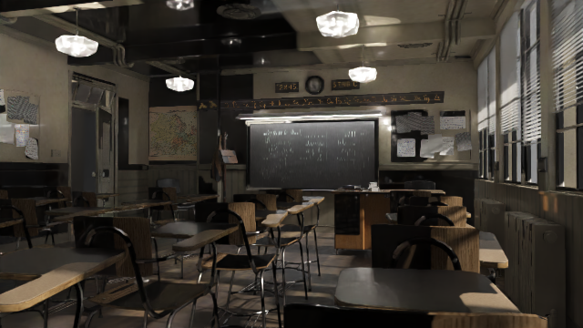 |  |

| Barcelona 初次接入 | Barcelona 材质改进 |
| --- | --- |
| 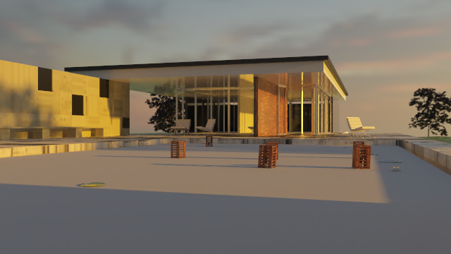 | 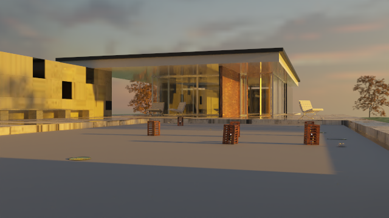 |

前后均为 640×360、256 spp、深度 24、曝光 1、相同源相机和粒子预算。旧图与新图的外观差异不是积分器误差测量；支持 alpha 后，稀疏植被的真实空隙与相应噪声会更明显，不用降噪平滑程度判断收敛。

新回归包括法线入射的独立薄片系数、掠射／高 IOR 外部 TIR、前后侧 branch 频率／RGB 能量、透射阴影、空介质栈、环境白炉与 CPU/GPU 面积光／环境对照。自包含 Blender 回归实际烘焙并直接检查 PNG 字节，确保 alpha／roughness／metallic 没有 gamma 变换、不重复乘 opacity，且 opaque alpha 全为 255：

```sh
blender --background --disable-autoexec --python-exit-code 1 \
  --python tests/PT/BlenderExportTests.py -- build/path-tracing/blender/export-fixture
```

本轮固定 seed=1、160×90、64 spp、深度 16 的实际场景对照，GPU 相对 CPU 的逐像素 RGB 相对 L1 为 Classroom **0.005020**、Barcelona **0.000301**，GPU/CPU 总 RGB 能量比为 **1.000609／0.999863**，非有限样本均为 0。两张最终 Metal 256 spp 图的观测追踪耗时约 **70.81／27.18 秒**，包含 checkpoint，不含导入／BVH／GPU 准备，存在并发工作负载。

本轮相关 CTest：Metal／Vulkan 各 7/7、ASan/UBSan 4/4；Blender 4.5.14 LTS 烘焙回归通过。原始线性图、报告、来源与校验值见 [材质验收记录](../img/path-tracing/blender-material-validation.json)。

## Barcelona 材质与池水

revision 4 修复实际遮挡错误：`lotus_scattering_plane` 位于水面上方约 0.00416 世界单位，源文件 `show_instancer_for_render=false`，旧导出器却把 viewport 可见的发射器当作不透明表面。现在剔除渲染隐藏的发射器自身，保留其可见实例；同样移除隐藏的 `pebbles_scatter`。其他 render-only depsgraph 设置仍需继续完善。

PNG 行从上向下，Blender UV 的 V 从下向上；导出三角形 UV 统一写入 `1-v`，同时翻转切线 normal 的 G。源图先固定原 UV，Normal Map 的源 UV 名称也在新增图集前固定；NORMAL 烘焙保留原 corner normals。粗糙 dielectric 读取 ORM 的线性 G。当前只烘焙所选表面顶层 Bump／Normal Map；建筑平滑薄玻璃仍忽略 bump，group 内 normal 和任意向量 normal 明确诊断为不支持。

源 `water` 为开放水平单片 Glass，IOR=1.1、roughness≈0.05477，Bump 强度 0.01／距离 0.001，没有连接体积节点。`prepare_blender_scenes.py` 对 Barcelona 默认启用 **显式 pool 艺术配置**：IOR=1.333、深度 0.5 世界单位、σa=(0.12,0.035,0.015)，σs=0。给单材质水平水片补齐底与侧壁，底面位于现有石子地面下方；保留原始小幅 Bump、原相机与世界光照，不替换成 FFT 海洋。封闭 dielectric 使用 Fresnel、粗糙反射／折射、介质栈和 Beer–Lambert 吸收。这些新增参数不是实测水样或源参数。

场景包新增可选 `normal_texture`／`normal_strength`、`bounded_volume`、`absorption`／`scattering`／`anisotropy`。normal RGB 为线性 [0,1] 编码；介质系数单位为每世界单位，|g|<0.99。常量 Volume Absorption 转为 `(1-Color)×Density`，Scatter 转为 `Color×Density`；只接受直接连接／Add、至多一个 Scatter，linked／Mix／group 体积不静默相加。[Blender 体积系数约定](https://docs.blender.org/UATEST/manual/en/4.5/render/shader_nodes/shader/volume_coefficients.html)。一般体积需提供封闭且同一 draw 的边界；多材质共享介质身份、非均匀密度未支持。

```sh
python3 tools/prepare_blender_scenes.py --scene barcelona --blender /path/to/blender \
  --water-profile pool --pool-depth 0.5
./build/pt/Scene-Renderer --path-trace-gpu blender-barcelona \
  --pt-size 640x360 --pt-samples 256 --pt-bounces 24 --pt-fixed --pt-denoise \
  --pt-output build/path-tracing/blender/barcelona-water
# 保留源 IOR／开放水片：导出时改为 --water-profile source。
# 直接使用 export_blender_pt.py 默认 source。
# pool 目前只处理名为 water 的单实例、水平、单材质表面。
```

| revision 3：发射器遮住水面 | revision 4：材质与池水 |
| --- | --- |
|  |  |

均为相同源相机、640×360、256 spp、深度 24、曝光 1 和 512 粒子预算。映射与水参数变化不能当作积分器收敛；保留 [未经降噪原图](../img/path-tracing/blender-barcelona-water-raw.png)。当前没有完整 layered closure、池水焦散专项采样或完整植被实例加速。

最终包：100 独立对象、528 实例、80 组颜色／ORM 和 30 normal 图集，1,455,687 导出／1,452,615 有效三角形。Metal 预览追踪约 19.37 秒、OIDN 约 0.45 秒，包含 checkpoint，排除导入／BVH／GPU 准备；有并发负载，不用于排名。

固定 seed=1、Sobol、160×90、64 spp、深度 16、不降噪的 CPU／Metal／Vulkan 原始 PFM 对照，相对 RGB L1 为 **0.000334966**，GPU/CPU 总 RGB 能量比约 **0.99985850**，非有限样本 0。封闭池体／贴图 roughness 的 GPU fixture 相对 L1 约 1.27×10⁻⁷，水内出射／切线 normal 约 1.55×10⁻⁷。Metal／Vulkan 各 **7/7**、ASan/UBSan **4/4**；Blender 回归实际检查 normal 方向、非对称 UV、隐藏发射器保留实例、体积转换和水体闭合／体积。[验收记录](../img/path-tracing/blender-water-validation.json)。

## Blender Cycles GT

使用官方 Blender **4.5.14 LTS Cycles CPU** 直接渲染原 `.blend` 的 `2- time: sunset`／`Camera`／frame 1：640×360、固定 **1024 spp**、最大深度 24、seed=1、8 threads。没有材质归约、图集、粒子预算、OIDN、adaptive sampling 或 compositor；保留完整源植被与 IOR=1.1 的原始开放水片。

GT 关闭源文件的 `sample_clamp_direct=1`、`sample_clamp_indirect=1` 和 `blur_glossy=5`，避免强度截断与 glossy 过滤造成额外偏差。另一张 **source-settings** 对照保留这些旧设置，不能作为无截断的输运基准。两者均为有限采样、有限深度参考，并非数学上无噪声的真值。

| Cycles 原场景 GT（1024 spp，不降噪） | 本项目 pool 配置（256 spp＋OIDN） |
| --- | --- |
|  |  |

上表统一使用本项目显示映射 `(1-exp(-max(RGB,0)))^(1/2.2)`、exposure=1，避免把 tone mapping 差异混入材质比较。另保存 [Blender 原 Standard 显示图](../img/path-tracing/blender-barcelona-cycles-gt-source-view.png) 和 [保留源 clamp／glossy 过滤的对照](../img/path-tracing/blender-barcelona-cycles-source-settings.png)。32-bit scene-linear EXR、PFM 与完整报告位于 `build/path-tracing/blender/barcelona-cycles-gt.*`；来源、参数、输出校验见 [GT 验收记录](../img/path-tracing/blender-cycles-validation.json)。

```sh
/path/to/blender --background --disable-autoexec \
  samples/assets/blender/barcelona/3d/pavillon_barcelone_v1.2.blend \
  --python-exit-code 1 --python tools/render_blender_reference.py -- \
  --output build/path-tracing/blender/barcelona-cycles-gt \
  --size 640x360 --samples 1024 --max-depth 24
# 保留源 clamp／glossy 过滤：追加 --source-integrator-settings，使用另一个输出前缀。
```

GT 和引擎图的 shader closure、粒子密度、水 IOR／体积与 render depsgraph 不同，因此不计算这组原场景图的“积分器 RMSE”。原场景 GT 用于定位外观缺口；下文的同包对照检验输运一致性。

## 同参数 Cycles 线性对照

`prepare_pt_comparison.py` 从现有导出包建立独立冻结配置；`cycles_pt_package.py` 在 Cycles 内重建同一组几何、实例、UV、相机、纹理、HDR 和光源。原 `.blend`、默认 PBR 和既有艺术预览继续保留。两种配置通过显式 `bsdf_model` 在 CPU／Metal／Vulkan 上使用相同闭包：

- `lambert`：所有表面变为 Lambert，包括原水与玻璃，去除体积和法线图，检查几何／UV／照明／色彩基线。
- `ggx-water`：不透明表面为 `.96*(1-metallic)*albedo/π + mix(.04,albedo,metallic)*GGX`。GGX 使用单次散射、相关 Smith 遮蔽，Glossy 颜色不包含 Schlick Fresnel；薄玻璃保持双界面平滑薄片，池水保持 IOR=1.333、封闭边界及 RGB 吸收；revision 5 的 `thin_diffuse` 保留独立 Lambert R／T。
- `lambert-leaves`：普通表面为 Lambert，玻璃／水体也变为不透明 Lambert；薄叶保留 Lambert R／T，用于单独检查法线与透射。

这是共同定义的对照材质，不能代表已经还原原始 Principled／旧 Layer Weight 图。固体 Glass 界面显式设为白色：本项目染色只影响透射，而 stock Cycles Glass 的颜色同时影响反射；水的颜色由同一组体积吸收系数产生。历史对照默认关闭 normal map；revision 5 使用 `--normals` 和 corner MikkTSpace frame 开启新的独立基线。默认 PBR 的 Fresnel／遮蔽模型不受这个对照模式影响。

Cycles 使用 byte atlas 的线性读取、UV 行翻转，插值／乘色之后才进行 pow(2.2)，不把 sRGB 或 AgX 当成输入色彩。两边相机投影前两行最大误差为 **0**；约 **1,452,615** 个有效三角形、**633** 个 draw、相同 **512** 个粒子。相机、有限太阳与 HDR 的轴变换在重建时固定；资产校验和及源 manifest 校验和写入冻结包。相关 Smith 项依据 [Cycles 4.5.14 的 microfacet 闭包](https://github.com/blender/blender/blob/v4.5.14/intern/cycles/kernel/closure/bsdf_microfacet.h#L602-L610)。

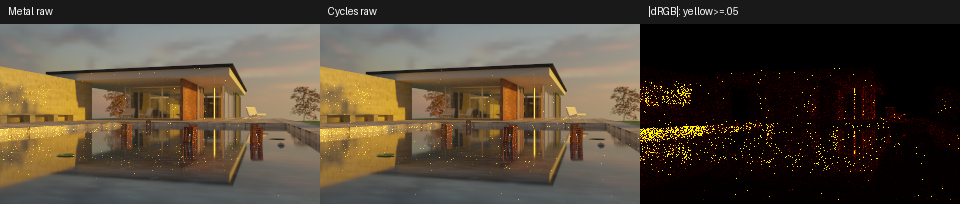

所有对照关闭 OIDN、adaptive、guiding、cache、clamp、glossy filter 和 compositor，统一 box 像素滤波。PFM 为原始 scene-linear RGB；展示图仍使用项目 exp/gamma 显示映射。绝对误差图的黑色为 0，黄色表示平均 RGB 绝对差至少 0.05；只在展示热图中截断，指标不截断、不调整曝光、不移动像素。

| 对照 | 分辨率／spp／深度 | 相对 RGB L1 | RGB RMSE | 总 RGB 能量比 |
| --- | --- | --- | --- | --- |
| Lambert：Metal／Cycles | 160×90／4096／24 | 0.5113% | 0.002524 | 1.000077 |
| GGX＋水体：Metal／Cycles seed 1 | 320×180／4096／24 | 4.9231% | 0.127911 | 1.000666 |
| 同一 Cycles 配置：seed 1／seed 2 | 同上 | 4.7560% | 0.123001 | 1.000257 |
| GGX＋水体：Metal／Cycles，4×4 块平均 | 同上 | 2.5846% | 0.031336 | 1.000666 |
| Cycles 两 seed，4×4 块平均 | 同上 | 2.5980% | 0.028330 | 1.000257 |

天空矩形 Metal／Cycles 相对 L1 为 **0.00329%**；池水区域仍有高方差反射亮点，不能用全图总能量差 **0.0666%** 宣称局部图像完全相同。跨渲染器与同渲染器换 seed 的差异相当，是噪声主导的证据，不是无偏或完整材质一致的证明。两边 sampling／roulette／ray offset 仍不同。指标、固定区域和 SHA 见 [水体同包记录](../img/path-tracing/blender-barcelona-matched.json) 与 [Lambert 记录](../img/path-tracing/blender-barcelona-lambert-matched.json)。Metal、Vulkan 的新增闭包／薄片标志／相关 GGX 池体原生回归各 **7/7**；ASan/UBSan 数值回归 **4/4**。首次 sanitizer 与两个 Cycles 渲染并行时触发 60 s 超时，单独执行和减少并发后的 CTest 均通过。

```sh
python3 tools/prepare_pt_comparison.py samples/assets/blender/barcelona/scene.json \
  --output build/path-tracing/alignment/barcelona-ggx-water --profile ggx-water
build/pt/Scene-Renderer --path-trace-gpu --backend Metal \
  --pt-scene-file build/path-tracing/alignment/barcelona-ggx-water/scene.json \
  --pt-size 320x180 --pt-samples 4096 --pt-bounces 24 --pt-fixed \
  --pt-output build/path-tracing/alignment/barcelona-matched-metal
/path/to/blender --background --disable-autoexec --python-exit-code 1 \
  --python tools/render_blender_reference.py -- \
  --pt-scene-file build/path-tracing/alignment/barcelona-ggx-water/scene.json \
  --size 320x180 --samples 4096 --max-depth 24 --seed 1 \
  --output build/path-tracing/alignment/barcelona-matched-cycles
# 再以 --seed 2 渲染 barcelona-matched-cycles-seed2，测量独立采样噪声。
# Python 环境需提供 numpy、Pillow；比较工具先检查参数和冻结配置相同。
python3 tools/compare_pt_references.py \
  build/path-tracing/alignment/barcelona-matched-metal.pfm \
  build/path-tracing/alignment/barcelona-matched-cycles.pfm \
  --repeat build/path-tracing/alignment/barcelona-matched-cycles-seed2.pfm \
  --output img/path-tracing/blender-barcelona-matched
```

没有把有限 spp 的逐像素差异自动归为实现 bug。另记录两个 Cycles seed 的差、4×4 块平均误差，以及固定天空／建筑／池水矩形，矩形含混合几何，不是材质分割。原始 EXR／PFM 与运行报告在 `build/path-tracing/alignment/`；图与指标在 `img/path-tracing/blender-barcelona-matched*`。

## 转换限制与下一步

当前是资产桥和受控预览，未实现完整 Cycles closure／节点执行器。Diffuse/glossy 混合近似为 Lambert+GGX；Glass 使用已有粗糙 dielectric；薄建筑玻璃已转换为平滑 thin-sheet，常见顶层 alpha shader 混合已烘焙；叶片 translucency、组内 scalar／normal、shader displacement 仍不完整。UV 烘焙不恢复缺失的方向性；常量体积已接入现有输运，复杂体积节点未支持；实例共用同一来源对象的 Object Info 随机颜色。源水参数可用 `--water-profile source` 保留；README 使用上文 pool 艺术配置。

不能将上述预览与 Cycles 原图逐像素误差解释为积分器误差，也不能将 OIDN 平滑视为收敛。同包线性基线已扩展到法线图与薄叶漫透射；完整实例已支持，后续继续补原材质层间闭包、过滤与水体焦散。功能、实例加速与测量顺序见 [后续改进计划](path-tracing-improvement-plan.md)。

## 共享 BLAS/TLAS 与完整植被

2026-10-05：CPU、Metal compute 和 Vulkan compute 为每个独立 `MeshPayload` 构建一个局部 BLAS，再以世界 bounds 构建实例 TLAS。局部射线方向不归一化，保留 world t；逆转置法线、镜像绕序、primitive ID、材质、介质栈和 emitter 的世界面积均按实例处理。几何读取预算改为独立 mesh 内存预算，仍检查 32 位实例 primitive ID 上限。这里使用软件求交，Metal 原生 RT／Vulkan ray query 尚未接入。

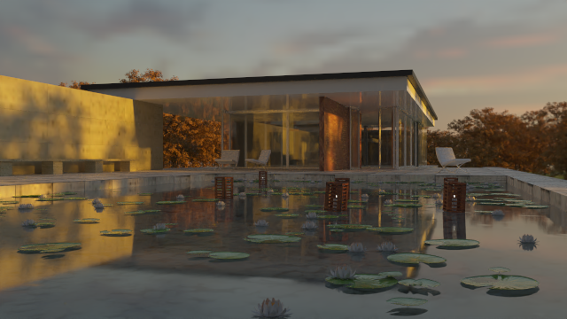

完整包保留 20,622／20,622 个植被粒子、20,638 个来源对象实例；材质分组后为 21,129 个 PT 实例、110 个共享 mesh ranges，281,749 个导出／281,074 个有效独立三角形，54,966,539 个导出／54,963,839 个有效实例三角形。原池水艺术配置和材质近似保持不变；完整几何不代表已经匹配原 Cycles closure。

| 测量 | 旧展开方式，512 粒子 | BLAS/TLAS，512 粒子 | BLAS/TLAS，全部粒子 |
| --- | ---: | ---: | ---: |
| CPU 几何／加速负载 | 194.28 MiB | 37.99 MiB | 51.95 MiB |
| GPU buffers，160×90 | 222.73 MiB | 85.01 MiB | 91.88 MiB |
| 有效实例三角形 | 1,452,615 | 1,452,987 | 54,963,839 |

有效数量的细微差异来自退化面现在在局部空间剔除，原版本在缩放后的世界空间剔除；源导出几何没有改变。上述内存统计是逻辑几何、加速结构、实例和 emitter 负载及 GPU buffers，不是进程 RSS／峰值或全部驱动内存；CPU 图像和纹理不包含在 `geometry_bvh_bytes` 中，稀疏 emitter map 为估算。

512 粒子包固定 seed=1、160×90、256 spp、深度 24 的同参数前后原始线性对照：RGB 相对 L1 **0.03767%**、总 RGB 能量比 **0.999960**。局部空间求交浮点舍入会改变少数随机路径，不能要求前后逐像素位一致。GPU 准备从 3.31 秒变为 0.13 秒，追踪墙钟观测从 3.79 秒变为 3.44 秒；后者同时改变了 checkpoint 频率，也受并发负载影响，只是本次观测，不作为纯求交速度排名。

完整包的 160×90、64 spp、深度 24 原始 Metal／CPU 对照：RGB 相对 L1 **0.16462%**，能量比 **0.999962**；Metal 与本机 Vulkan/MoltenVK 的原始 PFM 逐像素一致。回归 Metal／Vulkan 各 **7/7**，ASan/UBSan 四项全部通过（CPU 首轮 60 秒超时，单独重跑 51.11 秒通过）。

完整预览为 640×360、256 spp、深度 24、曝光 1，追踪／checkpoint 约 107.12 秒，OIDN Metal 约 1.24 秒；GPU buffers 约 108.36 MiB，非有限样本为 0。[未经降噪原图](../img/path-tracing/blender-barcelona-full-raw.png)与[数值记录](../img/path-tracing/blender-instances-validation.json)保留。水面／玻璃反射仍有噪声；材质分层、叶片透射、切线基准、纹理过滤与焦散采样继续按计划推进。

```sh
# 已安装 Blender 4.5.14 LTS，资产先按本文准备；完整包放在单独目录。
blender --background samples/assets/blender/barcelona/3d/pavillon_barcelone_v1.2.blend \
  --disable-autoexec --python-exit-code 1 --python tools/export_blender_pt.py -- \
  --output build/path-tracing/instances/barcelona-full --source-name barcelona \
  --atlas-size 256 --particle-limit -1 --water-profile pool --pool-depth .5

./build/pt/Scene-Renderer --path-trace-gpu --backend Metal \
  --pt-scene-file build/path-tracing/instances/barcelona-full/scene.json \
  --pt-size 640x360 --pt-samples 256 --pt-bounces 24 --pt-fixed --pt-denoise \
  --pt-output build/path-tracing/instances/barcelona-full-preview
# CPU 使用 --path-trace；Vulkan 构建使用 --backend Vulkan。
```

JSON 的 `acceleration` 记录独立几何、BLAS、TLAS、实例与 emitter 内存；`timings` 记录构建、导出、GPU 准备、dispatch/readback、film 更新及文件写出，`scene_package.load_timings` 记录包解析与纹理解码。GPU 准备包含场景导出；这些 CPU 墙钟区间不能重复相加，也不能视为硬件 GPU kernel 时间。最终 CLI 报告另记录命令启动至最终报告前的墙钟时间，排除进程启动和最终报告／设备销毁。

## 切线基准与薄叶透射

2026-10-05，导出 revision 5：Normal Map／Bump 烘焙使用原 corner normals，在最终 atlas UV 上调用 Blender `calc_tangents`，保存 MikkTSpace tangent xyz 与 bitangent sign。UV 的 V、normal 的 G 和 tangent handedness 同时反射。CPU／Metal／Vulkan 使用未归一化的物体空间 corner N／T 插值，以 `B=w*cross(N,T)` 合成 mapped normal，再整体逆转置到世界空间；负缩放不额外翻转物体空间 handedness，背面最后反向。Strength 对 xy 缩放，对 z 使用 `mix(1,z,clamp(strength,0,1))`。这遵循 [Cycles 4.5.14 tangent Normal Map 的计算顺序](https://github.com/blender/blender/blob/v4.5.14/intern/cycles/kernel/svm/tex_coord.h#L336-L446)，避免在非均匀缩放后重新正交化世界空间 frame 改变 normal。几何半球与入射方向仍沿用引擎的 normal 防护，未声称所有掠射保护与 Cycles 相同。

包格式仍为 `SceneRenderer.PT.v1`，`geometry.bin`／`PTMESH01` 的八 float 顶点保持兼容。新增可选 JSON `tangents` 指向 `PTTANG01` 的 little-endian sidecar；每 corner 四个 float32，draw 的 `tangents_offset` 从文件头起按字节计，必须满足 `(offset-8)%16==0` 且容纳完整 vertex count。w 允许 0／±1；0 或退化 frame 回退旧 UV frame。无 sidecar 的旧包可继续读取；镜像／非均匀实例仍共享几何。GPU `PackedVertex` 为 48 bytes，`PackedMaterial` 为 192 bytes；帧随独立几何增长，不随粒子数量展开。

新增 `bsdf_model="thin_diffuse"`：反射半球 `R/π`，透射半球 `T/π`；以 R／T 亮度决定 cosine 采样的半球概率，NEE 与 throughput 使用绝对余弦。它没有 IOR、折射或体积介质；alpha 继续表示几何覆盖率，不能拿 alpha 替代漫透射。`diffuse_transmission` 是线性 RGB，`transmission_texture` 是独立 pow(2.2) 解码的 RGB 图，不混入反射底色。Lambert 反射／透射参考 [PBRT](https://pbr-book.org/3ed-2018/Reflection_Models/Lambertian_Reflection)。

Blender 中所选 Diffuse／Translucent 颜色分别进行 EMIT 烘焙，导出前按 RGB 逐通道将超过 1 的 R+T 同比例归一化，再编码为八位图。八位量化仍有小误差；手写包需自行选择能量合理的 R／T。Barcelona 的 `leafs`、`white_lotus_leafs` 等原图包含 Add Diffuse＋Translucent，再混入 Glossy／Layer Weight；本轮恢复选定的漫反射／透射，原光泽与角度权重仍省略，转换诊断和 metadata 明确记录。完整包有 12 个 thin diffuse 材质组、81 组颜色／ORM、29 张 normal 图、全部 20,622 个粒子；并非全部都是叶片（如 wax 也使用此近似）。BDPT 的薄叶策略密度待独立验收，当前拒绝该组合；GPU radiance cache 暂不近似薄叶尾项。


预览使用原相机、640×360、256 spp、depth 24、固定 Sobol seed 1；[原始图](../img/path-tracing/blender-barcelona-appearance-raw.png)单独保存。数值检查使用原始线性 PFM，关闭降噪／clamp／自适应／曝光拟合；完整包开启法线图与薄叶的 Cycles 重建保留共享物体空间 mesh 和实例矩阵。历史关闭 normal 的 512 粒子高 spp 基线继续保存，二者不用于直接性能排名。

小型 [BlenderAppearanceFixture](../tests/PT/BlenderAppearanceFixture.py) 不需要下载资产，包含 smooth normal 球、镜像／非均匀缩放和薄透射球。`lambert-leaves` 排除 GGX 高亮采样干扰，检查 normal 与透射；完整场景保留 `ggx-water`。数值、独立 Cycles seed 噪声与性能记录见 [外观验收](../img/path-tracing/blender-appearance-validation.json)，图像对照见 [小场景](../img/path-tracing/blender-appearance-fixture.json)／[完整 Barcelona](../img/path-tracing/blender-barcelona-appearance-matched.json)。这些是有限样本测量，不把剩余差异全部归为噪声或宣称原始源材质已对齐。

192×96、4096 spp、depth 24 的小场景，物体空间 normal 合成修正后 RGB 相对 L1 从 **1.351%** 降为 **0.838%**；Cycles 独立 seed 之间为 **0.185%**，最终总 RGB 能量比 **1.007044**。剩余差异高于噪声，掠射 normal 防护／阴影边界需要继续对齐。完整 Barcelona 的 160×90、512 spp 同包对照为 **4.640%**，Cycles seed pair 为 **2.788%**，总 RGB 能量比 **1.017858**，最大单通道差 **32.033**；不裁掉异常样本来美化指标，也不从这组低 spp 图推断完整外观已对齐。CPU／Metal 同参数 64 spp 相对 L1 **0.2321%**，Vulkan 与 Metal 原始 PFM 逐像素一致；三者均无非有限样本。

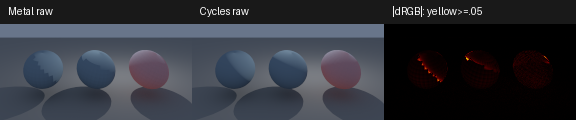

```sh
BLENDER=/path/to/blender
"$BLENDER" --background samples/assets/blender/barcelona/3d/pavillon_barcelone_v1.2.blend \
  --disable-autoexec --python-exit-code 1 --python tools/export_blender_pt.py -- \
  --output build/path-tracing/appearance/barcelona-full --source-name barcelona \
  --atlas-size 256 --particle-limit -1 --water-profile pool --pool-depth .5
python3 tools/prepare_pt_comparison.py build/path-tracing/appearance/barcelona-full/scene.json \
  --output build/path-tracing/appearance/matched-full --profile ggx-water --normals
"$BLENDER" --background --factory-startup --python-exit-code 1 \
  --python tools/render_blender_reference.py -- \
  --pt-scene-file build/path-tracing/appearance/matched-full/scene.json \
  --size 160x90 --samples 512 --max-depth 24 --threads 4 \
  --output build/path-tracing/appearance/matched-cycles
./build/pt/Scene-Renderer --path-trace-gpu --backend Metal \
  --pt-scene-file build/path-tracing/appearance/matched-full/scene.json \
  --pt-size 160x90 --pt-samples 512 --pt-bounces 24 --pt-fixed \
  --pt-output build/path-tracing/appearance/matched-metal
# 用 --seed 2 另生成 Cycles reference，再向 compare_pt_references.py 传 --repeat。
"$BLENDER" --background --factory-startup --python-exit-code 1 \
  --python tests/PT/BlenderAppearanceFixture.py -- build/path-tracing/appearance/fixture
python3 tools/prepare_pt_comparison.py build/path-tracing/appearance/fixture/scene.json \
  --output build/path-tracing/appearance/fixture-lambert --profile lambert-leaves --normals
# 同样渲染双方的 fixture-lambert/scene.json，192x96 / 4096 spp / depth 24。
```

固定 spp 的 CPU PT／GPU film checkpoint 默认首轮 4、16 spp，之后每 256 spp 读回／保存；`--pt-checkpoint-samples N` 可调整。自适应检查仍为 32 spp，CPU BDPT 保留原有间隔。GPU 每次 dispatch 仍为至多 4 spp，当前报告可查看正式追踪的 dispatch／readback 次数与读回字节；这些次数不包含可选 guiding 训练。


## 掠射法线与闭包遮蔽

2026-10-06，CPU／Metal／Vulkan 对冻结对照闭包（`bsdf_model` 1／2／3）分别保存原 mapped diffuse normal、未扰动的 smooth normal，以及修正后的 glossy／translucent normal。Lambert 不因法线背向相机就替换法线；GGX 与薄叶透射仅在镜面反射会落到几何背面时，将对应法线向几何法线旋转到有效边界。默认 PBR、玻璃与 FFT 水体仍使用其现有法线处理。

漫反射与薄叶透射增加 bump shadowing：使用未扰动 smooth normal 与各闭包法线计算遮蔽，不通过曝光、亮度拟合或裁掉异常样本补偿。公式与应用位置参考 [Cycles 4.5.14 BSDF](https://github.com/blender/blender/blob/v4.5.14/intern/cycles/kernel/closure/bsdf.h)；镜面反射保护参考 [Cycles normal guard](https://github.com/blender/blender/blob/v4.5.14/intern/cycles/kernel/closure/bsdf_util.h)，本实现用角度方程求旋转边界。

不同闭包的余弦与 proposal PDF 独立计算。对照闭包的 `evaluateBsdf`／sample value 以共同的几何余弦为测度，各 lobe 的 shading cosine 放入求值；调用者通过 `surfaceCosine` 恢复 `f*cos`。这样 NEE、continuation 与混合 PDF 一致，不因 Glossy 的半球判定丢弃 Diffuse lobe。薄叶采样选中反射或透射后，若落入错误的几何半球则返回空事件，不能再按另一闭包求值。Surface 内的新增法线不改变 GPU packed scene ABI。

这仍是 appearance correction，并非测量得到的微几何。Cycles 4.5.14 的 Translucent 在通用求值路径施加 bump shadowing，而 transmission sample 路径跳过该修正；这里对求值与采样统一施加，保留能量与估计器一致性，因此薄叶参考仍有可测的残差，不能宣称完全对齐。原 Glossy／Layer Weight 分层也仍被简化。

GPU radiance cache 的漫反射尾项只用于默认 PBR，对照闭包暂时禁用该近似。BDPT 显式拒绝这些对照闭包：新遮蔽的伴随输运与薄叶策略密度尚未验收；原默认材质与平滑玻璃的有限面积光 BDPT 继续回归。


固定 seed 1、depth 24 的新对照如下。小场景为 192×96／4096 spp；完整 Barcelona 为 160×90／512 spp、全部 20,622 粒子、开启 normal。旧图和旧验收文件继续保存，下面没有替换历史数值。

| 原始线性对照 | 修改前相对 RGB L1 | 修改后相对 RGB L1 | 修改后 RGB RMSE | 修改后总 RGB 能量比 |
| --- | --- | --- | --- | --- |
| 小场景 Lambert＋薄叶／Cycles | 0.838% | **0.290%** | 0.001037 | 0.998390 |
| 小场景 GGX＋薄叶／Cycles | 2.662% | **0.582%** | 0.017869 | 0.999728 |
| 完整 Barcelona／Cycles | 4.640% | **4.668%** | 0.267997 | 1.018148 |

Lambert 小场景 Cycles 独立 seed 之间 L1 为 **0.185%**；新图剩余差异仍高于它。薄叶球固定矩形 L1 为 **0.871%**、能量比 **0.992673**，保留透射残差；这些矩形含背景与阴影，不能视作逐材质 mask。GGX 小场景最大单通道差从 **12.675** 降到 **2.112**。完整 Barcelona 的最大差仍为 **32.033**，整体误差未改善，下一步需要定位高方差亮点及其他闭包差异，不用全图能量比宣称对齐。

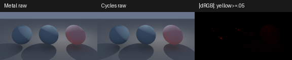

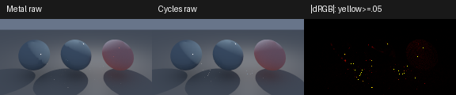

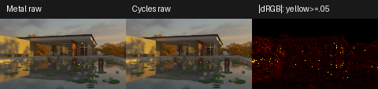

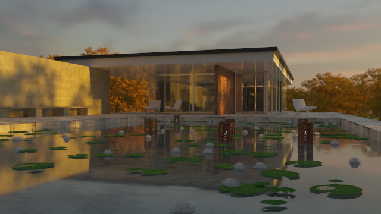

640×360、256 spp 的完整包预览另保存 [未降噪原图](../img/path-tracing/blender-barcelona-grazing-raw.png)。[本轮验收记录](../img/path-tracing/blender-grazing-validation.json) 包含参数、SHA、各后端原始图检查与阶段耗时；[Lambert 对照](../img/path-tracing/blender-grazing-fixture.json)、[GGX 对照](../img/path-tracing/blender-grazing-ggx.json)、[完整场景对照](../img/path-tracing/blender-barcelona-grazing-matched.json) 可单独查看。区域指标只对 Barcelona 应用其固定 sky／building／pool 矩形，小场景不套用这些区域名称。

完整原材质近似包的 160×90、64 spp、depth 24 smoke：CPU／Metal 相对 RGB L1 **0.2346%**，Vulkan／Metal 原始线性像素逐项相同，三者无非有限样本。CPU 与 GPU 使用相同包内 HDR、seed 和固定样本配置。预览 render 墙钟 **120.71 s**，OIDN 2.5.1 **0.55 s**；期间另有 CPU 验证工作，这些耗时不构成严格性能排名。

Metal、Vulkan 原生 PT CTest 各 **7/7**。最终代码 ASan／UBSan 的四项数值测试均通过：CPU 首次在三套构建与渲染并发时触发 120 s 超时，构建结束后仅重跑失败项，**53.90 s** 通过；scene-package、medium、procedural 在同一最终代码的前次运行通过。独立 BSDF 球面积分在 sanitizer 下使用 120 s 预算，普通构建保持 60 s。测试覆盖 60 组掠射反射保护，以及不同 lobe 法线的独立球面积分、Monte Carlo、sample／PDF 一致性与能量。

```sh
# 使用前一节导出的 revision 5 包与相同的独立 Cycles reference。
build/pt/Scene-Renderer --path-trace-gpu --backend Metal \
  --pt-scene-file build/path-tracing/appearance/matched-full/scene.json \
  --pt-size 160x90 --pt-samples 512 --pt-bounces 24 --pt-fixed \
  --pt-output build/path-tracing/grazing/barcelona-matched-metal
python3 tools/compare_pt_references.py \
  build/path-tracing/grazing/barcelona-matched-metal.pfm \
  build/path-tracing/appearance/matched-cycles.pfm \
  --repeat build/path-tracing/appearance/matched-cycles-seed2.pfm \
  --output img/path-tracing/blender-barcelona-grazing-matched
# fixture-lambert 与 fixture-matched 分别用 192x96 / 4096 spp / depth 24。
# 后端 smoke 统一原 barcelona-full 包、160x90 / 64 spp / depth 24，保留包内 HDR。
```


## 太阳反射链与实例统计缓存

2026-10-06，重放原始线性图的异常像素：`(1,54)` 的 seed 1／sample 334 经墙面 → 池水 → 太阳，单样本 red 为 16374；`(22,54)` 的 sample 447 经池水 → 墙面 → 池水 → 太阳，单样本 red 为 13705。`(104,31)` 的 sample 272 则经过多次漫反射、薄玻璃镜面反射与直通，再到太阳，单样本 red 为 14848。这些是在 160×90、512 spp、depth 24 下的稀有路径，并非仅凭 PNG 亮点判断；同参数 CPU 可重现 GPU 的主要异常。

太阳提议 v2 在水面上方的非 dielectric 顶点，先沿水平反射太阳方向向前求交，至多迭代四次，用实际界面 normal 更新反射方向。候选必须是封闭 dielectric 的正面、几何 normal 朝上（与 Y 轴点积大于 0.5）；忽略薄玻璃。导入的池水走通用 dielectric 与 tangent normal map，FFT 海洋走其原 normal 编码，反射提议兼容两者。不会给池水强加 FFT 标志、泡沫或 host-medium 规则。它也可能帮助符合条件的水平玻璃界面，不是任意镜面链求解器。

中心射线与微表面粗糙度决定 cone 范围，仅用来选择 continuation 方向。原 BSDF／HG proposal 保留 50%，混合 PDF 为 `0.5*p_base + 0.5*p_cone`；cone 外仍有原始采样支持。NEE 的竞争 PDF、throughput 与 miss-light MIS 都使用相同混合密度；实际的 BSDF、Fresnel、介质、太阳半径、clamp 和粗糙度没有被改写。原水下折射提议继续使用其介质边界条件。单样本混合重要性采样的依据见 [PBRT 4e](https://pbr-book.org/4ed/Monte_Carlo_Integration/Improving_Efficiency#MultipleImportanceSampling)。

透明覆盖可能使用同一 bounce 的随机维度 20–148，太阳提议的选择与 cone 采样改用 192／194，避免 alpha 接受事件与 proposal 选择共享 Sobol 坐标。三组 seed 的独立条件概率积分回归检查这一维度分配。

沿用 `--pt-no-water-sun-proposal` 关闭折射／反射两种提议，报告增加 `water_sun_proposal_version=2`。GPU parameters 保持 304 bytes，原 `acceleration.y` reserved 字段保存封闭 dielectric 实例数，CPU 使用构建时的缓存，均避免没有候选界面的场景产生额外求交。

CPU 在每条相机路径中调用 `scatteringCount()` 决定 ray epsilon；以前每次扫描全部实例，在完整 Barcelona 上为 21,129 次材料检查。现在将 scattering／dielectric／kind count 存入不可变 scene state，在保留有效几何实例时累计；退化或空 draw 不计数。查询为 O(1)／哈希查找，介质初始化和 BDPT 检查仍使用相同计数语义。

解析验收场景由 [makeWaterSolarValidationScene](../src/PT/ValidationScenes.cpp) 构建：Lambert 墙面、吸收封闭水体、阻断直射太阳的屋顶。独立积分整个有限太阳圆盘，参考值 **0.076202**；65,536 次新提议采样为 **0.076380**。这一固定 PCG 样本组的方差从 **296.846** 降到 **0.146672**，约 2024 倍；基础采样的有限样本均值 0.116572 显示稀有路径噪声，不能用它定义真值。将同一界面改为导入式 generic dielectric 仍匹配解析值；原生 GPU 同时验证 FFT-style 与 imported-style 两种标志。该测试不代表任意 FFT 波面或任意玻璃焦散已经解决。


完整 Barcelona 使用同一冻结包、相机、normal／薄叶与池水参数，160×90／512 spp／depth 24，以下全部为原始线性图。关闭 v2 提议的结果与上一轮原始 PFM **逐项相同**，可以作为这次的有效开关对照。

| 完整 Metal／Cycles seed 1 | 提议关闭 | 提议开启 |
| --- | --- | --- |
| 相对 RGB L1 | 4.668% | **3.531%** |
| RGB RMSE | 0.267997 | **0.155866** |
| 总 RGB 能量比 | 1.018148 | 1.007357 |
| 最大单通道差 | 32.033 | 29.013 |
| Render 墙钟 | 27.64 s | 32.27 s |
| 求交射线计数 | 66,695,724 | 76,978,589 |

同样样本数的 L1 约降低 24%，render 墙钟增加约 17%；额外界面预测有实际开销，不是所有场景都必然更快。Cycles 两个 seed 的 L1 仍为 2.788%，有限样本、薄叶与分层材质残差继续存在。像素 `(1,54)` 的 red 从 33.125 降到 1.389（Cycles 1.092），`(22,54)` 从 26.869 降到 0.144（Cycles 0.087）；薄玻璃链 `(104,31)` 仍为 29.059（Cycles 0.046），最大异常并未消失。没有通过裁去这些像素改善指标。

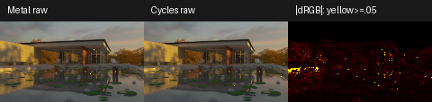


预览为 640×360／256 spp／depth 24，render 墙钟 **140.70 s**，OIDN **0.40 s**；[未降噪原图](../img/path-tracing/blender-barcelona-solar-raw.png)另存，数值比较不用降噪图。预览期间另有数值验证工作，以上墙钟不是严格的硬件 kernel 性能测量。

同参数 160×90／64 spp 的 CPU／Metal smoke，相对 RGB L1 **0.1905%**、总能量比 **0.999984**；512 spp 的 Vulkan／Metal 只有 27 个 RGB 分量不同，最大差 **1.19e−7**、相对 L1 **9.09e−11**，求交计数相同，不宣称逐像素完全一致。三条后端均无非有限样本。最终 Metal、Vulkan PT CTest 各 **7/7**，ASan／UBSan **4/4**，耗时 82.31 s。

统计缓存的单线程微基准固定完整包、16,384 条相机样本、depth 24，关闭太阳提议，排除加载／构建／film／写出；对照代码仅将 `scatteringCount()` 恢复为遍历材料。三轮交替顺序的中位数从 **0.7266 s** 降到 **0.4606 s**，约 **1.58 倍**；每条原始 RGB 结果完全相同。它只隔离热点中的实例统计成本，不能推断整个渲染器也按相同比例加速。正式可复用的 [trace 微基准工具](../tools/benchmark_pt_transport.cpp) 已构建并运行，原始样本与 A/B harness 相同；该目标不在默认构建或 CTest 中执行。

```sh
# BUILD_TESTING=ON；numpy/Pillow 用于原始图比较。
cmake -S . -B build/pt
cmake --build build/pt --target pt-transport-benchmark -j4
build/pt/pt-transport-benchmark \
  build/path-tracing/appearance/matched-full/scene.json \
  build/path-tracing/solar/transport-benchmark.json
build/pt/Scene-Renderer --path-trace-gpu --backend Metal \
  --pt-scene-file build/path-tracing/appearance/matched-full/scene.json \
  --pt-size 160x90 --pt-samples 512 --pt-bounces 24 --pt-fixed \
  --pt-output build/path-tracing/solar/barcelona-metal
# 加 --pt-no-water-sun-proposal 生成关闭提议的独立输出。
```

[本轮验收](../img/path-tracing/blender-solar-validation.json) 保存原始图 SHA、开关条件、区域、旧异常路径重放、解析测试、CPU 计数 A/B、后端差异和耗时；[Cycles 图像对照](../img/path-tracing/blender-barcelona-solar-matched.json)另存。后续优先处理有限太阳的薄玻璃反射链、恢复原材质分层，再推进经独立策略密度验收的 BDPT／SMS。

## 薄玻璃太阳反射链

2026-10-06，在太阳提议 v2 的基础上增加 v3：处理非 delta 顶点 → 一次光滑薄玻璃反射 → 若干直通薄玻璃 → 有限太阳的稀有路径。薄玻璃仍使用原来的几何法线、平行薄片 Fresnel、透射 tint 和离散反射／透射分支；实际路径逐段求交，没有把镜面链当作直线 shadow connection，也没有缩小太阳、提高玻璃粗糙度或 clamp 贡献。

构建场景时，按实例变换计算薄玻璃三角形的 world-space 几何法线及面积。法线符号统一，坐标以 1e−4 分组并累计面积，按面积保留最多八个方向。它们只是 importance proposal 的提示；曲面、被截去的方向及更复杂镜面链仍由基础 BSDF 覆盖。CPU／GPU 共享同一份 catalog，Metal／Vulkan uniform 增加八个 vec4，Parameters ABI 从 304 增至 **432 bytes**；原有 scene-package、Material、Instance ABI 不变。

在外部介质的非 dielectric 表面，按这些法线反射太阳中心。仅保留在当前 BSDF 下中心贡献为正的 cone，并与原来的水体 cone 合并；薄玻璃 cone 的半角为 `max(sunRadius + 0.0002, 0.001)`，用于容纳法线分组与浮点误差。薄玻璃 cone 总共使用 10% 概率并在有效方向中均匀分配，其余 90% 保留原 v2 采样：有水体 cone 时为 BSDF／water 的 50／50 混合，否则为原 BSDF。令 `p_v2` 为这一基础混合，完整 PDF 为 `0.9*p_v2 + 0.1*sum(p_thin_i)/N`；没有有效薄玻璃方向时完全保留 v2。**重叠 cone 的密度全部相加**。当前顶点的 NEE、continuation throughput 使用同一混合 PDF；后续薄片反射仍重置直接光 MIS，直通仍保留原有竞争关系。反射方向映射不替代真实 Fresnel 分支或介质规则。

随机维度 192 选择基础／cone，193 选择 cone，194／195 采样锥内方向，继续避开 alpha coverage 的 20–148。新增 `--pt-no-thin-sun-proposal` 可仅关闭薄玻璃提议，保留 v2 水体提议；已有 `--pt-no-water-sun-proposal` 关闭整个太阳 continuation proposal。报告保存 `thin_sun_proposal`、`thin_solar_normals` 和版本号。

解析回归为 Lambert 墙面 → 水平薄片反射 → 两块有色直通玻璃 → 太阳，直射太阳由屋顶遮挡。独立积分整个太阳圆盘，red 真值 **0.0409565**；固定 PCG 的 65,536 条新提议路径均值 **0.0420162**。方差从 **55.5462** 降至 **0.0391018**，该特定 fixture 约降低 1,421 倍。另加入远处旋转／镜像薄片，使两条 cone 重叠，仍检查积分一致；白炉检查在暗太阳与恒定 HDR 下开启提议不会破坏直通玻璃的 NEE／MIS，catalog 超过八个方向时检查 GPU 上限。它不是任意多次镜面反射的 SMS 或 BDPT 实现。

冻结场景可通过独立的 `pt-package-render` 构建／运行，只依赖 PT、RHI device 和 PT compute shader，避免实时场景／编辑器修改影响离线验证。新增 shader cooker 的 `--shader` 可只编译指定 shader 及其 include 依赖。该目标为 EXCLUDE_FROM_ALL，不在默认构建和默认 CTest 中运行。

```sh
cmake --build build/pt --target pt-package-render -j4
build/pt/pt-package-render --backend Metal --self-test
build/pt/pt-package-render --backend Metal \
  --scene build/path-tracing/appearance/matched-full/scene.json \
  --size 160x90 --samples 512 --bounces 24 \
  --output build/path-tracing/thin/barcelona-metal
# --no-thin-sun-proposal：保留 v2；--no-solar-proposal：关闭全部太阳提议。
# 独立工具使用上述短参数，主程序继续使用 --pt-* 参数。
```

完整 Barcelona 沿用同一冻结场景包、全部 20,622 植被粒子、160×90／512 spp／depth 24 和两个 seed。关闭薄玻璃提议、保留水体提议的 seed 1 原始 PFM 与上一轮 v2 **逐项相同**。同参数 Cycles 两个 seed 沿用已有独立结果：本轮只改采样，不改场景／BSDF／环境。

| Metal／Cycles 对照 | 薄玻璃提议关闭 | 薄玻璃提议开启 |
| --- | --- | --- |
| seed 1，相对 RGB L1 | 3.531% | **2.977%** |
| seed 1，RGB RMSE | 0.155866 | **0.049064** |
| seed 1，最大单通道差 | 29.013 | **5.996** |
| seed 1，RGB 能量比 | 1.007357 | 1.001548 |
| seed 1，render 墙钟 | 33.10 s | 33.16 s |
| seed 2，相对 RGB L1 | **3.069%** | 3.186% |
| seed 2，RGB RMSE | **0.100743** | 0.100966 |
| seed 2，最大单通道差 | 17.153 | 17.152 |

目标像素 `(104,31)` 的 seed 1 red 从 **29.0593 降到 0.065589**，Cycles 为 **0.046225**；seed 2 从 0.059492 到 0.057092，Cycles 为 0.065455。没有裁掉异常像素。seed 1 的池水／薄叶亮点 `(100,58)` 仍约 6.019；seed 2 的 `(114,59)` 仍约 17.254。因此本轮控制的是薄玻璃反射链，不能宣称每个 seed 或所有焦散都更快收敛。两个 renderer seed 的互差 RMSE 从 0.178163 降到 0.099574，只是有限样本的噪声观察。

初版曾把 50% 概率均分给全部水体／薄玻璃 cone，seed 2 的 L1 为 3.620%，会过多挤占普通路径采样；最终保留 90% v2＋10% 薄玻璃提议。上述全部数值和图来自最终版本。墙钟没有 GPU hardware timestamp，部分运行期间有其他构建任务，不能用约 33 s 的接近值证明性能完全相同。


CPU／Metal 在 160×90／64 spp 的相对 RGB L1 为 **0.1952%**，能量比 **1.000068**；512 spp 的 Vulkan／Metal 只有 25 个 RGB 分量不同，最大差 **1.19e−7**。所有渲染无非有限样本。原生 GPU fixture 同时覆盖普通和重叠薄玻璃 cone；主程序 Metal／Vulkan PT CTest 各 **7/7**，独立 PT native 验证也通过，ASan／UBSan 最终 **4/4**，耗时 106.00 s。主程序集成中只修正两处已有编译问题：海岸 compute shader 的 GLSL 保留字 `patch` 更名，bathymetry 增加 CancellationScope 的声明头文件；不改变其数据布局或水体计算。

[本轮原始验收记录](../img/path-tracing/blender-thin-validation.json) 保存两个 seed 的开关结果、像素、原始 SHA、catalog、CPU／GPU 差异和测试结果。后续优先处理池水＋薄叶残余路径，再独立验证多次镜面反射／折射的策略密度，推进 SMS／BDPT。

两个 seed 与对应 Cycles 图合并统计（两张图拼接、仍为每张 512 spp），相对 RGB L1 **3.300% → 3.082%**，RGB RMSE **0.131231 → 0.079377**；这不是另一张高采样真值，也不消除 seed 2 的退化。

640×360／256 spp 的原材质近似包 Metal＋OIDN 预览，render 墙钟 **152.73 s**，OIDN **0.57 s**；[未降噪原图](../img/path-tracing/blender-barcelona-thin-raw.png)保留，数值验收仍使用上面的 controlled package 原始 PFM。


