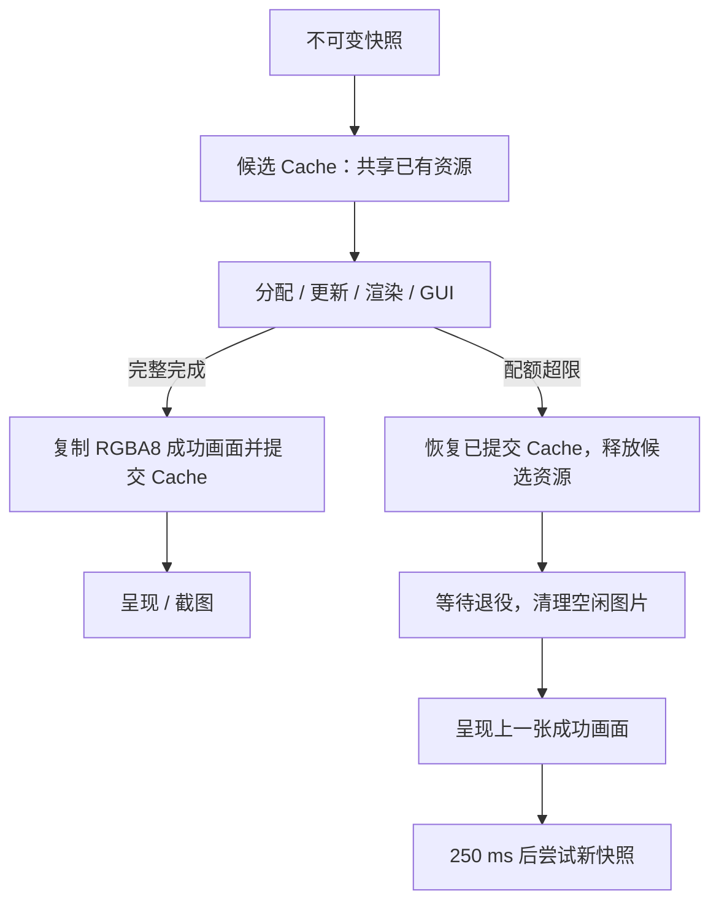

# Engine 内存压力处理与 GPU 帧发布回滚

2026-10-03，接续核心数据封装，完成 RHI 配额压力回收、候选 GPU 缓存事务，以及原生双线程编辑器的失败帧保留与恢复。

## 原问题

之前 RHI 配额在分配前直接拒绝，没有尝试释放空闲图片和等待已提交资源退役。即使存在可回收资源，也可能终止应用。

SceneAdapter 在逐项上传时就替换网格／材质缓存、递增上传 epoch；如果后面的资产创建失败，前面的替换已经生效。材质标量原地写入共享 GPU buffer，恢复 map 也无法恢复这些参数。GpuSubdivision 还会先标记新 source，再进行可能失败的创建，造成缓存记录与 GPU 内容不一致。

RenderRuntime 对所有异常都关闭队列。只有 CPU staging 的成功／失败事务，GPU 侧配额超限不能保留画面。地形、草、细分、海洋及时间历史包含可变 GPU 状态，因此单纯重新绘制旧 DrawPacket 也不能证明画面仍是上一帧。

## 压力回收

Device 分配 buffer／texture 前先检查配额；空间不足时调用一次所属设备的压力处理器，然后重新检查。处理器禁止创建资源、修改配额或替换自身，异常后重入标记也会恢复。没有处理器或回收后仍超限时，仍抛出 ResourceBudgetExceeded。

GpuImageCache 为设备安装弱引用处理器，按 LRU 释放足够的空闲图片。只有没有外部 material lease 的图片可回收，活材质、上一份提交缓存与回退画面继续持有资源。随后 waitIdle 安全完成 GPU 工作与 retirement，再允许分配；即使没有空闲图片，等待中的帧资源仍可能释放配额。等待仅发生在压力路径，正常分配保持原流程。

默认 64 MiB 空闲图片预算保持有效。压力回收提前让出空闲空间，不修改预算配置；回收后的新图片继续按正常缓存策略进入。ResourceMemoryStats 新增 pressureEvents 与 pressureRecoveries，后者只表示配额检查恢复，不能证明后续 native 分配一定成功。

## 候选缓存与发布画面

SceneAdapter 的 beginPublication／commitPublication／rollbackPublication 只允许设备线程调用，不允许嵌套或在事务内 invalidate。普通 resolve 自带一个局部事务；RenderRuntime 显式把事务延伸到 renderer 与 GUI 的成功完成。

候选 Cache 浅拷贝网格、材质、细分及地形记录，复用已有 GPU 对象和 const CPU payload。新的网格、图片来源、地形来源与 epoch 只进入候选记录。失败时恢复上一份记录，清理未被租用的候选图片，资源按 completion 规则释放。

材质参数发生变化时创建新的参数／扩展 buffer 与 binding set，共用原图片 lease；不再写旧 GPU 材质。参数不变时复用完整材质，不做每帧上传。地形材质也使用这个规则。细分先成功创建，再更新 source／material 记录。

RenderRuntime 额外拥有一张 RGBA8 成功画面，渲染和 GUI 完整成功后才复制到它。若配额超限，候选缓存回滚；已经开始修改效果状态或完成不同尺寸扩容的 renderer 会被释放，下一次重建。回退阶段只呈现成功画面，不重新使用可能被候选 compute 修改过的旧几何。

回退截图使用成功画面的真实宽高和像素，窗口呈现沿用后端缩放。队列继续消费，250 ms 内复用成功画面，避免每个 UI tick 重复创建同一个过大的候选。之后尝试最新快照；资源需求降低或配额足够时恢复正常渲染。日志记录不同拒绝原因，运行统计提供 rejectedPublications、fallbackFrames、memoryPressureEvents 与 lastRecoveryMessage。

## 成本与边界

- 成功画面额外占用 `4 × width × height` 字节，例如 1920×1080 约 7.91 MiB，并增加一次 GPU 纹理复制。缩放事务期间旧／新成功画面可能同时驻留，退役资源也继续计费。
- Cache 事务复制资产索引，不复制全部几何或图片；成本随记录数增长。连续材质动画会创建新的小参数 buffer／binding set，图片保持共享。
- 压力路径会等待 GPU 完成；这是低内存时的保守策略，不保证低延迟。
- 恢复范围是 ResourceBudgetExceeded。冷启动还没有成功画面时，超限仍明确失败；非法参数、文件错误、设备丢失与其他 native 错误继续传播。
- 这是 GPU **帧发布**与资产缓存记录的事务。CPU 世界已经发布的修改仍保留，异步资产接纳仍可能发布部分就绪绘制；完整世界的 CPU／GPU 联合两阶段加载仍是后续设计工作。
- 地形／VT／细分等已有对象的动态 compute 状态不逐字节回滚；冻结成功画面避免暴露失败结果，下一份成功快照重新生成当前状态。独立 resolve 的调用方不能把历史 GPU packet 当作不可变 GPU 内容。
- 原生 Metal／Vulkan 双线程编辑器具备画面回退；单线程对照与独立画廊仍按原异常传播路径处理。图片压力回收和 SceneAdapter 缓存事务是 RHI 共用功能。
- 逻辑配额统计仍不覆盖 driver heap 对齐、隐式 staging、交换链、pipeline、view／sampler 等开销。静态 mesh 分段上传及 pipeline cache 已在 [后续阶段](engine-streaming-and-pipeline-cache.md) 完成。实际 native heap 统计、自动调整 VT／FFT／LOD 品质、图片／生成资源增量初始化与首次管线预热仍待推进。

## 验证

在 Apple M4/macOS 上完成：Metal CTest **11/11**、Vulkan/MoltenVK **12/12**、OpenGL RHI 兼容路径 **8/8**。Metal 开启 API／Shader Validation；MoltenVK 关闭已知阻塞的 MetalTools 组合，本机没有 Khronos validation layer。

新增回归包括：

1. CPU RHI 配额回调释放资源后继续分配、回收不足拒绝、禁止递归分配、异常后重入状态恢复、失败不计费。
2. 真 GPU 空闲图片淘汰释放配额，活 lease 的读回像素保持正确。
3. 第一项网格与新材质参数成功建立，第二项分配失败；恢复原网格／材质身份与 epoch，旧材质不变透明，候选资源安全释放后占用恢复。
4. 外层在 resolve 成功后主动 rollback，仍恢复已提交记录。
5. 双线程先发布正常画面，然后窗口大尺寸扩容及 2048 FFT 海洋分别超限；两个拒绝帧的 PPM **逐字节等于成功画面**，包含旧尺寸。随后正常快照继续绘制并生成不同像素，队列正常排空。
6. 原有非法帧参数仍到达主线程，最小化／恢复和原有效果回归保持通过。

真实 Metal 编辑器 `--demo --hidden --size 640x360 --frames 12 --time 8 --gpu-resource-budget-mib 256` 正常退出，跟踪资源峰值约 **242.59 MiB**，没有拒绝发布；同尺寸 8 MiB 冷启动明确以配额错误退出。这里的峰值是单次功能验收记录，不是实际 driver heap 或性能基准。

CPU DeviceTests（含压力回调及设备线程测试）通过 ThreadSanitizer；完整图形应用与第三方 AppKit／GLFW 未做 TSan 验收。Windows／Linux 未实机验收。

相关文档：[核心数据边界](engine-data-boundaries.md)、[多线程设计](engine-multithreading.md)、[统一资源配额](engine-world-commands.md)、[设计审查](engine-design-review.md)。
