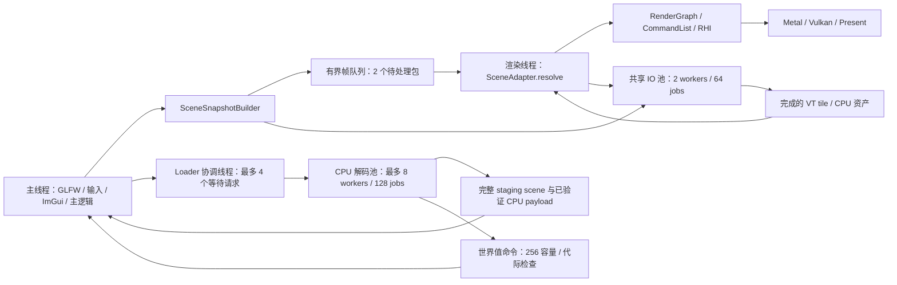

# Engine 多线程与主逻辑／渲染分离

## 线程与所有权

原生 Metal／Vulkan 编辑器默认使用独立渲染线程。GLFW 初始化、窗口、事件、输入、相机 tick、ImGui context、场景编辑和设置保留在主线程；RHI 创建、更新、提交、读回、呈现和 GPU 资源释放归渲染线程。窗口与字体 atlas 的初始化在启动阶段完成，`waitIdle` 后移交设备，退出时先排空消息、join，再把设备归还主线程并销毁窗口。



CPU 队列与 GPU 在途帧分别限制：最多 2 个等待的帧包，GPU 默认最多 3 帧。队列满时主线程受背压，避免无限堆积输入到画面的延迟；已经接收的帧按 FIFO 执行，不悄悄丢帧。逻辑线程与渲染线程可以重叠处理相邻帧，但这不是无等待的固定频率模拟器。

`Device::checkThread()` 检查设备归属。设备移交只能发生在启动／join 的静止边界，`adoptCurrentThread()` 不是并发锁。`RenderScene` 的结构容器、相机、sky／terrain 与 bootstrap payload 现已私有，读取和修改入口以及 snapshot capture 都检查逻辑线程。`objects()`／灯光列表返回 const 容器，插入去重，删除／清空同步维护灯光索引；活对象增删组件通过私有注册表自动通知世界并维护灯光索引。后台任务通过容量 256 的值命令队列提交 ID／参数，主循环限量消费 64 条；旧世界入口在替换时失效。Transform／Light／Camera 核心参数及 Mesh／Material 容器已私有，getter／setter 也检查归属；部分效果配置与历史 Texture 字段仍公开，**不得从后台线程直接修改**。后台工作只构建未发布对象或不可变 payload，完成结果由主线程应用。

## 不可变快照与资产版本

`RenderWorldSnapshot` 包含相机、光源、环境、海洋参数、绘制变换和 const CPU payload，没有 GameObject、Component、Camera、Material 或 GPU handle。网格数组和内存纹理先脱离可变场景，再交给 CPU job；模型矩阵、材质标量、相机等每帧复制。渲染线程只调用 `SceneAdapter::resolve(snapshot)`，不会回写太阳组件或读取输入单例。

`GuiFrame` 深拷贝 ImGui 顶点、索引和命令。渲染器不访问下一帧 ImGui 的内部缓冲区，也不在析构中访问 UI context。当前支持字体与已登记纹理；自定义 ImGui draw callback 不允许跨线程，必须先转成独立渲染消息。字体及原生 GUI pipeline 在启动阶段建立。

对象、组件、Mesh 和 Material 使用单调递增 ID，地址不再作为这些 cache 的身份；复制 Mesh／Material 资产会分配新 ID；GameObject／Component 禁止复制。`Mesh::setGeometry()` 与 Material 的纹理槽 API 自动更新内容版本，材质标量独立记录参数版本，不重建图片。历史 Texture 原地像素修改仍需在逻辑线程调用 `Material::invalidate()`；不允许把 getter 返回的 const 引用跨线程使用。地形继续使用 `invalidateHeight()`，并检查组件身份、路径、尺寸、预算、材质版本和草状态。`getComponent<T>()` 对精确类型使用 `type_index` 索引，基类查询保留确定顺序的动态转换；旧字符串接口保留给历史 JSON／反射。

原生图片解码缓存按规范化路径、mtime 和文件长度合并请求，payload 共享 const 图片。普通 Texture cache 封装容器并合并同路径进行中的 future；锁只保护索引，解码不占用索引锁。失败不会永久污染 key，未被外部使用的条目可以释放。共享图片 cache 在快照收集时回收无引用条目，Texture cache 在编辑器周期／退出时回收。

## 场景加载事务与取消

`Loader::buildScene(path)` 返回 `SceneLoadRequest`，包含 future、取消标记和进度。独立协调线程分发解码任务，按 JSON 对象键的确定顺序收集结果，避免 worker 完成先后改变场景顺序。每个解码对象先封存再经 future 交给协调线程接管，完整 staging 在资产准备后再次封存，主线程接管时重新指定组件与 CPU 资产归属；Camera、Mesh 和引用的 Material 一并参与。可变资产组必须整体移交，不支持不同线程同时使用跨世界共享的可变 Material。未封存外线程对象及单独外线程组件不能直接挂入世界。子 JSON、网格、材质图片及 VT bootstrap 验证成功后才返回 staging；准备的 const CPU payload 在主线程第一次 capture 时被接管，避免重复准备。

GUI 轮询 future，在主线程调用 `RenderScene::replaceWith` 一次发布，保留已有相机。解析失败、缺少子文件、解码失败或取消都保留原场景。事务保证 CPU 侧构建与资产准备；GPU 分配、设备能力及 GPU 专用参数校验失败仍由渲染线程上报，尚未实现 GPU 阶段的回滚。重新选择文件先取消旧请求，旧结果不会覆盖新选择。取消在任务边界和发布前检查，不强制中断正在进行的文件读取／Assimp 导入。满载的协调队列返回明确失败，不阻塞 UI 等待空位。

旧 `loadSceneAsync(scene,path)` 保留为阻塞兼容包装，内部也执行完整事务。OpenGL 兼容路径由该包装在 GL context 线程同步构建，后台 `buildScene` 明确拒绝此后端，避免历史组件在无 context 的 worker 中创建 GL 对象。Loader 不再公开 threadpool/maxThread。退出先等待所有已取消／过期请求结束，再关闭设备，避免任务访问已经销毁的运行环境。

## VT 与 GPU 上传预算

非根页采用 request → IO → ready → upload → publish：渲染线程使用 `tryEnqueue` 调度读取，不等待磁盘；源文件句柄通过源级 mutex 串行访问。每个 VT 最多 16 个待完成页，每帧最多发出 8 个请求、上传 8 页。只有所有 plane 上传完成才发布映射；缺页期间使用固定的粗根页。

根页在 CPU payload 准备时读取。替换资产时，旧任务只持有 CPU 源和 promise，不捕获 GPU VT 对象；旧 future 接收容器销毁后，结果不能写入新页表。离开视野的已完成页被丢弃。磁盘／页数据错误仍明确传给主线程，不能用不完整映射继续绘制。

普通材质图片通过同设备的 `GpuImageCache` 共用 texture／view，内容 hash 后再比较尺寸和完整字节，碰撞不会错误复用；sampler 独立于图片。默认图和 packed special 图也参与共享。不可变 shared 图片避免构造材质时再复制大数组，special payload 独立持有图片，不通过 alias 指针延长整个材质的 CPU 生命周期。

缓存默认保留最多 **64 MiB 空闲图片**，按 LRU 淘汰没有材质 lease 的条目，活图片不会被预算强行释放。该限制不是全局显存硬上限：统一 RHI buffer／texture 配额可另外启用，但 driver allocation 不在逻辑负载计费范围。GPU lease 在材质 binding set 之后通过 completion retirement 释放；缓存只能在设备线程操作，启动／退出仍使用既有静止设备移交。

普通网格／材质在渲染线程按当前 snapshot 逐步创建：每帧最多接纳 2 个新资产，累计上传目标为 32 MiB。超过单帧目标的单个资源允许独占一次上传，避免大资源永远无法加载；这是接纳预算，不是硬性的帧时间保证。材质接纳只计尚未缓存的图片字节；相同内容在单个材质中也不重复计费。尚未就绪的对象暂时不进入 DrawPacket，但其仍被引用的材质／细分记录不会因上游网格等待而被清除，避免反复重建。上传完成会使 TSAA 历史失效。地形、细分、海洋和 pipeline 初始化仍有不可分割的分配／构建；后续应增加大 buffer 分段上传和 pipeline cache。

可选 `--gpu-resource-budget-mib N` 对原生编辑器的所有 RHI buffer／texture 设定统一逻辑负载配额（默认 0，不限额）。分配前拒绝超限，失败不计费，等待 completion 的资源直到实际安全销毁才减计；超限由既有 worker 错误传播路径退出，尚无压力降级或 GPU 发布回滚。详见[组件、命令与配额](engine-world-commands.md)。

运行日志输出帧数、最近一帧渲染线程 CPU 用时、最近最多 256 帧的 CPU p95／p99（每 32 帧和退出时更新）、主线程提交队列的最大等待用时、共享 GPU 图片字节／上传／命中次数，以及逐次成功分配更新的 RHI buffer／texture 逻辑负载峰值。CPU 时间包含 worker 中的提交、呈现与必要等待，不是 GPU timestamp；队列最大等待也不是完整输入到画面的端到端延迟。该估算包含仍在 RHI 注册的资源，**不包含** driver heap 对齐、隐式 staging、交换链、pipeline 或 RHI 未登记的 native allocation，不能当作系统显存峰值。

## Render graph 与呈现

`ForwardPbrRenderer` 通过有序 `RenderGraph` 记录 geometry、SSAO、back depth、lighting、forward、motion、ocean、transparent、temporal、tone map。执行前验证未初始化读取和模糊的读写声明；读写同一 attachment 必须声明 ReadWrite。实际 binding／pass 反馈环和 native barrier 继续由 RHI 验证及实现。大气、海洋模拟、阴影仍由效果对象在图前调度。

这版 graph 保留已有命令顺序，不负责 transient texture alias、自动拓扑排序、跨队列或并行录制。这些功能需要完整资源描述及子资源生命周期，不能仅靠添加线程获得。

主线程把 framebuffer 尺寸放入帧包，并通过原子 mailbox 通知最新表面尺寸。最小化后，已经接收的旧帧仍完成离屏 GPU 工作，跳过无效表面呈现；恢复后继续正常呈现，退出不会因渲染线程等待窗口恢复而死锁。渲染 worker 使用显式 `setPresentationExtent`，不调用 GLFW 窗口查询。窗口缩放时已有旧尺寸帧可能仍在队列中；Metal／Vulkan 将它缩放到实际获得的 drawable／swapchain，后续帧重建目标并清空 TSAA 历史。Apple 渲染线程有每帧 autorelease pool，防止长时间运行积累临时 Objective-C 对象。

## 运行与验证

```bash
./build/Scene-Renderer --demo
./build/Scene-Renderer --classic terrain --hidden --size 640x360 --frames 40 --time 8 --resize 480x270
./build/Scene-Renderer --classic cornell --single-thread --hidden --frames 8 --time 8
ctest --test-dir build --output-on-failure
clang++ -std=c++17 -pthread -fsanitize=thread -g -Iinclude \
  tests/engine/ConcurrencyTests.cpp src/engine/JobSystem.cpp -o /tmp/engine-concurrency-tsan
/tmp/engine-concurrency-tsan
```

`--single-thread` 保留原生单线程对照；OpenGL 兼容编辑器维持单线程。无 UI 画廊和独立 GPU 自检使用同步收集路径，方便固定输入验证。

CPU 并发测试覆盖同 key 合并、不同 key、失败重试、释放、队列容量、worker 异常、嵌套阻塞拒绝、排空退出与背压，另覆盖多生产者世界命令、容量、取消、代际失效、弱入口与异常恢复；该测试已在 ThreadSanitizer 下执行。应用 GPU 自检覆盖失败保留场景、缺少子文件、异步构建／显式发布、快照在场景删除后仍可消费、几何版本失效、设备／场景线程检查、GUI 数据隔离、渲染 worker 错误传播，以及 VT 未完成页不发布。窗口测试包含原生前向、缩放、异步 VT 地形和单线程对照。

完整图形应用与第三方 AppKit／GLFW 没有在 ThreadSanitizer 下验收；不能将 CPU 基础设施测试当作所有第三方调用的线程安全证明。

组件边界、封存移交、命令队列和混合资源配额的后续回归同样通过 Metal **11/11**、Vulkan **12/12**、OpenGL **8/8**，CPU 并发测试再次通过 ThreadSanitizer。

参考：[GLFW 线程约束](https://www.glfw.org/docs/latest/intro.html#thread_safety)、[Apple CAMetalLayer](https://developer.apple.com/documentation/quartzcore/cametallayer)。

2026-10-03 在 Apple M4/macOS 上完成：Metal CTest **11/11**、Vulkan/MoltenVK CTest **12/12**；CPU 并发／graph 测试在 ThreadSanitizer 下通过。Metal 启用 API／Shader Validation，Vulkan 关闭本机已知会阻塞的 MetalTools 组合。

后续结构、图片共享、LRU 和预算等待修复的原因与验收见 [Engine 后续修复记录](engine-followup-fixes.md)。

核心参数私有化、自动版本失效、MaterialData worker 输入与资产移交的接口及最新验收见 [可变数据边界](engine-data-boundaries.md)。
