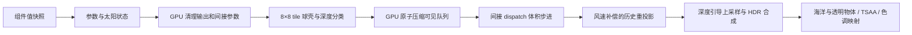

# GPU Driven 体积云

2026-10-05：把原来只有声明的 `Cloud` 组件接入新 RHI，Metal 与 Vulkan 共用计算 shader 和渲染调度。默认半分辨率执行体积积分，可在编辑器切换完整、半、四分之一分辨率；经典场景提供晴天积云、日落和阴天三种预设。旧场景默认关闭云，避免改变已有的对照图与性能。后续增加了 [可穿越三维体素云](immersive-voxel-clouds.md)，本文的球壳流程和测量对应 `voxel=false` 的远景模式。

方案参考了 Guerrilla 的实时体积云公开资料：[2015 年云景渲染](https://www.guerrilla-games.com/read/the-real-time-volumetric-cloudscapes-of-horizon-zero-dawn)、[Nubis, Evolved](https://www.guerrilla-games.com/read/nubis-evolved)。本项目采用程序化密度、有限步进和时域重建，并自行实现 GPU tile 压缩队列；并未复现完整 Nubis 系统，其性能数字也不适用于这里。

## 运行与参数

从仓库根目录使用原生 Metal 或 Vulkan 构建的程序运行：

```sh
./build/Scene-Renderer --classic clouds
./build/Scene-Renderer --classic clouds-sunset
./build/Scene-Renderer --classic clouds-storm
./build/Scene-Renderer --render-gallery img/metal cloud-gallery
```

不需要下载资源。`--demo`、天空、海洋和地形等带大气的示例挂有 `Cloud` 组件，在天空的 **Volumetric clouds** 面板开启。面板提供覆盖率、消光系数、云底高度、厚度、侵蚀、风速、步数、分辨率与独立时域累积。主逻辑修改组件，快照以值传递 `CloudSettings`；渲染线程拥有 GPU 纹理和历史，不从 GPU 线程访问可变组件。

场景 JSON 的天空对象可包含以下 `clouds` 字段；也可以通过组件注册表创建名为 `Cloud` 的组件：

```json
{
  "clouds": {
    "enabled": true,
    "voxel": false,
    "temporal": true,
    "baseHeight": 1200,
    "thickness": 1600,
    "coverage": 0.55,
    "density": 0.006,
    "shapeScale": 3500,
    "weatherScale": 45000,
    "erosion": 0.28,
    "maxDistance": 60000,
    "wind": [12, 4],
    "steps": 72,
    "lightSteps": 6,
    "downsample": 2,
    "seed": 7
  }
}
```

高度、厚度、距离和噪声周期单位为米，风速为米／秒，`density` 为最大消光系数（1／米），实际系数还乘程序化密度。`downsample` 只支持 1、2、4；主步数范围 16–192，太阳步数 1–12。字段先整体校验再发布，非法值和 NaN 不会部分更新组件。GUI 的侵蚀调节可改变云团细节；覆盖率改变局部密度阈值，并非画面白色面积的直接百分比。

## GPU 工作流



每个分类 tile 有 64 个线程；只要一个有效像素的视线在不透明表面之前与云层相交，便由一个线程通过原子操作追加 tile 编号，同时增加间接 dispatch 的 X 维度。Y、Z 固定为 1；步进 kernel 根据队列编号恢复二维坐标。分类后的主步进工作量完全由 GPU 控制，交互帧不读回 tile 数量，也不等待 CPU 判断可见性。

分类过滤的是视线／球壳／不透明深度，**尚未使用密度层次结构筛选空 tile**。队列为所有 tile 预留容量，主机提前检查容量是否超出后端单维 dispatch 上限；超出时提示增大降采样。零覆盖或零密度产生零组间接 dispatch，清理 pass 仍把辐亮度置零、透射率置一，避免留下旧云。

### 程序化密度

第一次开启或修改种子时，GPU 烘焙 64³ 周期噪声与 256² 天气图。64 个切片存放在 528×528 的 RGBA16F 图集中，每个 64×64 切片带一像素周期 apron；XY 使用双线性采样，Z 插值相邻切片，得到连续的三线性密度采样。这复用现有 RHI 的二维纹理接口，不需要 CPU 生成体积数据或上传外部云贴图。

主体由低频 Worley 和多层 value noise 构成，第二通道保存高频 Worley 侵蚀；天气图决定局部覆盖和高度形态。先判断高度剖面和天气阈值，空区域跳过体积噪声采样。风以世界 XZ 平面平移密度与天气图，噪声周期由 `shapeScale`、`weatherScale` 控制。

云层使用与大气一致的行星半径和海平面，位于两个同心球面之间。稳定二次方程求根处理地面、云内和云上观察位置；视线被行星、不透明场景深度与最大距离截断。每条射线目前积分最近的一段云壳，远侧第二段不额外积分。

### 光照与积分

主步进默认最多 72 次，并随帧改变采样位置；有密度时才发出默认 6 次太阳方向采样，采样位置按平方间距分布。Beer–Lambert 透射率低于 0.01 时提前结束。输出为已经乘积分权重的辐亮度 `L` 和透射率 `T`，场景合成满足 `L + T × background`。

太阳方向和大气顶层辐照度沿用场景太阳状态；云层中心高度的解析大气透射率用于衰减太阳入射。双 HG 相位近似前向散射和弱反向散射，太阳射线积分产生云内自遮蔽；天空环境来自现有大气辐照度 LUT。两个低频衰减项近似补充多次散射，单次散射反照率使用 0.98。RGBA16F 辐亮度限制为 65000；这是一套可控的 RGB 实时近似，尚无严格高阶散射求解或绝对光度标定。

### 时域与合成

历史使用云贡献加权的代表深度，把当前云位置按风速移回前一时刻，再经前帧视投影矩阵查找历史。云深度／不透明深度不一致时拒绝历史；通过 3×3 当前邻域裁剪限制历史色和透射率，默认历史权重为 0.85，透射率差异大时降低权重。覆盖、密度、种子、光照及场景版本变化，resize、FOV／投影变化、相机大幅跳跃和时间倒退／跳跃都会失效历史。投影变化比较在 TSAA jitter 之前执行。

四点深度引导上采样结合全分辨率射线／深度检查，把云放在地形后面。合成 pass 在海洋场景颜色复制之前执行，所以水体透射背景可以包含云；海洋随后覆盖自己的运动信息。云覆盖像素标记为不接受通用天空 TSAA 历史，避免把运动的云当成无限远静态天空再累积一次。透明物体在云之后绘制，尚未做透明物体与体积的逐段混合。

关闭云时释放其持久资源。`GpuClouds::commit` 只在命令提交成功后推进历史与种子状态；RHI 管理写入到采样、写入到间接参数读取的依赖，Metal 与 Vulkan 共用同一套效果调度。

## 实际渲染与测量

图片由新 RHI／原生 Metal 在 Apple M4 上实际生成，输出 960×720，云缓冲 480×360，每组独立重置历史并渲染 32 帧，固定时间 8 秒。`*-clear.png` 保持相机、太阳、曝光和大气一致，只关闭云；`*-opacity.png` 为 GPU 云历史缓冲的 `1-T`，白色表示更不透明，没有色调映射。

| 晴天积云 | 日落 | 阴天 |
| --- | --- | --- |
|  |  |  |

| 无云背景 | 半分辨率不透明度 |
| --- | --- |
|  |  |

| 场景 | 开云整帧均值 | 关云整帧均值 | 均值差 | 全像素平均主步数 |
| --- | --- | --- | --- | --- |
| 晴天积云 | 6.97 ms | 3.16 ms | 3.80 ms | 47.40 |
| 日落 | 6.82 ms | 3.25 ms | 3.56 ms | 47.40 |
| 阴天 | 6.63 ms | 3.22 ms | 3.41 ms | 27.29 |

逐帧数据：[晴天](../img/metal/clouds-metrics.json)、[日落](../img/metal/clouds-sunset-metrics.json)、[阴天](../img/metal/clouds-storm-metrics.json)。

GPU 时间为整帧原生命令缓冲，包含呈现复制；剔除前四帧，记录剩余 28 帧的均值。差值仅估计这组场景添加云后的整帧增量，**不是云 pass 的独立 timestamp**。画廊为统计每帧时间显式等待 GPU；交互渲染不做该等待。硬件、系统负载、分辨率、视角及密度都会影响结果，冷启动噪声烘焙／管线编译不在表中。

该视角的分类队列为 1980／2700 个 tile，剔除约 26.7%；不代表任意视角都有相同比例。步进统计在全部低分辨率像素上求平均，包含被剔除的零步像素，不能作为每条有效射线的平均步数。

960×720、半分辨率下的持久纹理和队列约 **14.50 MiB**：六张低分辨率颜色／元数据纹理约 11.87 MiB，噪声图集约 2.13 MiB，天气图 0.50 MiB，tile 队列及间接参数约 10.56 KiB。不包含既有 HDR／深度／天空纹理、管线和每帧参数资源；全分辨率的屏幕缓冲成本约为半分辨率的四倍。

## 验证与代码入口

Apple M4／macOS 上最终完整 CTest：原生 Metal **17/17**、Vulkan/MoltenVK **18/18**；两者包含主程序云 GPU 回归，Vulkan 另有独立 GPU 验证目标。Metal 的真实云场景在 API／Shader Validation 下分别通过 8 帧双线程与 8 帧单线程窗口运行。

云 GPU 回归覆盖：参数非法值原子拒绝、JSON 配置、间接队列容量、有限 HDR／透射率范围、主步数预算、风速历史、投影切换、零覆盖／零密度后的输出清理、地球遮挡、云内／云上球壳、不透明前景完全遮挡、奇数 viewport／四分之一分辨率 resize 和种子变更。测试进入实际 GPU shader，完全遮挡时还逐像素检查 HDR 与关闭云一致。

```sh
SCENERENDERER_DISABLE_PIPELINE_DISK_CACHE=1 ctest --test-dir build --output-on-failure
./build/Scene-Renderer --rhi-self-test
./build/Scene-Renderer --classic clouds --frames 8 --size 800x450
./build/Scene-Renderer --classic clouds --frames 8 --size 800x450 --single-thread
```

本次测试关闭磁盘管线缓存，未验证缓存持久化；Vulkan/MoltenVK GPU 数值测试通过，本机没有 Khronos validation layer，对 MoltenVK 关闭 MetalTools 的已知阻塞组合。本次新增功能未在 OpenGL 或 Windows／Linux GPU 上实机验收。

| 入口 | 职责 |
| --- | --- |
| `CloudSettings.h`、`Cloud.cpp` | 配置、边界校验与 JSON |
| `SceneSnapshot.cpp` | 逻辑组件到不可变帧参数 |
| `GpuClouds.cpp` | 噪声／天气缓存、tile 队列、间接 dispatch、历史与合成 |
| `cloud-classify.comp`、`cloud-march.comp` | GPU 可见性压缩与体积积分 |
| `cloud-resolve.comp`、`cloud-composite.frag` | 风速重投影、裁剪与深度合成 |
| `CloudValidation.cpp` | 两个后端共用的 GPU 数值回归 |
| `ClassicScenes.cpp`、`FeatureGallery.cpp` | 三种场景、无云对照、不透明度与性能 JSON |

## 当前边界与后续方向

尚未把云透射率接入地面／地形的太阳阴影，也没有更新天空 IBL、RSM 天空反弹或海面天空反射；云目前改变可见背景及其透射遮挡，不能把阴天预设解释为整个场景的天气光照。CPU/GPU 离线路径追踪还不包含这套云密度。

64³ 周期数据限制近处细节，近地平线长射线的固定步数也可能遗漏薄云；高速度、密度变化和遮挡边界仍可能产生时域模糊。阴天是较高覆盖／密度的云层，不包含降雨、闪电、气象流体模拟。下一步可按独立 pass 计时，增加保守密度层次／空空间跳跃、云阴影图和随视距变化的细节 LOD；当前先保留有固定预算、可验证的调度。
