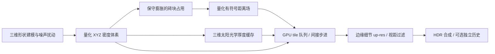

# 可穿越的三维体素云

2026-10-05：在 [GPU Driven 云层](gpu-driven-clouds.md) 的队列和 RHI 调度基础上增加独立体素路径。云由世界空间 XYZ 密度定义，可从外面、内部或上方观察；支持有限云体、风速平移、程序化风暴形态和内部闪光。专用预设以 **1920×1080 全分辨率**渲染，关闭云时域累积，不依赖 temporal upscaling。

参考路线来自 [Nubis Evolved / SIGGRAPH 2022](https://advances.realtimerendering.com/s2022/index.html) 和 [Nubis³ / Guerrilla](https://www.guerrilla-games.com/read/nubis-cubed)：后者介绍了体素建模、压缩距离场加速、密度 up-res 和光照采样加速。本项目实现相同方向的基础模块；体素建模、距离场编码和光照近似是本项目自己的实现，画面及耗时不能视为对其商业系统的复现。

## 运行

```sh
./build/Scene-Renderer --classic cloud-volume   # 云外观察
./build/Scene-Renderer --classic cloud-inside   # 云体内部视角
./build/Scene-Renderer --classic cloud-vortex   # 风暴形态与内部闪光
./build/Scene-Renderer --render-gallery img/metal cloud-volume-gallery
```

不需要额外下载。编辑器使用原有相机操作，可自由靠近、穿过和离开云体；**Volumetric clouds → Immersive voxel cloud** 切换模式。`CloudSettings` 默认使用体素模式，但默认不启用云；`clouds`、`clouds-sunset`、`clouds-storm` 明确选择旧球壳云层模式，保留远景及历史画廊。

体素模式的额外参数可写入天空对象的 `clouds` JSON：

```json
{
  "voxel": true,
  "enabled": true,
  "temporal": false,
  "downsample": 1,
  "voxelResolution": 128,
  "volumeCenter": [0, 2200, -4000],
  "volumeSize": [6000, 3600, 6000],
  "distanceSkipping": true,
  "coreIntegration": true,
  "coverage": 0.8,
  "density": 0.004,
  "steps": 128,
  "lightSteps": 6,
  "wind": [12, 4],
  "storm": 0,
  "lightning": 0
}
```

`volumeCenter`、`volumeSize` 是未平移时的世界空间中心与三轴尺寸（米）；云体随 `wind × time` 整体平移。分辨率支持 64³／128³，尺寸各轴 100–50000 米。`storm` 控制风暴建模分支，`lightning` 为内部闪光强度；它是局部体积发光，不包含几何闪电枝条、雷声或雨滴。球壳模式的 `baseHeight`、`thickness`、天气图不决定体素形状；`shapeScale` 和 `erosion` 仍控制噪声细节。

## 体素数据与 GPU 调度



密度由多个三维椭球云团的并集、三轴噪声域扰动和多频侵蚀生成；风暴分支使用随高度扭曲的漏斗及顶盖。它是真正依赖 XYZ 的有限密度场，并非只用水平天气图加高度剖面。当前建模是 GPU 程序化建模，**没有实现湿空气、凝结、浮力或 Navier–Stokes 流体模拟，也没有导入 VDB**。

由于当前 RHI 的采样接口以二维纹理为主，三维数据存于带一像素 apron 的切片图集：128³ 为 2080×1040，64³ 为 528×528，Z 轴手动插值两个切片，XY 硬件双线性插值。体积边界使用零密度，不周期重复；风平移整个体积，避免相机移动时云跟着相机重建。密度量化到 8 位，物理存储为 RGBA8（每图素 4 字节），不是 R8 原生三维纹理。

### 保守距离场

密度下采样到 32³ 砖块占用，检查砖块及邻接密度中心，覆盖三线性插值可能引入的边缘密度。GPU 初始化两种种子，然后 ping-pong 执行 32 次 26 邻域距离传播；结果保存为 8 位到非空／空砖块的距离、占用标志，以及到非恒密度内核的距离，共两张 256×128 RGBA8 纹理。

该字段编码的是离散 **Chebyshev 有符号距离**，不是精确欧氏 SDF：空空间到云为正，云内到空空间为负。步进仅使用正侧的保守下界：

```text
safeDistance = max(emptyBrickDistance - 2, 0) × min(brickSizeXYZ)
```

两砖块余量涵盖砖内采样位置和插值邻域。沿射线只跳过该距离以内的完整采样间隔，并保留原始采样网格相位；因此不会因跳跃改变有密度区域的采样位置。GPU 字段已逐砖块与 CPU 多源 BFS 参考对照，两种符号均校验；开启和关闭跳跃后的实际体积积分还逐像素对照。我们采用保守距离下界，避免近似最近点搜索过估距离造成漏云。

另外检测砖块及插值邻域是否全部为单位密度，传播第三个距离场界。仅在这一保守范围内合并最多八个主采样间隔：消光系数恒定，可解析积分透射率，太阳缓存／环境光按区间中点近似。云边缘保留细步进。`coreIntegration` 可独立关闭；空空间跳跃的等价测试与内核光照近似的误差测试分别执行，避免混淆两种保证。

### 光照缓存与细节 LOD

64³ RGBA16F 图集缓存太阳方向的光学厚度，默认每个缓存点使用 `4 × lightSteps = 24` 次非均匀密度采样。只有密度相关参数或太阳方向改变才重建；风速平移不需要重新计算太阳自遮蔽。主射线通过一次三线性缓存查询获得太阳透射和多次散射近似，不再在每个屏幕采样点发送六条太阳采样。

屏幕步进在体素密度边缘增加较细噪声侵蚀，密集内核跳过该噪声查询。细节随射线 footprint 平滑淡出，减少远处高频闪烁；细节只移除已有密度，确保距离场的保守包围仍有效。它是细节层的距离 LOD，尚无多级稀疏体素 clipmap 或流式砖块加载。光照缓存依据未追加细节侵蚀的密度构建，可能稍偏暗；单次缓存方向积分和 RGB 多次散射项都是近似。

### 云内、快速运动与闪光

相机相对反投影由 CPU 双精度矩阵构建，避免在公里级绝对坐标中减去近裁剪点导致方向精度损失。视线与平移后的三维包围盒相交，支持观察者在盒内；深度、行星和最大距离仍截断区间。主射线预算固定，透射率低于 0.01 时终止。全分辨率预设直接使用当前帧积分；启用独立历史时仍使用风速补偿与深度拒绝。内部闪光开启时自动绕过云历史及随帧抖动，避免发光脉冲残留在历史中。

内部闪光按固定周期在局部云心形成蓝白发光脉冲，并随体积平移；发光在当前积分中衰减、遮蔽。当前风暴的三维形状是静态建模后的平移，扭曲形态不代表随时间发展的流体涡旋。

## 实际效果与中间产物

以下为原生 Metal 实际渲染：1080p，全分辨率，128³ 密度，云时域累积关闭，各组运行 32 帧。画廊仍让通用 TSAA 处理无云背景，云覆盖像素拒绝该天空历史；32 帧运行用于稳定背景和测量，云不是靠 32 帧累积生成的。

| 云外 | 云内 | 风暴内部闪光 |
| --- | --- | --- |
|  |  |  |

| XYZ 密度中间切片 | 有符号距离中间切片 | 缓存太阳透射率中间切片 |
| --- | --- | --- |
|  |  |  |

密度显示原始量化值；距离场采用伪彩色，红色为空间正距离、蓝色为云内负距离；光照图显示 `exp(-tau)`。这些是实际 GPU 纹理切片，不是对效果截图进行绘制或生图。`*-reference.png` 是同时关闭空空间跳跃和恒密度内核合并的对照，`*-no-flash.png` 是关闭内部发光的对照，`*-clear.png` 关闭整个云体。

| 视角 | 两种加速开启 | 两种加速关闭 | 无云 | 全像素平均主查询数 |
| --- | --- | --- | --- | --- |
| 云外 | 11.82 ms | 23.57 ms | 6.06 ms | 14.96 |
| 云内 | 16.10 ms | 20.22 ms | 6.13 ms | 30.94 |
| 风暴／闪光 | 10.97 ms | 23.53 ms | 6.09 ms | 12.26 |

逐帧记录：[云外](../img/metal/cloud-volume-metrics.json)、[云内](../img/metal/cloud-inside-metrics.json)、[风暴](../img/metal/cloud-vortex-metrics.json)。

GPU 时间为整帧原生命令缓冲，含呈现复制；32 帧中的前四帧排除，统计剩余 28 帧。启动编译、密度／距离场和光照缓存重建不包含在暖帧均值中；缓存重建的成本不能解释为零。云内覆盖率、单射线的有密度长度和高密度提前终止显著影响成本。此表不是独立云 pass timestamp，也不能与 Guerrilla 在其他硬件／场景上的云渲染数字直接比较。

128³ 数据约增加 **10.63 MiB** 持久存储：密度 8.25 MiB、太阳缓存 2.13 MiB、两张距离场共 0.25 MiB。1080p 全分辨率的无历史路径只保留两张积分纹理，约 **47.46 MiB**，直接合成并跳过历史 resolve；相较六张积分／历史纹理的 142.38 MiB，少分配约 **94.92 MiB**。开启历史后再按需分配四张历史纹理。此外仍有噪声／天气、队列及既有场景缓冲。

## 验证与范围

隔离本轮渲染改动及既有 PT 基线的完整 CTest：Metal **17/17**、Vulkan/MoltenVK **18/18**。最终窗口通过 Metal API／Shader Validation 下的 1080p 双线程云外与云内运行、单线程运行；Vulkan 在本机没有 Khronos validation layer，采用实际 GPU 数值检查。完整测试关闭磁盘管线缓存；最终精度修复后补测 Metal GPU 1/1、Vulkan GPU 2/2，工作目录默认磁盘缓存配置下的云内／云外窗口也正常运行。缓存持久化格式不在本轮验证范围。

恒密度内核测试视角的主查询数从 196,683 降到 134,217（约减少 31.8%）；相对于细步进的辐亮度误差由独立回归检查，容许相对 L1 小于 5%，该 Metal 测量约 0.109%。透射率差异不得超过 0.011，包含 0.01 的提前终止界限；这些是特定测试视角的结果，不是任意体积的误差上界。

云回归包含量化密度尺寸、两种符号的 GPU／CPU 距离场逐砖块对照、距离场开启／关闭的积分等价、单位密度内核字段的 CPU 参考／合并光照误差、有限光照缓存、云内视线、内部发光能量增量、快速相机／风速下的无历史结果、64³→128³ 切换，以及既有零工作／深度遮挡／奇数 resize。Metal 与 Vulkan 共用相同测试函数及 GLSL 源码。

关键代码：`cloud-volume.comp`（建模）、`cloud-distance-init.comp`／`cloud-distance-step.comp`（距离场）、`cloud-volume-light.comp`（太阳缓存）、`cloud-voxel-march.comp`（间接步进和细节）、`GpuClouds.cpp`（缓存与调度）、`CloudValidation.cpp`（GPU 验证）。

尚未接入地面云阴影、海面云反射、天气变化对 IBL／RSM 的调制和离线 PT 云；透明几何与云体仍按整个 pass 顺序合成。有限体素分辨率与预算会限制近处细节；目前没有生产级云资产、流体演化、多体积流式 LOD 或完整气象系统。上述限制独立于已经实现并验证的可穿越体素表示和加速积分。
