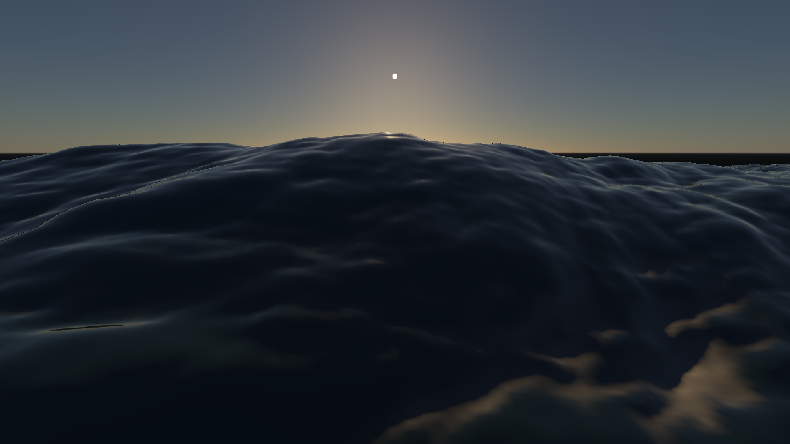
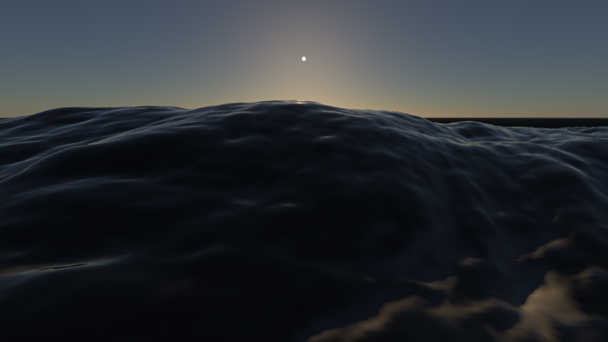
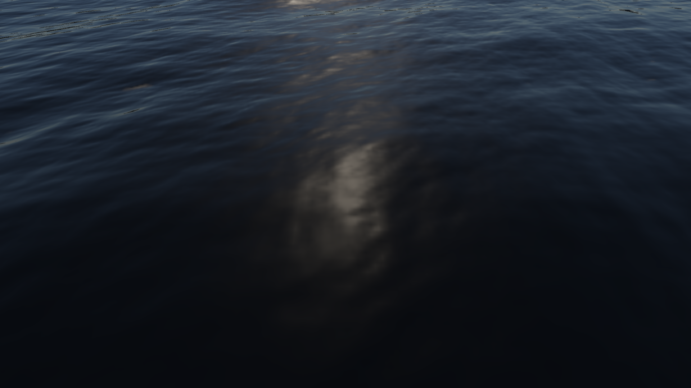

# FFT 海洋与透明水体修复记录

本次审查覆盖频谱生成、二维逆 FFT、位移、法线、泡沫及水面 HDR 合成，并增加高清短波细节、屏幕空间折射和近似次表面散射。截图由本项目的 Metal 后端实际渲染，固定随机种子 `1337`、模拟时间 `8 s`、分辨率 `1920×1080`。效果图已使用后续加入的 TSAA 累积 16 帧重新生成，原修复数值记录保留；抗锯齿及海面运动信息见 [TSAA 实现说明](tsaa.md)。


2026-10-03 更新：本文引用的海洋／透明水体及开关对照图片均已用**新 RHI／原生 Metal** 重新生成，每张独立重置 TSAA。天空与海面现在读取相同太阳能量和大气透射，详细变更见 [天空与太阳修复](sky-and-sun-review.md)。下列早期 FFT／水体数值是当时修复的验证记录，不作为本次天空修改后的画面亮度。

2026-10-06 更新：原生 Metal／Vulkan 水面增加相机附近密集网格、独立水下颜色／位置捕获和水中路径单次散射积分。当前截图、对比、耗时与限制见 [实时水体升级验收](water-realtime-upgrade.md)。下文保留早期 FFT 修复的数值记录。

## 修复前的问题与处理

| 问题 | 影响 | 修复 |
| --- | --- | --- |
| `h0(k)` 和 `h0(-k)` 使用同一坐标的随机数 | 相反方向的波不独立，不能正确构造实数波面的共轭频谱 | 读取周期镜像坐标的高斯随机数，使用 `conj(h0(-k))` |
| 波数使用像素索引归一化，与海面物理长度脱节 | 修改海面长度后，传播速度、波长和法线尺度不一致 | 使用 `k=(p-N/2)·2π/L`，长度以米计 |
| 最后一层蝶形额外反转旋转因子，随后奇偶修正重复改变相位 | FFT 输出并非预期的逆变换 | 使用统一 Stockham 逆变换，最后只做一次中心化奇偶修正 |
| 用复数模长生成高度和水平位移 | 波谷变成正高度，位移失去方向 | 提取带符号实部，统一除以 `N²` |
| 原方向分布存在除零、轴向角度和未初始化分支 | 无风或特定方向产生非有限值 | 使用对称 Phillips 方向权重；零风速、零方向、零振幅显式输出平面 |
| 法线计算中 Z 正负邻居读取相同纹素 | 一个方向的坡度错误 | 使用正确的四个周期邻居和 `L/N` 的采样距离 |
| Jacobian 未除以实际采样间距 | 泡沫随分辨率、海面长度改变，阈值缺乏一致含义 | 对水平位移求米制中心差分，再计算面积压缩率 |
| 网格长度与 UV 周期不一致，纹理边界非周期 | 波面边界与法线出现接缝 | 网格覆盖完整 `L`，纹理使用 repeat，采样对齐纹素中心 |
| 每帧生成无关随机参数，时间直接乘当前速度 | 不可复现，调整时间速度时相位跳变 | 显式种子，种子变化才重建噪声；用帧增量积分模拟时间 |
| 固定光照方向、天空重复 gamma、片元提前截断到 1 | 场景太阳设置无效，天空与高光能量不正确 | 读取启用的场景方向光和线性 HDR 天空 LUT，在最终后处理统一曝光、色调映射 |
| 以观察角度控制 alpha | 看不到真实水深变化，缺乏水下物体透射 | 拷贝不透明 HDR，结合 G-buffer 位置与法线估计水中路径，计算折射和 RGB 消光 |
| GPU 对象标识未初始化即析构 | 可能删除无关对象 | VAO、VBO、EBO 初始化为零，仅删除已创建资源 |

旧 FFT 着色器的复现测试不是目测判断：将旧四个 FFT 着色器库替换进相同测试，`N=8` 单频案例的相对最大误差为 **2**，测试按预期失败；修复后误差约为 **10⁻⁶**。

## 频谱与变换

波高采用 Tessendorf 形式：

```text
h(k,t) = h0(k) exp(iωt) + conj(h0(-k)) exp(-iωt)
ω(k) = sqrt(9.81 |k|)
h0(k) = Gaussian(k) sqrt(P(k)/2)
P(k) = A exp(-1/(|k|² Lwind²)) / |k|⁴
       · (k̂·ŵ)² · exp(-|k|² Lwind² · 10⁻⁶)
Lwind = windSpeed² / 9.81
```

这是深水重力波色散关系，浅水示例使用同一波谱，尚未按底部水深修正传播速度。DC 和 Nyquist 轴置零，避免自混叠频率破坏实数波面和水平位移的共轭关系。

频谱乘 `Δk·N²`，空间结果乘 `1/N²`；前者补偿归一化逆变换，并把频谱积分按 `Δk²` 离散化。改变 FFT 分辨率不会仅因归一化不同导致整片海面振幅塌缩。`A` 现在默认 `0.0005`，旧实现的 `A=73`、`HeightScale=30`、`Lambda=8` 等经验参数不能直接沿用。

水平位移频谱使用 `-i·kx/|k|·h` 和 `-i·kz/|k|·h`，再乘 choppiness。法线从位移后曲面的两个切向量叉乘得到；泡沫由水平位移 Jacobian 的压缩量生成，仍是即时泡沫，没有历史累积、输运或消散模拟。

## 高清海面

| 配置 | 主 FFT | 主域长度 | 水面网格 | 短波 FFT |
| --- | --- | --- | --- | --- |
| Ocean 默认配置 | 1024×1024 | 512 m | 513×513 | 256×256，32 m 域 |
| `--classic ocean`、`ocean-clear` | 1024×1024 | 256 m | 513×513 | 256×256，32 m 域 |
| 综合 `--demo` | 512×512 | 100 m | 257×257 | 256×256，32 m 域 |

专用海洋示例的主域采样间距为 `0.25 m`，原生短波间距为 `0.125 m`。主网格包含 263,169 个顶点、524,288 个三角形。综合演示包含地形、草等功能，采用较低主频谱开销；高清观察使用专用海洋示例。

短波使用独立种子和较低风速、振幅，在世界空间重复采样，叠加位移、坡度和泡沫。它是两组波谱的视觉叠加，尚未采用互不重叠的严格频带划分。细小波纹主要通过逐像素法线表现，几何网格不会解析所有短波频率。屏幕空间法线方差增加 GGX 粗糙度，减轻细节远处高光闪烁；2026-10-06 加入相机附近密集的非均匀网格、按局部网格间距过滤主位移，并淡出无法解析的短波几何；仍未实现无限海面或几何 clipmap。后续已加入 [TSAA](tsaa.md)，在最终 HDR 上执行时域抗锯齿。

GUI 可切换 `Small FFT waves`、调整 `Small wave detail`，并显示主 FFT 与网格分辨率。分辨率和域长度在组件初始化前设置，初始化后修改会明确报错；运行中调整这些结构参数需重建组件。

八张 RGBA32F 主纹理的基础层共约 128 MiB，短波基础层约 8 MiB，另有 mip 分配、网格和屏幕颜色快照开销。1024² 主频谱每次更新有 60 次蝶形 dispatch，256² 短波另有 48 次；提高分辨率增加 GPU 开销，未提供帧率提升或跨 GPU 性能结论。

### 大浪预设（2026-10-03）

`--classic ocean` 改为较强风浪的深海示例，同时提高频谱能量和垂直位移，增加水平波峰压缩及白沫。观察相机从海平面上方 `3.2 m` 抬至 `7.5 m`，俯角从 `6°` 增至 `10°`，保留接近海面的观察感受，并展示波峰和波谷的起伏。

| 参数 | 原深海示例 | 大浪深海示例 | 浅水示例（保持原值） |
| --- | --- | --- | --- |
| `WindScale` | 18 m/s | 28 m/s | 9 m/s |
| 频谱振幅 `A` | 0.0005 | 0.0008 | 0.0005 |
| `HeightScale` | 1 | 1.8 | 0.6 |
| 波峰压缩 `Lambda` | 0.8 | 1.15 | 0.5 |
| `BubblesThreshold` | 0.86 | 0.92 | 0.86 |
| `BubblesScale` | 2 | 3 | 2 |

风速控制 Phillips 频谱的波长与能量分布，`HeightScale` 再放大垂直位移；`Lambda` 控制水平位移使浪峰变陡，泡沫仍由局部 Jacobian 压缩生成。此预设是实时视觉调校，没有模拟真实翻卷破浪或流体飞溅，也不能将指定风速直接视作海况等级标定。浅水场景显式保留原振幅和泡沫参数，避免继承深海设置。

Metal GPU 回读主 FFT 位移，在同一种子 `1337`、模拟时间 `8 s` 和 `256 m` 域下，原配置全域高度范围为 `−2.77070～3.02331 m`、高度标准差为 `0.942337 m`；大浪配置为 `−7.61617～8.70961 m`、标准差为 `2.82354 m`，约为原来的 **3 倍**。范围取整个周期域的最小和最大高度，不代表某个单独波浪的峰谷高度，也未计入短波叠加。图库命令会输出这些主频谱统计，并检查高度是否为有限值。

本次调校在 TSAA 提交 `7fdd770` 加上述改动的独立源码快照中验证，保留工作目录中并行的 RHI 改动。开启 Metal API／Shader Validation 后，22 项海洋、5 项水体光学、25 项 TSAA 和 15 项 RSM 自检通过，原生窗口连续渲染 32 帧通过。三个深海截图重新累积 16 帧；主图 HDR 和 TSAA 输出均无非有限值，关闭短波／散射的最大 HDR 差分别为 `4.80688`、`0.598282`。浅水两张截图重新渲染后的 SHA-256 与原图完全一致。


| 关闭短波细节 | 关闭水体散射 |
| --- | --- |
|  |  |

这些对照使用相同相机、波谱种子、模拟时间、太阳、曝光和主频谱，分别只关闭短波叠加或水体散射。

## 透明水体与散射

原生 Metal／Vulkan 默认先独立绘制水下不透明材质，按 FFT 波面裁掉水上片元，输出 RGBA16F 颜色、RGBA32F 世界位置／有效性及独立深度。这层捕获不依赖主 G-buffer 中最近的水上遮挡物，前向材质也能提供水下位置。水下直射太阳颜色包含空气到水界面的 Fresnel 透射和入水后的 Beer 消光；发光材质保持自身发光。

折射使用 `IOR=1.333` 的 Snell 方向，沿折射射线执行 24 步屏幕空间位置搜索，再用 5 步二分细化交点；即使原屏幕坐标没有水下表面，也尝试寻找折射交点。位置／有效性使用 nearest，避免在轮廓边缘插值出虚假世界坐标。未命中时，仅在原坐标确有水下表面时回退，否则按默认 `deepWaterDistance=40 m` 计算深水。

```text
σt = absorption + scattering
T(d) = exp(-σt · d)
waterBody = underwaterColor · T + ∫ T(cameraLeg) σs phase Li T(sunLeg) dt
water = (1-Fresnel) · waterBody + Fresnel · skyReflection + sunSpecular
```

水中视线默认分成四段积分。每段使用精确常系数 Beer 权重和中点光源采样，太阳光使用 Henyey–Greenstein 相函数、入水 Fresnel、太阳路径消光及体积点的 CSM 阴影。宏观 FFT 波面反解水平位移后估计局部水深与太阳出水距离；体积厚度忽略短波以降低采样开销。天空仍为近似环境源。关闭 `Integrate water volume` 可回到旧的浪尖高度／颜色近似，便于比较。

RGB 吸收／散射系数单位为 `1/m`，透明度由实际水中距离控制。浅水折射强度仍为 `0.35`，深海为 `1`。最终 alpha 为 1，因为此 pass 已把透射、散射和反射合成为完整 HDR 颜色。新体积模型不使用浅／深水艺术色染色，它们仅用于旧近似模式。

此实现为实时单次体积散射近似。未实现 BSSRDF 多次散射／扩散、焦散、场景反射 SSR 或水下相机。独立捕获仍只有一层屏幕空间水下位置，不能恢复屏幕外或被其他水下几何遮住的表面，折射轮廓可能有重影。波面交点使用有限次迭代，不模拟翻卷破浪；天空环境与水下表面入射方向仍采用近似。

| 浅水透射与散射开启 | 关闭水下场景透射 |
| --- | --- |
|  |  |

浅水场景使用程序生成的五个材质球和底面，便于观察物体透射、颜色吸收与水深变化；不是扫描得到的海底资产。

## 验证与复现

验证在 Apple M4 上使用原生 Metal，开启 `MTL_DEBUG_LAYER=1` 和 `MTL_SHADER_VALIDATION=1`。为保留同时进行的 RHI 重构，本次编译与测试基于 RSM 提交 `0862f52` 加本次海洋改动的独立源码快照。

GPU 自检增加 22 项海洋案例和 5 项水体光学案例：

- `N=8/16` 复数逆 FFT 对比独立 CPU 直接 DFT；`N=1024` 对比单频解析波形。
- 带符号位移、中心化与归一化；平面及两种分辨率的周期正弦法线、Jacobian 泡沫。
- 完整 Phillips 频谱与演化对比 CPU；空间虚部残差、零均值、正负波高、确定性种子、时间演化和无风边界。
- 无天空且太阳禁用时无残留光照；太阳颜色生效，输出有限且保留大于 1 的 HDR 高光。
- RGB Beer–Lambert 解析值、浅水比深水透射更多、零消光保持场景颜色、水面上方表面拒绝、开启散射产生有限正贡献。

真实窗口及 ImGui 绘制也在双重 Metal 校验下验证了 3 帧。

修复后的 FFT 相对最大误差分别为 `1.05×10⁻⁶`、`7.09×10⁻⁷`、`1.33×10⁻⁶` 和 `1.23×10⁻⁶`。完整频谱与 CPU 空间波高的归一化误差为 `1.81×10⁻⁶`，空间虚实比约 `1.29×10⁻⁶`。

高清画廊检查 HDR 输出没有 NaN／Inf，并生成短波、散射和透明开关对照；对照必须产生非零 HDR 差异。最终深海 HDR 范围约 `0.00364～6.59`，浅水约 `0.0201～1.40`；短波、散射和透射开关的最大 HDR 差异分别约 `5.13`、`0.448`、`1.29`。这些差异用于确认功能实际生效，不是物理准确性评分。既有 15 项 RSM 测试以及基础、Sponza/San Miguel 画廊回归一并通过。OpenGL 后端通过编译；macOS 不支持本项目所需的 OpenGL 4.3 计算功能，因此未宣称 OpenGL 海洋运行验证。

从项目根目录运行：

```sh
cmake -S . -B build -DSCENERENDERER_METAL=ON -DCMAKE_BUILD_TYPE=Release
cmake --build build -j 8
MTL_DEBUG_LAYER=1 MTL_SHADER_VALIDATION=1 ./build/Scene-Renderer --metal-self-test
MTL_DEBUG_LAYER=1 MTL_SHADER_VALIDATION=1 ctest --test-dir build --output-on-failure
./build/Scene-Renderer --classic ocean
./build/Scene-Renderer --classic ocean-clear
MTL_DEBUG_LAYER=1 MTL_SHADER_VALIDATION=1 ./build/Scene-Renderer --render-gallery img/metal ocean
MTL_DEBUG_LAYER=1 MTL_SHADER_VALIDATION=1 ./build/Scene-Renderer --render-gallery img/metal ocean-clear
```

主要代码：[`Ocean.cpp`](../src/component/Ocean.cpp)、[`ocean/`](../src/shader/ocean/)、[`MetalOceanTests.cpp`](../src/metal/MetalOceanTests.cpp)、[`MetalWaterOpticsTests.cpp`](../src/metal/MetalWaterOpticsTests.cpp)。

算法参考：[Jerry Tessendorf：Simulating Ocean Surface](https://jerrytessendorf.blogspot.com/2011/10/simulating-ocean-surface-jerry.html)、[GPU Gems：Effective Water Simulation](https://developer.nvidia.com/gpugems/gpugems/part-i-natural-effects/chapter-1-effective-water-simulation-physical-models)、[GPU Gems 2：Generic Refraction Simulation](https://developer.nvidia.com/gpugems/gpugems2/part-ii-shading-lighting-and-shadows/chapter-19-generic-refraction-simulation)、[GPU Gems：Real-Time Approximations to Subsurface Scattering](https://developer.nvidia.com/gpugems/gpugems/part-iii-materials/chapter-16-real-time-approximations-subsurface-scattering)。本实现使用上述方向的实时近似，不是逐章完整复刻。
