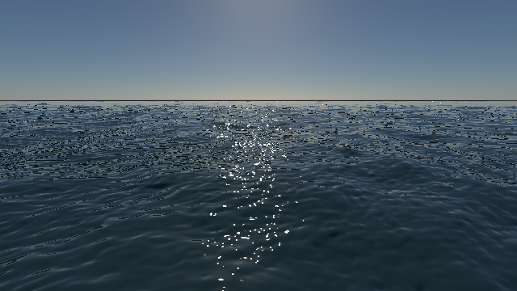
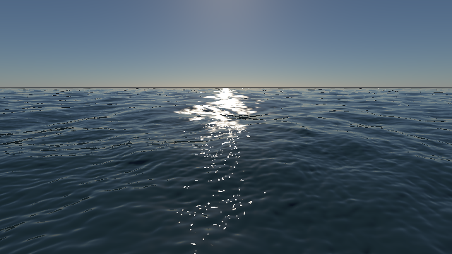
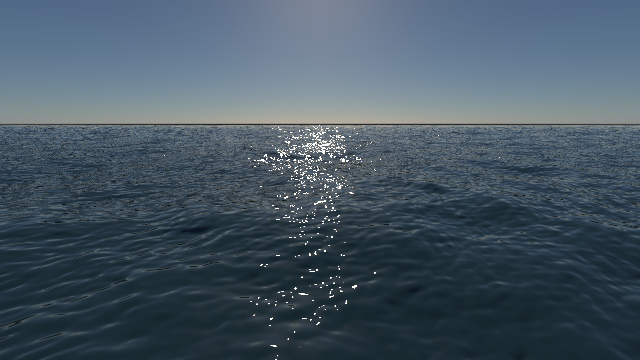
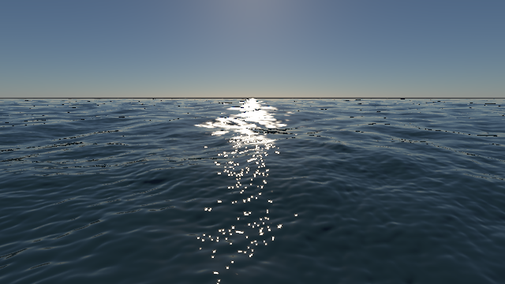
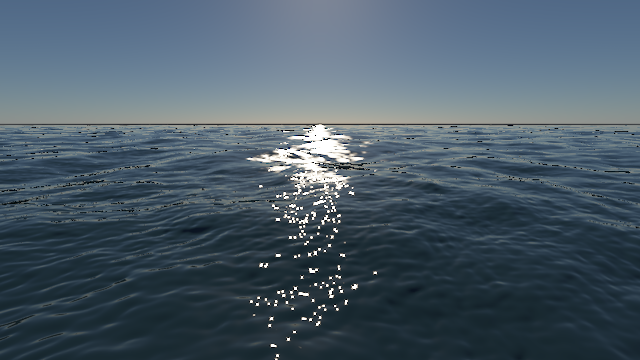

# 海面 glint 的空间滤波与 TAA

本页记录开发构建结果；验收记录保留当时的构建与源码哈希，复现命令需使用对应构建。

后续阶段已接入原始浮点 FFT 法线并调整 glint 重建与冻结水面累积，见[新阶段记录](ocean-float-normals-and-glints.md)。本文的图像和数字保留为此前阶段的历史结果。

2026-10-10，Apple M4 / Release / Metal。物理水面已加入 4×4 子像素太阳积分、斜率矩 mip 和线性 HDR 水面 TAA。**近景高光的空间欠采样明显改善，远景和完整 TAA 重建仍未解决**。下面保留消融、超采样参考和未改善的指标，避免把高光变柔或变亮当作准确性证明。

## 原因与实现

此前 FFT 法线只有一层，未解析的细波直接向竖直法线衰减；太阳盘仅用反射方向的局部导数近似滤波。一个像素内的反射分布可以有多个亮点，这个局部近似不足以重建它们。旧 TAA 又在压缩 HDR 空间混合，并裁剪孤立强亮点。它能够减少闪烁，也会压制太阳亮点的平均辐亮度。

本次实现包含：

- **可解析高光直接积分**：在一个像素中取 4×4 固定样本，分别查询主/细波法线、视线、Fresnel 与太阳项。光滑水面在子像素上使用有限太阳盘及局部角度滤波；粗糙水面在每个子像素上积分现有 GGX 太阳项。位置/UV 使用局部屏幕导数近似，跨三角形和强透视变化仍有误差。
- **未解析斜率统计**：GPU 保存 `E[sx]、E[sz]、E[sx²]、E[sz²]、E[sx*sz]` 和泡沫，逐级 2×2 归约，到查询后才减去均值得到协方差。主/细波协方差按独立波场近似相加。小于一个 texel 的 footprint 保留原法线，并不额外注入 bilinear 取样产生的方差。
- **远景滤波近似**：最大主/细波 footprint 为 4–8 texel 时，从子像素积分过渡到斜率矩近似。光滑太阳项使用线性化反射 Jacobian 将协方差投到太阳切平面；粗糙项使用各向异性 GGX 张量近似。GGX 没有有限的二阶斜率矩，这个张量相加不是严格卷积。远景外观和能量仍存在偏差。
- **水面 TAA 在辐亮度域混合**：时间和视图固定时使用累计平均权重，最多保留 0.97 历史权重；动态时使用受限权重、邻域裁剪和亮度变化抑制。保留深度、出屏、reactive 和光学置信度检查。场景反射/折射命中及近岸混合区域继续走原路径。历史和当前帧采用原高质量 cubic 重建，避免反复 bilinear 重采样扩散亮点。

物理水面默认启用，原艺术模式保留原采样布局；切换物理模式会重建水面布局，并重置材质相关历史。过滤状态复用 uniform 空闲分量，水面 uniform 仍为 1024 字节。为遵守 Metal 每阶段 16 个 sampler 的限制，矩和原法线共用一张三层纹理数组，不增加 fragment sampler 数量。

`GpuOcean` 按需生成矩纹理，离线 PT 捕获仍读取原始 FFT 法线，不执行这些实时矩 mip。1024² 主波与 256² 细波的完整三层 RGBA32F mip 增加约 **68 MiB** 显存，艺术模式无需这部分分配。PT 浮点法线和 ray footprint 仍是后续工作。最终构建另渲染的 640×360 / 512 spp / 24 次反弹 PT 原始 PFM 与上一阶段逐位相同，README 的 PT 展示图已用这次结果更新。

实现：[GpuOcean](../src/renderer/rhi/GpuOcean.cpp)、`src/rhi/shaders/ocean-surface-common.glsl`、`src/rhi/shaders/water-slope-filter.glsl`、[TAA](../src/rhi/shaders/temporal.comp)。

## 同场景对照

使用与[共享水面参数阶段](ocean-physical-surface.md)相同的快照：640×360、time=8 s、513² 网格、光滑水面、默认散射、太阳角半径 0.005 rad、曝光 1.4。TAA 图为固定海面的 20 帧结果，不能代表动态海面的抗闪烁或拖影验收。

参考图在 2560×1440 渲染实时单帧，**线性 HDR 中做 4×4 面积平均**后才色调映射，共 16 个高分辨率像素/输出像素。它是光栅超采样诊断参考，不是收敛的 PT GT。渲染命令中的 1 spp PT 仅用于共享捕获入口，其图像不参与误差比较。分别保存旧滤波和新滤波的高分辨率参考，以暴露模型改变。

| 旧空间滤波，单帧 | 新空间滤波，单帧 | 旧滤波的 4× 超采样参考 |
| --- | --- | --- |
|  |  |  |

| 旧空间滤波＋旧 TAA | 新空间滤波＋旧 TAA | 新空间滤波＋线性水面 TAA |
| --- | --- | --- |
|  |  |  |

### 线性统计：收益与边界

水域掩码来自像素中心 PT 的第一次水面交点；近景为屏幕底部 30% 中的水面，远景为屏幕高度 36%–50% 中的水面。所有数据来自未经色调映射/降噪的 PFM。

| 与旧滤波 4× 参考比较 | 近景相对 L1 | 全水域相对 L1 | 近景平均亮度 |
| --- | --- | --- | --- |
| 旧单帧 | 59.17% | 85.80% | 0.18862 |
| 新单帧 | **6.50%** | **56.24%** | 0.17876 |
| 旧 TAA | 76.67% | 80.43% | 0.06305 |
| 空间滤波＋旧 TAA | 71.76% | 96.08% | 0.06130 |
| 新空间滤波＋线性水面 TAA | 56.75% | 89.97% | 0.19378 |
| 4× 参考 | — | — | 0.17751 |

近景单帧误差下降约 9.1 倍；旧 TAA 在增加空间采样后仍明显压制亮点，说明只修法线/太阳项不够。新 TAA 的近景亮度及 L1 改善，但重建仍改变亮点形状，平均亮度比参考高约 9.2%。不能宣称 TAA 已达到单帧空间积分的匹配精度。

**全水域 TAA L1 没有改善**。远景新单帧/新 TAA 的平均亮度为 0.45516 / 0.46238，旧 4× 参考为 0.29108。两种滤波的高分辨率参考彼此也存在 45.54% 全水域 L1、87.91% 远景 L1，说明 far footprint、矩闭合及旧法线衰减的分辨率依赖仍是实质问题。远景暗碎带仍存在；当前结果没有证明它只由后处理 AA 引起。

本次一组同步帧中位数：旧单帧/TAA 为 **38.82 / 39.78 ms**，新单帧/TAA 为 **44.82 / 46.12 ms**。每组 20 帧、去除前 4 帧，包含 FFT、矩 mip、渲染和 GPU 等待，不含 presentation/导出。新增约 6 ms 是这一单次捕获的画质成本，不是稳定 FPS 或可直接外推到其他分辨率的基准。

## 验收与复现

[最终构建的匹配 PT＋OIDN](../img/path-tracing/ocean-aa-pt-denoised.png) · [PT 原图](../img/path-tracing/ocean-aa-pt.png)。

Metal/Vulkan 的 Ocean、Temporal 和 Water 自测均通过。斜率 mip 在 16² 波面上对所有级、两套矩层逐 texel 比较独立 CPU 归约，均值、二阶矩、交叉矩、泡沫及模拟后失效均通过，最大相对误差 `1.48×10⁻⁸`。太阳核新增斜率协方差积分案例，结果为 `0.999674`；零协方差 GGX 返回原模型也通过数值检查。

TAA 用同一静态水面像素交替输入 0.1 和 10 的 HDR 值，四帧结果接近线性平均 **5.05**，并验证出屏/反应性历史拒绝。CPU 两项 CTest、完整 Metal 原生 PT 回归及主程序/`pt-package-render` 构建通过；原生 FFT 捕获 CPU/GPU 相对 L1 仍为 `4.22×10⁻⁶`。上述测试不替代动态太阳亮点的视觉验收。

```sh
python3 -B tools/analyze_ocean_glints.py --render

# 两种独立消融：旧空间滤波；新空间滤波搭配旧水面 TAA
SCENERENDERER_WATER_UNFILTERED=1 build/pt-native-rt/runtime/Scene-Renderer \
  --classic ocean-sea-state --backend Metal
SCENERENDERER_WATER_TAA_LEGACY=1 build/pt-native-rt/runtime/Scene-Renderer \
  --classic ocean-sea-state --backend Metal
```

[验收 JSON](../img/path-tracing/ocean-aa-validation.json)保存五组命令、环境开关、统计、数值日志以及源码/二进制/编译 shader/原图/展示图哈希。原始结果位于 `build/ocean-aa/`；去掉 `--render` 可重新收集同一构建的结果，shader 或二进制变化时要求重渲染。OpenGL 新功能继续延后。

## 与 PT 的实际差距（2026-10-10 复核）

前面的近景改善衡量的是相对 **4× 光栅面积平均** 的误差，并不能证明接近 PT。本次重新统计已有同构建、同快照的原始线性 RGB，没有更改渲染参数或重新渲染；PT 参考为未经过 OIDN 的 512 spp 结果。匹配脚本现在分别记录 `matched_pt.raster_agreement` 与 `ssaa_agreement`，避免混用两种参考。

| 与原始 512 spp PT 比较 | 全水域 L1 | 近景 L1 | 远景 L1 | 两侧海水 L1 |
|---|---:|---:|---:|---:|
| 旧单帧 | 137.52% | 159.79% | 125.84% | 66.19% |
| 旧 TAA | 100.47% | 110.92% | 91.94% | 57.59% |
| 新单帧 | 152.13% | 154.66% | 177.34% | 57.44% |
| 新 TAA | 156.72% | 154.21% | 180.33% | 56.57% |

两侧海水 ROI 排除画面横向 35%–65% 的太阳走廊，不是按光路分类的 AOV。新 TAA 两侧平均 Y 为 0.04374，PT 为 0.03939，约高 11%；纹理与波面局部亮暗仍有明显差异。全水域和太阳区域 L1 被高能亮点的位置、有限采样噪声及法线输入差异放大，不能单独用它评价观感或宣称物理正确性。即使旧/新光栅做 4× 面积平均，相对 PT 全水域 L1 仍为 131.61% / 140.29%，说明继续提高光栅空间采样不能单独解决问题。

代码检查确认了以下未对齐项：

- 实时读取主波和细波的独立浮点 FFT 法线；PT 在 `freezeOcean` 中先合成为主波周期内的 RGBA8 贴图。当前主波 1024² / 256 m、细波 256² / 32 m，但 PT 合成图为 1024² / 256 m，细波每周期只剩 128 个采样，并在合成后量化。单通道编码步长 `2/255≈0.00784`；在小斜率附近对应约 0.45°，与太阳 0.005 rad（约 0.29°）角半径同一量级。不能把当前 PT 法线当成无损参考。
- 实时远景通过斜率矩和太阳角度高斯闭合估算未解析亮点，PT 则沿路径采样离散法线场；均值、方差不足以保留多峰反射分布，当前亮带被展宽。
- 实时海面反射直接查询天空，加上场景物体的屏幕空间查询；没有沿反射光线追踪其他海浪。PT 会再次命中海面。黑色碎带可能包含朝下反射、几何可见性或法线朝向处理的影响，尚无独立 AOV 证据确定各自占比。
- 实时水体采用四段积分、近似天空入射及可选多次散射 LUT，PT 采用体积路径采样；当前水体模型参数一致不代表积分结果一致。天空反射也尚未按未解析斜率分布卷积。

下一轮先做输入与分量对齐，再优化时域和性能：

1. PT 保留两套原始浮点 FFT 法线及各自周期，统一双线性采样与斜率合成，增加 CPU/GPU 法线数值对照；重新渲染匹配参考，保留本轮历史结果。
2. 输出天空反射、太阳反射、水体透射/散射、法线朝向与反射方向诊断，单独定位黑色碎带和两侧海水的差异；采用无散射控制组隔离表面问题。
3. 修正远景反射分布及天空卷积，再验证海面自身反射/遮挡的实时近似；以分量误差及采样收敛验证，避免用曝光或经验增益拟合展示图。
4. 表面与水体匹配后，验证动态海面/移动相机的闪烁和拖影，再优化样本数与矩纹理成本。

本次只新增 PT 对比统计和诊断结论，未修改渲染算法，未宣称消除上述差距。完整路线见[海洋后续交付顺序](ocean-sea-state-and-pt.md#后续交付顺序)。
