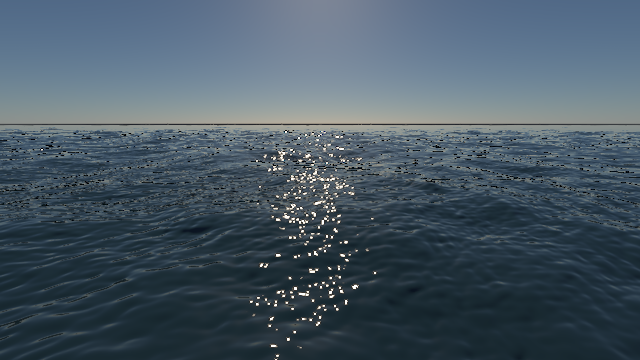
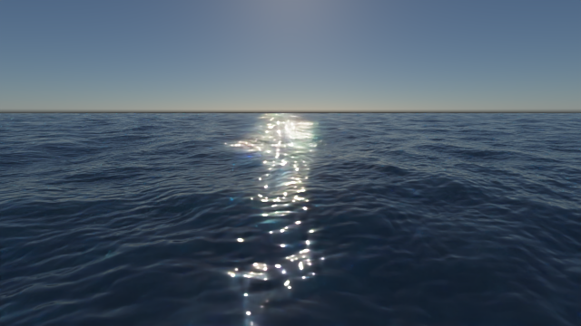
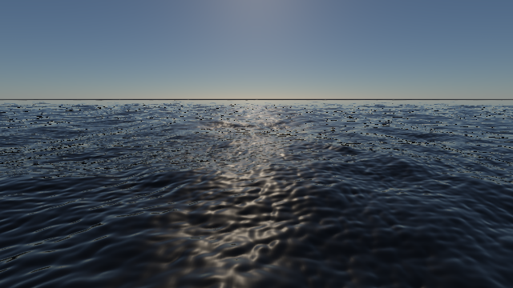
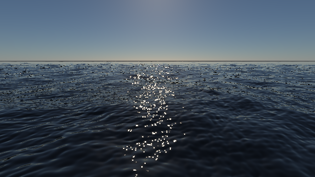
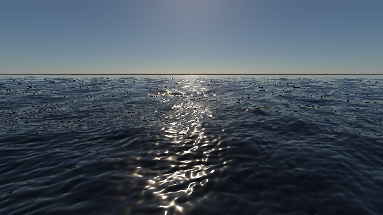
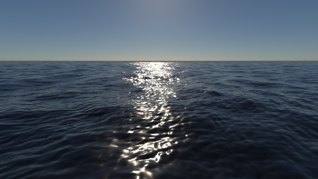

# 海水第三阶段：共享水面参数与太阳反射

本页记录开发构建结果；验收记录保留当时的构建与源码哈希，复现命令需使用对应构建。

2026-10-10，Apple M4 / Release / Metal 原生 RT。实时海水现在可使用与 PT 相同的水面粗糙度、IOR 1.333 和精确介质 Fresnel；`ocean-sea-state` 默认启用，原 `ocean`、`ocean-clear` 保留艺术模式。本阶段统一参数和太阳反射项，**完整水体外观尚未对齐**：远景法线、粗糙天空反射和水下光传播仍需改进。

## 实现范围

共享配置为 `include/component/WaterSurfaceModel.h`，随 `OceanConfiguration`、实时快照和 PT 冻结捕获传递。启用物理模式必须开启折射界面；粗糙度范围为 0–1，小于 0.02 与现有 PT 一样采用光滑 delta 界面。配置变更参与 PT 场景 identity，避免复用旧材质的捕获。GUI 可切换模式、调整粗糙度；物理模式固定水的 IOR，旧 FresnelScale/Specular/Gloss 控制仅在艺术模式显示。

[`ocean-surface.frag`](../src/rhi/shaders/ocean-surface.frag) 与 PT 共用 `src/rhi/shaders/dielectric-fresnel.glsl`。新太阳项使用法向入射的太阳辐照度及同一个角半径，不再乘旧艺术 specular 色值：

- **光滑水面**：查询反射方向与有限太阳盘。可解析的太阳盘使用平滑边缘；小于像素角度 footprint 时混合归一化的各向异性 Gaussian，协方差来自反射方向的屏幕导数。归一化近似保留角度积分的辐照度，避免只放宽高光而重复增加能量。这是有限太阳盘的滤波近似，未实现严格的像素积分，也不等同于完整波面斜率分布积分。
- **粗糙水面**：采用与 PT 对应的 isotropic GGX、精确 Smith G1 乘积及精确 Fresnel；在太阳球冠上取 16 个确定性样本积分。`alpha=roughness²`。接近 0.02 的窄峰仍可能需要更多或自适应积分样本，本次图像对照使用 0.12。
- **兼容性**：复用 1024 字节水面 uniform 中原来闲置的分量传递模式/粗糙度，未改变绑定 ABI。旧模式仍使用原 GGX/gloss 和艺术倍率。

粗糙模式目前只统一太阳 BRDF。实时天空/物体反射仍查询中心镜面方向；折射、体积透射和泡沫仍使用原近似。PT 则实际采样粗糙介质反射/折射与水中路径。因此不能把此开关称为两条管线已经共享完整 BSDF 传输。

## 匹配图像

相机、海况、time=8 s、640×360、曝光 1.4、513² 网格、1024²/256 m 主 FFT 与 256²/32 m 细波均与[第二阶段](ocean-realtime-pt-comparison.md)一致。风浪 Hs=1.6 m / Tp=5.5 s，独立涌浪 Hs=1.2 m / Tp=8 s，太阳仰角 25°、角半径 0.005 rad。实时图使用静态海面的 20 帧 TAA；PT 固定 512 spp、24 次反弹，展示图使用 OIDN。线性统计使用未经降噪/色调映射的 PFM，水面掩码来自像素中心 PT 水面交点。它不是实时超采样覆盖掩码。

| 物理光滑水面：实时 TAA | 同参数 PT＋OIDN |
| --- | --- |
|  |  |

[实时单帧](../img/path-tracing/ocean-physical-combined-realtime-single.png) · [PT 原图](../img/path-tracing/ocean-physical-combined-pt-raw.png)。太阳反射从旧模式的柔宽亮带变成集中亮点，但实时远处的暗碎点带仍存在，亮点位置、强度与 PT 也有明显差异。

为分离体积散射，本组只把 `sigma_s` 乘 0，保留吸收及所有其他场景控制；没有添加海底。旧艺术模式与新物理光滑模式的 PT 原图**逐位一致**，因此下表前两列的变化来自实时模型，而非更换 PT 参考。

| 旧艺术模式，无散射 | 新物理光滑模式，无散射 | 同一 PT＋OIDN |
| --- | --- | --- |
|  |  |  |

| 粗糙度 0.12，无散射：实时 TAA | 粗糙度 0.12，无散射：PT＋OIDN |
| --- | --- |
|  |  |

### 线性结果与解释

| 条件 | 实时水面亮度中位数 / PT | 实时水面亮度均值 / PT | 水域相对 L1 | 侧面水域相对 L1 |
| --- | --- | --- | --- | --- |
| 物理光滑，默认散射 | 0.02176 / 0.01734 | 0.07848 / 0.22135 | 100.47% | 57.49% |
| 旧艺术，无散射 | 0.01825 / 0.01270 | 0.04747 / 0.20984 | 95.36% | 29.37% |
| 物理光滑，无散射 | 0.01236 / 0.01270 | 0.06880 / 0.20984 | 100.63% | 22.75% |
| 物理粗糙 0.12，无散射 | 0.01569 / 0.01677 | 0.10195 / 0.21684 | 75.92% | 23.06% |

所有组天空相对 L1 为 0.147%。无散射光滑水面的侧面水域误差下降，亮度中位数也更接近；但整体水域 L1 **上升**，不能据此宣称已经改善逐像素匹配。默认散射时，亮度 > 1 的水面像素实时为 0.5745%、PT 为 0.2254%；亮点数量、位置和单点能量分布不同。PT RGBA8 法线与无 footprint 查询、实时浮点法线与导数衰减、太阳滤波和体积近似都还影响结果。

粗糙模式使亮带更连续，整体 L1 较小，但它改变了两边的材质，不能当作修复光滑水面误差的证据。512 spp PT 也不是严格收敛 GT；OIDN 图仅用于展示。实时静态 TAA 图不能证明动态海面的抗闪烁质量。

| 本次单次计时 | 实时同步 TAA 帧中位数 | PT 渲染阶段 | OIDN |
| --- | --- | --- | --- |
| 物理光滑，默认散射 | 37.31 ms | 23.26 s | 0.49 s |
| 物理光滑，无散射 | 31.26 ms | 3.55 s | 0.37 s |
| 物理粗糙 0.12，无散射 | 32.60 ms | 4.07 s | 0.38 s |

实时计时包含 FFT、渲染和 GPU 等待，不含 presentation/导出；PT 为累计 512 spp 的 CPU wall time，含 checkpoint IO，不含场景/AS/pipeline 准备和最终导出。这组不用于证明性能提升；[初始波谱缓存的交替开关基准](ocean-realtime-pt-comparison.md#本轮优化缓存初始波谱)保留在独立历史记录中。

## 数值验收与复现

Metal/Vulkan `--ocean-self-test` 均通过。新增 GPU probe 在 256² 网格上积分类太阳辐照度，四组太阳半径/角度导数为 `(0.005,0,0)`、`(0.005,0.01,0.01)`、`(0.005,0.04,0.002)`、`(0.02,0.01,0.01)`，积分为 **1.00341、0.999985、0.999894、0.999997**。积分包含方向 Jacobian 和入射余弦，允许 2% 数值误差；只验证这些小角度条件，不证明任意大 footprint 的精确能量。Fresnel/GGX 对双精度参考最大绝对误差分别为 `1.14×10⁻⁷` / `7.42×10⁻⁶`。

`pt-cpu`、`pt-procedural` CTest、完整 Metal `--pt-self-test` 通过；后者 FFT 水面捕获 CPU/GPU 相对 L1 为 `4.22×10⁻⁶`。所有四组对照平均 512 spp，非有限样本为 0。主程序与 `pt-package-render` 构建通过；OpenGL 新功能仍延后。

```sh
# 完整四组渲染、分区统计、图片收集与哈希
python3 -B tools/compare_ocean_rendering.py --render --surface-model physical \
  --directory build/ocean-surface-physical --image-prefix ocean-physical \
  --output img/path-tracing/ocean-physical-validation.json \
  --test-log-prefix /tmp/scene-water-physical --extra-case legacy --extra-case rough

# 单独运行：同时影响实时对照和 PT 捕获
build/pt-native-rt/runtime/Scene-Renderer --path-trace-gpu ocean-sea-state \
  --backend Metal --pt-traversal native --pt-fixed --pt-compare-ocean \
  --pt-size 640x360 --pt-samples 512 --pt-bounces 24 --pt-time 8 \
  --pt-ocean-grid 513 --pt-water-surface-roughness 0.12 --pt-denoise \
  --pt-output build/ocean-surface-physical/custom
```

`--pt-water-surface-legacy` 恢复旧实时高光及光滑 PT 捕获。已有 `--pt-water-roughness` 只覆盖 PT，禁止与实时匹配对照/共享参数同时使用。报告同时记录 `frozen_oceans` 和 `water_surface_models` 的有效参数。

[验收 JSON](../img/path-tracing/ocean-physical-validation.json)保留执行参数、原始 PFM/展示图/源码/二进制/编译 shader 哈希及数值回归日志。原始文件位于 `build/ocean-surface-physical/`。去掉上方 `--render` 可重新收集现有结果；二进制哈希改变时要求重渲染，不混用不同构建的计时/图像。

## 后续抗锯齿交付

已加入子像素太阳积分、斜率矩 mip 和线性 HDR 水面 TAA：[glint 前后对照与验收](ocean-glint-antialiasing.md)。本文保留加入该滤波之前的图像/计时；后续近景单帧明显改善，但远景和完整 TAA 重建仍未对齐。

## 下一阶段

1. **先解决法线与远景**：实时 slope/moment mip 已加入，需继续验收其远景闭合与 TAA；补齐 PT 浮点海洋法线和光线 footprint。检查有限网格边界和远景暗碎点，分别验收静止/移动相机和动态海面。
2. **完整粗糙界面**：实时天空/物体反射卷积与折射近似；窄 GGX 峰的太阳积分精度。加入独立的反射、透射、散射 AOV，分清水面模型与水下体积误差。
3. **多尺度与 PT 效率**：带能量分配的波谱级联；在相同误差/时间预算下改进体积太阳透射提议和天空采样。以减少路径成本验收，不能用降低散射系数代替加速。
