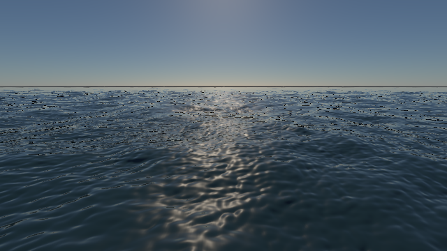
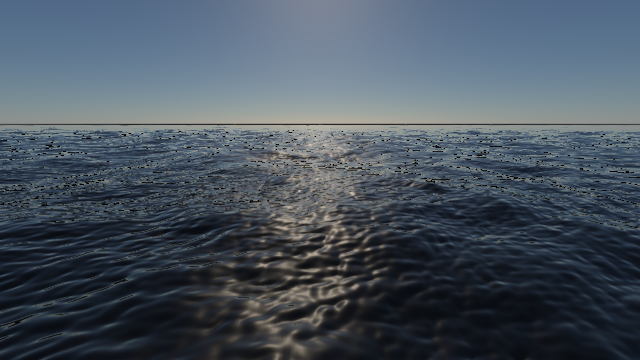
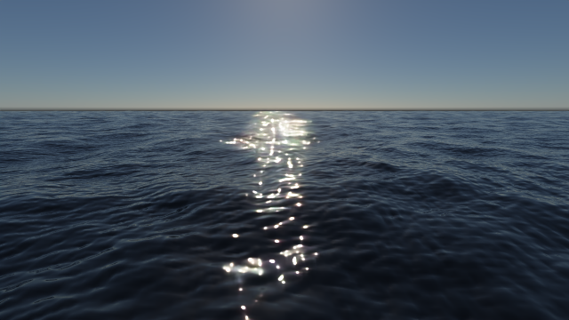

# 海水：实时管线与 Path Tracing 对照

本页记录开发构建结果；验收记录保留当时的构建与源码哈希，复现命令需使用对应构建。

2026-10-10，Apple M4 / Release / Metal。本文保留第二阶段的**旧艺术水面模式**对照和初始波谱缓存基准；两条管线共享海况和波面捕获算法，但水体外观尚未对齐。后续已加入共享水面参数、精确 Fresnel 与有限太阳反射，当前 `ocean-sea-state` 默认启用新模式：[第三阶段图像与验收](ocean-physical-surface.md)。本文图像和计时不覆盖这个后续改动；多级波谱和高精度 PT 法线仍待实现。

## 匹配条件

`--path-trace-gpu ... --pt-fixed --pt-compare-ocean` 在冻结海面之前保存同一份 `RenderWorldSnapshot`，供实时渲染使用。海况覆盖、相机、投影、时刻和光学参数的 CLI 修改都先作用于这份快照；`--pt-ocean-grid` 同时指定两边的网格大小。

本组条件为 640×360、time=8 s、seed=1337、513×513 相机加密水面网格、2048 m 水面、1024²/256 m 主 FFT 和 256²/32 m 细波。风浪 Hs=1.6 m / Tp=5.5 s，涌浪 Hs=1.2 m / Tp=8 s。相机 `(0,7.5,30)`，太阳仰角 25°、角半径 0.005 rad，曝光 1.4，IOR 1.333。PT 固定 512 spp / 24 次反弹，Metal 原生三角形查询，展示图使用 OIDN。

关闭额外 AO、RSM、DDGI、天气空气雾和屏幕后处理。实时分别导出单帧和 20 帧固定海面的 TAA；这只检查静态历史累积，不能代表运动海面的抗闪烁质量。两边的线性 HDR 都调用同一个 `pt::writeImage`，采用 `1-exp(-L*exposure)` 和 gamma 2.2。比较计算使用未经色调映射、未经降噪的 PFM。

| 实时 TAA | PT＋OIDN，512 spp |
| --- | --- |
|  |  |

[实时单帧](../img/path-tracing/ocean-comparison-combined-realtime-single.png) · [PT 原图](../img/path-tracing/ocean-comparison-combined-pt-raw.png) · [完整参数、线性统计、缓存基准和哈希](../img/path-tracing/ocean-comparison-validation.json)。此前 README 的实时图与 PT 图宽高比不同，属于预览；本组才是匹配视角的对照。

## 看到的差异及原因

浪形与天空基本对应。实时的太阳反射是宽而柔的亮带，PT 是水面上的高亮镜面亮点；远景实时仍有暗碎点带，PT 远处也存在采样/法线重建与有限水面边界问题。不能通过加曝光来修复这些模型差异。

| 项目 | 实时实现 | PT 实现 | 接下来的工作 |
| --- | --- | --- | --- |
| 太阳反射 | `ocean-surface.frag` 的 GGX；Gloss=256 对应 roughness≈0.297，并乘约 0.13 的艺术 specular 色值 | 默认光滑介质界面，精确介质 Fresnel，反射有限角度太阳盘；没有这个艺术倍率 | 共享水面粗糙度、Fresnel 和太阳盘积分/滤波策略 |
| 法线与小波 | 两张浮点 FFT 法线按屏幕导数衰减；导数方差又用于展宽高光 | 合成为周期性 RGBA8 法线图，双线性查询，尚无光线 footprint | PT 浮点法线、分离宏/细波、统一 slope/moment 滤波；保留未解析斜率能量 |
| 水下光 | 四段体积积分、天空方向近似与可选多次散射 LUT | 吸收、HG 随机游走、多次散射和界面反射/折射 | 建立有海底的体积专项对照，区分天空入射近似与散射路径采样误差 |
| 泡沫 | Jacobian 压缩指标与近似漫反射照明 | 同一瞬时泡沫指标，按路径采样混合漫反射 | 冻结一致的泡沫输运/消退状态，并验证能量 |
| 远景边界 | 有限网格、相机裁剪及边缘向天空混合 | 有限网格与不同的路径/介质边界处理 | 单独检查地平线覆盖；不能用色彩调节掩盖边界误差 |

### 线性原图统计

水面掩码来自 PT 在像素中心的第一次水面交点，不是超采样轮廓，也不代表实时覆盖。统计包含的 ROI 定义写在 `tools/compare_ocean_rendering.py`：侧面水域为画面下半部、左右各 35%；天空取顶部 30% 且没有水面交点的像素。

| 默认散射海水，实时 TAA / PT 原图 | 实时 | PT |
| --- | --- | --- |
| 水面线性亮度中位数 | 0.02733 | 0.01734 |
| 水面线性亮度均值 | 0.05579 | 0.22135 |
| 水面亮度 > 1 的像素比例 | 0% | 0.2254% |
| 侧面水域线性亮度均值 | 0.02594 | 0.02846 |

PT 少量很亮的太阳亮点显著影响均值；实时的大部分水面反而更柔亮。水域相对 L1 为 95.23%，天空为 0.15%。这说明主要差异集中在水面，而不是曝光/天空整体失配；它**不是相对真实海水的误差分数**。有限采样、高光位置与滤波不同都影响逐像素差异，PT 也未作为严格收敛 GT 验收。

### 关闭散射的分离实验

只把水中 `sigma_s` 乘 0，仍保留原吸收、波形、太阳、相机和反射/折射。没有额外生成海底；这里的“无散射”不等于浅水透明池塘。

| 实时 TAA，无散射 | PT＋OIDN，无散射 |
| --- | --- |
|  |  |

关闭散射后太阳亮带与亮点的差异仍存在，说明它不能仅归因于体积散射。侧面水域亮度中位数为 0.00814 / 0.00779，水域整体相对 L1 仍为 95.36%；共享水面反射和法线滤波应先于艺术颜色调节。

## 本轮优化：缓存初始波谱

[`GpuOcean`](../src/renderer/rhi/GpuOcean.cpp) 把原高度频谱计算拆成 `ocean-initial.comp` 和 `ocean-height.comp`。初始核缓存 `h0(k)`、`conj(h0(-k))`；稳定海况只演化 `exp(±i*omega*t)`，再执行原 IFFT、位移、法线和泡沫流程。

缓存 key 使用已归一化振幅、风/涌浪、波段、色散深度、seed 等计算参数。time、choppiness、泡沫控制不需要重建初始谱；海况/seed 改变会重建。风向 blend 动画变化时也会重建，不承诺缓存所有过渡帧。新增一张 RGBA32F 纹理：本预设主/细波分别增加 16 MiB / 1 MiB。PT 离线冻结仅模拟一次，**此缓存不加速路径积分**。

`SCENERENDERER_OCEAN_UNCACHED=1` 用于同一新实现每帧重建初始谱的消融，不是之前融合在单个 height 核中的旧版本基准。三组交替开关、每种模式 20 帧且去除前 4 帧：

| 同步实时帧耗时：三组中位数再取中位数 | 每帧重建 | 使用缓存 | 比值 |
| --- | --- | --- | --- |
| 单帧 | 35.61 ms | 32.34 ms | 1.10× |
| TAA | 37.21 ms | 32.15 ms | 1.16× |

三组开关输出的线性单帧/TAA 图均逐位相同。GPU encoder 记录中，缓存开启的 16 个测量帧有 0 次 initial dispatch，关闭时有 32 次（每帧主/细波各一次）。其中一组单帧缓存耗时也出现反向波动；上述小样本计时不能当成稳定吞吐量保证。耗时是包含 FFT、渲染、GPU 等待的同步 wall latency，不含场景 resolve、presentation 和导出；encoder 各阶段可能重叠，不将其简单相加。

## PT 成本与下一阶段

本组默认散射 PT 512 spp 用时 26.62 s，OIDN 0.53 s；无散射 PT 为 3.46 s，OIDN 0.45 s。默认散射共追踪约 11.35 亿条光线、1.393 亿次体积事件；无散射约 1.972 亿条光线。采样计时包含 checkpoint IO，分别约 0.38 / 0.21 s，不含场景/AS/pipeline 准备和最终导出。实时默认散射 TAA 本次捕获中位数为 35.32 ms。两者目标和计时范围不同，不能把比值直接解释为同等质量算法的加速比。

下一阶段依次做：

1. **共享水面外观基线**：共享粗糙度、精确 Fresnel 与太阳反射项已在[第三阶段](ocean-physical-surface.md)交付；天空粗糙反射卷积及独立反射/透射/散射 AOV 仍待实现，艺术模式继续保留。
2. **多尺度与采样**：浮点 PT 法线和 footprint；带能量分配的波谱级联，避免每个级联都按完整 Hs 标定导致重复能量。先用静态、移动相机及动态海面分别验收远景闪烁。
3. **海洋 PT 体积效率**：在相同误差/时间预算下比较太阳透射提议、天空体积采样和路径终止；记录体积事件/光线成本。不得通过降低散射系数冒充等质量加速。
4. **几何与系统**：海面更新/BLAS refit、显存与缓存失效统计；之后捕获近岸求解器和泡沫历史。

## 复现与验收

```sh
# 一次命令同时保存同视角的实时单帧、TAA、PT 原图和降噪图
build/pt-native-rt/runtime/Scene-Renderer --path-trace-gpu ocean-sea-state \
  --backend Metal --pt-traversal native --pt-size 640x360 \
  --pt-samples 512 --pt-bounces 24 --pt-time 8 --pt-ocean-grid 513 \
  --pt-fixed --pt-checkpoint-samples 512 --pt-denoise --pt-compare-ocean \
  --pt-water-surface-legacy \
  --pt-output build/ocean-comparison/combined

# 完整两种介质对照 + 三组缓存基准 + 原图统计与 README 图片收集
SCENERENDERER_GPU_PROFILE=1 python3 -B tools/compare_ocean_rendering.py \
  --render --benchmark-cache

# 只重新收集已存在的结果，不渲染；要求历史记录的二进制哈希一致
# 当前构建已改变，应保留旧验收 JSON，或将新复现输出到独立目录
python3 -B tools/compare_ocean_rendering.py
```

Metal/Vulkan `--ocean-self-test` 均通过，包括缓存命中、不同时间的 fresh/warm 一致性、非频谱控制、seed 失效，以及原海况 CPU DFT / 风向过渡 / Phillips / 8–1024 FFT 回归。新海况 DFT 最大误差保持 `3.75×10⁻⁷ m`。`pt-cpu`、`pt-procedural` CTest 和完整 Metal `--pt-self-test` 通过，后者冻结水面 CPU/GPU 相对 L1 为 `4.22×10⁻⁶`。本轮两个 512 spp 对照均无非有限样本。

原始 PFM 和报告在 `build/ocean-comparison/`，仓库图片及汇总 JSON 保留图像/原图/二进制/源码 SHA-256 和执行参数。OpenGL 4.1 后续功能继续延后，没有在本轮声明验证。
