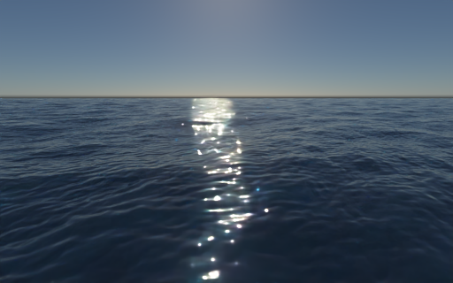
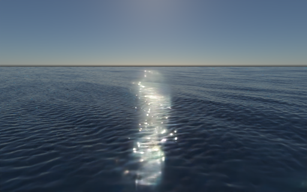
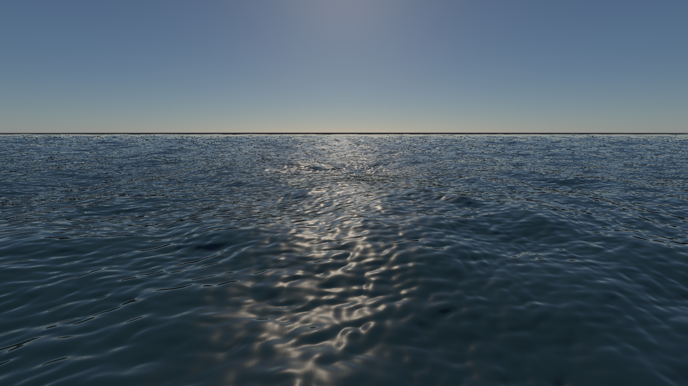

# 海洋海况模型与 Path Tracing

本页记录开发构建结果；验收记录保留当时的构建与源码哈希，复现命令需使用对应构建。

2026-10-10：按远海风浪、独立涌浪与固定时刻 PT 的方向交付第一阶段。新增 `ocean-sea-state` 预设；保留原来的 `ocean`、`ocean-clear` Phillips 波谱和画面参数。原生 Metal、Vulkan 共用 GLSL 计算实现。OpenGL 旧组件不支持新海况模型，启用时明确报错。

## FFT 要不要换

FFT 是频谱到空间波形的快速变换，并不是决定海洋真实程度的物理模型。原主海面使用单一 Phillips 波谱、对称方向分布和深水线性色散。首先改进波谱、波向和尺度，比直接替换 FFT 更适合目前的大面积远海与 PT 捕获。新实现仍采用线性随机海面和 choppy 水平位移，不能表示翻卷的多值水面。

仓库同时已有 [`GpuShoreWater`](../include/renderer/rhi/GpuShoreWater.h)：有限体积浅水求解、地形水深、湿干边界、局部泡沫与湿沙历史。下一步近岸工作应扩展并衔接这个模块，而不是重新造一个浅水求解器。目前 PT 捕获只读取 FFT 位移、法线、压缩泡沫，不捕获这些近岸时序状态。

| 方法 | 适用问题 | 本仓库的选择 |
| --- | --- | --- |
| JONSWAP/TMA + 独立涌浪 + FFT | 大范围风浪、交叉海况、明确浪高和周期 | 本阶段已实现 |
| 多尺度频谱级联与法线滤波 | 远处细波、近景长浪、避免重复铺贴和闪烁 | 下一阶段优先 |
| 浅水方程 | 浅滩传播、岸线反射、湿干边界 | 已有局部求解器；后续改进与远海/PT 的衔接 |
| Wave Particles | 局部物体扰动、尾流、交互波 | 需要船只/物体耦合时引入 |
| Water Wave Packets | 波群在地形上的传播、折射、适应性细节 | 作为大范围变水深传播的候选，不直接替换全部海面 |
| 局部三维 FLIP/APIC 或其他自由表面流体 | 翻卷破浪、撞击、喷溅、气泡 | 只在近景局部求解；成本与几何/体积捕获工作量较高 |

参考：[JONSWAP / TMA 与 Hs 标定](https://wavespectra.readthedocs.io/en/latest/construction.html)、[TMA 深度修正公式](https://wavespectra.readthedocs.io/en/latest/_modules/wavespectra/construct/frequency.html#tma)、[Wave Particles 作者页](https://www.cemyuksel.com/research/waveparticles/)、[Water Wave Packets 作者论文](https://pub.ista.ac.at/group_wojtan/projects/2017_Jeschke_WaterWavePackets/wavepackets_author.pdf)、[Wave Packets 作者实现](https://github.com/jeschke/water-wave-packets)、[APIC 作者论文](https://www.math.ucla.edu/~cffjiang/research/apic/paper.pdf)。这些是算法选择的依据；本轮没有移植作者实现。

## 已实现的海况

共享配置是 `include/component/OceanSeaState.h`。`enabled=false` 继续走原 Phillips 路径。新模型包含两套独立的 Gaussian 系数：XY 用于风浪，ZW 用于涌浪。新增 ZW 不改变旧 XY 随机序列。

- 风浪：JONSWAP，输入有效波高 Hs、峰值周期 Tp、峰值增强 gamma 和方向集中度；gamma=1 退化为 PM 的频谱形状。
- 涌浪：独立 PM 频谱，自己的 Hs、Tp、方向和集中度；本地风速为零仍可保留涌浪。
- 波向：表示波**传播到**的世界 XZ 方向；使用半角余弦幂分布。现有 Fourier 相位是 `+omega*time`，因此方向分布必须作用在 `-k` 上，否则波传播方向会反过来。
- 深度：`omega=sqrt(g*k*tanh(k*h))`，`h=0` 使用深水极限。有限深度使用 TMA 形状修正，并包含频率到二维波数密度的 Jacobian `domega/dk / k`。
- 标定：在实际 FFT 的非 DC、非自混叠 Nyquist 频率上积分，分别缩放到 `variance=(Hs/4)^2`。两套随机波场独立，预期总 Hs 是 `sqrt(Hs_wind^2+Hs_swell^2)`；有限域、单 seed、单时刻的实测值不必精确等于这个统计值。
- 主波段：SceneSnapshot 自动取 `[max(2 m, 2*domain/N), domain]`，边缘平滑衰减。32 m 小波 FFT 使用独立 0.5–2 m 波段，默认 RMS 2.5 cm，避免把整个主海况复制到 detail FFT。
- 实时风向过渡：固定随机数和相位，混合风浪谱的振幅；独立涌浪保持不变。修改周期/水深不保证连续相位过渡。

`HeightScale` 仍是浪高的艺术倍率，默认新预设为 1。`WindScale` 在新模型中不重新决定主海面能量，主海面由显式 Hs/Tp 决定；它继续控制短波细节。GUI 显示这一区别。零风浪方向会关闭风浪，非零涌浪高度要求有效涌浪方向。

归一化缓存在 CPU 侧，只在海况/方向/波段改变时重新积分。海洋计算参数由 80 字节扩展为 128 字节，每个 shader 的反射大小和成员偏移均验证。

## 同一海面的 PT

实时路径与 `captureProcedural` 使用同一个 `GpuOcean`，并共用 `oceanDetailSettings`。PT 固定时刻后，把主/细节位移转成网格，保留合成法线和压缩泡沫，再使用已有的 CPU/GPU 水体路径积分器：IOR 1.333、Fresnel 反射/折射、RGB 吸收与 Henyey–Greenstein 体积散射。展示图使用 Metal 原生三角形 ray query 和 OIDN；原始线性 PFM 与未滤波 PNG 同时保存。

实时屏幕折射/局部散射近似与 PT 的路径积分仍是不同渲染器。共享波形不等于画面完全相同，也不表示采样结果已严格收敛。尤其太阳 glint 和折射焦散仍会有有限采样噪声。

每次 PT 输出的 JSON 新增 `frozen_oceans`：波谱、浪高/周期/方向/深度、随机 seed、时刻、FFT/网格、光学系数、捕获高度 RMS/范围和三角形数量。PT 场景 identity 包含这些海况控制，以及此前遗漏的小波模式/RMS；修改它们会使冻结捕获失效。新海况启用相机加密网格时，相机 XZ 位移也会使捕获失效；其 JSON 顶点高度 RMS 是非均匀网格的样本统计，不是全域面积平均。旧 Phillips 捕获继续使用原均匀网格。

### 预览与对照

三张 PT 图采用相同相机、曝光 1.4、time=8 s、512×320、固定 256 spp、24 次反弹、513×513 水面网格，主 FFT 为 1024×1024 / 256 m，水面覆盖 2048 m。新海况的 PT 网格与实时路径一样使用 sinh 相机附近加密，并滤除网格不能解析的位移，近景保留密度、远景延伸覆盖。风浪 Hs=1.6 m / Tp=5.5 s，涌浪 Hs=1.2 m / Tp=8 s，传播方向分别为 `(1,1)` 和 `(-0.8,0.6)`。保留厘米级短波。仅改变被关闭分量的 Hs，没有改变材质、光源或相机。

| 风浪 + 涌浪 | 仅风浪 | 仅涌浪 |
| --- | --- | --- |
|  |  |  |

[合成原图](../img/path-tracing/ocean-sea-state-raw.png) · [风浪原图](../img/path-tracing/ocean-sea-state-wind-raw.png) · [涌浪原图](../img/path-tracing/ocean-sea-state-swell-raw.png) · [参数与验收记录](../img/path-tracing/ocean-sea-state-validation.json)。这些是算法输出，展示图用 OIDN；不是独立参考真值，也不用于证明对真实海洋的误差。



### 运行方式

```sh
# 实时编辑：Ocean 面板可切换波谱、调整风浪和涌浪
build/pt-native-rt/runtime/Scene-Renderer --classic ocean-sea-state --backend Metal

# 冻结海面：输出原图 .png/.pfm、降噪 -denoised.png/.pfm 和报告 .json
build/pt-native-rt/runtime/Scene-Renderer --path-trace-gpu ocean-sea-state \
  --backend Metal --pt-traversal native --pt-time 8 --pt-ocean-grid 513 \
  --pt-size 512x320 --pt-samples 256 --pt-bounces 24 --pt-fixed \
  --pt-checkpoint-samples 256 --pt-denoise --pt-output build/ocean-sea-state/combined

# CPU PT：海面捕获仍需要 Metal/Vulkan 的计算支持
build/pt-native-rt/runtime/Scene-Renderer --path-trace ocean-sea-state \
  --backend Metal --pt-size 64x40 --pt-samples 64 --pt-bounces 12 --pt-fixed \
  --pt-output build/ocean-sea-state/cpu

# 风浪或涌浪消融：分别追加 --pt-ocean-swell-height 0 / --pt-ocean-wind-height 0
# Vulkan PT：改为 --backend Vulkan --pt-traversal software；MoltenVK 没有原生 RT
```

| CLI 参数 | 含义 |
| --- | --- |
| `--pt-ocean-spectrum phillips\|jonswap` | 在现有含海面的场景中选用波谱 |
| `--pt-ocean-wind-height H` / `--pt-ocean-swell-height H` | Hs，米，0 关闭该分量 |
| `--pt-ocean-wind-period T` / `--pt-ocean-swell-period T` | 峰值周期，秒，1–30 |
| `--pt-ocean-wind-gamma G` | 风浪峰值增强，1–10 |
| `--pt-ocean-wind-spread S` / `--pt-ocean-swell-spread S` | 方向集中度，0–100；0 各向同性 |
| `--pt-ocean-swell-direction A` | XZ 角度，度；0 为 +X，90 为 +Z |
| `--pt-ocean-depth H` | 均匀波浪水深，0 为深水，否则 0.1–1,000,000 m |

海况控制会启用 JONSWAP；同时指定 `phillips` 和这些控制会报错。参数只适用于存在未冻结海面配置的场景。深度控制作用于波谱和色散，**不会自动生成海底或改变 PT 介质边界**。需要实际海底时必须配套场景几何。Tp 对应的波长应在 FFT 域中有足够分辨率；过长周期在小周期域内只能得到截断后重新标定的频谱，并不精确保留目标峰。

## 验证与当前限制

`--ocean-self-test --backend Metal|Vulkan` 覆盖新海况 CPU DFT 对照、Hermitian 实值高度、离散 Hs 标定、方向符号、倍增 Hs、无风独立涌浪、零 Hs、有限深度到深水极限、固定 seed/time 确定性，以及风向过渡的源端点/线性振幅。原 Phillips、带限短波和 8/16/256/512/1024 IFFT 回归也继续通过。`pt-cpu` 验证海况捕获 identity；`pt-procedural` 保留水体网格、材质、泡沫和光学回归。

本阶段未加入空间变化水深、非线性波间相互作用、翻卷、粒子浪花、泡沫体积或气泡多重散射。FFT 泡沫仍是 Jacobian 压缩的即时指标。PT 不读取运行中的浅水求解/岸线历史。网格上限 1025，法线图仍为 8 bit；小波几何/法线在掠射角及远景存在采样和滤波限制。深水模型的水平 choppy 位移也没有升级为有限深度势流轨道重建。

### 本机记录

Apple M4 / Release。三张 512×320 / 256 spp 展示图的采样时间分别为 9.89、9.80、10.03 秒，非有限样本均为 0；不包含场景/AS/pipeline 准备、降噪或图像保存。这是单次 CPU wall time，包含等待，不是稳定性能基准或纯 GPU timestamp。

Metal 与 Vulkan 的海况 CPU DFT 最大误差均为 `3.75×10⁻⁷ m`。完整 Metal `--pt-self-test`、两个 CPU CTest，以及主程序和 `pt-package-render` 构建均通过。

| 线性原图对照（64×40，深度 8 m，12 次反弹） | 相对 L1 | NRMSE |
| --- | --- | --- |
| Metal 原生 RT / Vulkan 软件 BVH，64 spp | 1.26×10⁻⁹ | 2.56×10⁻⁹ |
| Metal 原生 RT / CPU，64 spp | 2.035% | 4.009% |
| Metal 原生 RT / CPU，1024 spp | 0.484% | 1.208% |

GPU 后端一致性很好；CPU 与 GPU 尚非逐样本相同，增加采样后差异下降。这些结果不证明完整海洋已收敛，也不能把 CPU 的有限采样结果当作 GT。原图、报告和执行参数的 SHA-256 保存在验收 JSON，PFM 保留在 `build/ocean-sea-state/`。可使用 `python3 -B tools/collect_ocean_sea_state_validation.py` 重新收集这批已存在的渲染结果；它不启动渲染。

## 第二阶段进展：匹配对照与波谱缓存

已加入初始 GPU 波谱缓存，以及从同一快照导出的 640×360 实时单帧/TAA/PT 对照。两边的太阳高光、法线滤波和散射仍存在明显差异；多级波谱与 PT 高精度法线尚未完成。[图像、线性分区统计、优化验收与修订后的优先级](ocean-realtime-pt-comparison.md)。

## 第三阶段进展：共享水面参数与太阳反射

`ocean-sea-state` 现默认启用物理水面参数，与 PT 共用 IOR 1.333、粗糙度和精确 Fresnel。实时太阳项加入归一化的有限太阳盘滤波及粗糙 GGX 积分，已生成旧模式/新光滑模式/粗糙度 0.12 的匹配对照。远景暗碎点和粗糙天空卷积仍未解决，逐像素整体 L1 也未因高光模型修改而改善。[实现范围、四组图像、线性统计与下一步](ocean-physical-surface.md)。

## 第四阶段进展：glint 空间抗锯齿

实时物理水面已加入子像素太阳积分、斜率矩 mip 和线性 HDR 水面 TAA，并与 4× 分辨率光栅参考比较。此阶段近景单帧误差下降，但远景矩近似和 TAA 重建仍有偏差。[消融图、线性统计和成本](ocean-glint-antialiasing.md)。

## 第五阶段进展：浮点法线与 glint 重建

PT 已保留主波/细波的独立原始浮点法线，统一周期双线性采样、FFT 网格相位与斜率合成。实时增加 tent 太阳重建，并修正冻结海面 TAA 的反复重采样。新的 PT 参考与旧 8 位法线参考不同，远景与水体输运仍待对齐。[新对照、验收与限制](ocean-float-normals-and-glints.md)。

进一步加入海面辐射分量诊断，修正光滑远海太阳项的非线性反射变换，并积分天空反射与 Fresnel。远景和两侧海水对同快照原始 PT 的误差有所下降；近景 glint、海浪之间的反射和水体散射仍待改进。[当前图像、同构建统计和 Metal/Vulkan 验收](ocean-reflection-integration.md)。

## 后续交付顺序

1. **多尺度与采样**：原始浮点法线、独立周期采样和斜率合成已统一；继续对齐 slope/moment、视距/像素 footprint 滤波，排查远景暗碎点，再把主海面扩展为按波长分工的级联，加入波面几何误差检查。共享粗糙度/Fresnel/太阳项已完成，粗糙天空反射卷积仍需补齐。记录各 FFT、谱更新、网格/AS 更新的时间和显存；GPU 初始谱缓存已完成，避免稳定海况每帧重复计算频谱形状。
2. **泡沫与介质**：大面积泡沫生成、输运、消退与历史捕获；区分白沫、薄层泡沫和水中气泡。为实时与 PT 建立相同泡沫状态，而不是简单增加白色权重。
3. **近岸衔接**：扩展已有 `GpuShoreWater`，验证波谱边界注入、质量/动量、变水深波群传播和湿干边界；PT 直接冻结求解器状态/湿沙历史，建立平底与斜坡对照。必要时评估 Wave Packets，而不是假定单一均匀 TMA 深度已经解决近岸。
4. **海洋 PT 系统**：动态波面 BLAS refit/重建策略、地平线和有限水面边界、光线 footprint、太阳透射采样和体积散射专项基准。SPPM 当前不支持散射水体，不能直接叠加在默认海洋介质上；需要独立的体积/表面合并设计与能量验证。
5. **局部交互与破浪**：船体源项/尾流，再接局部三维自由表面模拟与粒子/气泡捕获。远海保留统计波谱，局部求解承担不适合高度场表示的效果。
