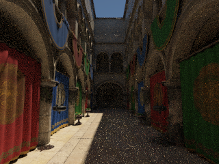
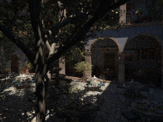
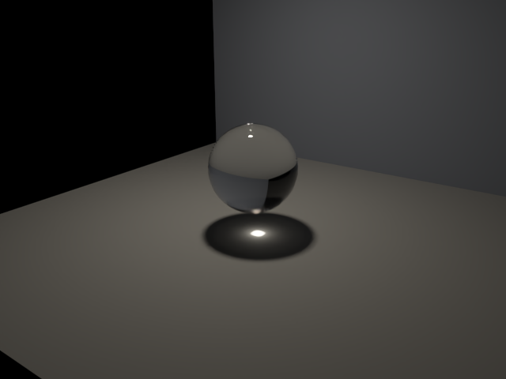

# Open Image Denoise 降噪

CPU PT、Metal/Vulkan GPU PT 和 CPU BDPT 的命令行最终输出可以使用现成的 **Open Image Denoise 2.5+**。`Denoiser.cpp` 调用官方 RT 神经网络滤波器，在线性 HDR 上执行，随后使用与原图相同的曝光和 tone mapping 写 PNG。降噪仅用于最终图，progress checkpoint 保留原始采样。

## 构建

macOS Apple Silicon 可下载固定的官方 2.5.1 ARM 包到被忽略的 `build/deps/`：

```sh
python3 tools/fetch_oidn.py
cmake -S . -B build/pt -DCMAKE_BUILD_TYPE=Release -DSCENERENDERER_RHI_BACKEND=Metal -DSCENERENDERER_OIDN=ON -DOpenImageDenoise_DIR="$PWD/build/deps/oidn-2.5.1.arm64.macos/lib/cmake/OpenImageDenoise-2.5.1"
cmake --build build/pt -j 6
```

下载工具固定版本和 HTTPS 官方归档的 SHA256，校验后解压；库、神经网络权重与第三方许可证随官方包保存，不提交二进制。其他平台使用 [官方发行包](https://www.openimagedenoise.org/downloads.html)，将 `OpenImageDenoise_DIR` 指向包内 CMake 配置目录；Windows 运行时需要将包的 `bin` 加入 `PATH`。已有 Vulkan 构建也使用同一个 OIDN 配置目录。

`SCENERENDERER_OIDN=AUTO` 默认在找到 2.5+ 时启用；`ON` 在缺少库时明确拒绝配置；`OFF` 保持不依赖 OIDN 的构建。未启用库的二进制请求 `--pt-denoise` 会明确报错，不会静默输出未降噪图。

## 使用

```sh
# 普通 GPU PT + OIDN。CPU 使用 --path-trace，其余降噪选项相同。
./build/pt/Scene-Renderer --path-trace-gpu sponza --pt-size 640x480 --pt-samples 64 --pt-bounces 16 --pt-fixed --pt-denoise --pt-output build/path-tracing/denoise/sponza

# BDPT 的真实焦散图；另保留未经降噪的 caustics AOV。
./build/pt/Scene-Renderer --path-trace caustics --pt-bdpt --pt-size 640x480 --pt-samples 512 --pt-bounces 8 --pt-threads 8 --pt-exposure 2 --pt-denoise --pt-output build/path-tracing/denoise/caustics

# 对已有线性 PFM 执行离线降噪，无需重新加载场景或重新追踪。
./build/pt/Scene-Renderer --path-trace --pt-denoise-input build/path-tracing/denoise/sponza.pfm --pt-exposure 3 --pt-output build/path-tracing/denoise/sponza-offline
```

| 参数 | 行为 |
| --- | --- |
| `--pt-denoise` | 最终图启用 OIDN，默认自动选择 OIDN 设备 |
| `--pt-denoise-device auto/cpu/metal` | 指定 OIDN 执行设备并启用降噪；与渲染后端独立 |
| `--pt-denoise-color-only` | 只使用 beauty HDR，适合对照辅助 AOV 引起的细节偏差 |
| `--pt-denoise-input FILE.pfm` | 离线模式；自动读取同名前缀的 `-albedo.pfm`、`-normal.pfm`，两者齐全才使用辅助图；缺省输出为输入前缀加 `-filtered` |

普通输出 `PREFIX.png/.pfm` 始终是原始积分结果；降噪另存为 `PREFIX-denoised.png/.pfm`。新增线性 `-albedo.pfm` 和带符号的世界空间 `-normal.pfm`，用于可重复离线处理。原始法线可为零（背景），PNG 法线的 `[0,1]` 映射不传给 OIDN。BDPT 的 `-caustics` 原始路径贡献也不经过降噪。

JSON 记录 OIDN 实际版本、实际设备、辅助图是否使用，以及 `denoise_seconds`。该时间包括设备/滤波器初始化、buffer 复制、辅助图预滤波和 beauty 执行；`trace_training_denoise_seconds` 为积分、训练和降噪之和，不包括模型导入/BVH/设备准备与最终文件输出。离线报告只记录本次降噪，不伪造渲染采样或射线数。

## 实现和边界

RT 以 `hdr=true`、`srgb=false`、high quality 执行。albedo / normal 在私有 OIDN buffer 内分别预滤波，再以 `cleanAux=true` 引导 beauty；原始 HDR、AOV 和采样统计均保持不变。显式打包 Float3、上传、读回，不假设 `glm::vec3` 的布局或 CPU 指针能被 GPU 直接访问，因此 Vulkan PT 读回结果也可使用 OIDN 的 CPU/Metal/CUDA 等自动设备。当前没有零拷贝 RHI interop、时域降噪或编辑器实时预览 UI。

当前渲染器辅助 AOV 采用像素中心第一交点，beauty 有子像素采样；两者在细几何、透明/玻璃、多层反射处可能不匹配。预滤波不会补齐缺失的第二层特征，可用 color-only 作对照。OIDN 的 RT 模型对稀有焦散、高频纹理和路径间相关性可能产生平滑或偏差，不能凭降噪图验证 BDPT 能量或证明更快收敛；所有算法误差仍比较未降噪的线性 PFM。

测试包含确定性含噪 HDR 阶跃面：线性能量、边缘两侧的均值、MSE 下降、原图/AOV 不变、color-only、NaN/尺寸拒绝；同时验证 PFM 大小端、scale、翻转和截断错误，以及关闭 OIDN 的构建。真实 Sponza、San Miguel 与 BDPT 图像另作视觉检查。

## 实测预览

Apple M4，OIDN 2.5.1 自动选择 Metal。两场景均为 320×240、64 spp、16 次散射的固定采样；线性误差对照为独立 seed 的 1024 spp 未降噪参考。没有使用曝光提高来改变误差。

| 场景 | 原始 64 spp | OIDN |
| --- | --- | --- |
| Sponza |  |  |
| San Miguel |  |  |

| 场景 | 追踪秒 | 降噪秒 | 降噪/原始 RGB MSE | 阴影 ROI Y MSE 比 | 降噪/原始平均 Y |
| --- | ---: | ---: | ---: | ---: | ---: |
| Sponza | 2.506 | 2.468 | 0.5915 | 0.0726 | 0.9989 |
| San Miguel | 2.559 | 1.211 | 0.9089 | 0.9367 | 0.9905 |

计时为单次进程，包含 OIDN 初始化和预滤波，不能当作滤波器暖机后的单次 kernel 时间。Sponza 的阴影收益明显，San Miguel 的树叶/复杂纹理改善有限；这些比值不代表所有材质或场景，也不代表同耗时多采样的比较。ROI 与 [收敛测量](path-tracing-convergence.md) 相同；原始 JSON/PFM 和比较报告位于 `build/path-tracing/denoise/denoise-comparison.json`。

BDPT 320×240、256 spp 图像使用辅助 AOV，降噪/原始 RGB MSE 为 0.7961，焦散 ROI Y MSE 为 0.9824，平均 Y 为 0.9961。参考是独立 seed 的 8192 spp 普通 PT，仍存在参考噪声。下图为已有 **640×480、512 spp BDPT** 的 PFM 离线 color-only 降噪，聚焦光斑保持可见；未经降噪的焦散 AOV 仍用于能量验证。



CPU 设备离线降噪和 Vulkan GPU PT → OIDN 自动 Metal 设备的实际流程均通过。Metal 全套 15/15、Vulkan 全套 16/16、CPU ASan/UBSan 2/2、无 OIDN 构建及固定版本下载/校验工具均验证通过。


API 与特征约定依据 [官方文档](https://www.openimagedenoise.org/documentation.html)，版本来源为 [OIDN 2.5.1 官方发行](https://github.com/RenderKit/oidn/releases/tag/v2.5.1)。
