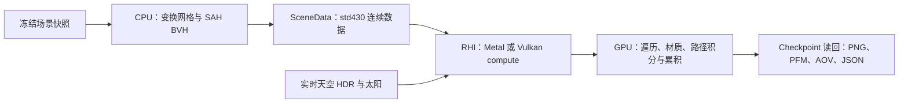

# CPU 采样优化与 Metal/Vulkan GPU Path Tracing

本轮实现 scrambled Sobol、GGX VNDF、自适应采样，并增加 `--path-trace-gpu`。GPU 执行射线生成、BVH 遍历、材质求值、NEE/MIS、多次反弹、Russian roulette 和逐像素累积；天空继续复用实时大气生成的 HDR。CPU 与 GPU 使用同一冻结场景和基础 PBR 定义。

## 使用

沿用项目的 Metal/Vulkan CMake 构建。大型模型先运行 `python3 tools/fetch_gi_assets.py`。

```sh
# CPU 默认 Sobol + VNDF + 自适应采样。
./build/Scene-Renderer --path-trace sponza --pt-size 640x480 --pt-samples 256 --pt-bounces 16

# 原生 Metal 构建：GPU tracing，首次同时烘焙实时天空。
./build/Scene-Renderer --path-trace-gpu sponza --pt-size 640x480 --pt-samples 256 --pt-bounces 16 --pt-exposure 3 --pt-output build/path-tracing/gpu/sponza
./build/Scene-Renderer --path-trace-gpu san-miguel --pt-size 640x480 --pt-samples 256 --pt-bounces 16 --pt-exposure 3 --pt-output build/path-tracing/gpu/san-miguel

# 已保存的天空及太阳 sidecar 可直接复用；GPU tracing 仍需设备。
./build/Scene-Renderer --path-trace-gpu sponza --pt-environment build/path-tracing/sponza-environment.hdr --pt-size 320x240 --pt-samples 256 --pt-fixed

# Vulkan 主后端的构建使用同一入口。
./build/vulkan/Scene-Renderer --path-trace-gpu sponza --pt-size 320x240 --pt-samples 256 --pt-fixed

# CPU PCG 固定 spp 对照；Metal/Vulkan GPU 使用 Sobol。
./build/Scene-Renderer --path-trace sponza --pt-sampler pcg --pt-fixed --pt-size 320x240 --pt-samples 256
ctest --test-dir build -R '^pt-' --output-on-failure
```

双后端构建可加 `--backend Vulkan`。默认输出前缀与 CPU 共用 `build/path-tracing/<scene>`，做对照时显式使用不同的 `--pt-output`。编辑器 `R` 键继续使用 CPU 静态入口；此次 GPU 路径通过命令行运行。

| 参数 | 默认值 | 含义 |
| --- | --- | --- |
| `--pt-sampler sobol/pcg` | sobol | CPU 可切换；GPU 当前使用 Sobol |
| `--pt-adaptive` / `--pt-fixed` | adaptive | 按误差指标提前停止，或每个像素完整运行指定 spp |
| `--pt-min-samples N` | 64 | 允许提前停止前的最小样本数 |
| `--pt-error R` | 0.03 | 相对于线性 RGB 均值的误差阈值 |
| `--pt-absolute-error A` | 0.0005 | 线性 RGB 绝对误差阈值，保护接近零的通道 |
| `--pt-samples N` | 64 | 自适应模式的每像素预算上限，固定模式的实际 spp |
| `--pt-bounces N` | 8 | 最大散射次数，支持 1–128 |

输出包括原有 PNG/PFM、albedo/normal AOV、HDR 和太阳 sidecar；新增 `*-samples.png` 用亮度表示相对于该次运行最大 spp 的采样分配。JSON 记录预算、实际平均 spp、总样本数、停止像素数、误差设置、执行后端及 GPU buffer 字节数。`setup_seconds` 记录 GPU 导出/打包、管线创建与资源准备的 CPU 墙钟时间；资源初始上传可能延迟到首次提交，相关等待会进入 `render_seconds`。模型导入和 CPU BVH 构建均在追踪计时之外。

## CPU 与 GPU 的共同采样

`Sampler.cpp` 实现 padded 2D Sobol：每对二维坐标独立使用由 seed、pixel、维度对生成的数字移位，并独立打乱样本索引。索引分成 `[2^k, 2^(k+1))` 的块，在块内用六轮不等长 Feistel 置换；因此每个二次幂样本前缀仍覆盖原来的完整二维点集，progress checkpoint 不需要重采样。相机、环境光选择与方向、太阳、发光面、BSDF 选择与方向、透明覆盖及 roulette 有固定的维度分配；二维方向样本成对请求，分支不会使后续 BSDF/roulette 改用其他维度。高反弹深度直接使用新的维度对，不依赖有限的大维度表。CPU 保留原 PCG，便于对照。

2026-10-05 修复了原来只有 XOR 移位的跨反弹相关性：维度 2 与 258 的 `I(x<0.5 && y<0.5)` 积分在 16,384 样本时仍得到 0 或 0.5，正确值为 0.25。新增解析积分回归覆盖多个 seed、反弹维度以及 `x*y`；保留一维分层和二维网格测试，并在 Metal/Vulkan 对照高反弹维度的逐值一致性。原下方性能与误差记录属于修复前的采样器，不能作为新版收敛指标。

GGX 从 NDF 改为 Heitz VNDF：根据 view 采样可见微表面法线，并同步更新 BSDF 与 NEE/MIS 使用的混合 PDF。采到无效方向时贡献零，不重试或重归一化。积分器还修正了最大深度的终止顺序：最后一次散射射线仍可累积环境/发光面，随后停止继续散射，保留 NEE 的 BSDF 配对贡献。

参考：[PBRT Sampler 接口](https://pbr-book.org/4ed/Sampling_and_Reconstruction/Sampling_Interface)、[Sobol Samplers](https://pbr-book.org/4ed/Sampling_and_Reconstruction/Sobol_Samplers)、[Heitz GGX VNDF](https://jcgt.org/published/0007/04/01/paper.pdf)、[PBRT Path Tracer](https://pbr-book.org/4ed/Light_Transport_I_Surface_Reflection/A_Better_Path_Tracer)。

自适应模式逐 RGB 通道用 Welford 更新均值和方差，在 checkpoint 比较 `1.96 × sqrt(variance / sampleCount)` 与 `absoluteError + relativeError × abs(mean)`。达到最小 spp 后，连续两个 checkpoint 满足条件才停止；CPU 与 GPU 使用相同规则。这个指标用于启发式预算分配，不能保证未见过的稀有路径已被充分采样，也不提供严格的图像误差界；提前停止具有统计偏差。固定 spp 模式保留为参考，比较时应同时检查暗部误差与采样分配图。

## GPU 数据与执行



GPU 首版采用软件 BVH compute 路径。CPU 构建二叉 SAH BVH，GPU 每个 invocation 处理一个像素，8×8 workgroup；每次 dispatch 最多推进 4 spp，checkpoint 读回。GPU 遍历使用深度上限 60、64 个槽的私有栈，按近 child 优先；退化三角形与 alpha mask 处理与 CPU 相同。纹理通过去重后的 RGBA8 texel buffer、descriptor 和显式双线性采样读取，保留原材质通道与 UV 约定。

数据有显式 ABI 断言：顶点 32 字节、BVH 节点 32 字节、三角形 16 字节、材质 128 字节、发光面 32 字节、累积像素 80 字节、参数块 288 字节。shader 经项目现有 GLSL→SPIR-V→MSL 工具链生成，C++ RHI 校验反射和绑定；资源创建、提交、读回均在设备拥有线程执行。单个 buffer 超过设备 storage range 会报错，不截断场景。

## 验证与测量

`pt-cpu` 新增 Sobol 一维/二维分层、高维访问、grazing VNDF 数值积分、最小深度环境 MIS、固定/自适应样本数与线程确定性测试。`pt-native-sky` 和原生 RHI 自检追加 GPU PT 测试：

- 1,024 条射线与 CPU 暴力求交比较。
- CPU/GPU Sobol 样本逐值比较。
- 基础 PBR、法线图与金属 VNDF、环境、有限太阳、点/spot、发光面与 alpha mask 的 CPU/GPU积分比较。
- 常量环境的自适应停止和均值检查。

Apple M4/macOS Release、320×240、256 spp 预算、16 次反弹、seed 1、曝光 3，CPU 使用 8 个 worker，GPU 性能测量关闭 Metal API/Shader instrumentation。各命令串行执行；存在其他开发负载，不作为严格基准。天空复用同一份 HDR/太阳 sidecar。

| 场景 | CPU 固定 spp | CPU 自适应 | Metal 固定 spp | Metal 自适应 | Vulkan 固定 spp | 自适应平均 spp |
| --- | --- | --- | --- | --- | --- | --- |
| sponza | 34.44 秒 | 32.67 秒 | 5.42 秒 | 5.35 秒 | 5.58 秒 | 246.51 |
| san-miguel | 52.03 秒 | 46.04 秒 | 9.34 秒 | 8.70 秒 | 9.47 秒 | 222.84 |

固定 spp 的追踪阶段 Metal 加速约 6.35× / 5.57×。包含模型导入、CPU BVH 构建、设备及资源准备和最终保存的完整命令耗时：Sponza CPU 36.29 秒 / Metal 8.74 秒；San Miguel CPU 64.08 秒 / Metal 22.03 秒。GPU 首次管线准备的成本也在完整命令内，不能把追踪加速倍数直接当作冷启动加速倍数。

320×240 的 GPU buffer 负载约 179.40 MiB / 681.99 MiB，包含网格、BVH、材质、完整纹理及逐像素状态；不包含 CPU 资产、driver/管线及导入临时空间。同一固定 spp 图，Metal/Vulkan 的 PFM 在本机逐值一致；CPU/Metal 的 RGB 相对 L1 差约 0.219% / 1.914%，平均亮度差约 0.00053% / 0.03466%。复杂几何中浮点舍入会改变部分后续路径；这是有限采样的一致性测量，不是对所有场景误差的保证。

采样质量另用 Sponza 320×240、GPU 1024 spp、独立 seed 7 做有限样本对照。CPU 256 spp Sobol 的选定阴影地面亮度 MSE 比 PCG 低约 18.5%，但全图 RGB MSE 高约 21.3%；此结果没有证明 Sobol 在所有区域都更优。自适应与固定 Sobol 的这块阴影 MSE 接近，全图平均亮度约低 0.172%；San Miguel 自适应平均亮度比固定模式低约 0.292%。参考图仍有采样误差，且 ROI 只覆盖一个地面区域。PCG、固定 spp 与 JSON 记录保留用于复核。

两个 Metal GPU 最终图为 640×480、256 spp 预算、16 次反弹，平均实际 spp 分别 245.11 / 219.67，追踪约 21.03 / 32.68 秒，非有限样本均为 0。图像及采样分配已检查；PNG 位于 `img/path-tracing/gpu-sponza.png`、`img/path-tracing/gpu-san-miguel.png`，完整 PFM/JSON 位于 `build/path-tracing/gpu/`。

完整 CTest：Metal 14/14、Vulkan/MoltenVK 15/15；Metal 回归启用 API/Shader Validation，CPU ASan/UBSan 通过。本机没有 Khronos validation layer，Windows/Linux 未实机验收。原始逐次测量和误差记录位于忽略的 `build/path-tracing/gpu-bench/{benchmark,consistency,quality}.json`。


## 当前边界

后续 [Guiding、Radiance Cache 与 BDPT 焦散](path-tracing-convergence.md) 已增加显式优化模式及 CPU BDPT 参考。上面的首次 GPU 性能记录属于默认普通 PT。

这条路径未加入硬件 ray tracing acceleration structure、GPU BVH 构建、wavefront 队列、ReSTIR。最终输出可以接入 [OIDN 降噪](path-tracing-denoising.md)。CPU/GPU 的真实模型比较允许浮点舍入造成分支差异，不要求逐像素位相同。程序化地形/草、海洋、计算细分后几何及特殊材质 lobe 的边界沿用 [CPU PT 说明](path-tracing-cpu.md)。天空能量、曝光和间接光增益未作艺术提亮；更好的采样不会自动改变正确解的平均亮度。

固定时刻地形、草丛与 FFT 水面现已通过共享捕获层进入 Metal/Vulkan PT；水面 IOR、泡沫和水下吸收使用同一材质 ABI。入口、精度预算、数值验证及介质限制见 [程序化 PT](path-tracing-procedural.md)。

水体／玉石的 RGB 体积输运、HG 和介质栈现已接入同一 CPU／Metal／Vulkan 内核，见 [随机游走 BSSRDF](path-tracing-subsurface.md)。体积场景暂禁用 GPU guiding/cache；surface BDPT 尚未覆盖体积策略和 MIS。
