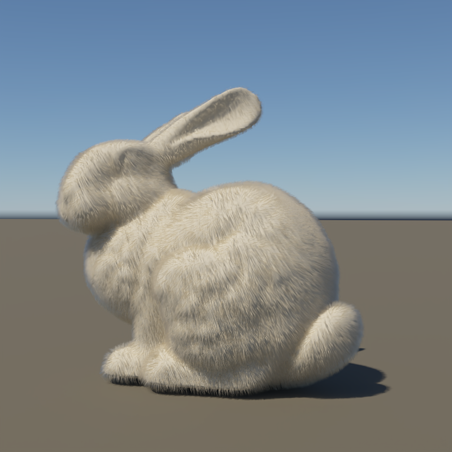
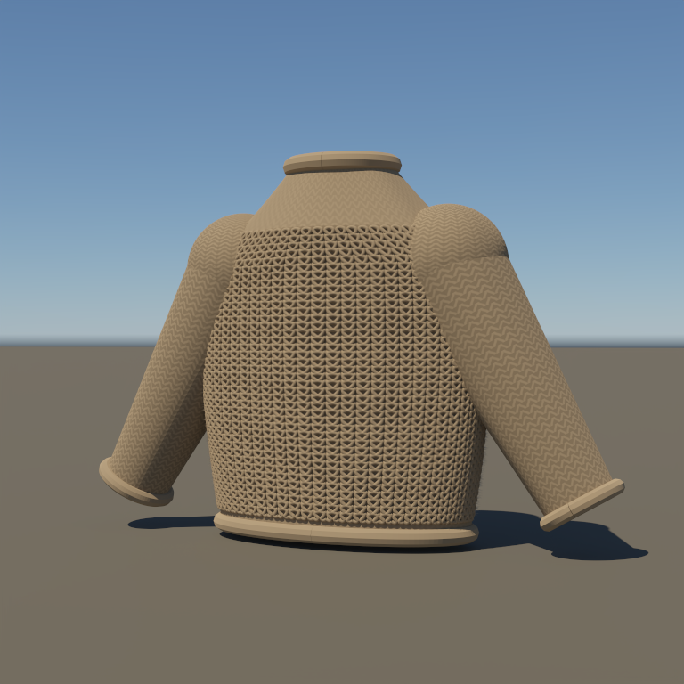
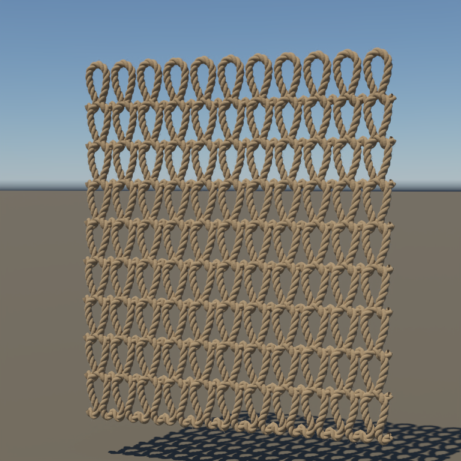

# 绒毛与针织布料：日光与夕阳

2026-10-09：在静态 groom 样例上细化 Bunny 绒毛、减弱毛衣表面图案、调整真实纱线位置，并用实时大气捕获的晴空和有限太阳进行离线路径追踪。

## 夕阳展示

README 现在展示同一套精修几何的夕阳版本：实时 `clouds-sunset` 预设捕获的 **512×256 HDR**，太阳高度 **5°**。天空和有限太阳同步旋转 **80°**、照明乘以 **1.2**，透射后太阳 RGB irradiance 约为 `[13.06871,6.00165,1.53389]`。保持相机、几何、发丝数量和材质不变，展示曝光为 **0.7**。

| 夕阳 Bunny 绒毛 | 夕阳针织毛衣 | 夕阳三股纱线 |
|---|---|---|
|  |  |  |

均为 **Metal PT，768×768、1024 spp、12 次反弹、seed 1、OIDN 2.5.1 CPU**。未降噪图：[Bunny](../img/path-tracing/bunny-fur-sunset-raw.png)、[毛衣](../img/path-tracing/knit-sweater-sunset-raw.png)、[纱线](../img/path-tracing/knit-yarn-sunset-raw.png)。[验收 JSON](../img/path-tracing/grooms-sunset-validation.json)与[夕阳 HDR、太阳参数、场景与日志](../img/diagnostics/materials/grooms-sunset/)保存来源及校验值。

夕阳版本三个场景均无非有限样本。

| 场景 | Metal 对 CPU 相对 RGB L1 | Metal／Vulkan |
|---|---:|---|
| Bunny 绒毛 | 2.00021% | 原始 HDR 完全一致 |
| 针织毛衣 | 0.01238% | 原始 HDR 完全一致 |
| 三股纱线 | 0.01923% | 原始 HDR 完全一致 |

云层作为冻结的环境贴图参与照明和背景；本组没有导入捕获中的地面云影场，也没有追踪穿云的体积路径。独立太阳保留经大气透射后的强度，因此这是固定 HDR 的夕阳展示，不能作为实时云影共享的验收。

生成与渲染示例：

```sh
MTL_DEBUG_LAYER=0 MTL_SHADER_VALIDATION=0 ./build/Scene-Renderer \
  --path-trace-gpu clouds-sunset --backend Metal --pt-size 32x32 \
  --pt-samples 1 --pt-bounces 1 --pt-fixed --pt-output build/pt-grooms-sunset/sunset
PYTHONDONTWRITEBYTECODE=1 python3 tools/create_pt_groom_sunset.py
MTL_DEBUG_LAYER=0 MTL_SHADER_VALIDATION=0 \
  ./build/pt-hair-sunlit/runtime/pt-package-render --backend Metal \
  --scene build/pt-grooms-sunset/bunny/scene.json --size 768x768 \
  --samples 1024 --bounces 12 --seed 1 --output build/pt-grooms-sunset/bunny/metal
./build/pt/Scene-Renderer --path-trace \
  --pt-denoise-input build/pt-grooms-sunset/bunny/metal.pfm \
  --pt-denoise-device cpu --pt-exposure 0.7 --pt-output build/pt-grooms-sunset/bunny/filtered
```

运行前冻结输入与实际程序，再渲染三个场景的 128×128／64 spp／深度 12 的 `check-metal`、`check-vulkan`、`check-cpu`；`tools/validate_pt_groom_sunset.py` 核对几何、材质和相机不变，检查后端原始 HDR 并发布图集。

## 原日光版本

| 阳光下的 Bunny 绒毛 | 阳光下的针织毛衣 | 布料纱线近景 |
|---|---|---|
|  |  |  |

三图均为 **Metal GPU PT，768×768、1024 spp、12 次反弹、seed 1、exposure 0.85**，采用 **OIDN 2.5.1 CPU** 离线降噪。未降噪展示：[Bunny](../img/path-tracing/bunny-fur-sunlit-raw.png)、[毛衣](../img/path-tracing/knit-sweater-sunlit-raw.png)、[纱线](../img/path-tracing/knit-yarn-sunlit-raw.png)。

## 绒毛调整

Bunny 数据来自 **Stanford University Computer Graphics Laboratory** 的[官方扫描数据页](https://graphics.stanford.edu/data/3Dscanrep/)，沿用原始 35,947 顶点、69,451 三角形。模型归一化到高度 2.6，毛根仍按表面面积采样并绑定三角形与重心坐标。

- 发丝数从 24,000 增至 **72,000**，根半径从约 0.0033 减至 **0.0018**，均带固定 seed 的 ±20% 变化。
- 身体控制点长度参数从 0.052–0.084 调至 **0.042–0.065** 世界单位，耳部减半；这是造型参数，不是兔毛实测尺寸。
- 显式 RGB 吸收为 `[0.08,0.11,0.18]`，纵向／方位粗糙度为 `0.32/0.38`，保留 R、TT、TRT 与高阶残余项。
- 使用较低的观察机位，轮廓上可看到日光照亮的绒毛。

毛发仍是固定参考相机的尖端衰减薄带，尚无原生曲线求交、毛囊、动力学或髓质散射。

## 布料调整

奶油色毛衣将正面弯曲纱线单元从 468 增至 **1,280 个**。针目重复数由 36×34 增至 64×52；真实纱线半径调至 0.0085、截面由 8 面增至 12 面；缩小纱线与布面的间距，减少悬浮造成的过重空隙阴影。底层针目图案强度降为 0.22，袖子为 0.45，避免真实纱线与表面图案重复产生强烈明暗。

毛衣布面绒毛从 2,000 增至 **8,000 根**，根半径减至 0.00065；每个真实纱线单元另有 12 根表面短绒毛（根半径 0.00045），合计 **23,360 根**。奶油色纱线底色 `[0.78,0.67,0.52]`、sheen 权重 0.22。最下方几何移至离地 0.03，保持相机与衣服相对关系。

近景单独展示九行连续的布料纱线：每行由 **三股真实几何**绕中心线捻合，捻距为 0.095 世界单位，股半径与中心偏移均为 0.009，截面为 16 面。另有 **18,000 根表面绒毛**，根半径 0.0006。中心线采用运输宽度 frame，减小截面跳变；纱线仍按不透明 cloth 着色，毛发闭包只用于表面绒毛，不把三股几何当作完整纱线内部输运。

布料采用粗糙漫反射、有界掠射 sheen 和薄片透射；显式纱线使用不透明 cloth 闭包。针目是未做机械松弛的造型原型，尚无连续织物拓扑验证、纱线内部输运或通用织物节点图。

## 日光与验收

使用实时大气输出的 **512×256 线性 HDR**，太阳高度约 **57.37°**。天空与有限太阳同步绕世界竖直轴旋转 **70°**、照明乘以 **3**；经大气透射后的 RGB irradiance 约为 `[8.36815,7.60645,6.52493]`，太阳角半径约 0.28648°。HDR 不含太阳盘，有限太阳独立参与照明；删除摄影棚面积灯，扩大地面以覆盖远处射线。

[验收 JSON](../img/path-tracing/grooms-sunlit-validation.json)与[场景参数、HDR、运行和降噪日志](../img/diagnostics/materials/grooms-sunlit/)记录固定输入和实际运行程序的 SHA256。128×128、64 spp、12 次反弹的小图使用 CPU、Metal、Vulkan 对照原始 scene-linear HDR，不调整曝光或像素位置。OIDN 仅用于展示，可能平滑细绒毛；后端一致性检查不等同于独立物理参考验证。

三个最终场景均无非有限样本；静态 groom 原有四项 Python 测试通过。

| 场景 | Metal 对 CPU 相对 RGB L1 | Metal／Vulkan |
|---|---:|---|
| Bunny 绒毛 | 1.92535% | 原始 HDR 完全一致 |
| 针织毛衣 | 0.00544% | 原始 HDR 完全一致 |
| 三股纱线近景 | 0.00780% | 原始 HDR 完全一致 |

本次复用此前冻结的独立 `pt-package-render` 和成套 shader；其[构建源码审计](../img/diagnostics/materials/hair-sunlit/runtime-source-audit.json)仍适用。

## 复现

生成器需要 NumPy，验收另需 Pillow。先准备 Bunny PLY 和实时晴空 HDR，然后执行：

```sh
PYTHONDONTWRITEBYTECODE=1 python3 tools/create_pt_groom_sunlit.py
MTL_DEBUG_LAYER=0 MTL_SHADER_VALIDATION=0 \
  ./build/pt-hair-sunlit/runtime/pt-package-render --backend Metal \
  --scene build/pt-grooms-sunlit/bunny/scene.json --size 768x768 \
  --samples 1024 --bounces 12 --seed 1 --output build/pt-grooms-sunlit/bunny/metal
./build/pt/Scene-Renderer --path-trace \
  --pt-denoise-input build/pt-grooms-sunlit/bunny/metal.pfm \
  --pt-denoise-device cpu --pt-exposure 0.85 \
  --pt-output build/pt-grooms-sunlit/bunny/filtered
```

毛衣与纱线分别使用 `sweater`／`yarn` 子目录。正式验收前保存输入与运行程序的 `source-freeze.json`；完成三个场景的 `check-metal`／`check-vulkan`／`check-cpu` 小图、`metal` 正式图和 `filtered` 降噪后，运行 `tools/validate_pt_groom_sunlit.py` 发布图集与验收记录。具体运行命令一并保存于诊断目录。

## 更完整的毛衣模型候选

完整造型展示优先考虑 [MadeByYeshe 的 Sweater Pack](https://sketchfab.com/3d-models/sweater-pack-50fc69ff7a9a4f91ad721b44e898772d)。作者说明模型在 Marvelous Designer 中制作，经 Blender 重拓扑与 Substance Painter 贴图处理，约 7,400 个三角形、4K 贴图，许可标为 CC Attribution。这是候选资产，尚未导入本项目；实际 UV、贴图通道与近景质量需要下载后验收。

另有 [qlodly 的 Knitted Sweater](https://sketchfab.com/3d-models/knitted-sweater-c038ef1af12545f18b8ab6d37e6d7bd4)，约 1,800 个三角形、2K 贴图、CC Attribution，适合低成本完整服装轮廓；针织细节主要依赖贴图。

接入时优先保留衣身、袖子、领口和完整 UV，再使用本项目 cloth／sheen 材质及面积分布绒毛。真实纱线几何用于近景细节，现有程序化场景继续提供可控的材质对照。换成更完整的服装网格不会自动带来纱线内部输运或完整针织力学。
