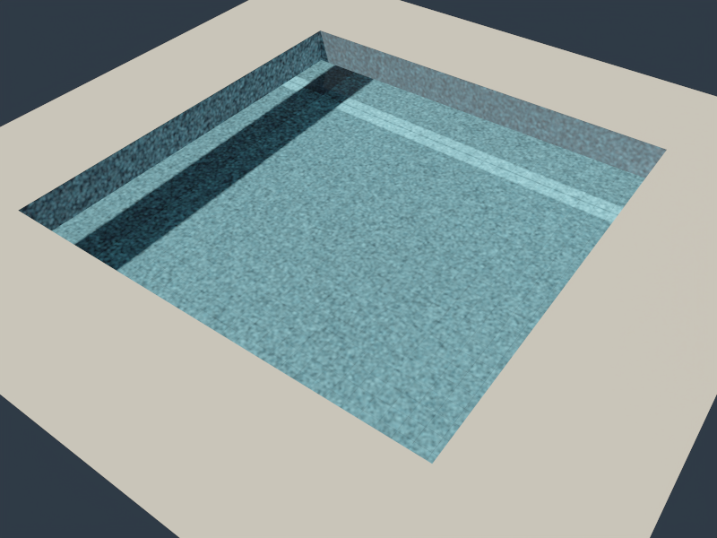

# Photon mapping、池底焦散与通用 PT 加速

本阶段暂缓材质扩展，优先实现 photon mapping 和通用 PT 优化。没有引入 ReSTIR／reservoir。CPU 并行生成冻结 photon map，CPU／Metal／Vulkan 使用相同的光子与空间索引查询间接光。

## 池底样例与运行

`pool-caustics` 使用封闭透明水体、1.333 IOR、RGB 吸收、有限太阳和棋盘池底。水面为两个解析波的固定几何，便于跨后端独立验收，**不是 FFT 捕获**。`pool-flat` 保留水体但关闭波形，`pool-no-water` 移除水体。池壁与水体侧面相隔 1 cm，避免共面交点的材质／介质归属歧义。

```bash
cmake --build build/pt --target pt-package-render -j 6

# 无编辑器／窗口循环的实际渲染；CPU、Metal、Vulkan 使用相同参数。
./build/pt/pt-package-render --fixture pool-caustics --backend Metal \
  --size 512x384 --samples 32 --bounces 8 --photons \
  --photon-paths 1000000 --photon-radius .08 \
  --output build/path-tracing/pool-photon

# 保留纯 PT 数学对照，不使用 photon map。
./build/pt/pt-package-render --fixture pool-caustics --backend Metal \
  --size 128x96 --samples 4096 --bounces 8 \
  --output build/path-tracing/pool-reference
```

主程序同样支持 `--path-trace[-gpu] pool-caustics`，使用 `--pt-photons`、`--pt-photon-paths`、`--pt-photon-radius`。已有冻结场景包可以通过 `--scene`／`--pt-scene-file` 接入。photon 模式要求固定 spp，不能同时启用 BDPT、guiding、radiance cache 或自适应停止。

输出 beauty、线性 PFM、独立 `-caustics.png/.pfm` 及 JSON。焦散 AOV 标记从光源出发、经过一个或多个平滑介电 delta 事件、首次到达非 delta 表面的路径；它是完整间接光的子集。

| 原始 beauty | 焦散 AOV |
| --- | --- |
|  |  |

上图由 Metal 实际渲染，512×384、32 camera spp、100 万发射路径、半径 0.08、深度 8，不使用 OIDN。光子预处理使用 CPU；[渲染报告](../img/path-tracing/pool-photon-render.json) 保留参数与计时。

### 晴天泳池：更明显的网状亮纹

`pool-sunlit` 保留 1.15 深度的清澈池水，改用五组不同方向的短涟漪、浅蓝 20 cm 瓷砖和混凝土池沿。太阳角半径为 0.00465 rad（约 0.266°），配少量常量蓝色环境填充。较短的波长让水面曲率在池底形成交叉聚焦线；photon 半径从旧预览的 0.08 缩到 0.025，减少密度核对亮线的平滑。没有添加焦散贴图，也没有单独放大焦散 AOV。

`pool-sunlit-underwater` 把相机置于水内并朝向池底，便于看清亮纹。`pool-sunlit-flat` 使用与水上视角相同的光照、相机、材质和预算，只关闭水波，作为对照。

| 水下池底近景 | 水上泳池视角 |
| --- | --- |
|  |  |



Metal 实际渲染：近景 960×600，水上／平水面对照 800×600；均为 64 spp、400 万发射路径、半径 0.025、深度 6。上面预览使用 OIDN；[近景原图](../img/path-tracing/pool-sunlit-underwater-raw.png)、[水上原图](../img/path-tracing/pool-sunlit-raw.png)、[平水面原图](../img/path-tracing/pool-sunlit-flat-raw.png) 均保留。固定半径估计仍有偏，池壁光子密度不足的噪声也仍存在。场景是冻结解析波面，**不是 FFT 捕获**。

```bash
./build/pt/pt-package-render --fixture pool-sunlit-underwater --backend Metal \
  --size 960x600 --samples 64 --bounces 6 --photons \
  --photon-paths 4000000 --photon-radius .025 --denoise \
  --output build/path-tracing/pool-sunlit-underwater
# 水上与平水面：将 fixture 换为 pool-sunlit / pool-sunlit-flat，size 为 800x600。
```

主程序也支持这三个场景名和既有 `--pt-photons` 参数。光子数值回归、主程序 CPU 水下命令通过，三张实际图均无非有限样本；参数、未降噪亮度与各项计时见 [晴天泳池记录](../img/path-tracing/pool-sunlit-validation.json)。

## 估计器与支持范围

光源端支持面积发光网格、有限太阳及 HDR。外部光源使用包围球的投影圆盘发射；面积端点包含面积密度、余弦方向密度和双面概率。所有源类型的选择概率都计入 flux，并以**发射路径总数**归一化，包含落空／吸收／早停路径。折射使用 importance transport，吸收按 Beer 定律计算。

光子记录位置、入射方向、法线、flux、路径深度和焦散标记。按半径大小划分空间单元，排序后查询相邻 27 个单元；归一化 Epanechnikov 圆盘核为 `2(1 - distance²/radius²)/(π radius² × emittedPaths)`。法线和离开切平面的距离防护减少隔墙漏光；这些防护也会在曲面／边缘引入附加偏差。

相机继续追踪介电事件，在首个普通 PBR 表面保留 emission 与直接 NEE，并用 photon gather **替代全部间接光**，然后终止该相机路径。直接光在该表面不再与已经停止的 BSDF continuation 做 MIS，避免遗漏直接光；没有把 photon 贡献直接叠加到完整 PT 上造成双算。存储时排除光源直接落在第一个表面的光子，查询同时限制光源与相机的总散射深度。

这是固定半径的**有偏两遍 photon mapping**，不是 BDPT／VCM／SPPM。增加相机 spp 只改善像素与相机路径采样，不能消除固定 photon map 的噪声或密度估计偏差；提高光子数并调整半径才会改变这一部分。

当前支持默认 PBR、固体介电界面和不含体积散射的吸收介质。体积 photon gather、BSSRDF、受控 Blender closure 伴随修正、薄片以及混合 alpha 尚未实现，明确拒绝；alpha cutout 可使用。介质采用与相机路径相同的水体 host／winding 规则；不支持非水体介质之间的交叉重叠。点光／聚光／解析方向光的光子发射暂未实现，同样明确拒绝，不能以缺失贡献代替实现。

理论参考：[PBRT Photon Mapping / SPPM](https://www.pbr-book.org/3ed-2018/Light_Transport_III_Bidirectional_Methods/Stochastic_Progressive_Photon_Mapping)。

## 通用优化与开关

- **阴影 any-hit：** CPU／Metal／Vulkan 在全不透明／alpha cutout 场景使用 BLAS/TLAS 提前退出，不计算最近命中的材质与法线。混合透明场景同样可在不透明遮挡处提前退出；没有不透明遮挡时保留最近的薄片／alpha 命中，继续原透射循环。`--no-shadow-any-hit`／主程序 `--pt-no-shadow-any-hit` 可关闭，验证相同样本的线性图像不变。
- **GPU 批次：** 默认每次提交 8 spp，`--gpu-batch-samples 1..64`／主程序 `--pt-gpu-batch-samples` 可调整。固定 spp 下不改变采样维度、样本序列或 film 累积顺序；checkpoint／读回间隔继续独立控制。
- **并行光子预处理：** 各发射路径使用独立确定性随机流，最终按单元、发射序号、深度排序；切换线程数不改变光子内容与查询累加顺序。外部太阳／HDR 发射原点保证在包围球外，免去逐条 initial-medium 扫描。
- **避免无效工作：** photon merge 表面无需准备之后不会使用的水体太阳 continuation proposal。GPU 复用关闭 guiding/cache 时的 film 备用分量保存焦散 AOV，普通 PT 的像素结构仍为 80 bytes。

## 验收和后续

自动检查包含平水面 Fresnel／吸收／投影照度解析对照、无水体零焦散、总深度限制、焦散 AOV 不超过 beauty、并行发射确定性、有限范围 any-hit 与 brute force、镜像／非均匀实例和 alpha cutout、透明回退、GPU batch 图像一致性及不支持组合的拒绝。CPU 和原生 Metal／Vulkan 均检查相同 photon map 的查询结果。

串行运行对照工具，避免不同变体同时争用 GPU；包括 photon 准备、设备设置和未降噪线性误差。4096 spp 纯 PT 是有限样本参考，不宣称 exact GT。

2026-10-06，Apple M4／Release，池底 128×96、深度 8：

| 方法 | 准备＋渲染 | 原始 RGB RMSE | 相对 RGB L1 |
| --- | --- | --- | --- |
| 纯 PT，416 spp，seed 1 | 0.749 s | 0.688 | 49.16% |
| Photon，100 万路径＋16 spp，seed 1 | 0.793 s | 0.253 | 29.58% |
| 纯 PT，416 spp，seed 2 | 0.741 s | 0.719 | 50.65% |
| Photon，100 万路径＋16 spp，seed 2 | 0.780 s | 0.254 | 29.64% |

近似相同预算下，两组 seed 的 RMSE 降低约 63–65%；这是焦散场景的质量收益，不是通用 PT 吞吐倍数。光子准备约 0.59 s，占这张小图的大部分时间；固定半径会平滑焦散细节。相对 L1 仍较高，包含有限参考的罕见路径噪声、photon 密度偏差与边缘误差。

同样本池底 128 spp 的 closest／any-hit／batch8／batch16 **PFM 完全一致**。本次准备＋渲染为 0.247／0.244／0.244／0.229 s；any-hit 收益很小，batch16 约快 8%，单次计时不代表所有场景。完整参数、两组 seed 与实际报告见 [验收数据](../img/path-tracing/pool-photon-validation.json)。

通用 PT 另使用有薄玻璃／混合透明材质的 Classroom，128×72、256 spp、深度 12，关闭 photon mapping。closest／混合 any-hit（均 batch4）准备＋渲染为 **8.629／6.734 s**，本次约减少 22% 时间；batch8／batch16 为 6.702／6.677 s。四种原始 PFM 完全一致，GPU dispatch 数从 64 降到 33／17。批量采样在这个主要受遍历限制的场景额外收益很小。

上述为串行单次测量，温度和设备状态会影响时间，不据此推断跨硬件或所有场景的倍数。复现 Classroom：

```bash
python3 tools/benchmark_pt_acceleration.py --backend Metal \
  --scene samples/assets/blender/classroom/scene.json --skip-photons \
  --size 128x72 --samples 256 --reference-samples 512 --bounces 12 \
  --output build/path-tracing/classroom-acceleration-metal
```

最终回归：Release 六项 PT 测试通过；ASan／UBSan 原有四项通过（111.90 s），独立 photon 测试通过（43.22 s）；Metal 和 Vulkan 原生 PT 自检、主程序 CPU pool 命令通过。Vulkan 使用本机 MoltenVK，Khronos validation layer 不可用。平水面九点平均照度与独立解析式之比约 0.98787。新增测试单独注册为 `pt-photon`，避免与原有大量独立 BSDF 积分累加触及单目标超时。

```bash
python3 tools/benchmark_pt_acceleration.py --backend Metal \
  --size 128x96 --samples 128 --reference-samples 4096 \
  --photon-samples 16 --photon-paths 1000000 --photon-radius .08 \
  --output build/path-tracing/pool-benchmark-metal
```

后续按测量推进：GPU 原生光子发射和排序、SPPM 半径／累计 flux 更新、体积光子与嵌套水体、GPU wavefront／原生 RT。材质分层继续保留在原计划中，暂不优先；ReSTIR 不属于这轮实现。
