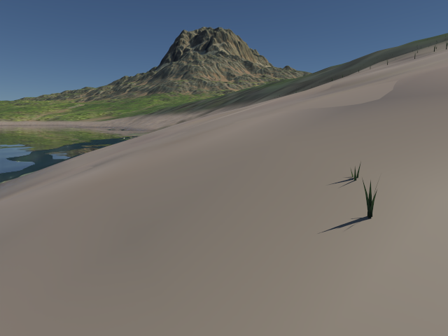

# Stanford Dragon、地形与 FFT 水面的离线 Path Tracing

本轮按固定时刻捕获现有场景：CPU、Metal/Vulkan GPU 单向 PT 共用冻结后的网格和材质；Stanford Dragon 使用 CPU BDPT 生成透明玻璃和焦散。README 中的图片由本项目真实渲染，原始线性 PFM、辅助 AOV、渐进结果和 JSON 保存在忽略的 `build/path-tracing/procedural/`。

## 实施与入口

- [x] 官方 Dragon 下载、SHA-256 校验、PLY 导入、玻璃覆盖和不透明对照。
- [x] 完整地形高度场、VT 地表材质及当前沙滩 PBR 捕获。
- [x] 原生 GPU 草丛姿态读回与共享草叶几何。
- [x] 原生大波／短波 FFT 固定时间捕获、岸线 mask、法线与泡沫。
- [x] CPU/Metal/Vulkan 水面 Fresnel 反射／折射、RGB 吸收及水下相机。
- [x] 编辑器设备线程捕获桥、数值测试、实际场景图和 OIDN。

`SceneSnapshotBuilder` 提供不可变 CPU 数据。`captureProcedural` 在设备拥有线程运行原生 FFT 和草丛生成，并把结果转换成普通 `SnapshotDraw`；完成后清除快照中的程序化 terrain/ocean 请求。CPU worker 和 GPU PT 使用相同的冻结场景，捕获后不再推进模拟。双线程编辑器通过 `RenderRuntime::capturePathTracingScene` 请求捕获，异常通过 future 交回逻辑线程；`R` 键冻结当前模拟时刻或时间覆盖值。

## Stanford Dragon 与真实焦散

来源为 [Stanford 3D Scanning Repository](https://graphics.stanford.edu/data/3Dscanrep/)，数据提供方 **Stanford University Computer Graphics Laboratory**。脚本固定官方 `dragon_recon.tar.gz` 和校验值，默认读取 `dragon_vrip.ply`：原扫描包含 437,645 个顶点、871,414 个三角形。Assimp 合并重复顶点后为 435,545 个顶点；PT 排除退化三角形，最终网格有效三角形为 871,296。仅居中、缩放至高度 2、生成平滑法线及设置玻璃材质，未填补原扫描的小孔，因此不是闭合体的物理基准。使用条件与哈希见 [资源声明](../samples/licenses/stanford-dragon.txt)。

```sh
python3 tools/fetch_dragon.py
./build/pt/Scene-Renderer --path-trace dragon-caustics --pt-bdpt \
  --pt-size 640x480 --pt-samples 512 --pt-bounces 12 --pt-threads 8 \
  --pt-exposure 2 --pt-denoise --pt-output build/path-tracing/procedural/dragon-glass

# 同一网格改为不透明材质，检查 caustic_energy_fraction 为 0。
./build/pt/Scene-Renderer --path-trace dragon-caustics --pt-bdpt --pt-no-glass \
  --pt-size 320x240 --pt-samples 64 --pt-bounces 12 --pt-threads 8 \
  --pt-output build/path-tracing/procedural/dragon-opaque-check
```

场景使用 IOR 1.5、有限面积顶灯、宽幅补光和漫反射摄影棚。`--pt-no-glass` 在 Dragon 场景中保留网格并改为不透明材质；原 `caustics` 球体场景仍移除玻璃球。可用 `--pt-dragon-mesh FILE.ply` 指定另一分辨率，下载脚本支持 `--resolution 2/3/4`。

`*-caustics.png/.pfm` 是分类出的“经过镜面事件再抵达漫反射表面”的真实路径贡献，没有附加焦散贴图。beauty、降噪图和焦散 PNG 使用相同曝光；焦散 AOV 保留原始采样噪声。BDPT 的端点、连接 MIS、pinhole splat 和限制沿用 [BDPT 说明](path-tracing-convergence.md)。降噪可能抹掉细小焦散，原始 PFM 始终保留。

## 地形与草丛

地形捕获直接读取 VT 源页面，包含全部高度场，独立于实时四叉树的视锥与 LOD。高度使用 finest mip 的双线性采样，法线由高度导数和模型变换得到。默认网格边长为 `min(heightVT.extent, 1025)`；可以显式降低至 257 做快速预览。大面积场景的低分辨率网格会使近景岸线和细草位置不一致，应提高网格精度。

五层基础地表材质选择不超过纹理预算的 VT mip。沙滩保留原始底色／法线／ORM 的 level 0 方形区域及岸线 mask，由 CPU／Metal／Vulkan PT 在实际命中点按世界坐标重复采样，结合海拔、坡度、岸线 proximity 与湿润度混合材质。岸线 mask 使用地形 UV 与 clamp 采样。沙纹分辨率独立于整块地形的 `--pt-texture-size`，避免把 8 km 地形烘焙进 2048² 贴图后，每像素约 3.9 m 导致近景沙纹与法线丢失。AO 不再乘入真实光传输。掠射角下背向入射射线的 shading normal 回退到有效基础／几何法线，避免整片黑带；完整 shading-normal 能量修正仍未实现。

草丛复用 `GpuGrass` 的原生生成和风动姿态、同一草叶几何，以及当前距离密度、坡度、水域和沙滩过滤。捕获的是当前相机与生成预算下的实例，不是整个世界无限密度的植被；默认最多 16,384 丛，可提高预算。草叶为双面非金属材质，使用与实时 shader 相同的根部／叶尖颜色。

```sh
./build/pt/Scene-Renderer --path-trace-gpu terrain --pt-time 8 \
  --pt-size 640x480 --pt-samples 128 --pt-bounces 12 --pt-fixed --pt-denoise \
  --pt-output build/path-tracing/procedural/terrain

# Mountain Lake 资源按 mountain-lake.md 准备；远景可能没有可见草丛。
./build/pt/Scene-Renderer --path-trace-gpu mountain-lake --pt-time 8 \
  --pt-size 640x480 --pt-samples 128 --pt-bounces 12 --pt-fixed --pt-denoise \
  --pt-output build/path-tracing/procedural/mountain-lake

./build/pt/Scene-Renderer --path-trace-gpu mountain-lake-beach --pt-time 8 \
  --pt-texture-size 2048 --pt-size 640x480 --pt-samples 256 \
  --pt-bounces 12 --pt-fixed --pt-denoise \
  --pt-output build/path-tracing/procedural/mountain-lake-beach
```

## FFT 水面与水下吸收

捕获直接运行现有 `GpuOcean`，读回 displacement、normal 和 foam。时间为 `animate ? snapshotTime × timeScale : 0`。大波频谱与现有参数一致；短波沿用 256²、32 m 周期、amplitude × 0.06 × detailStrength、seed + 71、wind × 0.6 的原生配置。默认采用现有 `meshSize`；几何同时包含两层 FFT 位移，细法线和泡沫另保留为周期场。

水面使用 IOR 1.333 的平滑 dielectric，通过 Fresnel 选择反射／折射；真实场景几何参与求交，所以湖面可反射山体、水下物体可被折射看到。RGB Beer–Lambert 系数沿每段实际水下距离衰减。入水／出水切换当前介质，水下相机预先确定初始介质。无限水下段按吸收系数逐通道取极限，零吸收通道保持透射，避免 Metal 的极大距离指数运算产生 NaN。

FFT 泡沫作为白色漫反射覆盖率，与透明水面形成显式概率混合及匹配 PDF。物理路径不照搬实时的屏幕空间折射、艺术浅／深水色或雾；关闭 refraction 时使用深水色的普通 PBR 近似。

```sh
for scene in ocean ocean-clear; do
  ./build/pt/Scene-Renderer --path-trace-gpu "$scene" --pt-time 8 \
    --pt-size 640x480 --pt-samples 256 --pt-bounces 16 --pt-fixed --pt-denoise \
    --pt-output "build/path-tracing/procedural/$scene"
done

# 改为 --path-trace 即使用 CPU 积分；FFT 捕获仍需要 Metal/Vulkan。
./build/pt/Scene-Renderer --path-trace mountain-lake --pt-time 8 \
  --pt-size 320x240 --pt-samples 32 --pt-bounces 12 --pt-fixed --pt-threads 8 \
  --pt-output build/path-tracing/procedural/cpu-mountain-lake
```

当前开放水面下已接入均匀 RGB 吸收／多次散射、HG 相位和介质栈，支持部分浸水的 Jade Dragon；实现、对照图与限制见 [水体／玉石随机游走](path-tracing-subsurface.md)。未构造水体侧壁／底面，未支持实时自定义泡沫色或动态运动模糊。既有 512 m 大波周期可完整包含 32 m 短波周期，其他不整除周期的组合未验收。水下焦散由单向 PT 采样，收敛可能较慢；**BDPT 尚未实现介质连接权重，含水面或散射材质的 BDPT 请求明确报错**。既有 BDPT 焦散验收对象为 Dragon 玻璃。


## 水下太阳路径采样

2026-10-05 增加水下太阳方向的延续采样 proposal：在水下漫反射表面或体积散射点，先用空气到水的折射方向和实际 FFT 水面法线估计太阳方向，再以 50% 概率采样其周围的有限锥体，另外 50% 保留原 BSDF／HG 采样。完整混合 PDF 同时用于路径权重和 NEE 的 MIS；路径仍需实际求交并经过 Fresnel 反射／折射及介质吸收／散射，没有直线透过水面的阴影近似，也没有扩大太阳或截断亮点。

方向估计只有四次迭代，可能无法找到全部焦散路径；保留原采样确保未被 proposal 覆盖的方向仍有概率。`--pt-no-water-sun-proposal` 关闭该 proposal，供同灯光、同曝光的原始线性对照。固定 256 spp 的旧浅水图仍是未充分收敛的历史预览，不能用 OIDN 的平滑画面验收水下能量。

| 湖岸旧图：整块地形烘焙 | 修复：世界坐标原始沙滩纹理，1024 spp |
| --- | --- |
|  |  |

| 浅水旧图：256 spp | 修复：折射太阳混合采样，4096 spp |
| --- | --- |
|  |  |

[湖岸未降噪原图](../img/path-tracing/pt-mountain-lake-beach-raw.png) · [浅水未降噪原图](../img/path-tracing/pt-ocean-clear-raw.png) · [完整参数、测试与图片校验](../img/path-tracing/shoreline-water-fix-validation.json)。两张最终图均为 640×480、time=8 s，使用原太阳与曝光；湖岸为 1024 spp／32 次反弹，浅水为 4096 spp／64 次反弹。OIDN 图用于展示，原始线性结果用于检查能量。

```sh
./build/pt/Scene-Renderer --path-trace-gpu mountain-lake-beach --pt-time 8 \
  --pt-texture-size 2048 --pt-size 640x480 --pt-samples 1024 \
  --pt-bounces 32 --pt-fixed --pt-denoise \
  --pt-output build/path-tracing/shore-fix/beach-final-1024
./build/pt/Scene-Renderer --path-trace-gpu ocean-clear --pt-time 8 \
  --pt-size 640x480 --pt-samples 4096 --pt-bounces 64 --pt-fixed --pt-denoise \
  --pt-output build/path-tracing/shore-fix/ocean-final-4096
```

相关 Metal／Vulkan 回归分别通过 5/5，ASan／UBSan 的 CPU／介质／程序化捕获检查通过 3/3。解析平面水体测试独立计算 Fresnel、Beer 吸收及粗糙度为 1 的 PBR／GGX 反射，30,000 条路径得到红通道 0.0728707，参考为 0.0746024，偏差约 2.32%；相机避开太阳镜面反射。CPU／GPU 的沙滩材质相对 L1 为 7.46×10⁻⁸，折射太阳混合采样为 1.74×10⁻⁴。这些是解析能量和实现一致性检查，有限采样下仍可能有稀有焦散噪点，不表示整个波浪场景已严格收敛。

捕获湖岸时还修复了透明／内部水面跳过路径的射线偏移：改用几何法线和坐标精度决定的偏移，避免千米级世界坐标下固定微小偏移被浮点舍入吞掉，重复求交同一边界。

## 参数与验证

| 参数 | 默认与范围 |
| --- | --- |
| `--pt-time T` | 8 秒；有限、非负 |
| `--pt-terrain-grid N` | 自动取高度 VT extent，最多 1025；显式范围 2…1025 |
| `--pt-ocean-grid N` | 使用实时 meshSize；显式范围 2…1025 |
| `--pt-texture-size N` | 1024；64…4096，VT 实际选择对应 mip |
| `--pt-grass-limit N` | 16,384 丛，最多 1,048,576，受原生 capacity 约束 |
| `--pt-no-grass` | 跳过原生草丛捕获；仅地形／已保存 HDR 可完全在 CPU 上运行 |

JSON 新增 `terrain_meshes`、`grass_meshes`、`ocean_interfaces` 和 `frozen_time_seconds`；原有几何数量、非有限样本、曝光、采样、时间和降噪记录仍保留。GPU std430 材质现为 176 字节（新增独立沙滩参数与贴图索引），参数块为 288 字节；两后端通过同一 GLSL→SPIR-V→MSL 工具链。

2026-10-04，Apple M4/macOS，完整 CTest 为 Metal **16/16**、Vulkan/MoltenVK **17/17**，ASan/UBSan CPU／程序化／denoiser **3/3**。回归包含：高度／法线／UV 与材质方向、损坏 VT 页面拒绝、沙滩湿润度／粗糙度、FFT 水面拓扑、Fresnel+Beer 能量、水下初始介质、零吸收通道极限、岸线 alpha、泡沫混合 PDF、掠射法线、未捕获水面与 BDPT 水体拒绝。设备线程测试验证 FFT 时刻变化及异常回传；32×24 / 512 spp 对照中，CPU/GPU 水面相对 L1 约 4.7×10⁻⁷，水下相机约 8.8×10⁻⁸。CPU、程序化捕获及 denoiser 另通过 ASan/UBSan。完整场景 PNG 已目视检查，非有限样本均为 0。性能数字受本机其他开发负载影响，不作为跨平台基准。

计算细分／额外位移、clearcoat／anisotropy、实时材质到 PT 的通用 SSS 映射、体积云和 BVH 实例共享仍属于后续工作；本轮支持的是上述已冻结的地形、草和 FFT 水面。

最终图片和实际 JSON 汇总见 [验收记录](../img/path-tracing/procedural-validation.json)：Dragon 512 spp BDPT 约 182.08 秒，焦散能量占比约 4.96%，不透明对照为 0；Mountain Lake 为 4,194,304 个三角形，Metal 128 spp 及 Vulkan 16 spp 均完成。所有记录保留具体设备、曝光、采样和时间；各次运行存在并行开发负载。
