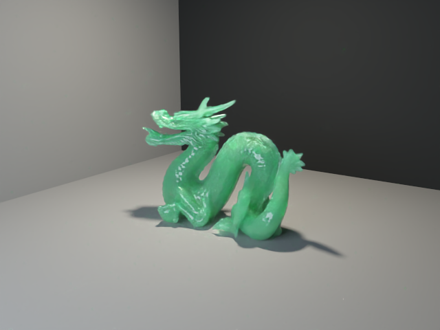
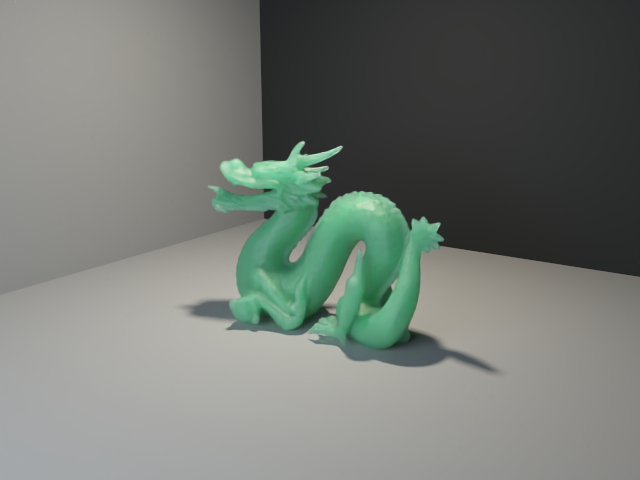

# 粗糙介电边界与半抛光 Jade Dragon

2026-10-05 第一阶段实现：CPU、Metal、Vulkan PT 支持各向同性 GGX 粗糙反射／折射。保持原来的均匀 RGB 随机游走介质，改变光线进入和离开介质时的方向分布。后续原生 GPU 求交、体积 BDPT 与非均匀材质见 [迭代计划](path-tracing-appearance-plan.md)。

## 材质与输运

`SnapshotDraw.pathTracingRoughness` 独立于实时 PBR roughness，要求有限且处于 [0,1]。GGX 的 α=r²；r<0.02 使用平滑 delta 边界，r≥0.02 使用 GGX VNDF 微表面法线采样。内外 IOR 相等时退化为直线透射。GPU 的 `PackedMaterial.absorption.w` 保存 r，材质仍为 128 字节，参数块仍为 288 字节。

CPU 的 `evaluateBsdf`、`sampleBsdf`、`bsdfPdf` 与共享 GPU shader 使用相同公式。反射与透射按精确 dielectric Fresnel 分配，处理全内反射；透射使用广义半向量 `h ∝ v + (ηt/ηi) l` 和对应方向 Jacobian。Radiance 透射相较 Importance 除以 `(ηt/ηi)²`，详见 [PBRT Dielectric BSDF](https://pbr-book.org/4ed/Reflection_Models/Dielectric_BSDF)。Smith masking 使用两侧 G1 的乘积。无效的法线／出射方向产生零贡献，不重复采样后重新归一化。

粗糙边界参与环境、面积光、有限太阳和局部灯光的 NEE／MIS；继续采样保存完整方向 PDF。水面泡沫与粗糙介电 lobe 使用完整混合 f／PDF。透射后继续使用原介质栈；直接照明阴影段选择出射侧的 σa+σs，例如从玉石出射至空气时不再沿空气段使用玉石消光。阴影射线遇到其他折射界面仍停止，由路径继续采样穿越，尚未包含跨多个折射面的光源连接。

CLI：

| 参数 | 默认 | 用途 |
| --- | --- | --- |
| `--pt-sss-roughness R` | 0.22 | `dragon-jade`／`dragon-jade-ocean` 的介电边界；0 恢复早期平滑预览 |
| `--pt-water-roughness R` | 0 | 捕获 FFT 水面后叠加未解析的微表面粗糙度；不替换 FFT 几何波形 |

显式指定玉石参数需要玉龙场景，水面参数需要捕获的 ocean；包括显式 0，场景不匹配也会报错。`media` JSON 保存 `dielectric_roughness`。旧 BDPT 参考继续使用平滑玻璃，粗糙介电和体积 BDPT 请求明确拒绝，避免遗漏策略密度。

## 玉石对照

玉龙仍采用艺术预设：IOR=1.54、RGB σa=(9,0.7,3.5)、σs=(35,45,38)、HG g=0.45。龙体两世界单位高按两米解释；改变尺度时需相应调整逆长度系数。预设未使用实测矿物光谱，内部色根、晶粒和杂质尚未建模。

同一修复模型、灯光、512 spp 和采样种子，仅改变边界 r：

| r=0 | r=0.22 | r=0.5 |
| --- | --- | --- |
|  |  |  |

图像由实际 Metal PT 生成，640×480、深度 96、曝光 2，OIDN 2.5.1 color-only。半抛光与平滑的差别较细微；粗糙对照展宽高光和透射。原始采样与报告用于数值验收，降噪图仅用于预览。

```sh
for roughness in 0 0.22 0.5; do
  ./build/pt/Scene-Renderer --path-trace-gpu dragon-jade \
    --pt-size 640x480 --pt-samples 512 --pt-bounces 96 --pt-fixed --pt-no-sky \
    --pt-sss-roughness "$roughness" --pt-denoise-color-only \
    --pt-output "build/path-tracing/appearance/jade-r${roughness}"
done
# CPU：入口改为 --path-trace；Vulkan：使用 Vulkan 构建并追加 --backend Vulkan。
```

## 验证与边界

Metal 与 Vulkan/MoltenVK 相关 CTest 均通过 5/5：CPU、介质、OIDN、程序化捕获、原生天空／GPU 一致性；ASan／UBSan 的 CPU、介质和程序化测试通过 3/3。

`pt-cpu` 对前／背面、r=0.35／0.65 各采样 150,000 次，独立球面积分使用 768×1024 方向，检查 PDF 积分与有效采样质量、f×cos/PDF 期望、radiance／importance 互易、全内反射附近、同 IOR 退化、非法参数与 ABI。

| 朝向／r | 有效采样质量／PDF 积分 | Importance 能量：采样／独立积分 |
| --- | --- | --- |
| 正面／0.35 | 0.997820／0.997789 | 0.996689／0.996662 |
| 正面／0.65 | 0.980180／0.980126 | 0.960437／0.960230 |
| 背面／0.35 | 0.985273／0.984993 | 0.971216／0.970843 |
| 背面／0.65 | 0.865433／0.864429 | 0.757838／0.756656 |

模型是单次散射 GGX，未包含微表面间多次反射／折射，高粗糙度尤其内侧会损失能量。这与有限采样或介质吸收不同，未做任意亮度补偿。表格用 Importance；Radiance 跨不同 IOR 的单侧输出可大于 1，需包含 η² 和两侧输运判断守恒。

吸收立方体内部相机的出射测试，用 60,000 条路径对照 512×512 独立半球积分：输出 1.18741／参考 1.18627，验证粗糙出射 NEE 没有把空气段按内部介质消光。嵌套水／玉石测试的 CPU/GPU 原始线性相对 L1 为 9.79311×10⁻⁶，内部相机为 4.28276×10⁻⁵，两原生后端均通过。

完整玉龙另用 160×120、128 spp、深度 96、r=0.22、同种子且不降噪对照 CPU/Vulkan：逐像素 RGB 向量长度的相对 L1=0.00764045，总 RGB 能量比（GPU/CPU）=1.00383317；逐 RGB 分量的相对 L1=0.00486238，非有限样本为 0。这些是实现一致性检查，不构成更快收敛的证明。图像生成时存在并发负载，报告耗时不用于速度排名。

图片 SHA256、原始渲染报告、数值记录和源文件校验见 [验收记录](../img/path-tracing/rough-dielectric-validation.json)。水体／随机游走模型的其余限制见 [次表面说明](path-tracing-subsurface.md)。
