# 完整效果图集与渲染说明

[返回项目展示](../README.md) · [构建与运行](getting-started.md) · [系统设计](system-design.md) · [技术文档索引](README.md)

这里保留各场景的详细参数、开关对照、中间产物、复现命令及历史验收记录。数据对应各段标明的日期与配置；最新实现范围以相关专题文档为准。所有 shell 命令仍从仓库根目录执行。

## 场景与效果

下面的实时效果图已使用本项目的**新 RHI／原生 Metal** 在 Apple M4 上重新生成：经典场景与天空为 **960 × 720**，海洋为 **1920 × 1080**。常规画廊每张图独立清空 TSAA 历史并累积 16 帧，云画廊运行 32 帧，后文 VT／阴影诊断画廊运行 64 帧；导入场景使用真实模型与纹理。GI 场景使用统一的 PBR 材质近似，以太阳方向光和大气天空作为直接光照及 RSM 反弹的来源；当前曝光、相机及光源配置见 [ClassicScenes.cpp](../src/renderer/rhi/ClassicScenes.cpp)。

### Sponza：中庭与多层拱廊

2026-10-05 已用 CSM／PCSS 修复后的版本重新生成本节及页首的五张 Sponza 图片，替换旧图中地面的异常三角形阴影；相机、太阳和曝光保持一致。[问题原因、前后对照与验收](vt-csm-pcss-fixes.md#sponza-readme-旧图修正)。

使用 Frank Meinl / Crytek 的 Sponza 模型：262,267 个三角形、25 个导入网格。中庭、彩色布帘和阴影区域适合观察间接光照及材质表现。图中为本项目设置的灯光，不是上游参考渲染的复现。

| RSM 关闭 | RSM 开启 |
| --- | --- |
|  |  |

### San Miguel：植物、喷泉与庭院

使用 Guillermo M. Leal Llaguno 的 San Miguel 场景及上游改进版本，导入 281 个网格、5,617,451 个三角形。保留桌椅、树木、花盆、喷泉及原始材质贴图；叶片使用透明裁切与双面绘制，阴影和 RSM 通道也采用相同的裁切规则。

| RSM 关闭 | RSM 开启 |
| --- | --- |
|  |  |

两组对照保持相机、曝光、直接光照、天空 IBL 和 SSAO 一致，只切换 RSM。`*-direct.png` 文件名表示 RSM 关闭，画面仍包含环境光和环境遮蔽。默认强度为 1，RSM 在色调映射前使 Sponza 的平均 RGB 亮度增加 **5.67%**，San Miguel 增加 **3.01%**。这些数值衡量当前固定视角的增量，不代表与参考 GI 的准确度。它近似局部的一次漫反射间接照明，有限采样会产生噪声，且不提供完整间接遮挡、多次反弹或焦散。

<details>
<summary>查看太阳与天空各自的间接光贡献</summary>

以下几何表面仅显示 RSM 一次反弹，经相同曝光和色调映射输出，不叠加表面的直接光或天空 IBL；背景天空和自发光表面仍保留。

| 场景 | 太阳反弹 | 天空反弹 |
| --- | --- | --- |
| Sponza |  |  |
| San Miguel |  |  |

</details>

实现、原有问题、能量公式、历史 GPU 数值测试和 Xcode 捕获方法见[中文 RSM 说明](rsm.md)。界面可独立切换太阳／天空反弹、查看纯间接光，并调整正交覆盖范围、采样半径和采样数。

### Cornell 风格场景、Bunny 与 Helmet

| 场景 | 展示内容 | Metal 实际渲染 |
| --- | --- | --- |
| Cornell Box 风格 | 自行生成红绿侧墙、两个箱体和顶灯面板；PBR、点光源阴影、SSAO、RSM、HDR。顶灯面板的自发光外观与实际点光源照明分别处理，另有弱补光；不是原始 Cornell 测量基准。 |  |
| Stanford Bunny | 官方 PLY 网格，展示白色非金属、金色金属和蓝色非金属三种材质。 |  |
| Damaged Helmet | Khronos glTF 示例，使用原始底色、法线、金属度／粗糙度和 AO 纹理；资源包含非商业使用要求。 |  |

```sh
./build/Scene-Renderer --classic cornell
./build/Scene-Renderer --classic bunny
./build/Scene-Renderer --classic helmet
```

### 更多经典测试场景

新增三个 Stanford 重建网格与 Sibenik Cathedral，全部通过新 RHI 的实时 PBR、CSM／PCSS 和 SSAO 渲染。扫描模型采用本项目设置的金属／非金属材质，教堂保留上游石材纹理；固定视角的导入规模如下。

| 场景 | 三角形 | 主要测试内容 |
| --- | --- | --- |
| Stanford Dragon | 871,414 | 金色金属、复杂曲面高光与轮廓阴影 |
| Happy Buddha | 1,087,716 | 浅色非金属、扫描细节与接触遮蔽 |
| Armadillo | 345,944 | 粗糙金属、壳面纹理几何与法线 |
| Sibenik Cathedral | 75,284 | 中殿、拱顶、石材材质与间接光对照 |

| Stanford Dragon | Happy Buddha |
| --- | --- |
| 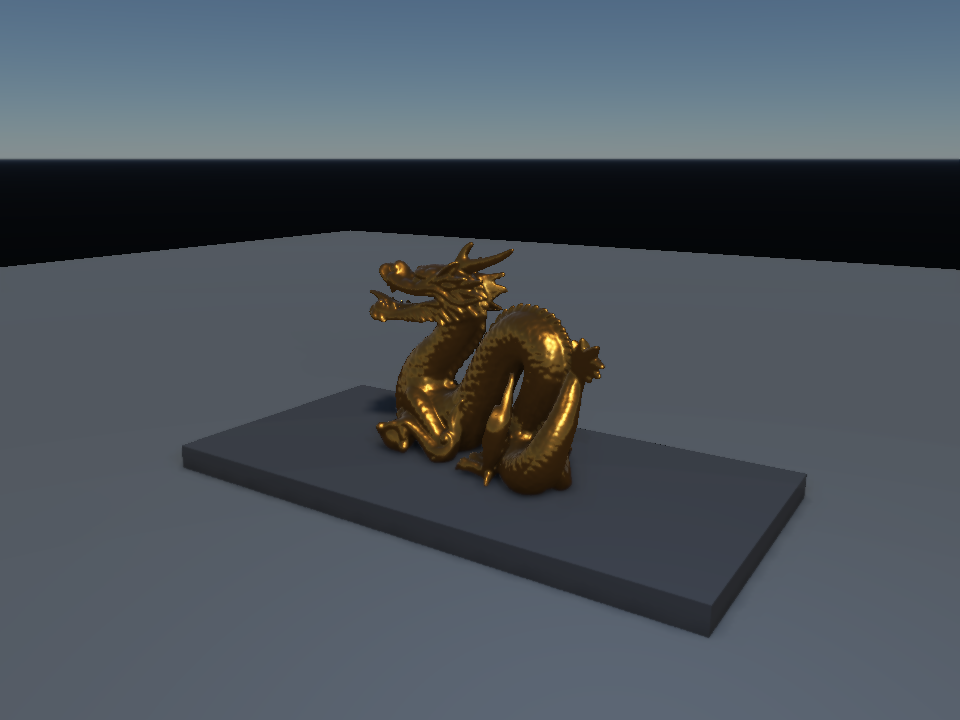 | 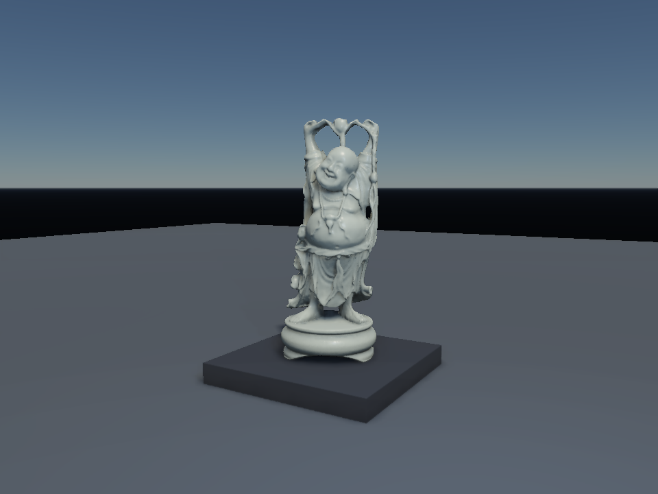 |

| Armadillo | Sibenik Cathedral |
| --- | --- |
| 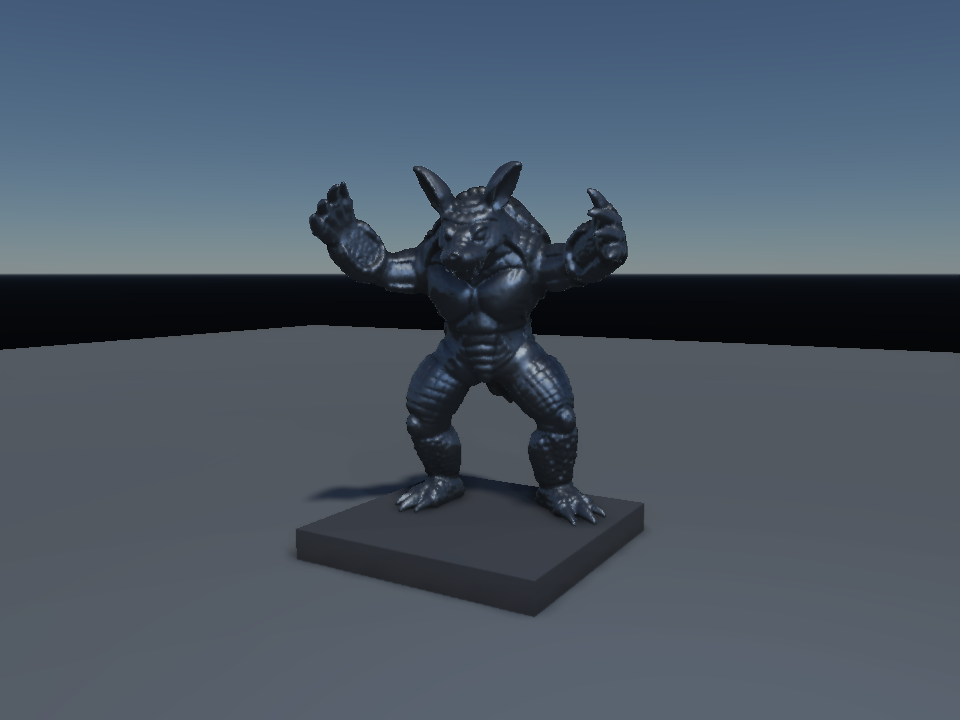 |  |

```sh
python3 tools/fetch_benchmark_assets.py
./build/Scene-Renderer --classic dragon       # 也可选择 buddha、armadillo、sibenik
./build/Scene-Renderer --render-gallery img/metal benchmarks
```

模型留在本地，仓库提供固定下载 URL、SHA-256、场景代码和实际截图。Buddha／Armadillo 使用保留 Stanford 来源的固定修订原格式镜像；Stanford 模型与 Sibenik 均有使用条件，详见 [资源说明](../samples/README.md) 和 [新增场景与验收](classic-benchmarks.md)。Sibenik 还会输出 RSM 开关及纯间接光对照，当前 RSM 为局部一次反弹近似。

## 大气天空与太阳

天空使用 Rayleigh／Mie 散射、臭氧吸收和各向同性高阶散射近似，按相机的米制海拔计算透射率与地平线。**太阳盘在背景片元中解析绘制**，其真实角半径独立于天空 LUT 分辨率；默认角直径约 0.573°。大气顶层的太阳辐照度同时驱动天空、PBR、RSM 和海洋，直接光乘大气透射及地球遮挡，日落时逐渐变红、衰减，太阳盘完全被地球遮住后不再提供直接照明，天空散射仍可保留暮光。

| 白天天空 | 太阳特写 | 地平线日落 |
| --- | --- | --- |
|  |  |  |

GUI 可修改太阳仰角、方位、角半径、多次散射强度、地面反照率与海平面。第一盏启用的方向光是太阳来源，面板与灯光保持同步。太阳盘不写进 IBL LUT，避免与直接方向光重复计算；显示、材质、RSM 和海面共享球面采样编码。实现、历史问题、能量公式和 Metal／Vulkan 回归数值见 [天空与太阳修复记录](sky-and-sun-review.md)。

```sh
./build/Scene-Renderer --classic sky
./build/Scene-Renderer --render-gallery img/metal sky
```

太阳盘使用 `L = E_top × T / (π × sin²(radius))`，增大角半径同时降低盘内辐亮度，保持总能量一致。零散射回归中，半径加倍后的离散总能量变化约 **0.62%**；极小角半径触发 RGBA16F 的 65000 显示上限时会损失能量，具体边界见修复记录。

`sky` 画廊还输出 10° 太阳和 -5° 暮光；纯天空示例没有地表几何，地球遮挡部分为暗色。RGB 光强尚未做绝对光度标定，该纯天空示例关闭云，星空和自动曝光尚未实现。

## 可穿越三维体素云

新增 **XYZ 体素密度 → 量化保守有符号距离场 → 加速间接步进 → 三维太阳光照缓存** 路径，支持靠近、进入、穿过和离开有限云体。专用预设使用 **128³ 密度、1080p 全分辨率、关闭云时域累积**；云形状由三维建模及噪声扰动生成，风暴预设具有扭曲漏斗形态和内部体积闪光。


| 云体内部视角 | 风暴内部闪光 |
| --- | --- |
|  |  |

空空间通过保守距离下界跳跃，恒密度内核在独立距离界内合并积分，边缘保留细步进；太阳透射率按三维缓存查询，细节侵蚀随视距过滤。无云历史模式直接合成，比六张屏幕积分／历史纹理少分配约 **94.9 MiB**。GUI 可调整体积中心、三轴大小、64³／128³ 分辨率及两种加速开关。

Apple M4／Metal 实测 1080p 云外视角：同样全分辨率的整帧 GPU 时间从关闭两种步进加速的 **23.57 ms** 降至 **11.82 ms**；无云基线 **6.06 ms**。数据包含整帧和呈现复制，排除启动阶段；云内视角更昂贵，完整结果见 [体素云测量](immersive-voxel-clouds.md)。Metal **17/17**、Vulkan/MoltenVK **18/18** 隔离回归通过，距离场逐砖块对照 CPU，空空间跳跃与内核近似分别验收。

```sh
./build/Scene-Renderer --classic cloud-volume
./build/Scene-Renderer --classic cloud-inside
./build/Scene-Renderer --classic cloud-vortex
./build/Scene-Renderer --render-gallery img/metal cloud-volume-gallery
```

<details>
<summary>查看体素密度、距离场与太阳光照中间切片</summary>

| XYZ 密度 | 保守有符号距离场 | 缓存太阳透射率 |
| --- | --- | --- |
| 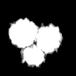 |  | 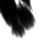 |

距离场红色表示空空间正距离、蓝色表示云内负距离；太阳缓存显示 `exp(-tau)`。画廊还输出 `*-reference.png`（关闭空空间跳跃／内核合并）、`*-no-flash.png`（关闭内部闪光）和无云对照。

</details>

这里采用程序化三维建模和量化 Chebyshev 距离下界，尚无流体模拟、VDB 导入或多级稀疏体素流式 LOD；风暴形态随风平移，未做流体演化。地面云阴影、IBL／RSM 天气调制与海面云反射仍待接入。完整算法、压缩存储口径、近似误差、GPU 回归和性能数据见 [三维体素云说明](immersive-voxel-clouds.md)。

## GPU Driven 体积云

云层采用 **GPU tile 分类与压缩队列 → 间接 dispatch 体积步进 → 风速补偿时域重建 → 深度引导上采样**。GPU 生成周期 Worley／value noise 和天气图，球面云壳与不透明深度共同决定可见区间；默认半分辨率、最多 72 次主步进及 6 次太阳采样，空密度跳过光照采样，低透射率提前结束。交互帧无需把可见性结果读回 CPU。

| 晴天积云 | 日落云层 | 阴天 |
| --- | --- | --- |
| 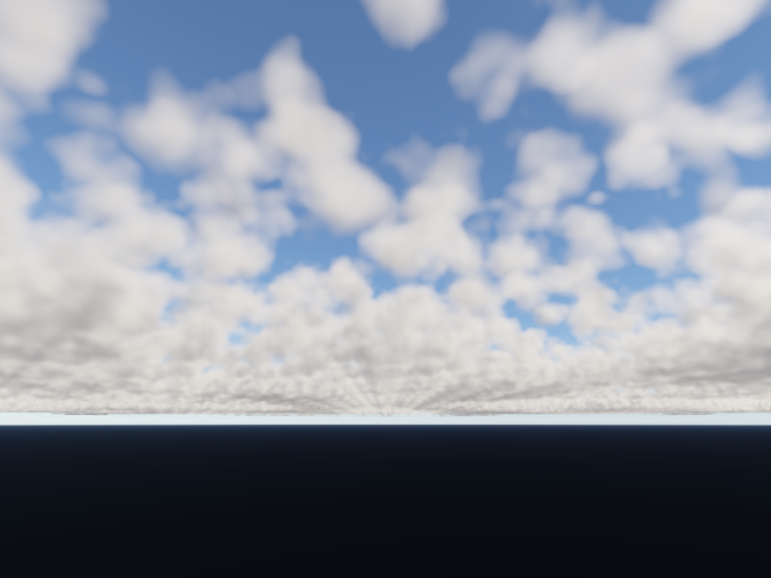 |  | 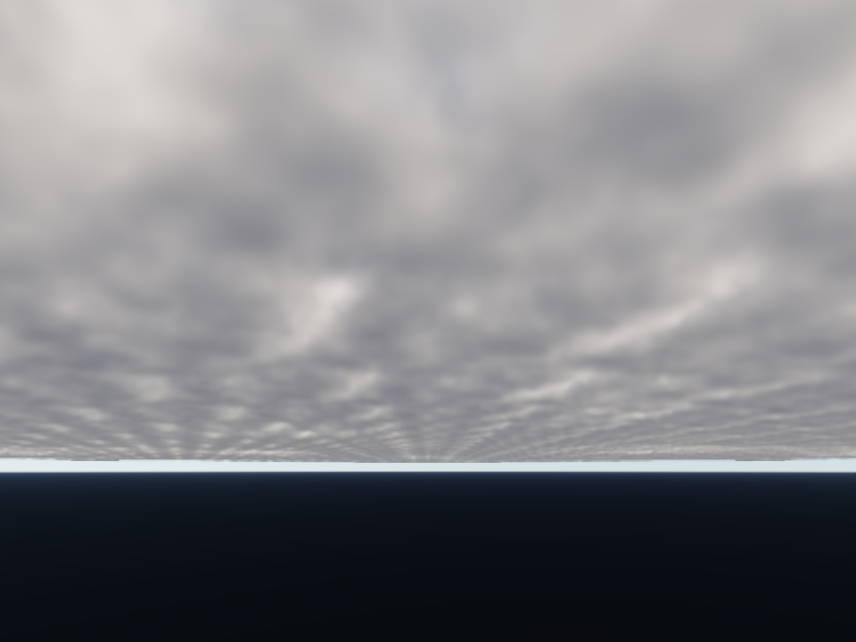 |

云共享大气的太阳方向与辐照度，包含云内自遮蔽、双 HG 相位和多次散射近似；太阳盘作为背景被云透射率衰减。独立历史处理云的风速运动，云覆盖像素拒绝通用天空 TSAA 历史，避免重复累积。GUI 的 **Volumetric clouds** 可开启带大气的现有场景，调整覆盖、高度、厚度、风速、密度、侵蚀和分辨率；其他场景默认关闭云。

Apple M4／Metal 实测：960×720 输出、480×360 云缓冲，晴天整帧平均 GPU 时间由 **3.16 ms** 增至 **6.97 ms**，增量约 **3.80 ms**；该视角剔除约 **26.7%** 的 tile。计时包含整帧与呈现复制，排除前四帧的启动阶段，不是云 pass 的独立计时。三种截图各累积 32 帧，完整数据见 [晴天记录](../img/metal/clouds-metrics.json)。

<details>
<summary>查看无云对照与 GPU 不透明度中间产物</summary>

| 同视角无云背景 | 云历史缓冲的 1−T |
| --- | --- |
| 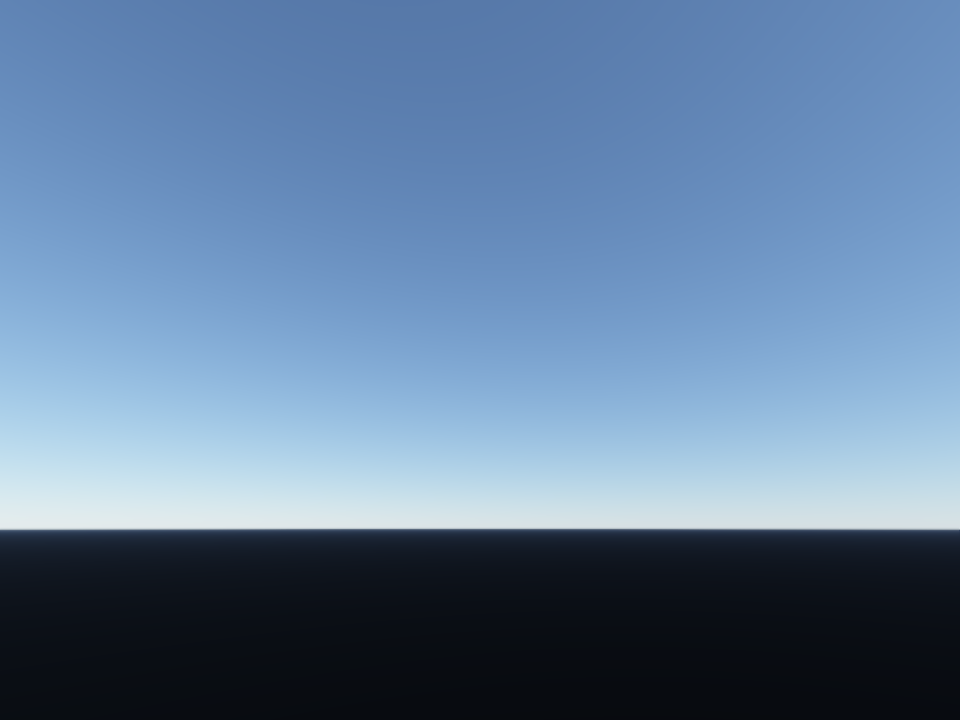 | 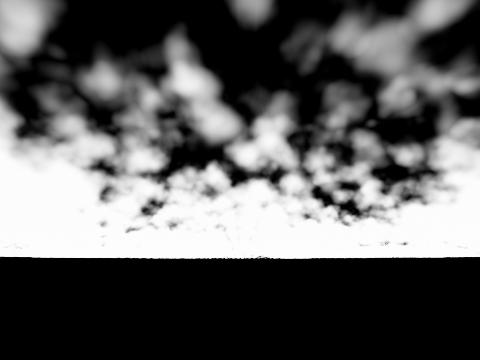 |

三种预设都输出 `*-clear.png`、`*-opacity.png` 和 `*-metrics.json`；白色表示更不透明，中间产物没有色调映射。截图来自实际渲染，未使用生成图片。

</details>

```sh
./build/Scene-Renderer --classic clouds
./build/Scene-Renderer --classic clouds-sunset  # clouds-storm 为阴天
./build/Scene-Renderer --render-gallery img/metal cloud-gallery
```

云对地面的投影阴影、天空 IBL／RSM 天空反弹的天气调制，以及海面反射中的云尚未接入；64³ 周期噪声与有限步数限制近处细节和薄云，快速运动仍可能出现时域模糊。实现、参数、GPU 流程、性能记录及双后端验证见 [体积云中文说明](gpu-driven-clouds.md)。

## 高清海洋与透明水体

海洋使用 **1024×1024 主 FFT、256×256 短波 FFT 和 513×513 水面网格**。主频谱表现长波，独立短波补充细小波纹；水面读取场景太阳和线性 HDR 天空，使用 Fresnel／GGX 光照及基于 Jacobian 的泡沫。

`--classic ocean` 默认展示波涛汹涌的深海：28 m/s 风速、1.8 倍高度和更陡的浪峰，配合压缩区域的白沫及透亮浪尖。GUI 可继续调整风速、`HeightScale` 与 `Choppiness`；`ocean-clear` 保留较平缓的浅水配置。

水体采用按水深计算的屏幕空间折射、RGB Beer–Lambert 吸收和近似单次散射，表现浅水透射及背光浪尖。GUI 可调吸收、散射、折射和短波细节。算法修复、数值测试、开关对照与限制见 [FFT 海洋与透明水体修复记录](ocean-fft-and-rendering-review.md)。

| 高清大浪海面 | 浅水透射与散射 |
| --- | --- |
|  |  |

截图为 1920×1080 原生 Metal 渲染，开启 TSAA 并累积 16 帧；浅水场景中的材质球和底面用于观察透射。散射与折射是实时近似，尚未实现体积多次散射、焦散或屏幕外折射。

```sh
./build/Scene-Renderer --classic ocean
./build/Scene-Renderer --classic ocean-clear
./build/Scene-Renderer --render-gallery img/metal ocean
./build/Scene-Renderer --render-gallery img/metal ocean-clear
```

综合 `--demo` 使用 512×512 主 FFT，专用海洋场景使用上述高清配置。

<details>
<summary>查看短波、散射和透明水体的开关对照</summary>

主波、相机、曝光与时间保持一致，各图独立清空 TSAA 历史。深海对照分别关闭短波或散射；浅水对照同时关闭折射和散射，以显示透射路径的作用。

| 深海关闭短波 | 深海关闭散射 |
| --- | --- |
|  |  |

| 浅水透射与散射开启 | 浅水关闭折射与散射 |
| --- | --- |
|  |  |

</details>

## 虚拟纹理地形

### Mountain Lake：山地与湖泊

导入 [ill_drakon 的 Mountain Lake](https://sketchfab.com/3d-models/mountain-lake-3043ead27ac74144950e634197a1490b)（CC BY 4.0），从原始规则网格重建 **1025×1025 高度场**，结合作者同分辨率的地表颜色图，接入高度／材质 VT。按米制解释原始坐标，演示范围为 **8×8 km**；湖面使用源水位、独立 512 m 频谱周期的 FFT、折射及近似体散射；生图水域 mask 限定岸线，GPU 草丛按距离、坡度、水位与 mask 过滤。VT 的 2048 存储尺寸来自重采样，不增加原始细节；当前水面反射只包含天空。下载、署名、转换和限制见 [山湖场景说明](mountain-lake.md)。


```sh
python3 tools/prepare_mountain_lake.py # 先按说明下载两个官方归档；沙滩贴图已随仓库提供
./build/Scene-Renderer --classic mountain-lake
./build/Scene-Renderer --classic mountain-lake-ground # 湖岸植被近景
./build/Scene-Renderer --classic mountain-lake-beach  # 沙滩 PBR 近景
./build/Scene-Renderer --render-gallery img/metal mountain-lake
```

草丛采用四片弯叶、360° 随机朝向，按世界距离调节密度：10 m 内约 15 cm 间距，逐渐过渡到 70 m 处的 3.5 m 间距，120–180 m 淡出。近区优先使用 GPU 实例预算，满密度目标约 42 丛／169 片草叶每平方米，实际数量受坡度、水域与视锥过滤影响。密集草块共享地形角点；水面省去完全干燥区域的网格单元。修复与验收见 [植被与 FFT 湖面](vegetation-and-lake-water.md) 和 [沙滩与草地密度](beach-and-grass-density.md)。


湖岸新增 [Poly Haven Aerial Beach 01](https://polyhaven.com/a/aerial_beach_01) 沙滩材质（Rob Tuytel，CC0），包含底色、法线、粗糙度和 AO。30 m 世界坐标平铺与 mip 过滤补充近景细节；岸线距离、相对水位和坡度控制混合，湿沙更暗、更光滑，草在沙地区域退让。


### 程序生成地形与草

地形高度图和五层 PBR 材质使用软件 **Virtual Texture**：固定物理 tile 缓存、mip 页表、祖先回退、边框过滤和区域上传。细页与缺页祖先在边界及对角角点连续混合，高度生成与草共用页采样；旧 float32 高度文件可直接按页读取，大场景可使用离线 pack，使高度和材质均无需在运行时完整解码。

大场景延迟渲染的世界坐标使用 float32，避免半精度位置量化产生地形阴影条纹；CSM 使用未抖动投影和世界单位偏移，PCSS 按太阳角半径／局部光尺寸估计半影。参数、修复原因和 GPU 验证见 [VT、CSM 与 PCSS 修复记录](vt-csm-pcss-fixes.md)。

GPU 四叉树按分块高度界、FOV、分辨率和距离估计屏幕误差，叶节点预算耗尽时保留父节点。公共整数网格与高度 morph 保持不同 LOD 的接缝一致，草附着于同一变形后的三角形表面，边界法线按实际差分跨度计算。默认网格从约 237.5 MiB 降至 19 MiB；8192² 虚拟尺寸下，网格与两套默认 VT 资源合计约 30.16 MiB，不包含草、阴影和其他渲染目标。

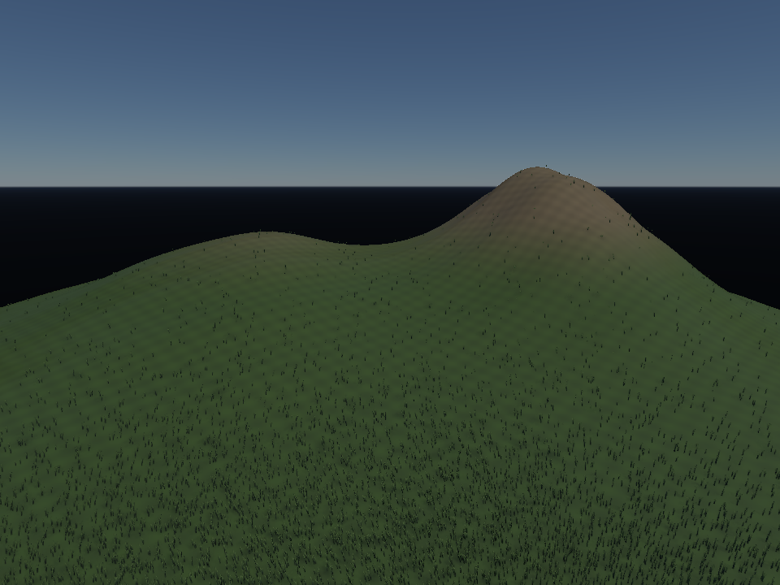

```bash
./build/Scene-Renderer --classic terrain
./build/Scene-Renderer --render-gallery img/metal terrain
```

示例由程序生成 1024² 高度与底色，无需额外下载。请求结合真实渲染深度的异步 GPU feedback、CPU 保守视锥预测，以及上一帧阴影／RSM 的辅助视图；每帧限制页读取／上传数量。原生双线程编辑器使用有界后台 IO，快速移动时可暂时回退到粗 mip。离线分页命令、配置、修复记录与验证见 [地形 Virtual Texture 说明](terrain-virtual-texture.md)。

<details>
<summary>查看同一视角的 LOD 网格</summary>

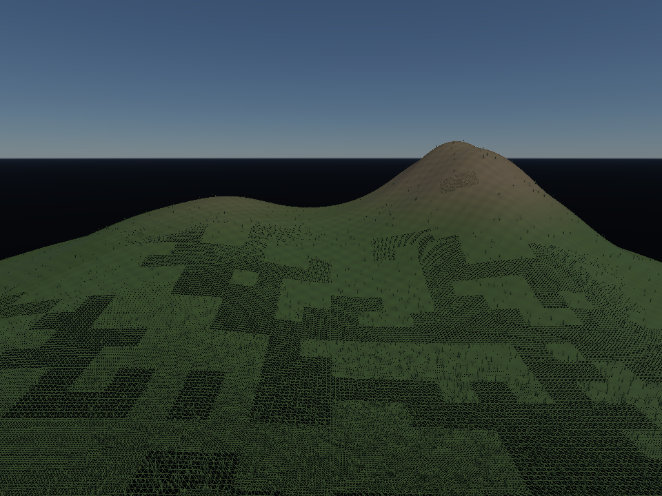

</details>

### VT 的物理缓存、页表与回退

以下中间产物于 **2026-10-05** 在 Apple M4／原生 Metal 上捕获。程序生成地形使用 **1024² 虚拟尺寸**，高度和五层材质各有 **64 个物理槽位**；每页包含 64² 内容及四边各 2 texel 的 apron，物理图集为 **544²**。两套图集与页表约 **10.18 MiB**，不含几何、反馈缓冲和其他渲染目标。捕获走异步页读取、GPU 深度反馈和阴影视图预测，每张最终画面单独清空 TSAA 历史并运行 64 帧。


上图直接读取 GPU 物理图集：高度归一化为灰度，底色保持原编码；此程序场景的切线法线和粗糙度为常量，几何法线另由高度差分生成。格线标出缓存槽位；相邻槽位可存放完全不同的虚拟页，物理图集里的格线并不代表地形接缝。

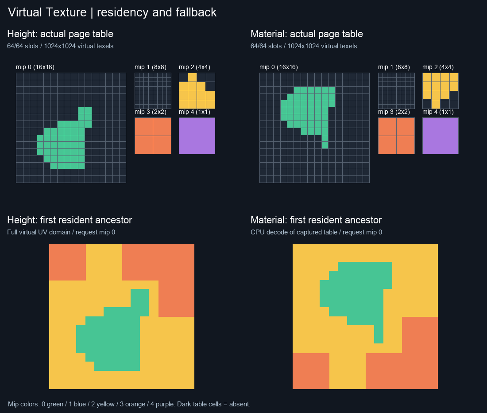

上排按 mip 解码实际 GPU 页表，深色表示缺页；下排在整个虚拟 UV 域请求 mip 0，并着色显示找到的**首个驻留祖先**。绿色是细页，黄色／橙色是粗页，紫色根页始终驻留。高度与材质的 V 方向相反，因此布局会翻转。下排是页表诊断，未模拟 shader 在缺页边缘的连续祖先混合，也不代表最终材质颜色。页驻留和后台 IO 仍可继续变化，本次计数见 [捕获数据](../img/diagnostics/capture-summary.json)。

## 级联阴影与 PCSS 软阴影

### CSM：近处精细、远处扩大覆盖

方向光采用 **5 级 CSM**，混合对数／线性深度分割，将有限图集分辨率优先分配给近处接收面。使用未抖动相机投影、光空间 texel 对齐和世界单位偏移；级联末段 10% 混合到下一级，最后一级末段淡出。下面的 `shadow-test` 全部由程序生成，含 4／10／16 m 高的近处立柱及延伸至远处的遮挡物；相机远裁剪 500 m，阴影距离 300 m。


右图根据同帧 GPU 世界坐标 G-buffer、实际级联分割和过渡参数生成伪彩色：绿、蓝、黄、橙、紫对应 C0–C4，灰色表示末级淡出及阴影距离外区域。它展示接收面的级联分配，不是阴影可见度。

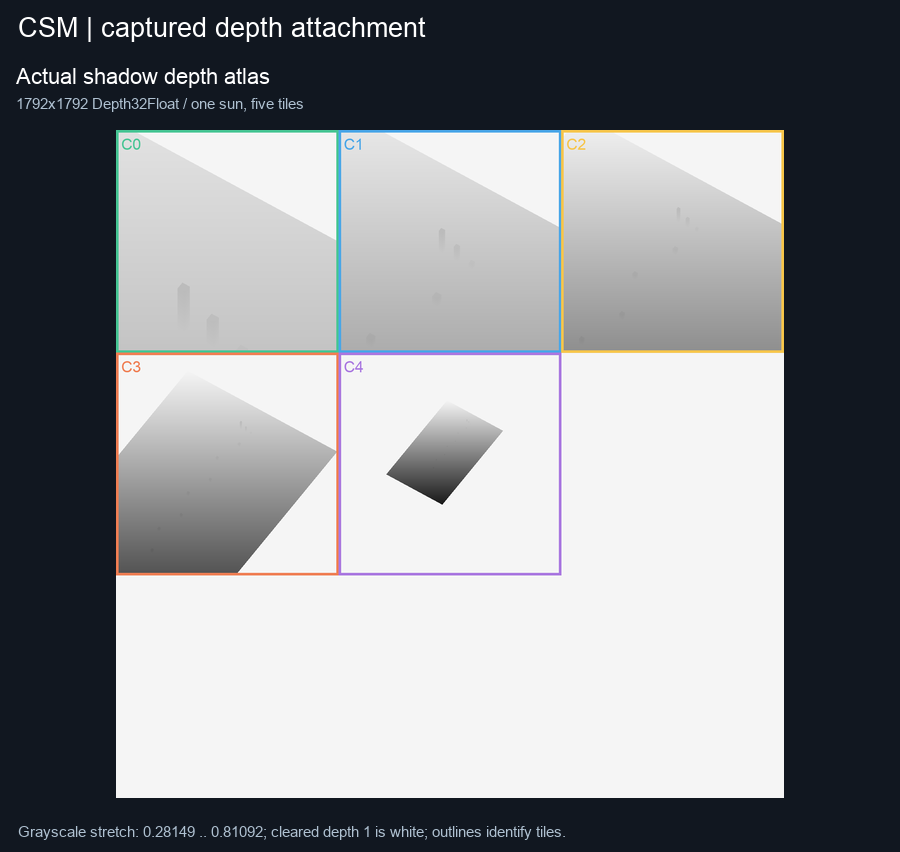

上图来自实际 **1792² Depth32Float 阴影附件**。单个太阳的五个 tile 使用 3×3 布局，每 tile 597²；彩框对应五个级联。所有 tile 使用同一灰度拉伸范围，白色为清除深度或背景。各 tile 是光空间投影，因此不会与相机画面具有相同形状。

<details>
<summary>逐级查看 CSM 深度投影</summary>

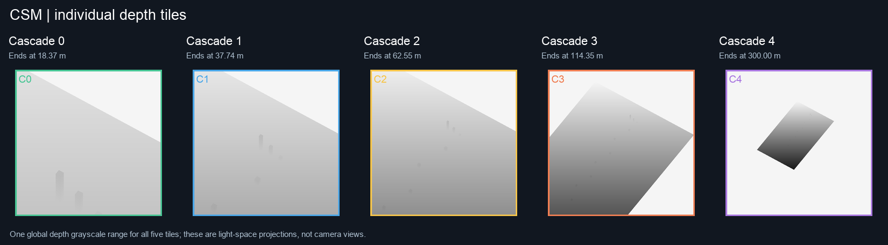

</details>

### PCSS：接触处清晰，远离遮挡物时变软

PCSS 用 24 个样本搜索遮挡物，以线性光空间深度和发光体尺寸估计半影，再进行最多 32 点圆盘过滤；小半影退回 3×3 PCF。下面保持相机、几何、材质、光照方向和曝光相同，对比 **PCF、默认太阳角半径 0.00465 rad 的 PCSS、放大角半径至 0.04 rad 的 PCSS**。PCF／PCSS 自动使用各自的图集投影保护边界。


下排为同一像素区域的局部放大。默认太阳尺寸较小，变化更细微；右列专门放大发光体以展示半影随遮挡物距离增长，**不是默认太阳配置**。这组截图验证方向光，点光源跨立方体面连续过滤尚未实现。算法、参数和此前修复见 [VT／CSM／PCSS 修复记录](vt-csm-pcss-fixes.md)。

所有图可从仓库根目录复现，无需模型资源下载；原始 GPU 缓冲写入指定临时目录，排版图及中文说明见 [效果捕获说明](render-diagnostics-gallery.md)。

```sh
./build/Scene-Renderer --classic shadow-test
./build/Scene-Renderer --render-gallery /tmp/scene-renderer-diagnostics diagnostics
python3 -m pip install numpy pillow
python3 tools/visualize_render_diagnostics.py /tmp/scene-renderer-diagnostics img/diagnostics
```

## TSAA 时域超采样抗锯齿

新 RHI 的完整场景渲染默认启用 TSAA，前向／延迟着色共用后处理。它使用 16 点 Halton 子像素抖动，在 HDR 色调映射前重投影并累积历史颜色。线性深度检查、YCoCg 邻域裁剪和自适应权重减少残影；海面使用前后两帧 FFT 位移生成运动信息，处理波浪自身运动。

GUI 的 `Enable TSAA` 可关闭此效果。场景切换、窗口尺寸、明显相机跳变以及太阳／大气参数变化会重置历史。当前 Metal 效果图均已重新生成，常规画廊每张运行 16 帧，VT／阴影诊断画廊运行 64 帧，静态表面累积 TSAA，各开关对照单独清空历史；地形视图、模型及驻留页稳定时复用确切生成几何并允许历史累积；LOD／页发生变化的地形及动态草使用 reactive 标记；历史图片仍保留历史标记。具体设计、测试与边界见 [TSAA 实现说明](tsaa.md)。

## 路径追踪

### CPU 路径追踪

`src/PT/` 通过不可变场景快照保留物体变换、纹理、法线图、金属度／粗糙度、透明裁剪和灯光。CPU 使用扁平 SAH BVH 加速求交，以 Lambert + GGX 材质追踪多次反弹；天空、有限角半径太阳和发光面使用重要性采样与 MIS。天空先由 **Metal 或 Vulkan 的实时大气**烘焙为 HDR 环境贴图，保存后可以完全在 CPU 上复用。

下面保留首次 PCG/NDF 固定采样的 CPU 图：本项目在 Apple M4 上生成的 **640×480、256 spp、最大 8 次反弹**结果，曝光为 3。当前默认采样已更新为 Sobol/VNDF 与自适应模式，见下方 GPU 与采样优化说明。阴影区仍有采样噪声，尚未加入降噪器；这些图不是收敛参考解。

| Sponza | San Miguel |
| --- | --- |
| 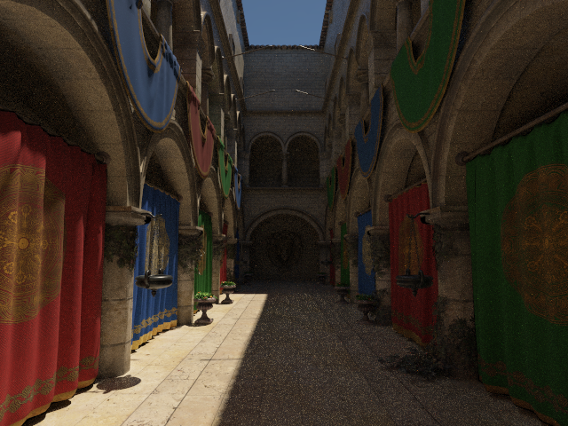 | 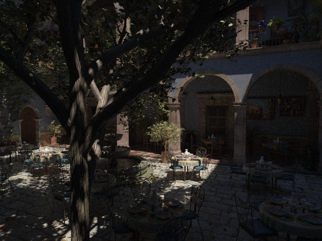 |

| 场景 | 有效三角形 | 320×240 / 8 spp 预览 | 640×480 / 256 spp | 非有限样本 |
| --- | --- | --- | --- | --- |
| Sponza | 262,266 | 1.30 秒 | 124.55 秒 | 0 |
| San Miguel | 5,602,728 | 2.04 秒 | 197.08 秒 | 0 |

预览使用 6 个 worker，最终图使用 8 个 worker。时间包括追踪期间的 checkpoint 保存，不包括模型导入、BVH 构建及首次天空烘焙；运行时存在其他开发负载，不作为严格性能基准。

从仓库根目录运行，先生成预览，再复用天空提高采样：

```sh
python3 tools/fetch_gi_assets.py

# 烘焙实时天空，生成两个场景的预览。
for scene in sponza san-miguel; do
    ./build/Scene-Renderer --path-trace "$scene" --pt-size 320x240 \
        --pt-samples 8 --pt-bounces 6 --pt-threads 6 \
        --pt-output "build/path-tracing/$scene-preview"
done

# 复用 HDR 及太阳参数，无需创建 GPU/context。
for scene in sponza san-miguel; do
    ./build/Scene-Renderer --path-trace "$scene" \
        --pt-environment "build/path-tracing/$scene-preview-environment.hdr" \
        --pt-size 640x480 --pt-samples 256 --pt-bounces 8 \
        --pt-threads 8 --pt-exposure 3 --pt-output "build/path-tracing/$scene"
done
```

输出位于 `build/path-tracing/`：渐进 PNG、线性 HDR PFM、albedo/normal 诊断图、JSON 参数记录，以及环境 HDR 和太阳参数 sidecar。前 4、16 spp 和后续每增加 32 spp 保存 checkpoint；当前每次运行从零开始。编辑器 `R` 键冻结当前场景并阻塞渲染，输出 `build/path-tracing/editor.*`。

CPU 路径支持静态 mesh 和基础 PBR；地形／草、FFT 水面及均匀介质的后续接入见下方程序化场景与次表面散射章节。实时 clearcoat／anisotropy 等特殊 lobe 的离线支持范围见专题文档。macOS OpenGL 4.1 可通过已保存的 HDR 或 `--pt-no-sky` 运行 CPU 追踪。实现、数学边界、全部参数及验证见 [CPU Path Tracing 说明](path-tracing-cpu.md)。

<details>
<summary>历史 Cornell 实验（100 spp，最大深度 10）</summary>

旧独立 Cornell 实验仍保留 `out.ppm` 路径。


</details>

### GPU 路径追踪与采样优化

新增 `--path-trace-gpu`，通过共享 RHI compute shader 在 **Metal/Vulkan** 上执行软件 BVH 遍历、材质求值、多次反弹及累积。CPU 构建 BVH 并上传冻结场景，天空由实时大气烘焙为 HDR；CPU/GPU 共用 scrambled Sobol、GGX VNDF 和自适应采样规则，CPU 另保留 PCG 对照。

| GPU Sponza | GPU San Miguel |
| --- | --- |
|  | 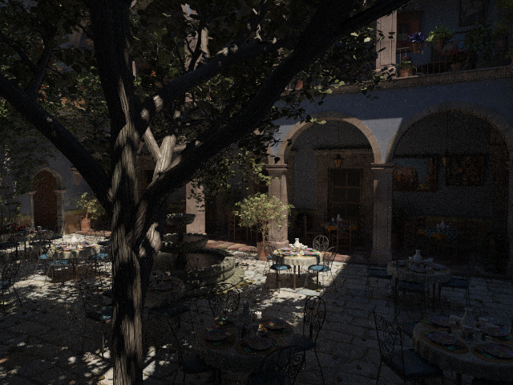 |

上图为 **640×480、256 spp 预算、16 次反弹**，实际平均采样约 245 / 220 spp；追踪耗时约 21.03 / 32.68 秒，非有限样本均为 0。阴影仍有噪声，未增加艺术提亮或降噪。

同一 Apple M4，320×240、固定 256 spp、16 次反弹、CPU 8 workers 的串行对照：

| 场景 | CPU | Metal GPU | Vulkan GPU | Metal 追踪加速 |
| --- | --- | --- | --- | --- |
| Sponza | 34.44 秒 | 5.42 秒 | 5.58 秒 | 6.35× |
| San Miguel | 52.03 秒 | 9.34 秒 | 9.47 秒 | 5.57× |

计时包括追踪期间 checkpoint 保存，排除模型导入、CPU BVH 构建及 GPU 准备；完整命令耗时和测量边界见 [GPU Path Tracing 与采样优化](path-tracing-gpu.md)。自适应模式默认最少 64 spp，连续两次满足 RGB 方差阈值后停止；这是有偏的启发式预算分配，`--pt-fixed` 可保留完整采样。Sobol 的阴影误差在此次对照中降低，但全图误差并未优于 PCG，文档保留了具体结果。

```sh
./build/Scene-Renderer --path-trace-gpu sponza --pt-size 640x480 \
    --pt-samples 256 --pt-bounces 16 --pt-exposure 3 \
    --pt-output build/path-tracing/gpu/sponza
./build/Scene-Renderer --path-trace-gpu san-miguel --pt-size 640x480 \
    --pt-samples 256 --pt-bounces 16 --pt-exposure 3 \
    --pt-output build/path-tracing/gpu/san-miguel
# 固定 spp / CPU PCG 对照
./build/Scene-Renderer --path-trace sponza --pt-sampler pcg --pt-fixed --pt-samples 256
```

JSON 新增执行后端、实际平均 spp、总样本数及 GPU buffer 负载；`*-samples.png` 展示采样分配。GPU 通过命令行运行，编辑器 `R` 键继续使用 CPU 静态渲染。

### 收敛优化与 BDPT 焦散

GPU PT 新增显式的 `--pt-guiding` 和 `--pt-cache`。Guiding 冻结训练得到的 BSDF/可见天空方向分布，以完整混合 PDF 更新 NEE/MIS；Cache 复用粗糙漫反射的深层延续贡献，是有偏的预览近似。训练时间、命中率及同耗时误差记录见 [收敛优化与焦散说明](path-tracing-convergence.md)。当前默认仍是普通 PT，不能仅凭采样数或平滑程度判断更快收敛。

新增 **CPU BDPT** 面积光参考：相机/光源子路径、连接策略 MIS、针孔相机投影和 film splat，并支持平滑玻璃 Fresnel 反射、折射及全内反射。下图是程序生成的玻璃球聚光，另有 `*-caustics.png/.pfm` 输出真实 specular-to-diffuse 路径贡献，并以无玻璃图做对照。

| BDPT 原始渲染 | OIDN 降噪 |
| --- | --- |
| 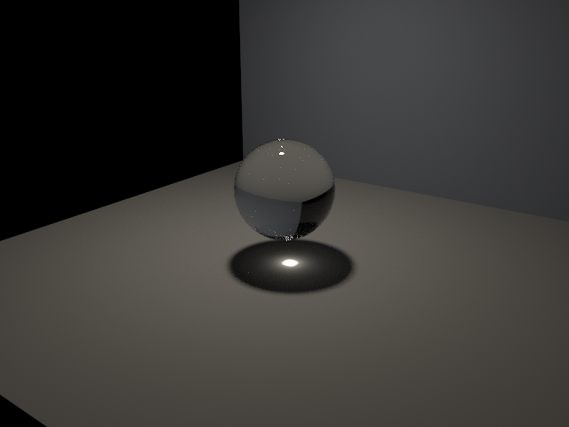 |  |

两图来自同一份 **640×480、512 spp、8 次反弹**的 BDPT 结果；右图对原始线性 PFM 做 color-only 降噪。

<details>
<summary>查看未经降噪的独立焦散路径贡献</summary>

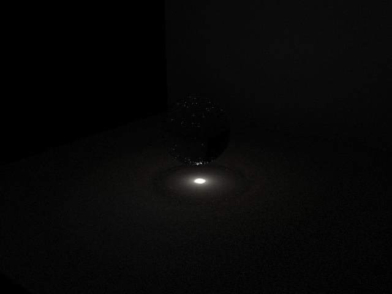

</details>

```sh
./build/pt/Scene-Renderer --path-trace caustics --pt-bdpt --pt-size 640x480 --pt-samples 512 --pt-bounces 8 --pt-threads 8 --pt-exposure 2 --pt-output build/path-tracing/caustics
```

BDPT 首版为 CPU 数学参考，支持有限面积光源、针孔相机、基础 PBR 和平滑玻璃；HDR/太阳及点光端点尚未接入，会明确报错。Metal/Vulkan 的 GPU 单向 PT 也支持这种 PT 专用玻璃覆盖；GPU BDPT 尚未实现。

### OIDN 降噪

CPU、Metal/Vulkan PT 和 CPU BDPT 可以加 `--pt-denoise` 使用 **Open Image Denoise**，在线性 HDR 上结合 albedo/normal AOV 降噪。原始 PNG/PFM 保留，降噪另存为 `*-denoised.png/.pfm`；还支持 `--pt-denoise-input FILE.pfm` 离线处理。构建方式、设备选择和焦散细节边界见 [降噪说明](path-tracing-denoising.md)。

```sh
./build/pt/Scene-Renderer --path-trace-gpu sponza --pt-size 640x480 --pt-samples 64 --pt-bounces 16 --pt-fixed --pt-denoise --pt-output build/path-tracing/denoise/sponza
```

| 场景 | 原始 64 spp | OIDN 降噪 |
| --- | --- | --- |
| Sponza |  |  |
| San Miguel |  |  |

上图为 **320×240、固定 64 spp、16 次反弹**的 Metal GPU PT，降噪使用 albedo/normal AOV；左右采用相同曝光。BDPT 焦散的原始／降噪对照见上一节。

### Stanford Dragon 透明玻璃与 BDPT 焦散

使用 [Stanford University Computer Graphics Laboratory 的 Dragon 扫描](https://graphics.stanford.edu/data/3Dscanrep/)，完整原始网格为 **871,414 个三角形**，覆盖 IOR 1.5 玻璃。下图由本项目 CPU BDPT 输出：**640×480、512 spp、12 次反弹**，保留原始渲染与 OIDN 降噪结果。

| 原始 BDPT | OIDN 降噪 |
| --- | --- |
| 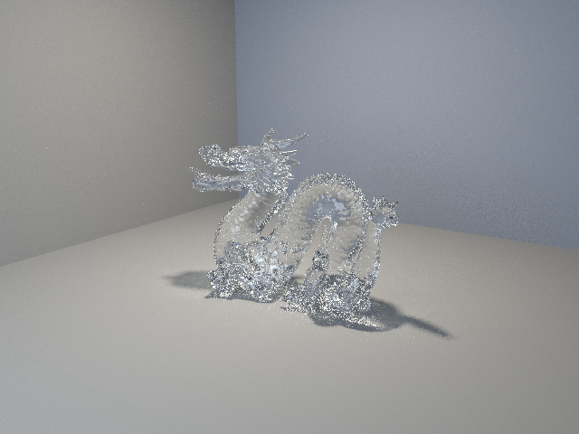 |  |

<details>
<summary>查看独立的真实焦散路径贡献</summary>

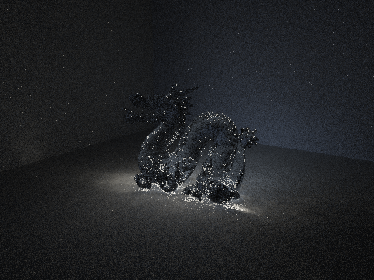

焦散图保留原始采样噪声，曝光与 beauty 相同；同网格改为不透明材质的对照中，焦散能量为 0。原扫描含小孔，未做闭合修复，因此不是严格闭合玻璃基准。模型使用条件见 [资源声明](../samples/licenses/stanford-dragon.txt)。

</details>

```sh
python3 tools/fetch_dragon.py
./build/pt/Scene-Renderer --path-trace dragon-caustics --pt-bdpt \
  --pt-size 640x480 --pt-samples 512 --pt-bounces 12 --pt-threads 8 \
  --pt-exposure 2 --pt-denoise --pt-output build/path-tracing/procedural/dragon-glass
```

### 地形与海洋的固定时刻 Path Tracing

CPU、Metal/Vulkan GPU PT 现已接入当前高度／材质 VT、沙滩 PBR、原生草丛姿态及大波／短波 FFT。湖水包含真实场景反射、IOR 1.333 折射、岸线 mask、泡沫和按路径长度计算的 RGB 水下吸收；天空由实时大气烘焙为 HDR。下图为 **640×480、time=8 s** 的实际 Metal GPU PT，经 OIDN 降噪。

| 地形与草丛，128 spp | Mountain Lake，128 spp |
| --- | --- |
|  |  |

| 湖岸沙滩，1024 spp | 浅水折射与水下物体，4096 spp |
| --- | --- |
|  |  |

2026-10-05 已用 CSM／PCSS 修复后的版本重新生成本节及页首的五张 Sponza 图片，替换旧图中地面的异常三角形阴影；相机、太阳和曝光保持一致。[问题原因、前后对照与验收](vt-csm-pcss-fixes.md#sponza-readme-旧图修正)。


```sh
./build/pt/Scene-Renderer --path-trace-gpu mountain-lake --pt-time 8 \
  --pt-size 640x480 --pt-samples 128 --pt-bounces 12 --pt-fixed --pt-denoise \
  --pt-output build/path-tracing/procedural/mountain-lake
# 改为 --path-trace 即使用 CPU 积分；FFT／草丛捕获仍需要 Metal/Vulkan。
```

默认捕获完整高度场，网格边长最多 1025；可用 `--pt-terrain-grid`、`--pt-ocean-grid`、`--pt-texture-size` 调整精度。草丛受当前视点与预算约束，默认最多 16,384 丛；`--pt-no-grass` 可以跳过。编辑器 `R` 键冻结当前时刻，随后静态渲染。水体已支持均匀 RGB 吸收、多次散射、HG 相位与介质栈，见下方 Jade Dragon 联合场景；**BDPT 水体介质连接仍未支持**，Dragon 焦散使用现有玻璃 BDPT。捕获设计、完整命令、CPU/GPU 数值对照和限制见 [Dragon／程序化 PT 说明](path-tracing-procedural.md)。

此前程序化捕获版本在 Apple M4/macOS 上通过 Metal **16/16**、Vulkan/MoltenVK **17/17** 和 ASan/UBSan **3/3** 回归；上面的实际渲染非有限样本均为 0。图片校验值、场景三角形数量、采样和耗时见 [验收记录](../img/path-tracing/procedural-validation.json)。

### 水体 BSSRDF 与 Jade Stanford Dragon

CPU、Metal 和 Vulkan PT 已支持均匀介质随机游走。水体沿实际折射路径计算 RGB 吸收、多次散射和 HG 相位；玉龙以 IOR 1.54 的介电表面进入模型，在内部散射后从其他位置出射，形成隐式 BSSRDF。独立使用原扫描的运行时修复副本，最终龙体有 871,286 个三角形；原始资源不变。

下面保留的早期平滑边界玉龙图为 **640×480、512 spp、最大深度 96** 的实际 Metal GPU PT，经 OIDN color-only 降噪。无散射对照保留相同的吸收、折射、模型和灯光。

| Jade 随机游走 BSSRDF | 关闭玉石散射的有色玻璃对照 |
| --- | --- |
| 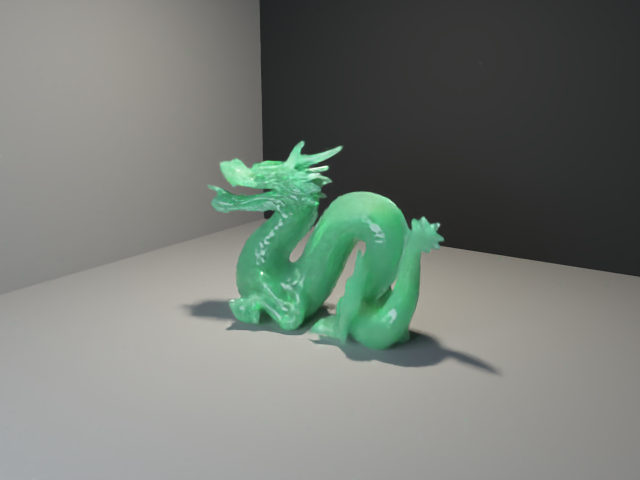 | 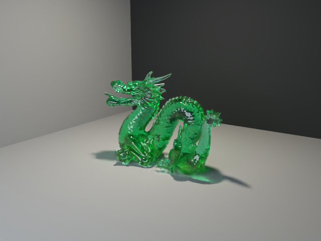 |

**玉龙位于原生 FFT 海面上**，足部部分浸水；玉石内部优先使用玉石介质，出射后再切换至水或空气。time=8 s，联合场景有 2,968,440 个三角形。新预览为 **640×480、2048 spp、最大深度 96**，使用原生水体系数、20 m 海床、2° 角半径的软太阳和 OIDN 辅助 AOV 降噪。软太阳改变光源形状，便于预览；默认真实太阳设置继续保留。

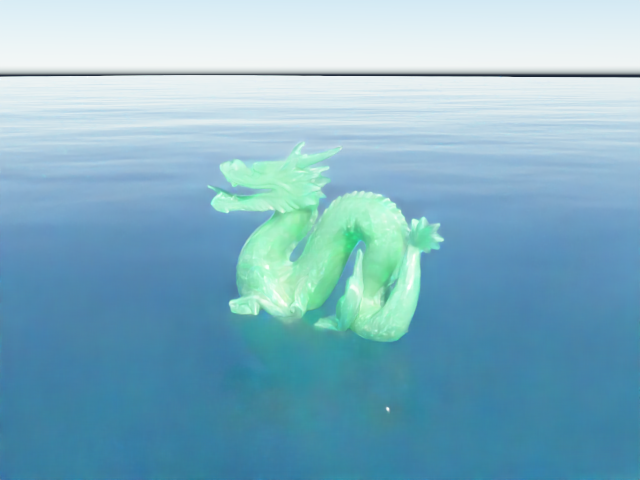

旧图的“雾”不是空气体积：浅色的两米海床、四倍水体散射和未收敛的太阳焦散被 color-only 降噪混合成云斑。关闭水体散射和 CPU PCG 对照仍出现云斑。另修复了 Sobol 不同反弹之间仅做 XOR 移位的相关性；新增解析积分与 CPU/Metal/Vulkan 一致性回归。诊断和预览参数见 [水体／玉石 PT 说明](path-tracing-subsurface.md)。

| 海面预览设置 | 旧图（伪影记录） | 新图 |
| --- | --- | --- |
| 分辨率／固定采样 | 640×480／512 spp | 640×480／2048 spp |
| 静水面至海床深度 | 2.2 m | 20 m |
| 水体散射倍率 | 4× | 1×（原生系数） |
| 太阳角半径 | 大气默认，约 0.27° | 2° 软太阳，保持辐照度 |
| OIDN 输入 | color-only | color + 预滤波 albedo／normal |

新图在 Apple M4 上追踪约 **191.8 秒**。降噪／原始积分的全图平均 RGB 比值由旧图约 **0.629** 改善为新图约 **0.984**；两图的场景参数不同，这些数值只记录降噪偏移，不构成同场景收敛或焦散能量正确性的证明。本次最终相关回归包含 CPU、介质、降噪、程序化捕获与原生天空／GPU 一致性：Metal **5/5**、Vulkan **5/5**。真实小太阳下的折射焦散仍有高方差，折射界面光源采样和体积 BDPT 待实现。

<details>
<summary>查看原始采样、旧图伪影和关闭散射诊断</summary>

| 玉龙原始采样 | 玉龙／海洋原始采样 |
| --- | --- |
| 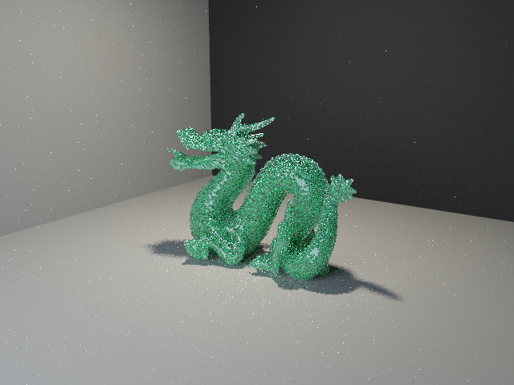 | 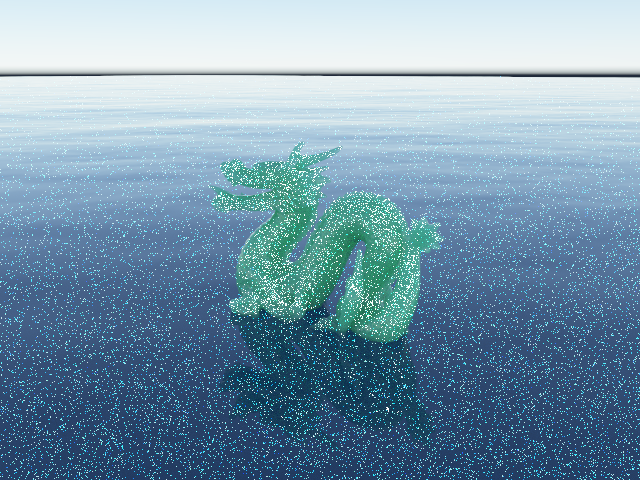 |

旧版 512 spp、浅海床、四倍散射的降噪图，保留作伪影记录：

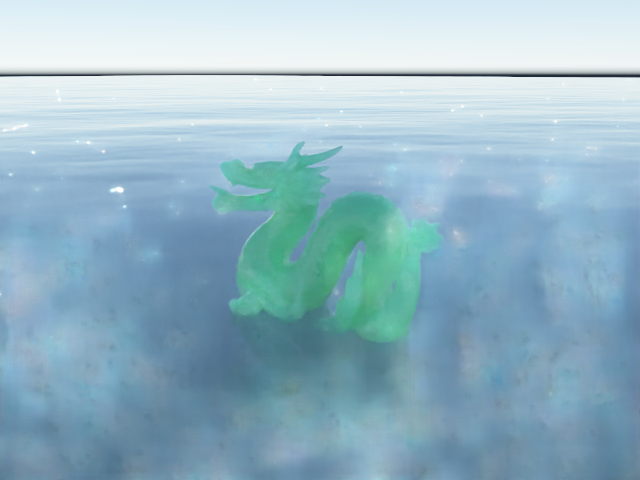

旧设置关闭水体散射仍出现云斑；该图不能与上方新场景直接比较散射能量：

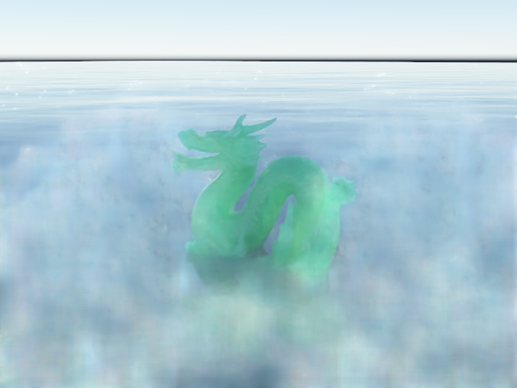

</details>

```sh
python3 tools/fetch_dragon.py
./build/pt/Scene-Renderer --path-trace-gpu dragon-jade \
  --pt-size 640x480 --pt-samples 512 --pt-bounces 96 --pt-fixed \
  --pt-no-sky --pt-sss-roughness 0 --pt-denoise-color-only --pt-output build/path-tracing/subsurface/dragon-jade
./build/pt/Scene-Renderer --path-trace-gpu dragon-jade-ocean \
  --pt-time 8 --pt-size 640x480 --pt-samples 2048 --pt-bounces 96 --pt-fixed \
  --pt-sun-radius 2 --pt-ocean-floor-depth 20 --pt-sss-roughness 0 --pt-denoise \
  --pt-output build/path-tracing/subsurface/dragon-jade-ocean-preview
# CPU：入口改为 --path-trace；Vulkan：使用 Vulkan 构建并追加 --backend Vulkan。
```

两场景默认深度 96；`--pt-sss-scale` 调整玉石自由程，`--pt-sss-scattering-scale 0` 关闭玉石散射，`--pt-water-scattering-scale 0` 关闭水体散射。当前是均匀 RGB 模型；介电边界已支持 GGX 粗糙反射／折射，玉石默认 roughness=0.22、水体默认 0；**体积 BDPT 和体积 guiding/cache 尚未接入**。材质参数、封孔、能量守恒、CPU/GPU 对照和范围限制见 [水体／玉石 PT 说明](path-tracing-subsurface.md)，原始 JSON 与图片校验值见 [次表面验收记录](../img/path-tracing/subsurface-validation.json)，新预览与雾状伪影诊断见 [诊断记录](../img/path-tracing/ocean-fog-validation.json)。

### 粗糙介电边界与半抛光玉石

CPU、Metal、Vulkan 已接入各向同性 GGX VNDF 反射／折射、精确 Fresnel、全内反射和透射 PDF，粗糙表面参与 NEE／MIS。玉龙默认 `--pt-sss-roughness 0.22`，`0` 保留平滑玻璃边界；`--pt-water-roughness` 可增加 FFT 网格未解析的微表面粗糙度，默认 `0`。

下面三图均为实际 Metal PT：**640×480、512 spp、深度 96、曝光 2、同一灯光和均匀玉石系数**，仅改变边界粗糙度，使用 OIDN color-only。半抛光改变高光与透射的方向分布；较粗糙对照更明显。内部色根、杂质与晶粒尚未建模。

| 平滑边界，r=0 | 半抛光，r=0.22 | 较粗糙，r=0.5 |
| --- | --- | --- |
|  |  |  |

<details>
<summary>查看未经降噪的半抛光玉龙</summary>

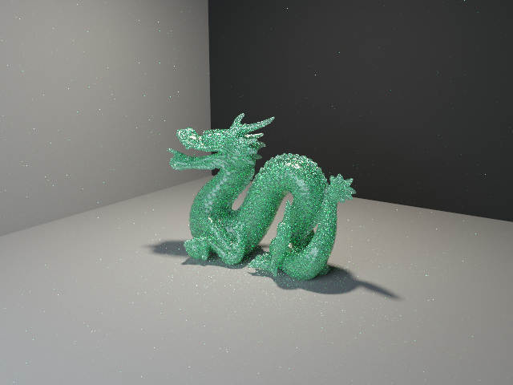

</details>

```sh
./build/pt/Scene-Renderer --path-trace-gpu dragon-jade \
  --pt-size 640x480 --pt-samples 512 --pt-bounces 96 --pt-fixed --pt-no-sky \
  --pt-sss-roughness 0.22 --pt-denoise-color-only \
  --pt-output build/path-tracing/appearance/jade-polished
# 将 roughness 改为 0 或 0.5 得到两张对照。
```

相关回归 Metal **5/5**、Vulkan/MoltenVK **5/5**，ASan/UBSan 的 CPU／介质／程序化测试 **3/3**；完整玉龙 160×120、128 spp 的 CPU/Vulkan 原始线性图逐像素 RGB 向量长度的相对 L1 为 **0.00764**、总 RGB 能量比（GPU/CPU）为 **1.00383**。单次散射 GGX 在高粗糙度下会损失能量，尚未补偿微表面多次散射；粗糙介电与体积 BDPT 仍明确拒绝。实现和数值验证见 [粗糙介电说明](path-tracing-rough-dielectric.md) 与 [验收记录](../img/path-tracing/rough-dielectric-validation.json)。[外观与加速迭代计划](path-tracing-appearance-plan.md) 第一阶段已完成，原生 GPU 求交、体积 BDPT／VCM／SMS、非均匀玉石按后续阶段推进。
