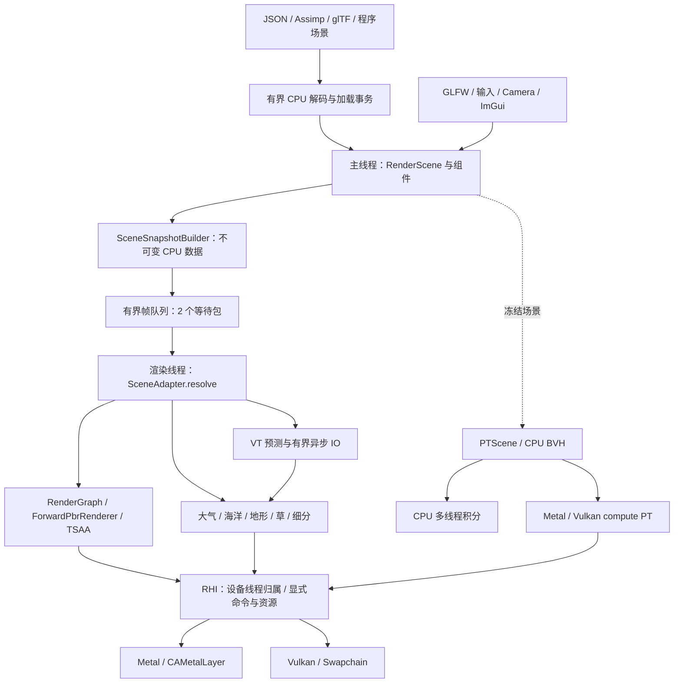
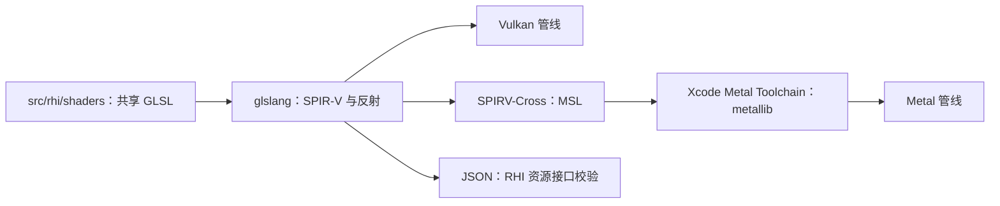

# 整体系统设计

[返回项目展示](../README.md) · [构建与运行](getting-started.md) · [技术文档索引](README.md)

## 分层与线程

项目按主逻辑、不可变场景快照、CPU 资产任务、渲染调度和 GPU 后端分层。主线程拥有 `RenderScene`、输入、相机和 ImGui，`SceneSnapshotBuilder` 准备可共享的 const CPU payload；独立 `RenderRuntime` 从有界队列消费快照，`SceneAdapter.resolve` 只在渲染线程创建 GPU 网格／材质和绘制包。`RenderManager` 保留编辑器设置及旧兼容调度。

新 Metal／Vulkan 路径直接使用 RHI 的缓冲区、纹理、管线、资源绑定和命令列表。GL 风格组件字段仍用于读取历史场景数据，但原生 GPU 效果由 `src/renderer/rhi/` 调度；旧 `RenderPass` 与 Metal GL 兼容桥只属于保留的兼容路径。RHI 后端负责资源生命周期、状态转换、上传／读回、提交及呈现，支持多个在途帧；算法与 backend 分开，CPU 路径追踪保持独立。

### 一帧如何生成

1. 主线程收集相机、几何、材质、太阳及局部灯光，复制 GUI draw data，发布不可变快照；CPU jobs 准备新资产，渲染线程接纳有预算的上传并更新地形 LOD、草和细分。
2. 统一太阳状态和观察高度；按参数缓存或更新大气 LUT，更新海洋 FFT、位移、法线与泡沫。
3. `ShadowRenderer` 渲染稳定五级 CSM、点光源六面及聚光灯阴影，按实际灯数分配 atlas，使用 PCSS 软阴影与级联重叠混合；可选捕获太阳／天空 RSM 的位置、法线与反射功率。
4. 不透明对象写入 G-buffer，计算 SSAO；全屏合成 PBR、天空与 RSM；前向模式改用共享材质公式绘制场景。前后表面深度用于近似 SSS。
5. 依据不透明深度积分并合成体积云，拷贝 HDR 场景，再绘制排序透明材质与折射／吸收／散射水面，并生成物体和海面的运动信息。
6. TSAA 在 HDR 中检查深度、重投影与裁剪历史，然后统一曝光、色调映射，绘制 ImGui 并呈现。

组件通过 weak owner 避免对象引用环，网格／材质／组件使用稳定 ID 与内容版本。RenderScene 结构、组件注册表与 owner 私有，具体类型查询采用索引；增删组件自动维护灯光索引。Transform／Light／Camera 的核心参数、Mesh／Material／Texture 的 CPU 数据、MeshRenderer 设置及大气／海洋／地形配置通过检查接口访问；配置以整组校验后提交。几何及共享图片修改自动更新内容版本，材质快照保留独立只读像素，材质标量复用图片缓存。后台任务只提交 ID／值命令，由主线程限量执行，场景替换使旧入口失效。

资源缓存合并同 key 的解码；同设备普通 GPU 图片按内容共享，空闲 LRU 默认 64 MiB，sampler 独立。静态网格与材质图片按每帧 8 MiB、每块 256 KiB 及共享 2 ms CPU 软目标增量上传，分别限制四个已分配的未完成任务；完整写入后才发布。每设备管线共享 native 对象，调用持有独立 handle，空闲 LRU 默认 64 项；Metal Binary Archive／Vulkan Pipeline Cache 支持磁盘复用，首次 cache miss 编译仍同步。

Loader 后台构建并封存 CPU staging，渲染线程准备独立 GPU 缓存和试绘。GPU ready 后才替换 CPU 世界并按 token 激活缓存；加载失败、取消或过期候选保留旧世界。RHI buffer／texture 可配置统一逻辑字节配额，超限保留上一张成功画面并重试；显式开启自动品质策略可降低 FFT、海洋网格、地形叶子及 VT 缓存规格，原始 CPU 参数不变。统计区分 RHI 逻辑字节与驱动内存，记录 CPU p95／p99、GPU 提交时间和输入采样到完成确认的延迟。

大气、海洋、阴影／RSM 进入有序 RenderGraph；编译检查逐 mip／layer 初始化、读写依赖和 transient 生命周期。Metal／Vulkan 支持指定纹理子资源上传、复制与异步读回；SSS 临时深度与场景深度在不重叠区间共用物理纹理。当前图按声明顺序执行，尚未自动重排或实现多队列调度。全部实施、验收及剩余边界见 [Engine 后续计划实施](engine-runtime-completion.md)，线程协议见 [多线程说明](engine-multithreading.md)，评价见 [设计审查](engine-design-review.md)。

`--forward` 在同一场景调度中改用前向材质光照，保留阴影、环境光、水体和后处理。核心实现见 [ForwardPbrRenderer.cpp](../src/renderer/rhi/ForwardPbrRenderer.cpp)、[SceneAdapter.cpp](../src/renderer/rhi/SceneAdapter.cpp) 与 [RenderManager.cpp](../src/system/RenderManager.cpp)。

### 统一着色器构建

[compile_rhi_shaders.py](../tools/compile_rhi_shaders.py) 在构建期生成 `.spv`、Metal `.metallib`、反射信息和 OpenGL 可用的 shader 版本。运行时按后端加载二进制及接口描述，C++ 校验统一缓冲区布局与绑定。阴影由主机分别提交各级联／六面；细分使用共享 GPU 计算生成可绘制几何，使 Metal／Vulkan 复用同一效果代码。

## 渲染技术

| 技术 | 实现与用途 | 当前边界 |
| --- | --- | --- |
| PBR 与材质变体 | 底色、法线、金属度、粗糙度、AO；各向异性、清漆层、近似 SSS、细分位移 | 新 RHI 场景前向／延迟共享材质着色公式；SSS 使用前后表面深度近似厚度 |
| 延迟与前向渲染 | G-buffer 解耦几何与光照，完整场景可切换前向着色，HDR 合成后色调映射 | 尚未实现自动曝光 |
| 阴影 | 稳定五级 CSM、重叠混合、自适应 atlas 分区；太阳／局部光 PCSS，窄半影 3×3 PCF | 默认 300 世界单位距离；有限采样及过滤半径；点光尚无跨面的连续 PCSS |
| TSAA | Halton 投影抖动、深度重投影、物体／海洋运动信息、HDR／YCoCg 历史裁剪与自适应累积 | 新 RHI 场景前向／延迟共用后处理；快速运动和透明表面仍可能模糊或拖影 |
| SSAO | 屏幕空间采样核与噪声纹理，增强接触处的遮蔽 | 不包含屏幕外几何的信息，不等同于 GI |
| RSM | 太阳方向正交投影；太阳辐照度＋大气天空漫反射 LUT；每纹素反射功率、显式采样 PDF、G-buffer 全屏合成；支持聚光灯回退 | 单个投影仅记录最近表面，天空入射未计算遮蔽；局部一次漫反射反弹，可能漏光、有采样噪声 |
| 大气与 IBL | 共享太阳状态、相机海拔、解析太阳盘；Rayleigh／Mie／臭氧、透射率、高阶散射近似、天空与 E/π 卷积 LUT | RGB 模型；太阳盘 HDR 上限 65000；未实现完整场景反射探针或环境遮挡 |
| 三维体素云 | XYZ 密度、量化保守距离场、太阳缓存、空空间跳跃／恒密度内核积分、全分辨率无历史路径 | 有限程序化云体；非气象流体求解；无稀疏体素流式 LOD |
| GPU Driven 体积云 | 程序化密度／天气图、球壳深度剔除、GPU tile 队列和间接步进、云内自遮蔽、风速历史与上采样 | RGB 散射近似；地面云阴影、IBL／RSM 天气调制和海面云反射尚未接入 |
| FFT 海洋与水体 | 共轭 Phillips 频谱、归一化二维 IFFT、主波与短波叠加、法线与 Jacobian 泡沫；深度折射、RGB 消光、近似单次散射与 HDR 光照 | 周期有限海面；折射限于屏幕空间，散射厚度是近似；不是流体求解器 |
| 地形与草 | 高度／五层材质 VT、深度 feedback／多视图预测、有预算屏幕误差 LOD、拼接与高度 morph、附着草 | feedback 可能带入包围范围内其他几何；页／LOD 变化时 reactive，尚无逐顶点前帧变形历史 |
| 模型导入 | Assimp、glTF；GI 示例增加 OBJ/MTL 材质、透明遮罩与高度图转法线 | OBJ 的传统材质参数近似转换为 PBR，玻璃／水不做真实折射 |
| CPU/GPU 路径追踪 | 冻结场景、纹理 PBR、SAH BVH、天空/太阳/发光面 NEE + MIS；scrambled Sobol、GGX VNDF、自适应采样；Metal/Vulkan compute 路径 | 冻结 mesh 与基础 PBR，支持程序化地形／FFT 水面和均匀介质；GPU 使用软件 BVH，OIDN 为可选依赖；体积 BDPT 与部分特殊 lobe 尚未接入 |

## 目录与模块

完整目录约定与依赖管理见 [仓库结构说明](repository-layout.md)，技术文档见 [文档索引](README.md)，测试入口见 [测试说明](../tests/README.md)。

| 路径 | 职责 |
| --- | --- |
| `src/main.cpp` | 程序入口、命令行、窗口与主循环 |
| `include/component/`、`src/component/` | GameObject 组件、网格、灯光、大气、海洋和地形逻辑 |
| `include/renderer/`、`src/renderer/` | 场景、材质、纹理、渲染通道 |
| `src/system/` | 渲染、输入、资源与界面管理 |
| `src/buffer/` | 顶点、索引、统一与图像缓冲区接口 |
| `src/metal/` | 退役的 Metal GL 兼容桥及历史自检；默认构建不编译 |
| `src/rhi/shaders/` | 统一 PBR、阴影、RSM、SSAO、大气、体积云、海洋、地形及 TSAA shader |
| `src/renderer/rhi/`、`src/rhi/` | 效果调度、GPU 资源、原生后端与验证入口 |
| `src/shader/` | 旧 OpenGL / Metal 兼容路径效果源码 |
| `src/engine/`、`include/engine/` | 有界任务与帧队列、资源 cache、资产 ID、render graph 与渲染线程 |
| `src/PT/` | CPU/GPU 路径追踪、冻结场景转换、Sobol/VNDF 与采样预算 |
| `tools/` | 着色器转换及可复现的资源下载脚本 |
| `tests/`、`tests/legacy/` | 当前 CMake／Python 回归与历史反射实验源码 |
| `external/`、`lib/` | 随仓库保留的第三方源码／头文件与 Windows CMake 构建所需 `.lib` |
| `samples/`、`img/metal/`、`img/path-tracing/` | 示例资产与来源清单、实时渲染与 CPU 路径追踪截图 |
| `docs/metal.md`、`docs/rsm.md` | 中文 Metal 迁移说明与太阳／天空 RSM 实现、验证说明 |
| `docs/archive/` | 早期架构笔记与开发计划，供历史参考 |
| `docs/sky-and-sun-review.md` | 历史天空问题、新 RHI 太阳／大气修复、能量与 GPU 回归 |
| `docs/engine-multithreading.md`、`docs/engine-design-review.md`、`docs/engine-followup-fixes.md` | 主逻辑／渲染分离、资源事务与快照、GPU 图片共享与修复、设计评价及下一步 |
| `docs/engine-world-commands.md` | 私有组件注册表、线程封存移交、后台值命令与 RHI 统一资源配额 |
| `docs/engine-runtime-completion.md` | 联合世界加载、图片增量上传、固定逻辑时钟、mip／layer、transient 复用、GPU feedback、磁盘管线缓存、降级与验收 |
| `docs/engine-data-boundaries.md` | 核心数据私有化、资产移交、自动版本失效、参数校验与剩余边界 |
| `docs/engine-gpu-publication.md` | 内存压力回收、候选 GPU 缓存事务、失败画面保留与恢复、成本与验收 |
| `docs/engine-streaming-and-pipeline-cache.md` | 静态网格跨帧上传、字节／用时预算、管线独立句柄与共享 native、LRU 与验收 |
| `docs/path-tracing-denoising.md` | OIDN 构建、HDR/AOV 降噪与离线处理 |
| `docs/path-tracing-convergence.md` | GPU Guiding、Radiance Cache、BDPT 与玻璃焦散验证 |
| `docs/path-tracing-gpu.md` | Sobol/VNDF、自适应采样、Metal/Vulkan compute PT、性能与误差对照 |
| `docs/path-tracing-cpu.md` | CPU 物体渲染、HDR 天空桥、两个大型场景输出与复现、数值验证及限制 |
| `docs/tsaa.md` | TSAA 重投影、海洋运动信息、历史处理与截图复现 |
| `docs/ocean-fft-and-rendering-review.md` | 海洋 FFT、高清波纹、透明与散射的修复和验证记录 |
