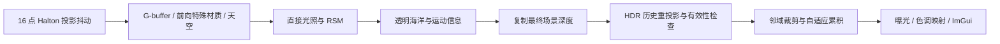

# TSAA 时域超采样抗锯齿

TSAA 在原生输出分辨率下累积不同子像素位置的采样，改善几何边缘、材质细节及海面高光的时间稳定性。延迟渲染路径默认开启，GUI 的 `Enable TSAA` 可关闭；关闭后同时停用投影抖动和历史合成。


新 RHI 更新：场景的前向／延迟着色共用 `GpuTemporal` 后处理，物体模型矩阵和海面位移提供运动信息。太阳／大气参数改变会清空历史，画廊每张独立重置后累积 16 帧。以下旧 `RenderPass` 的说明属于兼容路径；当前实现见 `src/renderer/rhi/GpuTemporal.cpp` 与 `ForwardPbrRenderer.cpp`。

## 一帧中的位置



历史存储线性 HDR 颜色及相机空间线性深度，使用两组纹理交替读写。阴影和 RSM 的光源投影保持原有计算；TSAA 只抖动实际相机投影，避免阴影投影跟着像素抖动。

独立的 `DepthPass → BasePass → PostPass` 前向路径目前不接入 TSAA。延迟路径内绘制的前向特殊材质和天空进入最终 HDR 合成，因此受到 TSAA 处理。

## 抖动、重投影和历史拒绝

使用循环的 16 点 Halton(2,3) 序列，并减去整组均值，确保抖动的平均偏移为零。像素偏移换算为投影偏移后写入相机缓冲区；历史失效时从序列起点重新开始。

静态几何从最终深度和当前抖动 VP 的逆矩阵重建世界位置，再投影到上一帧的抖动 VP。天空按方向重投影，不包含相机平移。上一帧深度与期望相机空间深度比较，使用 `max(0.03 m, 2%·depth)` 阈值，拒绝遮挡关系变化的历史。屏幕外、相机背后及 NaN／Inf 历史颜色也会拒绝。

历史颜色在亮度压缩的 HDR 空间转换为 YCoCg，再按当前 3×3 邻域的 min/max 与均值 ±1.25 标准差共同裁剪。这抑制旧轮廓、强高光和颜色变化留下的拖影。历史权重默认 0.9，开始累积时按帧数渐增；当前与历史亮度差增大时，权重进一步降低。

窗口尺寸、场景或相机实例改变、明显相机跳变、投影参数改变、TSAA 开关、主要光照和海洋参数切换会重置历史。相机平移超过 3 m 或视向变化超过约 37° 被视为跳变。连续相机运动仍通过重投影累积。

## 海洋的特殊处理

海面保存上一帧的主波和短波位移贴图。顶点阶段在同一网格点采样前后两帧位移，计算上一帧水面位置、投影坐标及相机空间深度。绘制海面时临时增加一个 MRT 附件，记录：

```text
RG = previousUV - currentUV
B  = previous linear view depth
A  = water marker
```

这样既包含相机与抖动变化，也包含 FFT 波浪自身运动。绘制完成后解除额外附件，保存位移供下一帧使用。TSAA 读取水面运动信息覆盖普通深度重投影，历史权重上限为 0.85，并按亮度差加快响应，减少泡沫、折射和高光残影。

这描述的是水面几何运动；折射背景和镜面反射的运动并不完全等于水面运动，响应权重和邻域裁剪只能近似处理。其他独立运动的网格、骨骼及草暂未提供各自运动向量，主要依赖深度拒绝和颜色裁剪，快速运动时仍可能模糊或出现拖影。TSAA 也不能保证消除所有细线和透明裁切边缘的锯齿。

## 验证

新增 25 项 Metal GPU 与状态测试，覆盖：

- 抖动序列的零均值、范围、唯一性和周期复现。
- 首帧、HDR 压缩空间中的解析混合值、屏幕外重投影、深度遮挡、海面响应权重、非法运动信息、非有限历史、邻域裁剪及大于 1 的 HDR 能量。
- 线性深度存储，以及天空重投影忽略相机平移、使用零深度标记。
- 棋盘格时间闪烁；静止海面抖动偏移与解析预期一致，波浪演化产生额外运动信息。
- 首帧和连续积累、相机跳变、渲染设置切换、窗口尺寸变化、关闭／重启 TSAA 和场景切换。

合成棋盘格在未滤波时的亮度变化范围为 1，累积后的稳定阶段范围约为 **0.259**。这是合成测试的结果，不代表所有真实场景均有相同改善。

Metal API 与着色器校验下同时执行既有 22 项海洋、5 项水体和 15 项 RSM 数值测试，并重新渲染基础与 GI 画廊，检查原始 HDR 和 TSAA 输出的有限值。三个 CTest 场景测试均通过，OpenGL 后端编译通过；真实窗口中连续运动海面和 ImGui 在双重 Metal 校验下运行了 32 帧。

验证基于 `e799ff3` 加本次改动的独立源码快照，保留工作目录中同时进行的 RHI 重构。

## README 图片复现

所有当前 Metal 示例在 TSAA 开启后累积 16 帧再导出。每个 RSM 或水体开关对照重新清空历史，使用相同的抖动序列、相机、曝光和冻结的模拟时间，避免上一个配置污染新图。基础及 GI 场景为 960×720，海洋为 1920×1080。

```sh
cmake -S . -B build -DSCENERENDERER_METAL=ON -DCMAKE_BUILD_TYPE=Release
cmake --build build -j 8
MTL_DEBUG_LAYER=1 MTL_SHADER_VALIDATION=1 ./build/Scene-Renderer --metal-self-test
MTL_DEBUG_LAYER=1 MTL_SHADER_VALIDATION=1 ./build/Scene-Renderer --render-gallery img/metal core
MTL_DEBUG_LAYER=1 MTL_SHADER_VALIDATION=1 ./build/Scene-Renderer --render-gallery img/metal gi
MTL_DEBUG_LAYER=1 MTL_SHADER_VALIDATION=1 ./build/Scene-Renderer --render-gallery img/metal ocean
MTL_DEBUG_LAYER=1 MTL_SHADER_VALIDATION=1 ./build/Scene-Renderer --render-gallery img/metal ocean-clear
```

GI 命令需要事先下载 Sponza 和 San Miguel。README 的历史资产及 CPU 路径追踪截图保留原来的历史标记，不作为 TSAA 结果。

主要代码：[`TemporalAA.cpp`](../src/renderer/TemporalAA.cpp)、[`tsaa.comp`](../src/shader/post/tsaa.comp)、[`Ocean.cpp`](../src/component/Ocean.cpp)、[`MetalTemporalAATests.cpp`](../src/metal/MetalTemporalAATests.cpp)。实现参考 [High-Quality Temporal Supersampling](https://advances.realtimerendering.com/s2014/) 与 [A Survey of Temporal Antialiasing Techniques](https://research.nvidia.com/labs/rtr/publication/yang2020survey/)。
