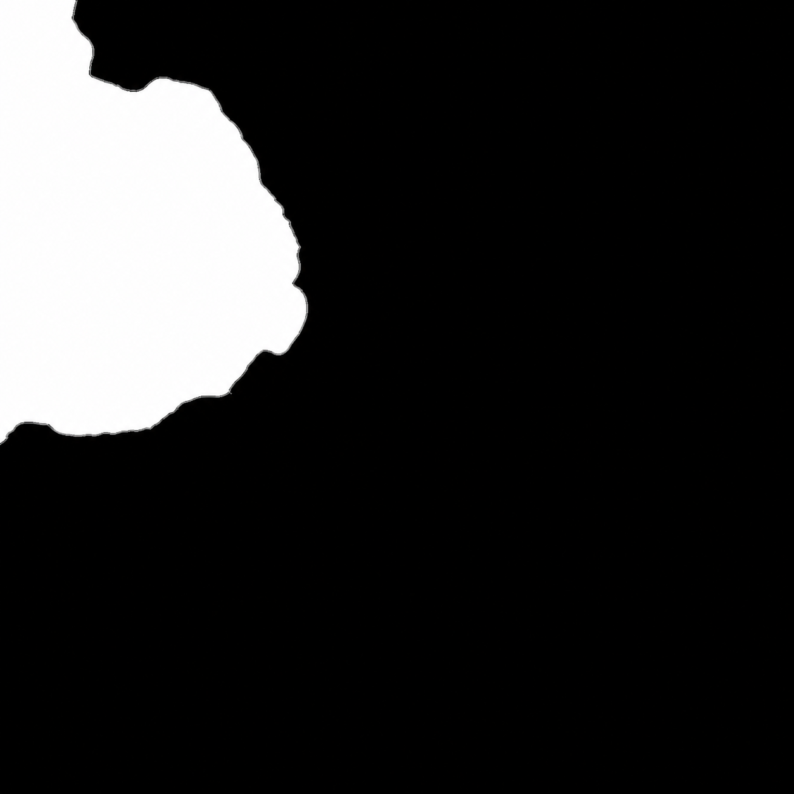

# 草地植被与 FFT 湖面改进

2026-10-04，使用新 RHI 实现，Metal 上验收。山湖资源接入、转换和上游许可见 [Mountain Lake](mountain-lake.md)。本文的截图来自引擎实际渲染；生图模型只参与水域 mask 制作。

同日后续增加沙滩材质，并将草改为近处密、远处稀疏的世界空间分布。以下保留最初修复记录，新增参数、预算策略和最新验证见 [沙滩与草地密度](beach-and-grass-density.md)。

## 修复与设计

| 原实现的问题 | 本次改动 |
| --- | --- |
| 候选统计包含屏幕外、水下和远处的草，挤占实例预算 | 计数与生成共用 `grass-placement.glsl`，先执行距离、视锥、坡度、水位、最高海拔及水域 mask 过滤，再按有效候选数限制容量 |
| 随机种子包含采样高度，VT 页到达后位置可能改变 | 使用整数地形格与子格 ID 的 hash；随机位置与风动画、页中高度值解耦。根部高度仍随实际地形更新 |
| 朝向只有 90°，单片三角形从侧面消失 | 360° 朝向；每个草丛四片细长弯叶，分段收尖，并随机改变生长尺寸，保留双面 PBR 与风弯曲 |
| 大地形每格只有 2×2 个候选，近景过稀 | 支持每格 2×2、4×4、8×8 个候选。先对整个叶块做距离预剔除，再进行细粒度过滤；距离带中同时降低密度和叶片尺寸 |
| 增加草密度后每片草重复读取四个地形角点 | 每个 16×16 工作组共享 8×8 格的 256 个角点；在 8×8 候选模式下，地形角点求值次数从每块 16384 降至 256，计数与生成各执行一次 |
| 修改草的密度或尺度也重建地形资源 | 可变标量通过 `SnapshotTerrain` 逐帧复制；这些调整保留地形与草 GPU mesh。改变实例容量或 mask 路径时重建缓存 |
| 静态水盒无波动、折射与散射 | 用现有 FFT 水面、短波法线、天空反射、折射、吸收与近似单次散射替换原盒 |
| 8 km 的湖面显示范围也充当 FFT 周期，短波缺失 | 将 `MeshLength` 与 `SpectrumLength` 分开，显示范围保留 8000，主频谱采用 512 m 周期平铺；主 FFT 512²、短波 256²、水面网格 1025² |
| 全矩形水网格包含大量陆地区域 | 构建索引时保守跳过 mask 完全为黑的网格单元；片元仍采样 mask，限定准确岸线；全黑 mask 可以安全产生零绘制 |

候选密度超过容量时，使用独立、稳定的随机阈值抽样，再用原子容量保护避免越界。实例顺序不确定；达到容量保护上限时，具体保留集合仍可能受 GPU 执行顺序影响。距离或 LOD 变化会改变候选集合，这并非持久化生态分布。

地形角点与实际地形生成共用高度 morph 和拼接规则，草根附着在同一三角形上。坡度在世界空间计算，因此非等比地形缩放也能正确限制陡坡。VT 页更新时，根部随地形变化，但整数随机种子不会因高度变化重新随机化。

## 水域 mask 与坐标

[`mountain-lake-water-mask.png`](../samples/assets/masks/mountain-lake-water-mask.png) 使用 OpenAI 内置 imagegen 编辑生成。输入是源高度场在水位 **432.236877** 以下的二值水域参考与灰度高度参考，提示模型保留轮廓、只清理岸线并作窄灰度过渡。实际输出为 **1254×1254**，未进行图片后处理；与最近邻重采样的几何参考比较，二值 IoU 为 **0.988794**。完整提示与方法保存在 [prompt 记录](../samples/assets/masks/mountain-lake-water-mask.prompt.txt)。

- 白色表示水，黑色表示陆地。FFT 片元以 0.5 为阈值，植被以 0.1 为阈值保守留出岸边。
- mask 使用地形材质 UV：`U=(source X+4000)/8000`、`V=(source Y+4000)/8000`；引擎 Z 为 `-source Y`，所以草和水都采样 `(u,1-v)`。
- FFT 的周期纹理 UV 与水域 UV 分离，mask 不会随频谱重复平铺，也不含 FFT 采样所需的半 texel 偏移。
- 水面仍接受地形深度遮挡；草同时检查实际世界高度是否高于 `waterLevel + shoreMargin`。mask 是近似岸线约束，不能代替真实湖盆高度或浅水模拟。
- CPU 图片在 I/O job 中解码，以 `shared_ptr<const ImageRGBA8>` 跨线程发布。草与水通过同一设备图片缓存复用上传；mask 不使用颜色 gamma 转换。



## 设置与运行

`Grass::settings()/updateSettings()` 在逻辑线程使用；纯值 `VegetationSettings` 随快照传给渲染线程。可控制容量、每格候选数、LOD 上限、密度、距离淡出、最小世界法线 Y、最高海拔、水位／岸边余量、宽高与 mask 路径。当前组件默认使用世界空间间距；`nearSpacing=0` 时回到这里最初的固定格采样，候选数才主要跟随地形 LOD。

山湖预设：65536 个草丛容量、10 m 内 0.15 m 间距、70 m 处 3.5 m 间距、180 m 距离、120 m 起淡出、最小法线 Y 0.8、最高海拔 1200 m、水位以上 1.5 m 才生成。海面风速 8 m/s、低波幅，不生成白沫。未配置 mask 的普通海洋维持完整矩形水面；没有水域 mask 的草仍可用水位过滤。

```sh
python3 tools/prepare_mountain_lake.py
./build/Scene-Renderer --classic mountain-lake
./build/Scene-Renderer --classic mountain-lake-ground
./build/Scene-Renderer --render-gallery img/metal mountain-lake
./build/Scene-Renderer --render-gallery img/metal mountain-lake-ground
```


## 验证与边界

隔离已有未提交的路径追踪工作，以仓库 HEAD 加本轮文件构建 Release，原生 Metal 编译成功。启用 `MTL_DEBUG_LAYER=1 MTL_SHADER_VALIDATION=1`：相关 CTest **11/11** 通过；另有资源转换和 VT 离线测试各 **3/3**。GPU 回归包括：

- 全黑／全白水域 mask 的 dry/wet HDR 对照与水面范围变化后的资源重建。
- 水下、全白水域、远距离、过陡坡、零密度、相机后方草的零实例结果；视锥关闭后的有效对照。
- 非对称 mask 的 V 方向、4×4 候选模式、间接容量界、草根高度附着、风动画根部不移动与实际实例绘制。
- 调整密度与距离保持地形／草 mesh，调整容量重建对应实例存储。
- 主逻辑／渲染双线程 120 帧山湖近景运行，以及 1920×1080 远景和近景截图。

植被目前是程序化草丛，未实现树木资产流式加载、物种生态、持久化植被区块或 impostor 树 LOD。湖面仍是深水周期 FFT，未实现浅水边界、岸线流体或山体反射。原地表色图仅 1025²，近景纹理细节和分页回退的清晰度仍受资源与缓存限制。
