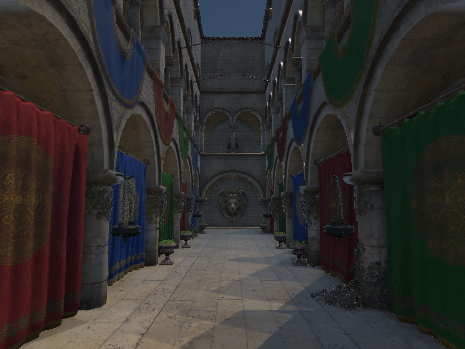

# VT 接缝、CSM 与 PCSS 修复

本次针对新 RHI 的 Metal／Vulkan 实时路径，覆盖高度／材质 VT、方向光 CSM 与方向光／局部光 PCSS。主逻辑通过帧快照传递设置。

## VT 接缝

原 apron 能连接同 mip 页，但缺页时直接切到粗 mip 祖先，会出现高度台阶、材质线及角点裂缝。现在逐级累积采样，在缺页周围按距离平滑退到祖先；宽度为本 mip 的 `4 × apron`，默认 8 texel。检查八个邻页，包括对角页，公共边两侧获得一致权重。

细页内部保留完整细节，域外不算缺页，根页固定驻留。高度继续 float32 手动双线性插值，材质使用 atlas 过滤。网格、草和前向／延迟／阴影材质共用规则。该修复为空间过渡，新页抵达尚无跨帧渐入。

## CSM 与大场景精度

原级联使用 TSAA 抖动投影，无重叠，并把完整相机远平面分给阴影。山湖远平面达 16 km，近处精度不足；固定 14×14 atlas 分区使单太阳每级仅 128×128。固定归一化 bias 在巨大深度范围下还会变成米级偏移。

- CSM 使用未抖动的相机矩阵；默认阴影距离 300 世界单位，五级划分采用 70% 对数、30% 均匀混合。
- 每级末端默认 10% 重叠混合，最后一级末端淡出。
- 投影包围球量化，光空间 XY 中心对齐 texel，预留过滤边界。
- 根据实际 tile 数划分既有 atlas；单太阳用 3×3 分区，1792 atlas 中每级 597×597，总资源尺寸不变。
- 深度范围拟合 caster 与受限阴影视锥；bias 改为世界单位，默认 0.002，并按投影换算。采样按几何接收面斜率校正。
- 透视远角点按相机射线和视深度比例求得，避免巨大 far/near 比下直接逆投影丢失精度。

实际截图还暴露了 **G-buffer 世界坐标半精度量化**：公里坐标下 float16 产生亚米至米级误差，导致阴影条纹，并破坏接收面导数。位置 attachment 与管线格式改为 RGBA32Float，其余材质 attachment 保持 RGBA16Float。每像素增加 8 字节，1920×1080 约增加 15.8 MiB；前向路径不增加该资源。

## PCSS

旧 OpenGL shader 的 PCSS 没有接入新 RHI；原新路径实际只有固定 3×3 PCF。现在前向、延迟和透明材质共享三步流程：24 个圆盘 tap 搜索 blocker，平均其**线性光空间深度**；太阳按角半径及 blocker／receiver 距离估计半影，局部光按发光半径、透视投影及线性距离估计；宽半影用 32 个圆盘 PCF tap，窄半影用 3×3。

每个 PCF tap 对四个 texel 先比较再双线性混合。搜索和过滤限制到当前 tile，接收面校正按实际采样坐标计算，无 blocker 返回可见。默认半径上限 24 texel；没有天空时太阳角半径 0.00465 rad，有天空时采用大气太阳参数；局部光半径 0.05 世界单位。

每光源保存深度元数据，级联宽度从矩阵推导。`ShadowParameters` 为 16048 字节，低于 16 KiB uniform block，原 RSM 字段偏移保留。

## 参数与边界

编辑器开启 Shadow 后可调 PCSS、Shadow distance、Cascade blend、世界单位 bias 和 Local light radius。关闭 PCSS 回到带 atlas 隔离与接收面校正的 PCF。修改参数重置 TSAA 历史。

山湖按米制解释坐标，默认 300 m 用于湖岸近景，不覆盖全部 8 km 山地；提高阴影距离会摊薄近处分辨率。PCSS 为有限采样近似，过滤上限限制宽半影。点光六面目前按面内 clamp，尚无跨立方体面的连续 PCSS 采样。

## 验证

GPU 回归覆盖高度／材质的驻留边、缺页边、对角角点、邻近缺页的公共边、细页细节、根页回退和驱逐后的采样；CSM 覆盖 TSAA atlas 一致性、16 km 相机的近处分辨率、亚 texel 平移与重叠。新增公里坐标位置精度及前向／延迟阴影对照，允许轮廓导数差异而检查整体一致性。

PCSS 覆盖正交／透视半影增长、深度线性化、atlas 边角隔离、级联分界连续，以及背后／距离外不误遮挡。原点光、聚光、alpha caster、RSM、SSAO、透明材质、resize 与编辑器回归也保留。

Metal 启用 API／Shader Validation；Vulkan 用 MoltenVK 数值回归，本机无 Khronos validation layer。测试设置 `SCENERENDERER_DISABLE_PIPELINE_DISK_CACHE=1`，不代表磁盘 pipeline cache 持久化验证。为隔离同时进行的路径追踪工作，使用基于 `4858fe2` 加本次变更的独立构建。

最终结果：Metal 全部 **16/16** 通过，耗时 34.08 s；Vulkan GPU **1/1** 通过。合成正交 blocker 测试中，近／远接收面半影像素由 12 增至 57。公里坐标下前向／延迟 HDR 差异大于 0.05 的像素为 54／9216，低于 1% 的轮廓差异容限；位置本身必须保留亚米精度。

README 山湖图片由修复后的渲染器实际生成，无 UI、固定动画时间。

## Sponza README 旧图修正

2026-10-05：README 页首及 Sponza 对照使用的 `img/metal/sponza*.png` 最后更新于 `edb0bec`（2026-10-03），早于阴影修复 `6621418`（2026-10-04）。因此 README 仍展示旧 CSM 路径的地面三角形块状阴影，即使当前着色器已修复。此次纠正的是画廊产物与代码版本不一致；没有额外改动阴影算法或调整光照掩盖问题。

| README 原图 | 当前 CSM／PCSS 重渲染 |
| --- | --- |
|  |  |

使用提交 `860ddc7` 的独立 Release 构建，在 Apple M4／Metal 上重渲染五张图片：RSM 关闭、合成、纯间接、太阳间接、天空间接。分辨率 960×720，各自清空 TSAA 历史并运行 16 帧，固定时间 8 s。相机位置 `(-8.5, 2.2, 0)`、yaw 0°、pitch 6°、FOV 58°、曝光 1.1 及原太阳配置均保持不变。现图的地面阴影轮廓连续，旧图中的大块三角形明暗切割消失；这是特定固定视角的视觉验证，不意味着全部场景阴影均无瑕疵。

Metal API／Shader Validation 下五张图均成功导出，HDR 读回检查未出现 NaN／Inf；启用与关闭校验的图片逐通道最多相差一个 8 位色阶，差异数据保存在验收 JSON。代码未变化，未为本次图片刷新新增合成测试。保留原图以便核对；所有图片都是渲染输出，没有图像修补。

RSM 关闭时平均线性 HDR RGB 为 0.0337116，合成后为 0.0356235，增量约 **5.67%**；README 数值同步更新。源版本、配置、全部图片 SHA-256 和五种贡献均值见 [验收记录](../img/diagnostics/sponza-shadow-validation.json)。均值包含背景，日志精度为六位有效数字，不是独立阴影 pass 的性能测量。

```sh
MTL_DEBUG_LAYER=1 MTL_SHADER_VALIDATION=1 \
  ./build/Scene-Renderer --render-gallery build/sponza-shadow sponza
```

## 参考

- [NVIDIA PCSS Integration](https://developer.download.nvidia.com/assets/gamedev/docs/PCSS_Integration.pdf)：blocker 搜索、半影估计与过滤。
- [Microsoft Cascaded Shadow Maps](https://learn.microsoft.com/en-us/windows/win32/dxtecharts/cascaded-shadow-maps)：级联划分、重叠与 texel 对齐。
