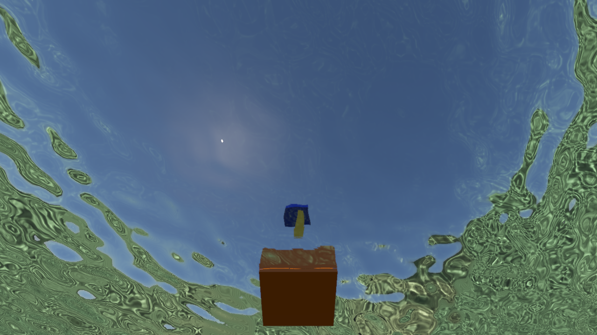
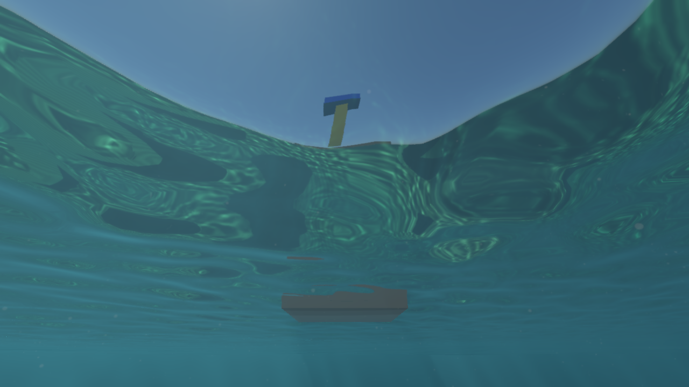

# 水下水面透明窗口与空气侧折射

2026-10-07。修复水下观察时天空缺少太阳圆盘、原相机视野外的水上物体无法进入折射的问题。潜水场景添加橙色浮体、黄色标杆和蓝色顶盖，用于检验水面上下两段的光路；散射增益从 3 调整为 1，保留原有吸收、散射系数、波浪和太阳光束。


## 折射路径

空气侧保留原相机的捕获层，优先用它获取高分辨率的近处轮廓。新增第二个空气视图，从同一眼睛位置朝上、使用 145° 垂直视野。折射光线在原捕获中找不到物体时，查询这个更宽的视图，从而恢复原相机视野外的水上几何。

水中层、原空气层、宽空气层在同一 atlas 的独立列中保存 HDR 颜色和世界坐标；阴影／材质着色仍以真实观察位置计算。DDA 对宽视图使用对应投影、视图深度和像素足迹，深度区间层级也使用各自视图。水中近处几何不会遮掉空气层。宽视图仅在启用且接近或位于水下时捕获；关闭后回到原两列布局，不读取上一帧结果。1280×720 下第三列颜色、位置、深度与层级区间约增加 43 MiB；回到水上两列布局后释放。没有额外的每帧 CPU 回读，也没有扩展已有采样槽数量。

天空照明 LUT 为避免重复太阳能量，刻意不保存太阳圆盘。界面透射现在单独加入与显示天空一致的有限角半径、HDR 和抗锯齿圆盘；照明与散射继续使用太阳照度，不把圆盘加进它们。几何命中会覆盖天空，所以浮标可以遮挡太阳。

界面仍按水／空气折射率 1.333 计算 Snell 折射与 Fresnel，再累计一次眼睛到水面的 Beer 吸收与散射。6 m 垂直水中段的 RGB 透射约为 `(0.43,0.67,0.67)`；橙色物体在深水下会失去部分红色。

## 观察与开关

- **Camera → View pitch**：新增俯仰角滑块。默认海床视角为 −8°；设为约 **68°** 可抬头检视天空和浮标，也可以按住右键转头。
- **Ocean → Wide air refraction**：默认开启。关闭可比较原视野覆盖，也减少一次几何捕获。
- **Underwater distance fog**：关闭可检查纯界面透射和物体颜色。
- **Refraction strength**、吸收／散射系数与太阳光束控制继续有效。

透明天空窗口的边界随波面法线移动。平静水面从垂直方向量起，临界角约 48.6°；更偏向水平的方向会全反射水下景物。因此潜水平视看到较多海床反射，而抬头可以看到天空。波面折射会让跨越水面的标杆在交界处发生偏移。

| 正常水体，6 m 深 | 关闭观察段水体 |
| --- | --- |
|  |  |



## 验证与性能

Metal API／Shader Validation 与 Vulkan 水体自检通过。新增回归覆盖：太阳圆盘进入最终界面透射、近临界角的折射光线命中原捕获完全不可见的物体、宽视图关闭／恢复；已有 Beer、单次眼睛光程、空气侧远距离物体、前景遮挡、全反射、波面跨越与奇数尺寸重建继续通过。独立 CPU Snell 几何参考的 52,758 个内部像素中，仅 2 个超过既定误差阈值，平均最大通道误差为 `0.00005878`。CPU 合约检查 4／4 通过。

```sh
SCENERENDERER_DISABLE_PIPELINE_DISK_CACHE=1 SCENERENDERER_GPU_PROFILE=1 \
  ./build/Scene-Renderer --render-gallery img/diagnostics/water/air-refraction dive-refraction-gallery
./build/Scene-Renderer --classic underwater-dive --size 1280x720
```

Apple M4／Metal，1280×720，每模式 32 帧，排除前 4 帧。关闭旧预览后重测主渲染提交：

| 模式 | GPU 中位数 ms |
| --- | ---: |
| 默认海床视角 | 78.66 |
| 抬头看天空／浮标，6 m 深 | 55.93 |
| 同镜头，旧散射增益 3＋仅原空气视野 | 53.11 |
| 同镜头，关闭观察段水体 | 30.43 |
| 浅水 1 m 深 | 62.35 |

抬头视角中宽空气捕获的阶段区间约 0.97 ms。阶段区间包含等待且可能重叠，不能相加或视为净成本。主提交包含捕获、场景、水体与后处理，排除单独提交的 FFT，不能直接当作完整应用 FPS。旧参数对照仍包含新浮标和太阳圆盘，且改了两个设置，属于参数对照而非完整旧版渲染或单项性能 A/B。此前一次采集与后台旧预览竞争 GPU，其时间数据已用独占预览关闭后的采集替换。

宽视图仍是屏幕空间的单深度层近似，不能恢复被空气中其他几何遮住的背面，也没有完整覆盖极接近地平线的所有方向；宽视图对象的采样精度低于原视图。当前天空透射包含大气 LUT 和太阳圆盘，尚未加入任意方向的体积云环境捕获。

[实际捕获与 GPU 样本](../img/diagnostics/water/air-refraction/underwater-dive-water-metrics.json)、[Metal 验证](../img/diagnostics/water/air-refraction/metal-validation.log)、[Vulkan 验证](../img/diagnostics/water/air-refraction/vulkan-validation.log)、[CPU 合约检查](../img/diagnostics/water/air-refraction/cpu-tests.log)。
