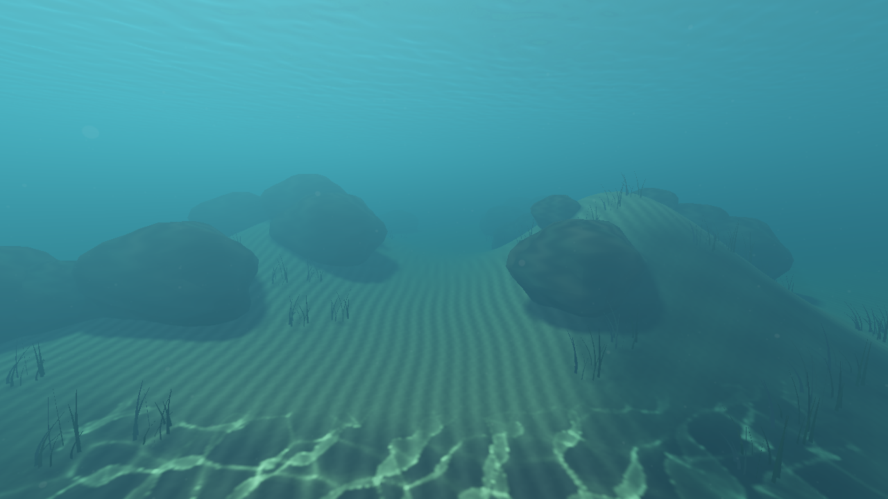
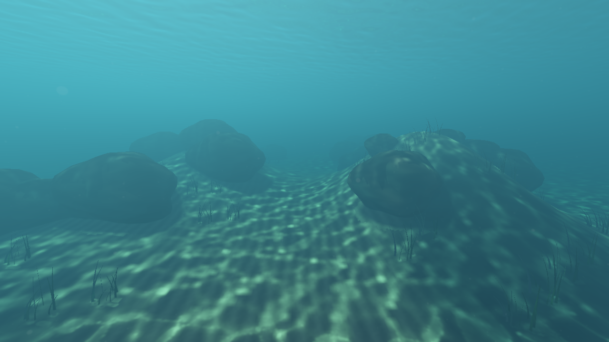
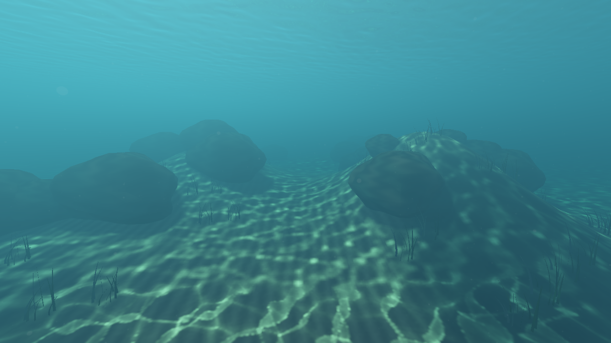

# 分级焦散与礁石接收

2026-10-07。原来的 16×16 m 焦散图只跟随相机覆盖近处地形，潜水时前方沙沟超出范围，独立礁石又因高度不匹配而没有焦散。现在使用近、中、远三层覆盖，并捕获沿入水阳光方向可见的海床、礁石和其他不透明网格。

```sh
./build/Scene-Renderer --classic underwater-dive --size 1280x720
```

| 仅近层、地形接收（模拟原限制） | 分级覆盖＋网格接收 |
| --- | --- |
|  |  |

| 分级覆盖，仅地形 | 分级覆盖＋网格接收 |
| --- | --- |
|  |  |

## 覆盖与过渡

| 层 | 接收范围 | 接收图 | 接收 texel | 光子网格 | 水面源范围 |
| --- | ---: | ---: | ---: | ---: | ---: |
| 近 | 16 m | 512² | 3.125 cm | 257² | 24 m |
| 中 | 48 m | 512² | 9.375 cm | 513² | 56 m |
| 远 | 128 m | 512² | 25 cm | 513² | 144 m |

三层放在同一张 1536×512 图集中，保持一个采样绑定，避免增加水面 fragment 阶段的 sampler 数量。各层按源网格单元独立对齐；中心使用相机沿平均入水日照方向投影到海平面的坐标，让贴近相机的海床优先落在近层。

采样从远到近，优先使用最精细的有效接收面。每层边缘的 12% 范围平滑混合到外层；混合的是照度倍率，不叠加三份光照。远层过滤源网格无法充分采样的短波法线，减少走样。它保留较大尺度焦散，远处仍会被自然的水体消光遮住。

## 接收面与光路

每层先做一个沿平均折射太阳方向的正交剪切投影，记录最近水下表面的世界位置、几何法线和深度。它相当于入水阳光方向的单层几何捕获；斜面和被斜射阳光照到的竖直岩壁都可以占据接收 texel，不再只存地形的 XZ 高度。

接收捕获复用网格与实例姿态，执行材质 alpha cutoff，跳过透明物体和海平面以上的表面。光子从真实 FFT 波面出发，按局部波面法线折射，在捕获的接收层上查找首次交点；捕获范围外仍可使用稳定地形高度场。源三角形以面积比累计太阳通量，再按接收法线、Fresnel 和 Beer 衰减归一化。跨越礁石轮廓的大高度跳变三角形被剔除，过滤也避免把岩石照度混到下方海床。

采样匹配的是接收面深度，匹配容差随层级 texel 尺寸调整。输出的接收高度存成相对海平面的值，避免 RGBA16F 在高海拔湖泊中丢失厘米级精度。焦散只调制太阳直射项；原来的阴影、环境光、水体观察段与物体材质继续参与渲染。

这是单层接收面近似，未对任意三维网格做完整光线求交。被平均日照方向遮住的第二层表面、悬挑底面和波面弯折后新显露的表面可能缺失；不包含多次反射光子、透明物体内部光路或体积焦散。源投影倍率上限 20、输出倍率上限 8，控制有限分辨率下的奇点。

## 开关与验收

Ocean 面板在 **FFT seabed caustics** 下提供：

- **Near / mid / far caustics**：开启三层；关闭后仅更新和采样近层。
- **Caustics on submerged meshes**：使用几何接收捕获；关闭后使用稳定地形。
- **Caustic strength**：整体倍率混合强度。

所有水体预设沿用这些开关；总开关仍默认只在演示场景启用。运行以下命令可复现本报告：

```sh
SCENERENDERER_DISABLE_PIPELINE_DISK_CACHE=1 SCENERENDERER_GPU_PROFILE=1 \
  ./build/Scene-Renderer --render-gallery img/diagnostics/water/caustic-cascades dive-caustics-gallery
```

固定 1280×720，32 帧／模式。输出三层照度图、礁石像素遮罩、近层限制、地形接收、关闭焦散、颗粒与水体开关、波面时间变化，以及水下／水上视角。所有 HDR 输出检查有限值。

新增 GPU 回归验证三层平面的照度接近 1，网格接收的高度和能量正确，斜面／竖直岩壁接收斜射日照，1000 m 海平面的相对深度精度，alpha cutout、网格与层级开关，以及随波面变化的焦散。既有 Beer、双向折射、全反射、太阳遮挡、TSAA 和 FFT 检查继续运行。

[Metal 验证](../img/diagnostics/water/caustic-cascades/metal-validation.log)、[Vulkan 验证](../img/diagnostics/water/caustic-cascades/vulkan-validation.log)、[GPU 与图像元数据](../img/diagnostics/water/caustic-cascades/underwater-dive-water-metrics.json)。

## 成本

固定焦散资源约 71 MiB：纹理约 41 MiB，两套共享光子三角形拓扑约 30 MiB。每帧三层各增加接收捕获、光子追踪、投射累加与归一化；没有逐帧 CPU 回读或新增 CPU 等待。关闭网格接收跳过接收捕获，关闭分级覆盖只做近层，总开关关闭时跳过整套焦散工作。

<!-- cascade-measurements -->

Apple M4 / Metal，1280×720，固定 8 s，每模式 32 帧，排除前 4 帧。主渲染提交 GPU 中位数：

| 模式 | GPU 中位数 |
| --- | ---: |
| 三层＋网格接收 | 71.82 ms |
| 仅近层＋地形接收 | 62.06 ms |
| 三层＋地形接收 | 72.34 ms |
| 关闭焦散 | 64.24 ms |

计时包含主渲染捕获、场景、水面与后处理，排除另行提交的 FFT、反馈和截屏，不等于完整应用帧率。各模式顺序采集，受热状态及 GPU 负载影响，不能将两个中位数的差当作单项净成本；同名焦散阶段的 counters 混合三层调用，且阶段区间可能重叠，不能直接相加。

只比较礁石像素内部（遮罩侵蚀 3 px），开启网格接收与地形接收模式的编码 RGB 平均绝对差为 **0.561/255**；共有 **9698** 个内部像素的最大通道差超过 2/255。固定解析波面的网格接收相位变化平均增益差为 **0.00935729**；平面基准增益约 **0.99998**。图像差用于确认功能在岩石上生效，独立夹具承担能量验证。

Metal API／GPU Shader Validation、Vulkan/MoltenVK 水体回归及四项 CPU／RHI 合约检查通过。

[图像变化量](../img/diagnostics/water/caustic-cascades/image-comparisons.json)、[CPU 合约检查](../img/diagnostics/water/caustic-cascades/cpu-tests.log)、[采集日志](../img/diagnostics/water/caustic-cascades/gallery.log)。
