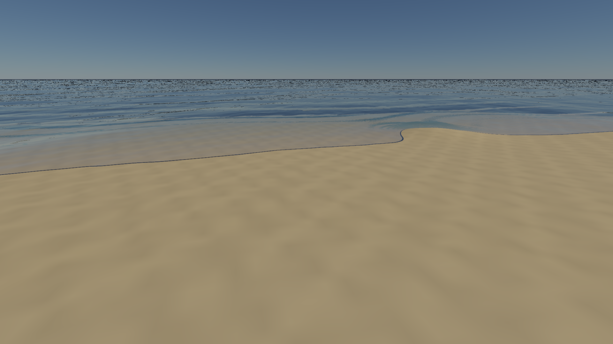
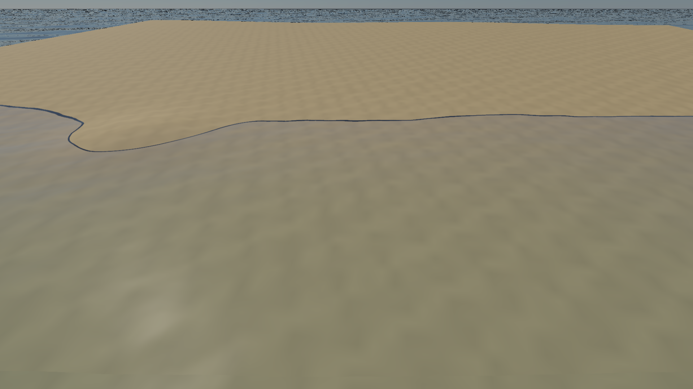
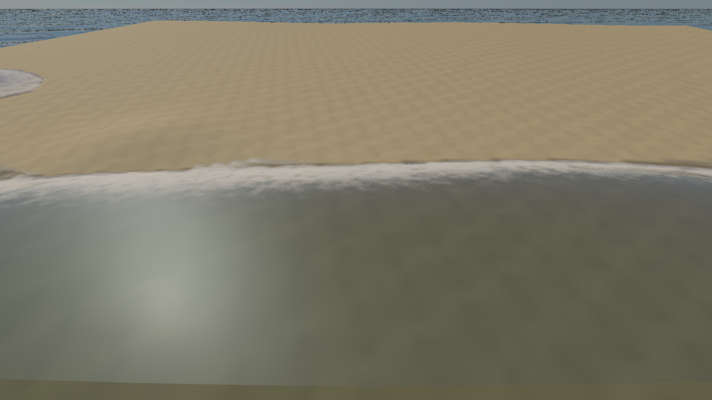
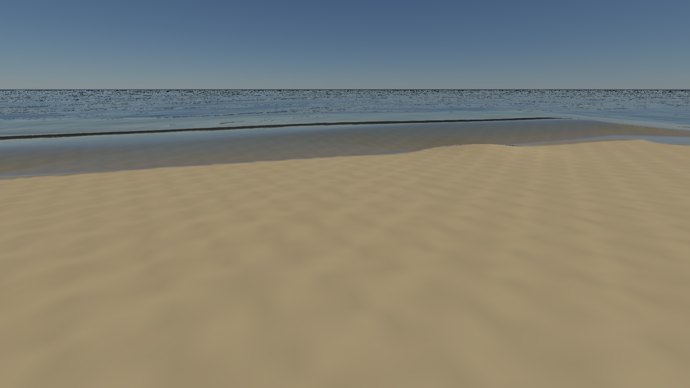
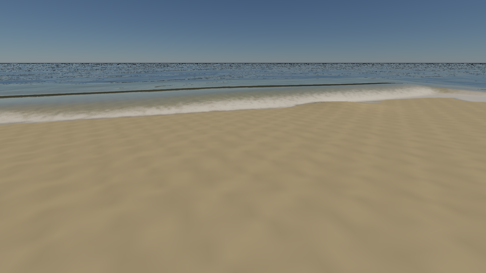
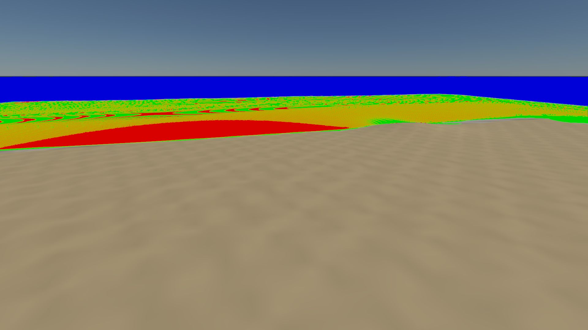
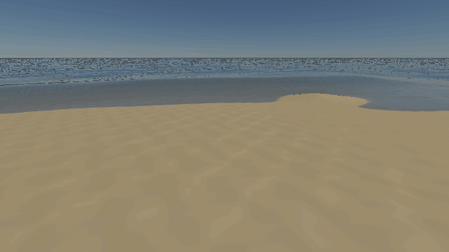
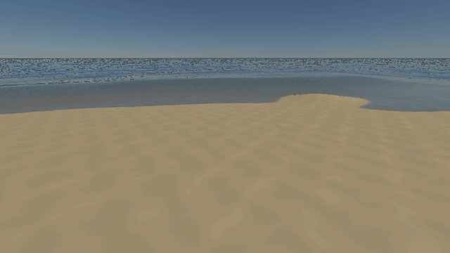

# 可开关的折射、散射与近岸水体

2026-10-06。原生 Metal／Vulkan 首版实现：透视正确屏幕折射与地形回退、局部体积多次散射、浅水波、持久泡沫、上岸／退水及湿沙。旧场景保持这些新增效果关闭；新增 `coastal-beach` 和 `coastal-water` 默认开启，使用同一海岸和光学参数。当前以正确性与可审阅画面为目标，没有 60 fps 门槛。

## 打开场景与开关

```sh
./build/Scene-Renderer --classic coastal-beach
./build/Scene-Renderer --classic coastal-water
# Vulkan 构建加 --backend Vulkan
```

在编辑器 `Ocean` 面板操作：

| 开关 | 行为与依赖 |
| --- | --- |
| `Robust refraction + terrain fallback` | 独立水下捕获的 DDA 求交、保守深度层级、命中检查；屏幕层缺失时求交稳定地形高度场。需要 `Water refraction`；屏幕 DDA 使用 `Capture underwater surfaces` |
| `Multiple scattering (slab LUT)` | 追加两次及以上散射；需要 `Integrate water volume` 和非零散射系数／散射强度 |
| `Nearshore shallow waves` | 地形海床上的局部浅水模拟；替换浅水区 FFT 长波，保留按水深衰减的短波。需要 `TerrainComponent` |
| `Persistent shore foam` | 控制近岸泡沫显示和生成，使用浅水状态；远海 FFT 泡沫由原参数控制 |
| `Wet sand + drying` | 使用浅水湿干历史调整地面颜色／粗糙度，退水后保留湿沙和残留泡沫 |

浅水分辨率、patch 范围、涌浪高度／周期／方向、泡沫强度／寿命和干燥时间均可调整。配置默认 `robustRefraction=false`、`multipleScattering=false`、`shore.enabled=false`；`shore.foam`／`shore.wetSand` 为浅水启用后的子开关。关闭浅水会停止更新并撤销动态覆盖／湿沙绑定；光学 LUT 与深度资源可以保留为缓存，开关不等于立即释放全部显存。

`Water diagnostic` 提供透射率、路径长度、命中、来源及置信度。来源：红色为屏幕捕获，绿色为地形回退，蓝色为无命中；调试图不改变光学参数。使用 IOR 1.333、折射强度 1 做物理对照。

## 实际画面

同一参数、固定动画时刻 8 s、1080p／Metal。`baseline` 使用本轮二进制，仅关闭新增折射、局部多次散射和浅水模拟，保留此前的近景网格、水下捕获及单次体积积分。静态捕获的浅水首次跳转到 8 s 时从 6 s 初始化并预演 2 s；完整时间历史见下方动画。

| 新功能关闭 | 新功能开启 |
| --- | --- |
|  |  |
|  |  |

| 关闭近岸泡沫 | 关闭动态湿沙 | 折射命中来源 |
| --- | --- | --- |
|  |  |  |

清澈水的两次以上散射贡献较小；`*-no-multiple.png` 保持相同吸收／散射参数，只关闭 LUT。增加散射系数会同时降低底面清晰度，不能通过增加内部亮度保证更透明。

固定与移动相机均连续推进 0–10 s，以 12 帧／s 保存真实 GPU 输出。GIF 为缩小后的回放，采样／播放速度不代表编辑器帧率。





## 实现与近似

**折射。** 独立水下颜色／位置层配合透视 DDA；逐像素候选检查射线距离、连续表面局部平面、深度范围和像素足迹容差。RGBA32F min/max 层级仅做保守跳过。Beer 使用验证后的射线距离；失败时尝试世界空间地形回退，仍失败则采用深水路径。置信度参与水面 TSAA 历史权重。

海床来自固定 CPU 地形源 mip，最大 1024²、端点保持，与摄像机 LOD／VT 驻留无关，包含高度与编码基础色。高度轴必须保持竖直、变换可逆。地形回退包含近似漫反射太阳／天空照明、消光及 CSM；它不复现完整 VT/PBR、细节沙滩贴图、局部灯和间接反弹，因此不同命中来源仍可能有亮度／材质差异。没有新增任意水下模型 BVH、第二深度层或硬件 ray query；屏幕层缺失的非地形物体仍不覆盖。

**局部多次散射。** `T + 单次散射 + 2+ 散射` 分解避免重复单次能量。预计算均匀黑底平面水层响应，固定 IOR 1.333，HG 各向异性；运行时把两次以上上向通量近似为各向同性出射辐亮度。太阳和天空采用各自入射能量，天空角度使用代表值，没有完整环境角度积分。

表尺寸 `16×16×5×4`：τ 在 `[0,32]` 以 `log(1+τ)` 采样，反照率在 `[0,1]` 向高值集中，g 在 `[0,0.85]`，空气入射余弦在 `[0.1,1]`。越界参数夹到表边界。每节点 2048 条路径、seed 1337、最多 256 次散射；表保存 2+／单次／底部通量与标准误。高反照率、厚层的有限路径深度仍有截断误差。生成数据存于源码，首次开启仅上传约 80 KiB，不执行昂贵的运行时预计算。

该功能是局部体积多次散射近似，不包含不同表面位置间的空间 BSSRDF、内部界面反射、高反照率沙底与介质间多次反弹，以及完整出射方向依赖。

**岸线。** GPU 有限体积浅水方程，使用静水平衡的 hydrostatic reconstruction／Rusanov 通量、湿干正性处理和底摩擦。默认 256²／128 m，单元 0.5 m；相机移动时按单元滚动并保存重叠区，补充新区域。深水用 `maxDepth=8 m` 代理，真实海床仍供光学使用。

边界输入经过 5 tap、4 m 尺度滤波的 FFT 长波和独立涌浪，8 单元缓冲带吸收过渡；FFT 动量使用主风向的浅水行波近似，未恢复每个频率的轨道速度。浅水区替换宏观 FFT 高度，短波高度与法线按水深衰减，并同步用于水下裁剪。外部粗 mask 在有效浅水 patch 内由湿干解替代，海床陆地仍阻止上岸水深为负；人工排水／障碍 mask 的额外约束尚未实现。

时间步采用速度上限 6 m/s、代理水深加 3 m 波高余量的二维 CFL 档位，默认约 4.58 ms；充分子步推进，不丢弃普通帧的模拟时间。此固定界限面向所给浅水海岸预设，不是任意压缩流／溃坝的自适应最大波速求解。大于 2 s 的跳时或倒放初始化并预演最多 2 s。离开 patch 后历史随区域退出，重新进入不保留全海岸长期湿润数据。

泡沫由浅水坡度、流动压缩及 swash 生成，按流速平流并衰减；湿润历史固定在世界空间，上岸时饱和、退水后指数干燥。当前提供高度场波浪与覆盖率泡沫；翻卷管状浪、3D 飞溅粒子、Boussinesq 色散、船体交互和完整空间 BSSRDF 保留为后续质量扩展。RSM／阴影材质 pass 仍使用此前材质路径，动态湿润的间接反弹没有同步重算。新增浅水状态也尚未接入离线路径追踪导出。

## 验证与资源

Metal API／Shader Validation 与 Vulkan/MoltenVK 水体验证通过。三个独立 seed、每点 100,000 路径的局部 LUT 对照：最大通量绝对误差 **0.00471323**，仅代表这三个测试点；所有节点非负且总逃逸能量不超过 1，纯吸收退化为 Beer，零散射不会增加多次散射。

浅水独立 32² fixture：静水高度最大误差 0，静水动量约 `2.0e-7`（Metal）／`6.6e-7`（Vulkan）；闭域质量比 1；重叠滚动、非负深度／有限状态通过；8 s 缓坡测试产生最多 254 个上岸单元、80 个退水后湿沙单元及非零持续泡沫。另验证 DDA 平面路径、无屏幕几何时的海床命中／距离、散射开关、动态 mask 与关闭后的旧状态拒绝、活动浅水 TSAA／相机滚动／47×33 resize。保留原透明度、单次散射、水下遮挡、前向／延迟、FFT、大气及 TSAA 回归。

原生 PBR／材质／地形 GPU 回归与四项 CPU 检查记录在 [验收 JSON](../img/diagnostics/water/coastal-validation.json)。两个 10 s 渲染序列记录每秒上岸、退水湿沙、泡沫、实际模拟子步和耗时；[固定相机数据](../img/diagnostics/water/coastal-motion.json)、[移动相机数据](../img/diagnostics/water/coastal-motion-camera.json)。

1080p 每水面基础捕获约 55.4 MiB；启用 DDA 层级再加约 42.2 MiB。1024² 海床 CPU／GPU 各约 16 MiB；256² 浅水状态双缓冲、泡沫／湿沙双缓冲及上一帧状态合计约 5 MiB；LUT 约 80 KiB。均为逻辑像素载荷，不含驱动对齐、FFT、场景资源、临时 uniform 或命令内存。

本机顺序测量如下，单位 ms；静态图每模式预热 4 帧、测量 12 帧，动画统计预热后 117 帧。差值受场景、初始化历史、温度与调度影响，不用来归因单个 pass 的成本。

| Metal 场景 | 主 GPU 中位数／P95 | render CPU+GPU 中位数／P95 |
| --- | --- | --- |
| 1080p 岸侧，新增功能关闭 | 73.02／95.68 | 未记录 |
| 1080p 岸侧，新增功能开启 | 89.66／111.07 | 未记录 |
| 1080p 水侧，新增功能关闭 | 69.73／71.50 | 未记录 |
| 1080p 水侧，新增功能开启 | 102.31／123.11 | 未记录 |
| 960×540 固定相机连续模拟 | 76.48／103.04 | 83.07／109.34 |
| 960×540 移动相机连续模拟 | 89.76／107.85 | 96.30／114.12 |

双线程 Metal 编辑器启用 API／GPU Validation，8 帧及 `640×360 → 641×361` resize 通过，无拒绝发布／降级画面；该短冷启动检查不作为稳态性能基准。

性能原始数据见截图 metrics 及动画 JSON。`main_gpu_ms` 覆盖主提交中的捕获、地形／材质、水面、TSAA 和 tone mapping，排除单独提交的 FFT／浅水；`render_cpu_and_gpu` 为 `render()` 到 `waitIdle()` 的墙钟时间，包含 CPU 调度与这些 GPU 提交，排除资产准备、读回／图片保存和展示。不能把主提交计时称为完整帧率，也不能从这两项相减得到纯浅水 GPU 耗时。Metal 该验收构建未指定 CMake Release；Vulkan 为 Release，两后端性能不直接比较。当前尚未提供逐 pass GPU timing。

## 复现

```sh
./build/Scene-Renderer --water-self-test
./build/Scene-Renderer --render-gallery build/coast coastal-beach
./build/Scene-Renderer --render-gallery build/coast coastal-water
./build/Scene-Renderer --render-gallery build/coast-motion coastal-motion
./build/Scene-Renderer --render-gallery build/coast-camera coastal-motion-camera
```

LUT 可独立重建：

```sh
c++ -O3 -std=c++17 -DWATER_TRANSPORT_GENERATE -Iinclude -Iexternal \
  tools/generate_water_transport_lut.cpp src/renderer/rhi/WaterTransport.cpp -o /tmp/water-lut
/tmp/water-lut > src/renderer/rhi/water-transport-lut.inl
```

主要实现：[折射与 LUT 查询](../src/rhi/shaders/water-refraction.glsl)、[浅水计算](../src/rhi/shaders/water-shore.comp)、[模拟调度](../src/renderer/rhi/GpuShoreWater.cpp)、[海床数据](../src/renderer/rhi/WaterBathymetry.cpp)、[多次散射参考](../src/renderer/rhi/WaterTransport.cpp)、[水面](../src/renderer/rhi/OceanSurface.cpp)、[湿沙材质](../src/rhi/shaders/water-wet.glsl)、[验证](../src/renderer/rhi/WaterValidation.cpp)。调研依据与尚未完成的质量门槛见 [原方案](water-refraction-bssrdf-shoreline-plan.md)；当前验收未宣称完成原建议中的任意几何覆盖、完整 PT 图像匹配或翻卷波光学。

后续的 Release 分阶段计时、第一轮优化与海面边界修复见 [性能报告](water-coastal-performance.md)。本页的早期性能表保留为功能首次实现的历史测量。
