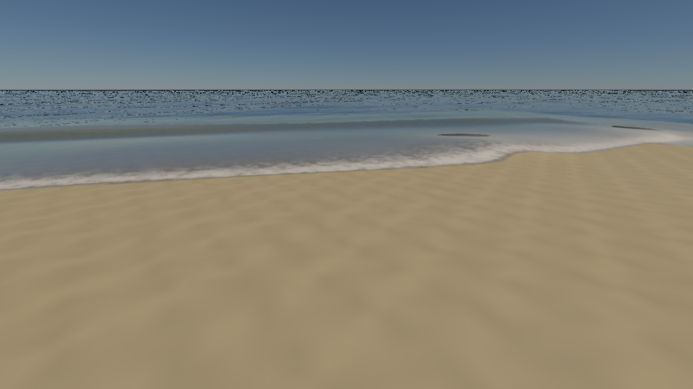
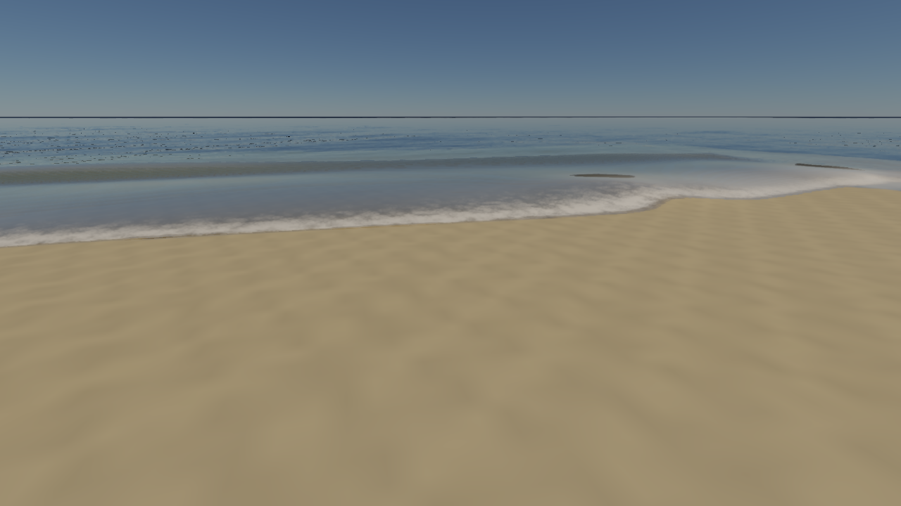

# 近岸水体：第一轮性能优化与边界检查

2026-10-06；Apple M4，macOS 15.3.1，Metal，Release。结论：720p 静止海岸完整帧延迟约减半，移动视角与高分辨率仍受地形生成及水面绘制限制。本轮保持 FFT 分辨率、海面网格、浅水步长与折射／散射／岸浪开关一致，没有靠关闭效果或降低输出分辨率取得收益。

## 视角与界面

- **按住右键并移动鼠标**旋转视角；普通鼠标移动用于操作面板。
- W/A/S/D 前后左右，Q/E 下降／上升；Shift 加速，Alt 减速；滚轮改变视场角。
- Camera 面板的 **Lock camera** 可检查／解除视角锁定。
- Info 顶部新增操作提示与实际 framebuffer 尺寸。多线程编辑器底部改用渲染线程的帧计数估计渲染 FPS；此前 ImGui 的逻辑线程刷新率会误导性能判断。该 FPS 是渲染提交速率，不能代替 GPU 阶段计时或显示器呈现速率。

输入逻辑本身要求右键按下才捕获鼠标，释放后恢复光标；按下时会清零此前累计的鼠标位移，避免突然跳转。

## 测量方法

原生 `coastal-performance`／`coastal-performance-water` 入口每组运行 40 帧，前 8 帧预热，后 32 帧统计；模拟时间从 8 s 开始，以 1/15 s 递增。关闭自动质量调节与 pipeline 磁盘缓存；两侧使用相同预设、镜头、采样序列、阴影、TSAA 与输出尺寸。移动镜头包含地形重建和浅水 patch 滚动；effects-off 仅作新效果成本对照。

完整帧延迟包括 drawable 获取、资产收集、CPU 录制、FFT、浅水、阴影、主渲染、呈现和等待 GPU 完成；截图、JSON 写入与场景首次构建不计入稳态帧计时。每帧主动等待完成，因此它是**同步帧延迟**，不能直接当作多帧并行编辑器的 FPS。

新增 `SCENERENDERER_GPU_PROFILE=1` 使用 Metal stage-boundary timestamp counters，保留原有编码器与提交边界；不拆分 pass、不逐 pass 等待。分别记录 compute、blit、vertex、fragment 和 command-buffer 时间。结果只在完成后解析；采样缓冲池复用已完成的缓冲，避免 Metal 采样缓冲数量上限。默认关闭；目前逐阶段采样仅支持符合条件的 Apple Metal GPU，Vulkan 保留空接口。

计时方式依据 [Apple：Sampling GPU data into counter sample buffers](https://developer.apple.com/documentation/metal/sampling-gpu-data-into-counter-sample-buffers) 和 [Metal Counters profiling](https://developer.apple.com/videos/play/tech-talks/10001/)。渲染阶段取 vertex 与 fragment 的区间耗时，计算阶段取 encoder 区间。**不同阶段可以重叠，以下阶段耗时不能相加得到整帧耗时，也不等于 ALU 活跃时间。**

## 同配置前后对比

单位 ms；下表为 32 个稳态样本的中位数，p95 使用排序样本的 95% 分位索引。

| 场景 | 尺寸 | 完整帧：优化前 → 后 | 延迟下降 | GPU 整次提交：前 → 后 | 完整帧 p95：前 → 后 |
| --- | --- | --- | --- | --- | --- |
| 海岸，静止镜头 | 1280×720 | 52.46 → 26.89 | 48.7% | 49.67 → 25.64 | 55.05 → 28.84 |
| 海岸，移动镜头 | 1280×720 | 66.05 → 42.11 | 36.2% | 62.98 → 40.18 | 69.06 → 44.52 |
| 朝向浅水海面的镜头 | 1280×720 | 59.38 → 37.54 | 36.8% | 56.61 → 36.20 | 60.96 → 38.97 |
| 海岸，静止镜头 | 2560×1440 | 99.69 → 57.60 | 42.2% | 96.65 → 56.09 | 102.77 → 60.30 |
| 关闭新增水体效果的对照 | 1280×720 | 42.95 → 23.59 | 45.1% | 40.46 → 22.69 | 45.76 → 24.82 |

本轮没有达到所有场景 60 FPS。新增效果开启后的最终 720p 静止场景，比 effects-off 对照增加约 3.30 ms 同步帧延迟；这是整帧差值，包含阶段重叠变化，不能归为某个单独 shader 的成本。

### GPU 各部分

静止海岸 1280×720；同名 pass 按帧汇总后取中位数。基线的 `ocean` 标签按录制顺序拆为水下捕获和水面，compute 则归为深度链；最终代码直接提供这三个独立标签。

| 部分 | 优化前 | 优化后 | 解释 |
| --- | ---: | ---: | --- |
| 512 FFT 全路径 | 22.96 | 1.91 | 含谱演化、两方向变换、位移和法线／泡沫 |
| 256 细节 FFT 全路径 | 9.99 | 0.95 | 同上 |
| 浅水子步与历史 | 4.95 | 2.33 | 相同 CFL 步长，缓存固定床面 |
| 阴影 | 38.82 | 11.00 | RSM 关闭时改为 depth + alpha cutoff |
| 地形 G-buffer | 7.40 | 5.45 | 未降网格预算；减少竞争后区间变短 |
| 水下捕获 | 5.90 | 5.93 | 独立绘制被海面遮挡的几何 |
| 折射 min/max 深度链 | 0.72 | 0.61 | 各 mip 的 compute 区间之和 |
| 水面顶点＋片元 | 10.38 | 6.64 | 层级跳步、床面射线裁剪与边界修复 |
| 直接光照 | 1.52 | 2.13 | 区间包含调度与竞争，部分阶段未随整帧同比下降 |
| 运动向量 | 3.19 | 3.85 | 同上，独立几何 pass 仍有成本 |
| TSAA | 0.77 | 0.62 | HDR 时域解析 |
| 色调映射 | 0.13 | 0.11 | 全屏后处理 |
| 呈现拷贝 | 0.05 | 0.04 | 不包含显示器扫描输出 |
| SSS back 占位 | 0.25 | 0.23 | 此预设无 SSS 材质，主要为附件成本 |
| AO raw／filter 占位 | 0.02／0.02 | 0.02／0.03 | 此预设 SSAO 关闭 |

大气与多次散射查表的首次创建在预热阶段；固定太阳／相机高度下，大气缓存不需要每帧重新积分。移动镜头最终地形 compute 区间约 **16.65 ms**；FFT 的区间也受到同时执行的地形工作影响，不能把静止镜头的 FFT 数字直接套用。

## Pipeline bubble 与提交检查

- 同步基准的主 GPU 提交从 49.67 降到 25.64 ms；CPU 主录制从 1.76 降到 0.77 ms。102 次 FFT butterfly dispatch 降为 12 次，其余谱／位移／法线生成保持原语义；总 FFT compute dispatch 从每帧 110 次降为 20 次。
- commit 到 GPU start 的中位间隔从 0.52 降到 0.23 ms；完整 GPU 提交内，未被采样阶段区间并集覆盖的时间约 0.09 ms，前后都较小。
- 这不能证明内部没有 bubble：stage-boundary 区间可能包含依赖等待、调度和内存 stall。当前证据表明，优先压缩实际工作量比单纯增加并行队列更有效；本轮没有将有依赖的计算强行并行。
- 编辑器还包含高度／材质 VT 反馈读回、UI、发布图像与呈现等额外提交。连续帧日志与原生时间戳单独保存在下面的证据文件中；不能把其中最后一个 UI／present command buffer 当作整个渲染帧。
- 最终连续编辑器运行 120 帧，实际 framebuffer 为 **1280×720**，共 481 次 command-buffer 提交。按包含 `water/surface` 的主渲染提交识别帧，去掉前 8 帧后，112 帧的主提交 GPU 时间中位数为 **26.89 ms**，主提交起点间隔为 **28.88 ms**（约 34.6 次／秒），commit 到 GPU start 为 **0.23 ms**。这是实际多线程运行的采样；起点间隔仍不等于显示器呈现 FPS。初次管线编译计入总运行时间与冷启动峰值，没有混进上述稳态中位数。
- Instruments **Metal System Trace** 实际尝试发生 `Rules engine appears to be stuck`，trace 以错误退出。该 trace 不参与定量结论；具体硬件 occupancy／带宽 stall 尚未得到有效的 Instruments 数据。

## 本轮实现

1. **共享内存 FFT**：256 线程工作组保留整行复数，在组内完成全部 Stockham 阶段。256／512 走新路径；较大 FFT 与不满足工作组限制的设备保留原逐级路径。旋转角归约到一个周期，提高随机频谱数值精度；`SCENERENDERER_FFT_REFERENCE=1` 可切回参考实现。
2. **深度阴影**：关闭 RSM 时不再计算法线／金属度／太阳与天空通量，不再每帧写三张 RSM MRT；保留纹理 alpha cutoff、VT alpha 和实例化。打开 RSM 时恢复原完整通量路径。
3. **浅水床面复用**：步进读取状态里的 proxy bed 与历史里的真实 bed；初始化和 patch 滚动仍查询床面。床面模型变换变化会使模拟不兼容并重建。
4. **折射跳步**：按当前 min/max 格子的真实出口前进，修复“跨八像素还要求留在同一八像素格”使跳步失效的问题；使用精确 texel 的 min/max，避免线性过滤破坏保守区间。高度场射线先做 XZ 域裁剪，避免远处无效床面上的 64 次搜索。

## 海面边界

浅水域外使用 sea level + 20 m 的干燥占位床面。旧合成直接对 H + bed 插值，把没有水的陆地／域外格也当作海面高度，可能出现水墙。现在先将干燥格转为渲染用高度，再插值；高度场外返回 FFT。物理状态的床面值保持原语义，避免为显示修复改变浅水通量。

远景法线与泡沫原来只采样单级实时 FFT 纹理，欠采样造成碎点；现在按屏幕 footprint 渐变到平均上向法线、衰减无法解析的泡沫。公里级网格最外缘与同一视线的天空颜色过渡，弱化有限网格硬边；它是显示域接缝处理，并非完整大气积分。近景波纹、折射和近岸区域保留。

新增 GPU 回归覆盖 wet/dry 插值、bathymetry 边界与 patch 边界，要求平静湿格和干燥占位格之间保持 0 m 海面、高度场外回到指定 FFT 高度。单张默认镜头截图不能替代这个域外测试。

| 优化前 | 最终版本 |
| --- | --- |
|  |  |

## 验证与证据

- Metal 全套 `--rhi-self-test`：开启 API Validation、GPU Shader Validation 与阶段采样；覆盖阴影／RSM／实例化、海洋、时域、VT、资源生命周期与 GPU 上传读回。
- 256／512 随机复数频谱对独立 CPU Cooley–Tukey 参考：相对最大误差 **8.53e-7／9.51e-7**；8／16 保留直接 DFT 对照，1024 保留原路径解析解验证。
- 浅水静水平衡、封闭质量比 1、滚动、湿干非负、泡沫／湿沙，以及折射平面／域外床面命中、路径长度、散射开关和奇数尺寸验证。
- CPU 的 engine-concurrency、image-decoder、RHI contract、graphics contract 四项通过。
- Vulkan／MoltenVK 水体、边界、随机 FFT 和时域验证通过；此环境没有 Khronos validation layer。叠加 Metal GPU Shader Validation 的首次尝试卡在 MoltenVK 的 Metal 调试资源表分配，CPU 采样确认尚在大气更新的 `vkDeviceWaitIdle`；关闭该调试层后正常通过。该结果是兼容性检查，Metal 原生全套测试单独开启了 API／Shader Validation。

[汇总 JSON](../img/diagnostics/water/coastal-performance-summary.json)；[GPU 对比时间线（Chrome Trace Event 格式）](../img/diagnostics/water/coastal-performance-trace.json)；[连续编辑器摘要](../img/diagnostics/water/coastal-editor-summary.json)；[连续编辑器原始时间戳](../img/diagnostics/water/coastal-editor-profile.json)；[编辑器日志](../img/diagnostics/water/coastal-editor-profile.log)；[Metal 全套验证](../img/diagnostics/water/coastal-performance-rhi-validation.log)；[Vulkan 验证](../img/diagnostics/water/coastal-performance-vulkan-validation.log)；[Instruments 失败日志](../img/diagnostics/water/coastal-metal-system-trace.log)。每组完整 40 帧的数据与两张原生截图位于 `img/diagnostics/water/performance-{before,after}-{720,moving,water,1440,effects-off}/`。

复测当前构建（会写入新的 `after` 数据；历史基线不会由脚本自动还原）：

```sh
cmake --build build --target Scene-Renderer -j 6
python3 tools/benchmark_coastal_pipeline.py --run --tag after
python3 tools/benchmark_coastal_pipeline.py --summarize
SCENERENDERER_GPU_PROFILE=1 \
SCENERENDERER_GPU_PROFILE_OUTPUT=/tmp/coastal-editor-profile.json \
SCENERENDERER_DISABLE_PIPELINE_DISK_CACHE=1 \
./build/Scene-Renderer --classic coastal-beach --size 1280x720 --frames 120
```

下一轮优先检查地形生成的 VT 高度／梯度读取、LOD 误差代理与缓存触发原因，其次是水下捕获和运动向量的重复几何绘制。地形目前用高度跨度代理误差，斜平面也会触发细分；应评估相对双线性插值的残差，配合实际几何误差验收。严格法线分布 mip 与有效硬件 counter trace 可进一步区分远景过滤质量及微观 pipeline stall。
