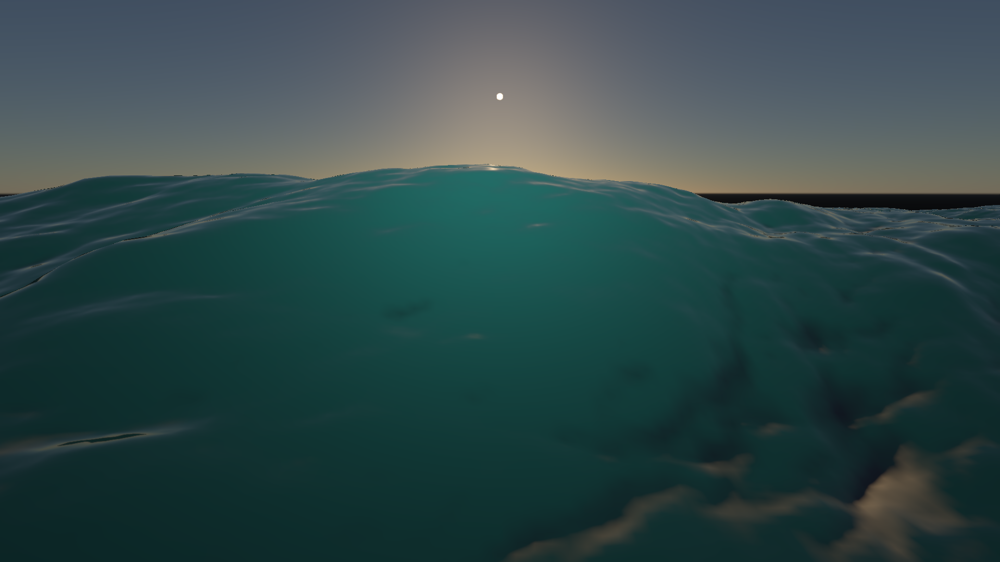
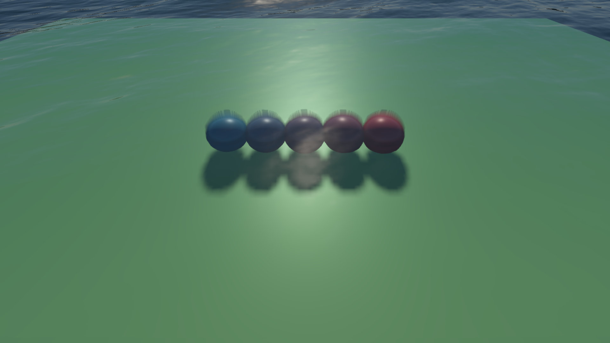
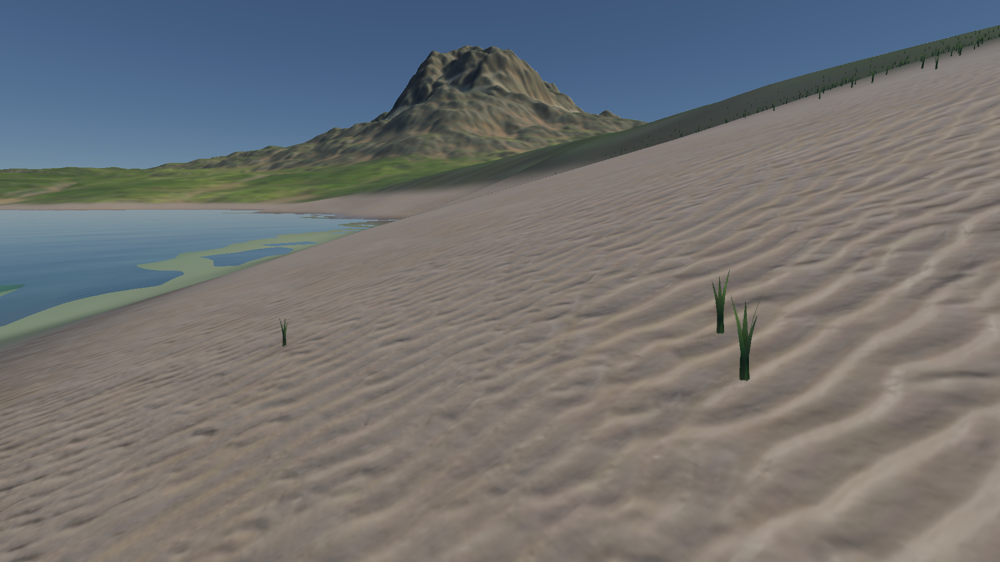

# 实时 FFT 水体升级验收

2026-10-06，Apple M4，原生 Metal／Vulkan。此次更新聚焦近景波面采样、水下透射来源及单次体积散射。截图用 Metal 实际渲染，1920×1080，固定种子 1337、模拟时间 8 秒，每张独立重置 TSAA 后累积 16 帧；相机、太阳、曝光、波谱振幅和 RGB 消光系数均沿用原场景。

## 网格与“过于平滑”

均匀海洋网格原本每格 0.5 m；山湖把 1025² 网格铺在 8 km 显示范围内，每格约 7.81 m，远粗于 512²／512 m 的 FFT 主域及 256²／32 m 的短波域。

现在用 sinh/asinh 重分布相同数量的顶点，固定整个水域边界，把样本集中在相机附近。默认 `gridFocus=8 m`，本次海洋和近岸相机附近的单元约 0.11 m。主位移按局部单元大小过滤，不能由网格解析的短波几何逐渐淡出；像素法线仍保留细节。相机移动时，TSAA 跟踪相同世界波面坐标，不把网格重分布当成水的运动。水域 mask 继续按世界位置取样。

FFT 分辨率、位移网格和像素法线是三个不同采样层。加密几何能改善近景轮廓与折射，但不会自动增加高频波谱能量：Phillips 频谱仍偏重长波，GGX 法线方差抗锯齿仍会加宽无法解析的高光。山湖保持平静预设，未通过增大振幅改变海况。

## 水下透射与散射

水面现在使用独立的水下材质颜色、位置／有效性和深度层。捕获按 FFT 波面裁掉水上片元，不依赖主 G-buffer 中最近的水上物体；前向材质也参与捕获。位置使用 nearest 采样，避免轮廓边缘产生插值出的虚假位置。原屏幕坐标缺少水下几何时，仍尝试折射射线搜索；确实无水下命中才使用深水距离。没有不透明几何的场景跳过捕获与折射搜索，并防止读取上一帧留下的捕获。

透射按 `T=exp(-(σa+σs)d)` 计算。水下表面的太阳照明包含入水 Fresnel 和太阳路径消光；表面发光单独保留。最终 alpha 为 1，因为该 pass 已完成背景透射、散射与反射的 HDR 合成。

体积散射沿水中视线分四段，每段用精确常系数 Beer 权重和中点光源。太阳源包括 HG 相函数、入水 Fresnel、光到体积点及体积点到相机两段消光，以及体积点的 CSM 阴影。主 FFT 波面反解水平位移并有限次估计太阳出水距离；厚度忽略短波，降低逐片元读取开销。天空源仍是近似环境照明。新模型的颜色由 RGB 吸收／散射系数产生，旧浅／深水艺术色只在关闭体积积分时使用。

这能模拟部分浪尖透光和水体散射效果，目前实现的是**单次体积散射**。BSSRDF 的多次散射／扩散、焦散、SSR 和水下相机尚未实现。折射仍依赖单层屏幕空间水下位置，不能恢复屏幕外或被其他水下几何遮住的表面；浅水材质球的折射轮廓仍可能重影。有限次波面求交也不适用于翻卷破浪。水下直接光的入射方向使用平面界面近似，天空环境与主场景 RSM／AO 未完整重建到隐藏水下表面。

## 同参数前后对比

“之前”为升级前的独立原生 Metal 源码快照；“之后”为本次水体改动。深海失去了旧近似中的绿色染色，表现更暗；浅水保留材质球和底面透射。近岸保持原平静波谱，因此变化较小。

| 场景 | 之前 | 之后 |
| --- | --- | --- |
| 深海 |  |  |
| 浅水 |  |  |
| 山湖沙滩 |  |  |

新深海开关对比：

| 开启短波和散射 | 关闭短波 | 关闭散射源 |
| --- | --- | --- |
|  |  |  |

## 验证与耗时

Metal／Vulkan 水体、大气、FFT 和 TSAA 回归通过。新增检查覆盖零消光保持底色、Beer 透射解析值、2 m 平面水深、独立连续单次散射参考、水上遮挡下的水下捕获、离屏太阳遮挡对体积散射的影响、空场景旧捕获拒绝、前向／延迟一致性、相机移动、resize 和黑色 mask。平面单次散射最大 RGB 误差约 `0.000146`；遮挡测试的 4096 个像素在主 G-buffer 中记录水上物体，独立捕获仍记录水下底面。

Metal API／Shader Validation 通过。GPU 插桩与旧磁盘二进制缓存组合曾在 Metal 的 archive 加载中崩溃，验收时关闭磁盘缓存后完成。CPU 的程序几何、RHI 合约及引擎并发四项检查通过。编译／验收基于 `0b9e0a2` 加本次实时水体改动的独立源码目录，未纳入工作区同时进行的 PT／AO 改动。

| 检查／场景 | 旧近似模式 | 升级后 |
| --- | --- | --- |
| Metal，640×360 平面，主渲染 | 1.368 ms | 2.002 ms |
| Vulkan，640×360 平面，主渲染 | 0.970 ms | 1.698 ms |
| Metal 1080p `ocean`，主渲染 | — | 39.04 ms |
| Metal 1080p `ocean-clear`，主渲染 | — | 48.60 ms |
| Metal 1080p `mountain-lake`，主渲染 | — | 47.53 ms |
| Metal 1080p `mountain-lake-ground`，主渲染 | — | 49.10 ms |
| Metal 1080p `mountain-lake-beach`，主渲染 | — | 45.08 ms |

640×360 平面测试交替使用两个常驻 renderer，前两帧预热、每种模式测量八帧。旧近似模式关闭近景网格、水下捕获和体积积分；它使用当前 shader 的公共修复，不是旧版本二进制的精确性能。计时为主原生渲染 command buffer，排除单独提交的 FFT。

1080p 画廊计时覆盖主渲染提交中的水下捕获、场景、水面、TSAA 和 tone mapping，排除单独提交的 FFT 及展示／截图（原文及 JSON 曾误标为包含 FFT，现已纠正口径，数值不变），前四帧预热后取十二帧中位数。每帧测量前先清空上一帧展示 fence，避免展示拷贝覆盖实际渲染耗时。测量按顺序运行；这些是 M4 的一次固定场景 GPU 测量，不等同于编辑器帧率。水下捕获增加约 55.4 MiB 附件／水面（1080p，不计驱动对齐），并额外绘制不透明材质；空深海场景不分配捕获附件。

[逐帧计时、验收与源码／图片 SHA-256](../img/diagnostics/water/validation.json)。GUI 的 Ocean 面板可分别切换 `Focus wave mesh near camera`、`Capture underwater surfaces`、`Integrate water volume`，调节网格集中尺度和 RGB 消光系数。

## 复现

从项目根目录运行原生 Metal 或默认 Vulkan 构建：

```sh
./build/Scene-Renderer --water-self-test
SCENERENDERER_DISABLE_PIPELINE_DISK_CACHE=1 MTL_DEBUG_LAYER=1 MTL_SHADER_VALIDATION=1 ./build/Scene-Renderer --water-self-test
./build/Scene-Renderer --render-gallery build/water-gallery ocean
./build/Scene-Renderer --render-gallery build/water-gallery ocean-clear
./build/Scene-Renderer --render-gallery build/water-gallery mountain-lake-beach
```

实现：[OceanSurface](../src/renderer/rhi/OceanSurface.cpp)、[波面与厚度](../src/rhi/shaders/water-waves.glsl)、[水下捕获](../src/rhi/shaders/water-capture.frag)、[水面合成](../src/rhi/shaders/ocean-surface.frag)、[独立验收](../src/renderer/rhi/WaterValidation.cpp)。频谱修复记录见 [FFT 海洋](ocean-fft-and-rendering-review.md)。
