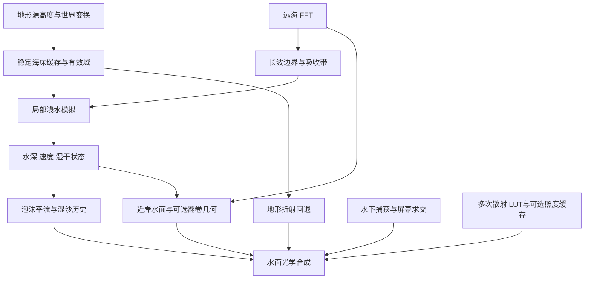

# 实时水体：折射、散射与近岸海浪审阅稿

2026-10-06 实施更新：可开关的首版折射、局部多次散射、浅水波、泡沫与湿沙已实现，实际交付及与本建议的差异见 [近岸水体功能验收](water-coastal-features.md)。本稿保留调研与质量扩展建议；空间 BSSRDF、翻卷几何与飞溅尚未实施。

2026-10-06 初稿为调研与设计；当前实施状态见上方验收链接。这里将“潜水波”理解为“浅水波”：波浪接近岸线后变陡、破碎，伴随上岸、退水和浪花。建议采用 **远海 FFT + 局部浅水模拟 + 持续泡沫 + 分层水体光学**；需要翻卷浪头时，再加入局部浪形网格。

## 需要审阅的选择

| 路线 | 折射与水体 | 岸边效果 | 成本与适用范围 |
| --- | --- | --- | --- |
| 快速视觉方案 | 改进屏幕空间求交；单次散射加局部多次散射 LUT | 水深驱动的波列、动画浪形、泡沫历史与湿沙 | 成本较低，容易控制构图；上岸退水主要是程序化动画，不能作为流体模拟验收 |
| **推荐：混合方案** | 稳健屏幕求交 + 地形回退；多次散射 LUT；厚水区域可选空间扩散 | FFT 驱动局部浅水方程，实际湿干边界；泡沫随流动；翻卷浪形作为可选层 | 成本中等，最契合现有 FFT、地形与 Metal/Vulkan 架构；需要稳定水深数据及明确耦合边界 |
| 更高物理精度 | 几何射线求交 + 低分辨率随机游走体积输运 | Boussinesq 波浪；局部三维流体处理翻卷、飞溅 | 成本高，开发和去噪难度较大；适合作为局部研究模式或离线参考 |

下文的架构、分辨率和实施次序是针对本项目的设计判断，不是引用论文的性能保证。建议先交付稳健折射、局部多次散射和浅水上岸；翻卷浪头及严格的空间 BSSRDF 单独验收。

## 现有实现的限制

| 项目 | 工作区当前实现 | 对下一步的影响 |
| --- | --- | --- |
| 折射 | 独立水下颜色／位置／深度捕获；沿折射方向均匀搜索 24 次、二分 5 次 | 单层数据缺少被水下物体遮住的背景；轮廓处深度跳变可能被误判为交点。只增加步数不能恢复缺失几何 |
| 光学 | RGB Beer 消光、四段单次体积散射、HG、太阳入水与 CSM 阴影 | 已有基础水体输运；多次散射和跨位置传输仍需另外估计 |
| 泡沫 | FFT 压缩 Jacobian 生成即时覆盖率 | 没有漂移、寿命、退水残留和岸线破碎源 |
| 岸线 | 静态二值水域 mask，低于阈值直接 discard | 波浪无法越过原岸线；mask 没有连续水深，也没有上岸／退水状态 |
| 波面 | FFT 位移高度场，有限次反解水平位移及太阳出水距离 | 适合普通浪面；不能表示同一水平位置上的翻卷内外表面 |

代码依据：[水面合成](../src/rhi/shaders/ocean-surface.frag)、[波面求交](../src/rhi/shaders/water-waves.glsl)、[水下捕获资源](../src/renderer/rhi/OceanSurface.cpp)。已有成果及测量见 [实时水体升级验收](water-realtime-upgrade.md)。

还有一个资源限制：山湖原高度场是 **1025²／8 km，约 7.81 m 一个样本**，水域 mask 约 6.38 m 一个像素。2048 的 VT 存储尺寸只是重采样。把浅水模拟加密到 0.5 m，并不会补出沙滩坡度、浅滩或礁石的真实细节。需要新增可控的高精度海岸测试场景，并为山湖近岸补充高度数据或明确标注的人工岸坡细化。依据：[山湖资源](mountain-lake.md)、[水域 mask](vegetation-and-lake-water.md)。

## 调研：可借鉴的成熟方法

| 一手资料 | 方法及可借鉴部分 | 本项目采用方式与边界 |
| --- | --- | --- |
| [UE Single Layer Water，当前官方文档](https://dev.epicgames.com/documentation/unreal-engine/single-layer-water-shading-model-in-unreal-engine) | 在专用水体 pass 中组合表面反射和介质吸收／散射，读取水下颜色及深度；支持降采样 | 延续现有水体合成结构，增加质量档位；这种水体模型不等于完整空间 BSSRDF |
| [McGuire、Mara：Efficient GPU Screen-Space Ray Tracing，JCGT 2014](https://jcgt.org/published/0003/04/04/paper.pdf) | 透视正确的屏幕 DDA，避免均匀世界步进遗漏／重复屏幕像素；讨论多深度层 | 用于折射求交；另外设计保守深度层级和命中置信度。屏幕外信息仍需要几何回退 |
| [Horizon Forbidden West 水体，Guerrilla／SIGGRAPH 2022](https://advances.realtimerendering.com/s2022/SIGGRAPH2022-Advances-Water-Malan.pdf) | 动画波浪横截面压成变形纹理，沿受控波前实例化，生成翻卷几何；最终横截面使用手工动画曲线 | 可做高质量翻卷浪头；无需先引入 Houdini。它是动画／烘焙驱动的混合方法，不是全场实时三维流体 |
| [Celeris，Tavakkol、Lynett，2017](https://arxiv.org/abs/1611.05984) | GPU 上的扩展 Boussinesq 求解，支持移动岸线，并有破碎／非破碎波基准 | 作为近岸水动力和验收参考。其 Direct3D 实现不能直接搬入现有 RHI；首版建议更简单的局部非线性浅水求解器 |
| [Wave Particles，Cem Yuksel 等，SIGGRAPH 2007](https://www.cemyuksel.com/research/waveparticles/) | 波粒子表达和传播波面扰动，处理边界反射及物体交互 | 可用于波前或船尾波；涉及水量输运与湿干岸线时，建议优先浅水方程 |
| [PBRT：BSSRDF 定义](https://www.pbr-book.org/3ed-2018/Volume_Scattering/The_BSSRDF)、[扩散近似](https://www.pbr-book.org/3ed-2018/Light_Transport_II_Volume_Rendering/Subsurface_Scattering_Using_the_Diffusion_Equation) | BSSRDF 总结不同入射／出射表面位置之间的介质传输；扩散适用于足够厚、散射充分的介质 | 区分局部多次散射与空间传输。清澈浅水和薄浪尖不能统一套用厚介质扩散 |
| [Christensen、Burley：Approximate Reflectance Profiles，Pixar 2015 作者资料](https://www.seanet.com/~myandper/abstract/memo1504.htm) | 用简洁的径向分布近似次表面反射，便于实时核估计 | 仅作为厚介质空间核的候选起点；需要用本项目的水体参数重新拟合，不能直接使用皮肤参数 |

这些资料覆盖当前引擎实践和仍适用的基础方法；论文年份不代表它们是 2026 年新算法。本稿没有用厂商示例的帧率推断本项目性能。

## 1. 折射：先保证交点正确，再提高覆盖率

**第一层：屏幕空间求交。** 保留独立水下捕获，把 24 次均匀步进替换为透视正确 DDA。建立有效性与线性深度的保守 min/max 层级，对长射线跳过空区；轮廓附近回到逐像素验证。候选交点必须同时通过射线深度区间、位置到射线的距离、表面连续性和水下有效性检查。深度容差从像素投影尺度和几何斜率计算，不能用大厚度把背景全部当作命中。

返回 `hit position / ray distance / confidence / source`。Beer 距离使用通过检查的射线交点，而不是任意 UV 样本到水面的欧氏距离。低置信度命中使用可靠回退；折射历史遇到遮挡变化、出屏、不同对象或水深变化时失效。提供交点、置信度和来源调试图，便于识别重影来自何处。

**第二层：世界空间海床回退。** 对屏幕外或屏幕层缺失的地形，沿折射射线与共享高度场求交，在实际世界交点取沙滩／海床材质并重新计算水下照明。不能沿用原屏幕像素的颜色。该路径覆盖地形，不覆盖被遮住的任意模型；材质 VT 缺页时采用一致的低 mip。

任意水下物体仍需额外深度层或几何 BVH。第二层捕获可以作为质量档，但先压缩现有 RGBA32F 世界位置为可重建的线性深度，并测量实际收益。工作区 PT 的 compute BLAS/TLAS 可提供设计参考；当前实时 RHI 未暴露完整原生 ray-query 接口，不能把硬件光追当成已有功能。

**法线与参数。** 折射方向使用与像素足迹匹配的波面法线，保留真实可解析波纹；反射可使用更细法线。物理验收固定 IOR=1.333、折射强度=1，不能通过减小折射强度掩盖轮廓错误。掠射角折射覆盖率下降时采用有置信度的过渡。屏幕 UV warp、加密 mesh、降低透明度都不能独立修复错误交点。

## 2. 实时估计 BSSRDF：分两级交付

“水不太透明”需要同时观察水深、吸收、散射和命中情况。深水中实际透射很低是合理现象；提高散射会增加内部亮度，也可能降低背景清晰度。建议先用 0.2／1／3／10 m 水深和统一光学参数建立对照，避免把所有水体调成同一种青色。

### A：默认的局部多次散射估计

将输运拆成 **未散射透射 + 已有单次散射 + 两次及以上散射**，避免重复加光。用离线 Monte Carlo 在均匀平面水层中预计算多次散射响应，运行时查表。

LUT 的参数至少涉及光学厚度、单次散射反照率、HG 各向异性和光源／观察角度。首版固定 IOR，提供有限的 `g` 预设；采用厚度／反照率／入射角表及离散角度切片。若进一步把多次散射近似为各向同性，必须记录这个简化，不能声称一个任意三维 LUT 已覆盖完整角度响应。太阳与天空分开估计，输入采用线性 HDR 辐照度。

有效水层厚度来自海床和宏观波面，清澈、极薄或超出拟合范围时退回原有输运。首版黑色底边界 LUT 只估计介质贡献，水下底面仍走现有透射；高反照率海床与介质之间的多次反弹作为明确遗漏项，另设白沙对照评估。也不把浪峰高出静水位的高度当成全部水体厚度。

这一级可改善水体内部的柔和亮度，是**局部体积多次散射近似**。它不会自动产生不同浪面位置之间的空间传输，因此不能单独称为完整 BSSRDF。

### B：可选的空间 BSSRDF 近似

在稳定的世界空间水面 patch 上存储入射照度，对满足光学厚度和散射条件的区域应用拟合扩散核。核受水深、岸线、表面归属和遮挡约束，估计从相邻位置进入后在当前表面出射的光。零散射时权重归零；薄浪尖、浅水和破浪边界使用单次输运或更直接的局部随机游走参考。

这条路径是受限的非局部近似，仍不能精确表示强前向散射、复杂翻卷和细小阴影。不要模糊最终屏幕颜色或水下材质颜色来模拟 BSSRDF，这会把物体纹理和岸线一起抹掉。若审阅目标是接近 PT 的任意空间传输，则另做低分辨率随机游走加时间重建，增加几何边界表示与去噪工作。

现有 [PT 均匀介质与随机游走](path-tracing-subsurface.md) 可提供光学参数和独立参考。LUT 拟合需输出无降噪线性结果、采样方差及散射阶数分解，不能用 OIDN 后的外观作为能量真值。

## 3. 岸边海浪：波面、浪花与湿沙共享水动力

### 共享地形与水深

新增与相机无关的局部海床缓存：`bed height / still-water depth / shoreline distance / domain validity`，数据来自地形源高度和模型变换。距离场仅辅助波前方向和区域分配，实际流体使用海床高度。VT 缺页用固定粗层回退，更新时版本化并平滑切换，避免移动相机或换页凭空制造波浪。

原 mask 改为可容纳上岸范围的粗水域／障碍约束；最终湿干边界由水深决定。不能简单取消整个 mask，否则会淹没不相关区域。新 `coastal-beach` 测试场景包含缓坡沙滩、斜向入射、浅滩和一个礁石，提供精确几何；普通 `ocean` 场景没有海岸地形，需要新增该场景才能验收交界效果。

### 局部浅水模拟

首版用 256² patch，覆盖 128–256 m，约 0.5–1 m 单元；先做固定 patch，再支持相机附近的稳定网格滚动。状态为非负水深 `H` 与水平动量 `Hu/Hv`，采用守恒有限体积、静水平衡和湿干处理；时间步受二维 CFL 条件约束。深水不纳入精细模拟，不能固定少量子步后忽略稳定条件。

FFT 只向外边界输入可由浅水模型解析的长波高度和一致流速，配合吸收缓冲带。过渡区以同一低频基底做替换／差值混合；短波保留为细节，按水深与网格解析能力衰减。直接把全量 FFT 位移和全量浅水解相加会重复波能并形成接缝。

这能表达近岸传播、上岸、退水和高度场形式的破碎跃变。非线性浅水方程缺少完整色散及翻卷几何；如果长周期波在浅滩上的相位与色散误差明显，再评估 Boussinesq。模拟 patch 的移动需要保存重叠区状态、补充边界和明确离开区域的降级，不能每次重置泡沫。

### 浪花、泡沫和湿沙

泡沫使用持久世界空间覆盖率场，破碎／耗散、流动压缩和礁石附近的冲击作为生成源；随浅水速度平流，并独立衰减。FFT Jacobian 泡沫继续负责远海白沫，近岸接入同一覆盖率合成。单纯 `depth fade + 白色噪声` 可做预览，但会形成常亮的白边，缺少波浪生命周期。

岸线湿润场由实际湿干变化更新。上岸时增加覆盖，退水后留下较暗、较低粗糙度的湿沙，再缓慢干燥；泡沫可在湿沙上短暂残留。飞溅使用少量受限粒子，优先保证泡沫连续性；粒子与泡沫各自有能量／覆盖率上限，避免整个海面变白。湖泊使用弱波浪、小泡沫预设，海岸使用独立的涌浪与破碎预设。

### 翻卷浪头是额外几何层

当需要明显的卷浪管和白色浪冠时，采用局部动画横截面纹理，沿岸线波前变形，按水深触发并与浅水时间相位对齐。采用自制解析／手工曲线数据，不依赖外部离线流体软件。

翻卷内外面必须作为独立几何，并提供水中路径厚度或可求交的边界代理。现有 `y=height(x,z)` 反解、捕获裁剪和太阳出水求交都不能直接套用。该层首先局限于单个受控海岸区域；如果只画卷浪轮廓、仍使用平面厚度，应明确标为视觉版本，不作为完整光学验收结果。

## 数据与渲染关系

## 性能与资源门槛

已有 M4／Metal 1080p 固定场景主渲染提交中位数约 **39.0–49.1 ms**，包含水下捕获、场景、水面、TSAA 和 tone mapping，排除单独提交的 FFT，排除展示；这些是此前测量，不是本稿算法性能。当前没有可直接承诺 60 fps 的余量。先分别计时 FFT、水下捕获、求交／光学、浅水、泡沫和重建，避免把整场景耗时当作水体耗时。

| 部分 | 建议的预算控制 | 明确代价 |
| --- | --- | --- |
| 折射 | 深度层级跳过空区；高置信度区域半分辨率，轮廓／浅水精查 | 深度不连续处需全分辨率校验；依然需要地形或额外层补信息 |
| 水下捕获 | 先压缩位置数据；按可见水域及需要的对象组织捕获 | 当前附件约 55.4 MiB／1080p 水面；照搬第二套会再增加同等量级 |
| 浅水 | 仅近岸 patch，质量档控制覆盖范围、分辨率和更新频率 | 256²、RGBA32F 双缓冲状态本身约 2 MiB；海床、泡沫和通量 scratch 另计 |
| 多次散射 | 小 LUT 默认常驻；空间照度缓存仅质量档开启 | 查表成本较低，但拟合误差必须实测；空间核与随机游走成本更高 |
| 翻卷／飞溅 | 只在近景活动波前分配网格和粒子 | 除几何，还会增加求交、捕获与透明覆盖成本 |

以上是资源算术与控制策略。首轮性能报告须提供相同场景、相同光学参数的开关对照和运动序列，报告中位数、P95、显存及实际更新步数；不提前给未经测量的毫秒数。

## 实施顺序与验收

| 阶段 | 可独立审阅的交付 | 通过条件 |
| --- | --- | --- |
| 0：基线与数据 | 海岸测试场景；海床缓存；分 pass 计时；命中／水深调试图 | 相机和 VT LOD 变化不改变海床；现有水体回归保持通过 |
| 1：折射 | DDA／层级求交、置信度、地形回退、物理参数档 | 水下材质球轮廓、台阶、离屏海床、运动遮挡与掠射视角；错误命中和残影明显减少，失败来源可定位 |
| 2：散射 | 单次／多次分解，MC LUT，零散射与清澈水对照 | 相同参数对照无降噪 PT；纯吸收退化正确，白环境能量检查通过；拟合误差与底部反弹遗漏单列 |
| 3：近岸 | 局部浅水、边界耦合、泡沫平流与湿沙 | 连续动画显示波浪上岸、退水和残留泡沫；静水不自生波、闭边界质量守恒、斜向入射及 patch 接缝稳定 |
| 4：质量扩展 | 可选空间扩散、翻卷浪形与飞溅 | 分别记录适用光学范围；翻卷内部不沿用错误高度场求交；费用由实际 pass 计时决定 |

视觉验收至少包含固定相机和移动相机的 10 秒序列，统一种子、海况、光照及曝光；分别展示原版、折射升级、增加多次散射、增加近岸模拟。浅水清晰度与厚水内部亮度分开评估。泡沫、湿沙和上岸必须看连续动画，单张截图无法确认。

**推荐批准范围：阶段 0–3；阶段 4 保持独立质量扩展。** 这样先获得更可靠的透明水面、明确可验证的散射估计和实际岸线运动，再决定翻卷及完整空间输运的投入。
