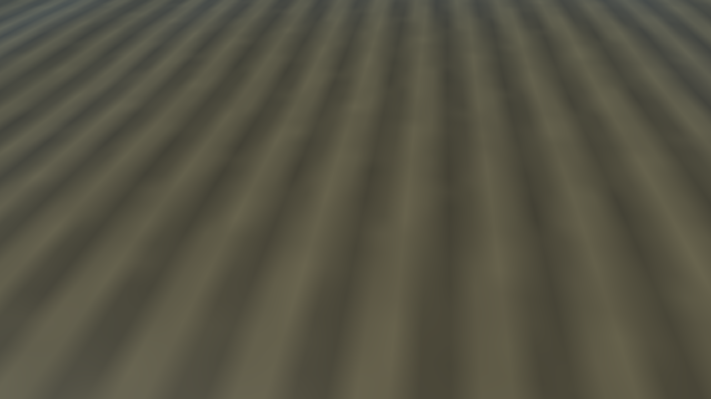
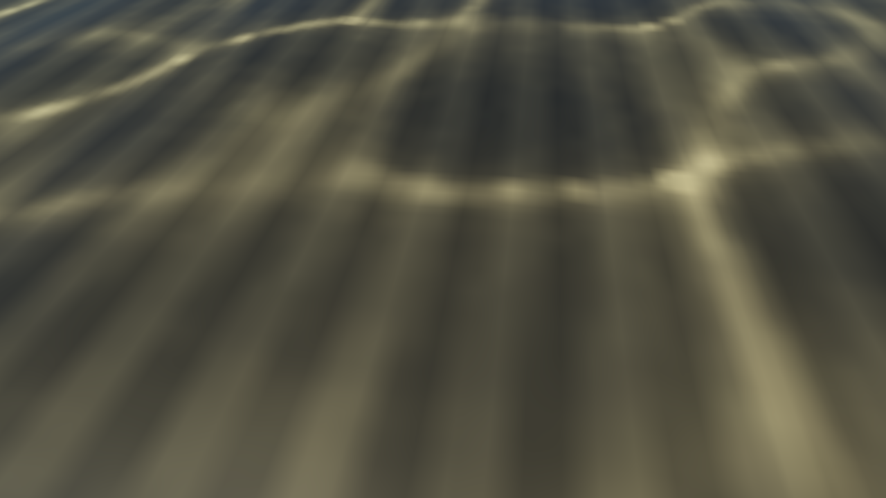
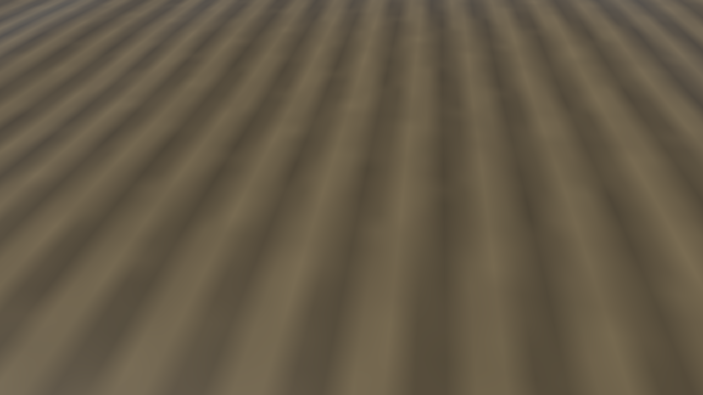
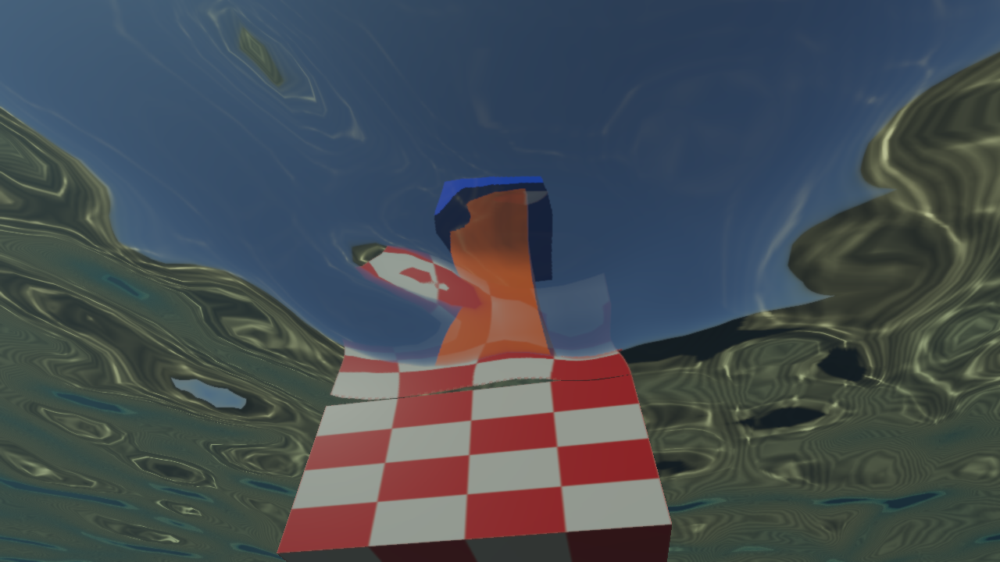
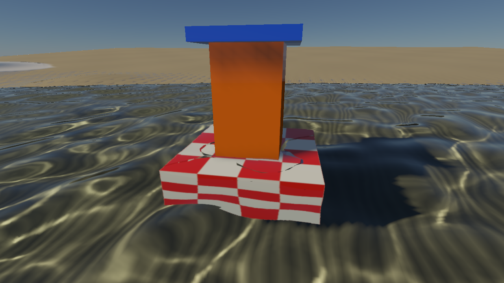

# 水底细节与实时 FFT 焦散

当前已升级为三层覆盖与水下网格接收，见 [分级焦散与礁石接收](water-caustic-cascades.md)。下方保留初版 16 m 高度场方案的实现和验收数据。

2026-10-07。实时水底增加细砂纹、法线微起伏和可开关的太阳折射焦散。焦散来自当前 FFT／浅水波面，通过同一张世界坐标贴图进入水下直视、水上透射和水下水面反射的水底照明。

## 查看与复现

```sh
./build/Scene-Renderer --classic coastal-seabed --size 1280x720
SCENERENDERER_DISABLE_PIPELINE_DISK_CACHE=1 SCENERENDERER_GPU_PROFILE=1 ./build/Scene-Renderer --render-gallery img/diagnostics/water/seabed-demo seabed-gallery
```

`coastal-seabed` 与 `coastal-underwater` 共用场景，前者将镜头朝向水底。按住鼠标右键转向，WASD 移动，Q／E 升降。Ocean 面板的 **FFT seabed caustics** 控制焦散，**Caustic strength** 在 0–1 之间调节；**Underwater distance fog** 控制观察段消光与散射。其他预设的焦散保持默认关闭。

| 同镜头关闭焦散 | 开启焦散，8 s |
| --- | --- |
|  |  |

| 8.35 s | 关闭水下观察雾 |
| --- | --- |
|  |  |





## 修复与实现

砂纹原来的周期约 1 m，1024² 纹理覆盖 128 m，近景呈现几条宽缓色带。演示砂底改为约 25 cm 的纹理起伏，使用 2048² 颜色／法线纹理；细法线对应约 2 mm 高度，地形几何保留较大的厘米级起伏。水体稳定高度／颜色图的分辨率现在取高度与颜色源中较大的一项，颜色上限 2048，高度源上限 1024，通过双线性重采样保留原来的高度场。这样，精细颜色不会被较粗高度源抹平。

稳定水底颜色还会乘地形材质的 albedo factor，避免捕获与屏幕外高度场回退使用不同材质颜色。演示砂色已经包含在贴图中，材质乘色设为白色。验收流程启用异步虚拟纹理反馈，与应用采用相同的近景页面加载路径；元数据保留驻留页、反馈量与 mip 分布。

焦散采用前向折射光子网格：

1. 相机附近 16×16 m 接收区域使用 512² 焦散图，约 3.125 cm／texel。257² 源网格覆盖 24×24 m，为斜射光预留每侧 4 m 边界。相机按源网格间距 9.375 cm 平移，等于接收图的三个 texel，重叠区域的世界光子采样点保持一致。
2. 从当前大／小 FFT 位移和法线、局部浅水状态重建波面，反解水平位移采样位置。按 Snell 定律折射太阳方向，有限步进并二分查找稳定水底高度场。
3. 每个光子携带 Fresnel 透过率、Beer 消光和倾斜波面接受的太阳通量。源三角形投影到水底，以源面积／接收面积分配照度；加法混合自然累积重叠的光束。含未命中顶点的三角形整体裁掉，避免无效顶点拉出假覆盖区域。
4. 3×3 二项式过滤后，除以当前宏观／浅水水位下的平滑太阳照度。接收面斜率与太阳折射方向参与归一化，防止重复计算斜射投影、Fresnel 和深度衰减。
5. 捕获与水底回退只调制所追踪太阳的直接照明。天空、物体自发光和观察段散射使用原来的路径；高度匹配抑制纹路落在离开水底的物体上，贴图边缘平滑退回原照明。夜间、干区和未命中位置不保留旧纹路或产生黑块。

方案参考 [NVIDIA 的光子投射与网格焦散累加介绍](https://developer.nvidia.com/blog/generating-ray-traced-caustic-effects-in-unreal-engine-4-part-2/)，此处实现针对现有 FFT 和高度场，不依赖 RTX 硬件光追。渲染命令中增加 ray compute → additive mesh → normalization compute 三段，没有逐帧 CPU 回读或新增等待。

为了符合现有每组 8 个绑定和 Metal sampler 数量限制，小 FFT 泡沫同时打包到法线 alpha，水面复用原有 detail-foam 槽绑定焦散。独立泡沫图仍保留，专项测试检查两份数据一致。RHI 新增加法混合状态，Metal／Vulkan／OpenGL 保持原 alpha 混合的默认行为，管线缓存键包含新状态。

## 验证与性能

Metal API／GPU Shader Validation 和 Vulkan/MoltenVK 的 `--water-self-test` 验证以下项目：平面照度、斜射与消光归一化、宏观水位变化、波面聚焦的面积能量、相位变化、相机移动的重叠区域一致性、全干与部分缺失光子的覆盖、夜间旧状态清除，以及精细颜色分辨率与材质乘色。既有 Beer／散射、双向折射、全反射、捕获遮挡、TSAA 和 FFT 回归继续通过。

最终数值与分阶段耗时见下方自动汇总。焦散图是带限的高度场近似：投影面积倍率上限 20，输出倍率上限 8，用有限面积过滤控制奇点。它只覆盖相机附近水底，不包含翻卷浪、任意离底网格、多次反射光子或体积焦散；原有水中体积散射继续独立计算。

精细演示的稳定高度／颜色图从 1024² 提升到 2048²，RGBA32F GPU 图从 16 MiB 增至 64 MiB。焦散固定资源约 12 MiB，关闭功能后跳过三段 GPU 工作。当前以效果验收为目标。

<!-- measured-seabed-results -->

Metal 与 Vulkan 均测得平面平均增益 **0.99998**，带 RGB 消光的斜射增益约 **1**；小幅解析波面的平均增益 **1.00084**，范围 **0.933105–1.07324**。相位改变后的平均绝对增益变化为 **0.0148747**。这些结果来自独立光子场夹具，不以演示图像代替能量验证。四项 CPU／RHI 合约测试通过。

Apple M4，Metal，1280×720，固定 8 s 场景，每模式 64 帧，去掉前 4 帧。GPU counters 开启，Metal 验证层关闭。以下为各阶段区间中位数，单位 ms：

| 阶段 | 水底视角 | 水上透射视角 |
| --- | ---: | ---: |
| 折射光子与高度场命中 | 0.199 | 0.203 |
| 投影网格与通量累加 | 3.688 | 9.825 |
| 过滤与照度归一化 | 0.192 | 0.170 |

主渲染提交中位数：水底开启焦散 **37.47 ms**，关闭 **38.66 ms**；水上开启 **58.68 ms**。这些提交包含捕获、场景、水面、TSAA 和色调映射，排除单独提交的 FFT／浅水模拟、纹理反馈与截屏。本轮关闭模式的总提交中位数反而更高，这组顺序对照不足以估计焦散净增量。阶段区间可能重叠且受 GPU 负载影响，不能把三段相加当作独占帧时间增量，也不能由此推算应用完整帧率。当前焦散工作的大头是投影网格；后续优先压缩无效光子三角形、按可见水底调整采样区域，再进行交替模式性能对照。

同视角开关焦散的编码 RGB 平均绝对差为 **0.04659**，8→8.35 s 的差为 **0.07607**。这些是图像变化量，时间对照同时包含波面／浅水状态变化，不作为光学误差。

[逐镜头与分阶段元数据](../img/diagnostics/water/seabed-demo/coastal-underwater-water-metrics.json)、[图像变化量](../img/diagnostics/water/seabed-demo/image-metrics.json)、[采集日志](../img/diagnostics/water/seabed-demo/gallery.log)、[Metal 校验](../img/diagnostics/water/seabed-demo/metal-validation.log)、[Vulkan 校验](../img/diagnostics/water/seabed-demo/vulkan-validation.log)、[CPU 合约检查](../img/diagnostics/water/seabed-demo/cpu-tests.log)。原始水底捕获与物理颜色图集保存在同目录，供排查纹理与合成问题。
