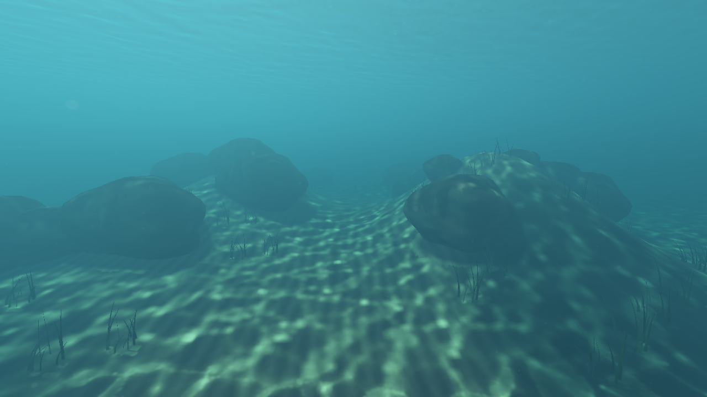
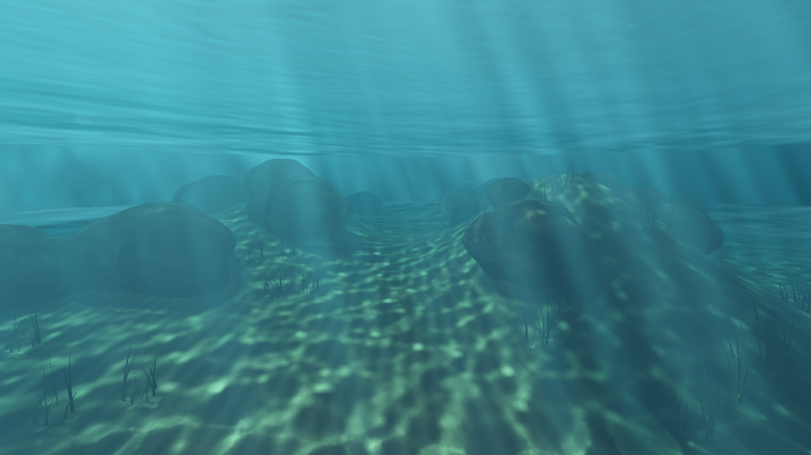
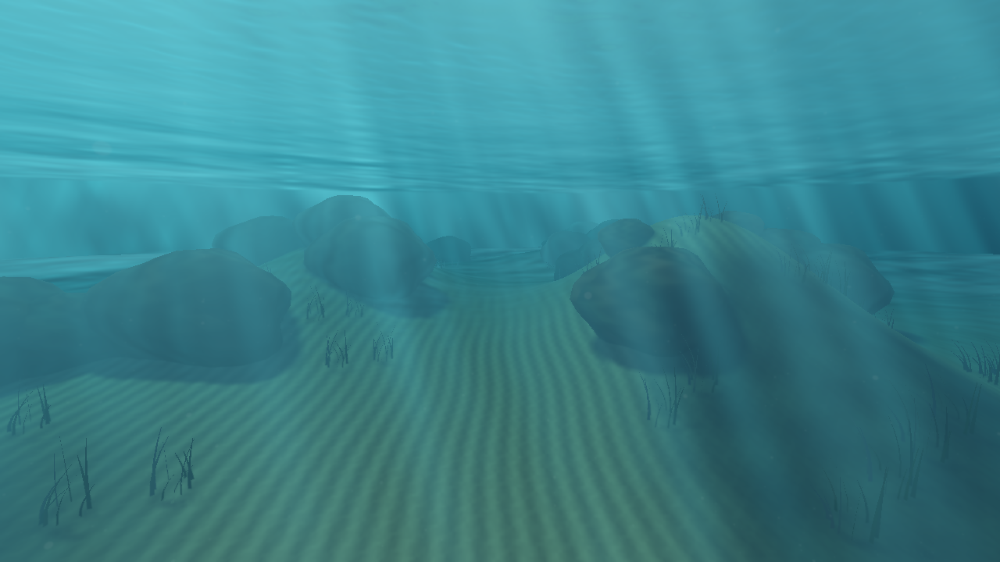

# 水下太阳光束

本报告图像与性能来自透明窗口修复之前、散射增益为 3 的历史采集。当前增益改为 1，增加水上浮标与宽空气侧捕获；最新画面与耗时见 [透明天空窗口与空气侧折射](water-air-refraction.md)。

2026-10-07。`underwater-dive` 现在同时展示水体中的太阳光束和海床上的焦散。光束来自实时 FFT 波面折射后的光通量变化；默认潜水视角保持位置、方向、太阳和曝光一致，方便比较。

| 关闭光束 | 开启光束 |
| --- | --- |
|  |  |

关闭海床焦散后，水体中的光束仍然存在：



## 实现

1. 在相机附近、固定世界网格上读取 FFT 位移和法线，按 Snell 定律计算入水方向。短波法线按光子网格足迹过滤，避免把无法采样的细波变成大条纹；启用岸边浅水模拟时混合其坡度。
2. 同一批光线投射到 **0、1.5、3、5、8、12、20、32 m** 八个水平深度层。三角形源面积与投射面积之比给出局部光通量；重叠区域累加，有限足迹过滤约束焦点奇异值。平静水面的相对通量为 1。
3. 深度层打包为一个 2048×256 atlas，覆盖太阳对齐的 48×48 m 区域。沿平均入水方向的坐标让直光束在相邻层间对齐；层间线性插值，覆盖边缘与 24–32 m 深度渐隐到原有均匀照明。
4. 水下观察段与水面内反射段使用同一个采样函数。局部通量只调制已有太阳散射项，继续使用 HG 相函数、太阳方向阴影和 Beer 衰减。场景深度、水面出口和有限水域仍截断观察光路。吸收和 Fresnel 不在光通量场重复累计。

光通量生成不读取海床，不依赖 `FFT seabed caustics`。夜间、关闭效果、强度为零、关闭体积积分或水下雾时不更新此场，也不会读取旧帧结果。没有新增每帧 CPU 回读。新增固定 GPU 资源约 **16 MiB**。

水面法线纹理的 alpha 已包含与独立泡沫纹理相同的数据；水面着色复用该通道，将空出的采样槽用于光束 atlas，维持现有 RHI 绑定组和纹理槽限制。

## 操作与复现

Ocean 面板中：

- **Underwater sun shafts**：独立开关。其他预设默认关闭，潜水预设默认开启。
- **Sun shaft contrast**：0–3；默认演示 1.8。它放大相对单位照度的明暗变化，0 等价于关闭；1 为原始相对通量。
- **Underwater volume samples**：4–32；潜水预设改为 32，以更好地采样光束。低样本数可能出现条带。

按住右键转头，WASD 移动，Q／E 下潜／上浮。默认平视能看到礁石后方的斜向明暗光束；稍抬头可观察光束连接到波动的水面。

```sh
SCENERENDERER_DISABLE_PIPELINE_DISK_CACHE=1 \
  ./build/Scene-Renderer --render-gallery img/diagnostics/water/sun-shafts dive-shafts-gallery
./build/Scene-Renderer --classic underwater-dive --size 1280x720
```

固定 1280×720，32 帧／模式；输出光束开关、海床焦散关闭、8→8.35 s 波面更新、抬头开关，以及颗粒、水体、水上视角对照。HDR 全部检查有限值。默认镜头光束开关的 8-bit RGB 平均绝对差为 4.32／255，背景水体区域为 6.18／255；时间对照包含波面、海床焦散和颗粒更新，不能单独归因于光束。

## 验证与耗时

Metal API／Shader Validation、水体自检、Vulkan 水体自检通过。新增检查包括八层平静水面的能量、光通量场与吸收系数无关、无海床依赖、波浪聚光及时间变化、夜间与干燥区域不发光，以及最终体积积分的关闭／零强度一致性。解析波在 5 m 深处平均／最小／最大通量约 **1.00254／0.38696／2.16797**，改变波相位后的平均绝对变化为 **0.19369**。原有几何遮挡、单次眼睛光程、界面折射、TIR 和切换回归继续通过。

Apple M4／Metal 主渲染提交 GPU 中位数：

| 模式 | GPU ms |
| --- | ---: |
| 默认视角，光束开启 | 76.73 |
| 同镜头，光束关闭 | 72.40 |
| 同镜头，海床焦散关闭，光束开启 | 67.46 |
| 抬头朝太阳，光束开启 | 78.99 |
| 同抬头视角，光束关闭 | 72.59 |

计时包含光通量生成、捕获、场景、水体与后处理，排除单独提交的 FFT；排除前四帧。模式顺序采集，差值约 4–6 ms 只能作为本次效果开销的粗略参考，温度和负载也会影响结果。未启用阶段 counters，不能将这些数据当作单项 pass 的耗时；主提交耗时也不是完整应用 FPS。

目前是有限区域、八层深度、单次散射的近似：没有完整三维多次散射，也没有对每条折射光线追踪水中遮挡；遮挡沿用现有太阳方向阴影图。场外和深水会平滑回到均匀散射，过大的对比或低积分样本会损失能量精度或出现条带。有限深度切片不能完整表达所有尖锐焦点、翻卷浪和水体中的彩色多次折射。

[采集与 GPU 样本](../img/diagnostics/water/sun-shafts/underwater-dive-water-metrics.json)、[图像变化量](../img/diagnostics/water/sun-shafts/image-comparisons.json)、[Metal 日志](../img/diagnostics/water/sun-shafts/metal-validation.log)、[Vulkan 日志](../img/diagnostics/water/sun-shafts/vulkan-validation.log)、[CPU 合约检查](../img/diagnostics/water/sun-shafts/cpu-tests.log)。
