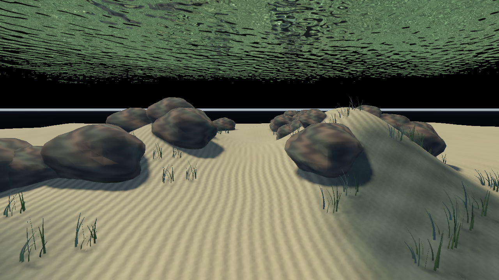
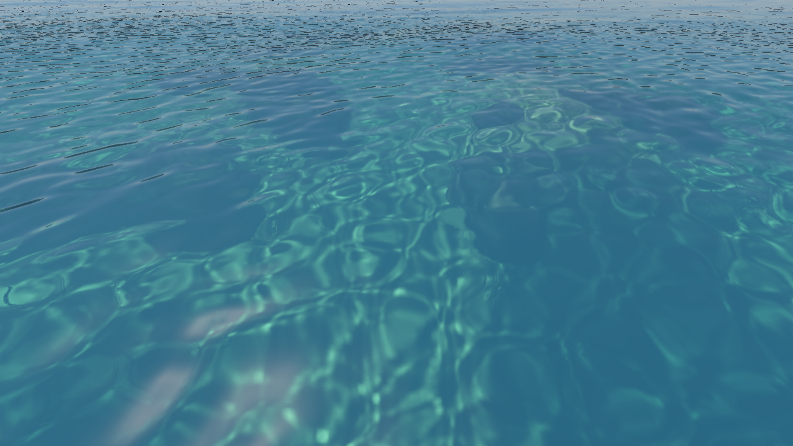

# 海底潜水场景

2026-10-07。`underwater-dive` 面向置身海底的整体体验，使用原生 Metal／Vulkan 实时渲染。

```sh
./build/Scene-Renderer --classic underwater-dive --size 1280x720
```

相机从 `(0,-6,-12)` 出发，海平面为 0 m，沙地深约 10 m。平视前方的沙沟，两侧有礁石、起伏的礁坡和海草，远处逐渐融入水体。礁石和海草分别合并为一个网格，避免每块石头、每片草单独提交绘制。当前礁石与海草是程序化示意资产；海草没有摆动动画。

按住右键移动鼠标转头，WASD 移动，Q 下潜、E 上浮，Shift 加速。抬头看波动的水面；上浮穿过海平面后可俯视透射到海底的景象。相机使用自由飞行，没有地形碰撞。


## 水体、光照与悬浮物

潜水场景的散射增益现为 1；新增水上浮标、宽空气侧捕获和太阳圆盘透射。Camera → View pitch 约 68° 可检视天空窗口，效果、原参数对照和限制见 [透明天空窗口与空气侧折射](water-air-refraction.md)。

RGB 吸收系数为 `(0.13,0.032,0.018)` /m，散射系数为 `(0.012,0.035,0.048)` /m。Beer 透射随真实水中距离衰减：20 m 观察段的 RGB 透射约 `(0.058,0.262,0.267)`，红色优先损失，近处保留细节，远处呈蓝绿色。90 m 是积分距离上限，不代表能见度为 90 m。

水下观察段和水面内反射段继续使用共享水体传输函数；眼睛到界面的水中段只累计一次。太阳入水后的 Fresnel、太阳光程的吸收以及场景阴影进入体积散射。该预设现在使用 32 个积分样本，并启用随 FFT 波面变化的水下太阳光束；其他场景保留 4 步默认值。折射光通量在八个水深平面上投射，再沿实际水中观察段采样。算法、同镜头对照与成本见 [水下太阳光束](water-sun-shafts.md)。

悬浮颗粒使用 0.65 m 世界空间格子与确定性整数哈希生成，半径 4–10 mm，随仿真时间缓慢漂移。沿实际光线做最多 48 个格子的 DDA 查询，最长覆盖前方 14 m，并在最近几何、水面出口或水域边界处终止。像素足迹软化小颗粒，距镜头 0.45 m 内不画颗粒，避免大圆点遮住画面。颗粒的局部散射是视觉近似：亮度使用水深与眼睛光程衰减，未为每个颗粒单独计算太阳阴影或多次散射。

FFT 焦散使用 16／48／128 m 三层覆盖，调制海床与独立礁石的直接日照。接收捕获、层级过渡、同镜头开关对比及限制见 [分级焦散与礁石接收](water-caustic-cascades.md)。

Ocean 面板可调整：

| 控件 | 用途 |
| --- | --- |
| Underwater distance fog | 关闭水中观察段吸收／散射与颗粒，便于比较 |
| Integrate water volume | 关闭散射与颗粒，保留 Beer 吸收 |
| Underwater volume samples | 水下观察／内反射段 4–32 步，平衡遮挡采样质量与耗时 |
| Wide air refraction | 恢复原相机视野外的水上物体；关闭可减少空气侧捕获 |
| Underwater sun shafts | 独立开关水体中的太阳光束 |
| Sun shaft contrast | 0–3 的聚光明暗对比，0 等价于关闭 |
| Suspended underwater particles | 开关悬浮物，其他预设默认关闭 |
| Particle density | 0–1 的格子占用率，0 等价于关闭 |
| FFT seabed caustics | 开关太阳焦散 |
| Near / mid / far caustics | 开关三层覆盖，关闭后只保留近层 |
| Caustics on submerged meshes | 开关礁石等网格的接收捕获 |
| Short wave ripples | 开关近距离 FFT 短波 |
| Absorption / Scattering | 调整颜色衰减与浑浊程度 |

## 同镜头对照

| 关闭观察段水体效果 | 潜水水体效果 |
| --- | --- |
|  |  |

关闭观察段仍保留太阳穿过水体到海床的衰减，这张图并非无水参考。

| 抬头看水面 | 水上看海底 |
| --- | --- |
|  |  |

可复现采集：

```sh
SCENERENDERER_DISABLE_PIPELINE_DISK_CACHE=1 SCENERENDERER_GPU_PROFILE=1 \
  ./build/Scene-Renderer --render-gallery img/diagnostics/water/caustic-cascades dive-caustics-gallery
```

固定 1280×720，每个视角 32 帧，排除前 4 帧计时。输出潜水平视、关闭颗粒、12 s 波面／颗粒更新、关闭观察段水体、抬头及水上俯视六组 PNG，另有三组焦散开关对照；元数据记录开关、相机、吸收散射系数、积分样本和 GPU 样本。该计时统计主渲染提交，包含捕获、场景、水体和后处理，排除另行提交的 FFT，不作为完整应用 FPS。

以下为初版 16 m 地形焦散的历史数据，设备 Apple M4 / Metal。最新分级焦散的成本见 [分级覆盖报告](water-caustic-cascades.md)。历史主渲染提交 GPU 中位数：

| 模式 | 主提交 GPU 中位数 |
| --- | ---: |
| 潜水平视，16 步＋颗粒 | 56.01 ms |
| 同镜头关闭颗粒 | 52.08 ms |
| 同镜头关闭观察段水体 | 41.53 ms |
| 抬头看水面 | 30.07 ms |
| 水上俯视 | 57.84 ms |

逐阶段 counters 中，平视水下观察段区间为 14.78 ms、水面区间为 33.56 ms、焦散光子投射区间为 0.72 ms。区间可能重叠，并包括 GPU 等待依赖的时间，不能相加当作总耗时。模式按顺序采集，温度与 GPU 负载可能变化，不能把两个中位数的差直接解释为单项效果的净成本。当前预设用于效果审阅，后续优化重点是高采样水体积分、界面光路查询，以及水下／空气两层捕获的几何提交。

[初版性能样本](../img/diagnostics/water/dive-demo/underwater-dive-water-metrics.json)。

## 验证

水体回归包含独立 Beer 衰减、竖直 slab 能量积分（4／16／32 步）、水下太阳遮挡、双向折射、全反射、一次眼睛段衰减、分层捕获、干燥水域、出入水面与 TSAA／resize。新增潜水测试检查颗粒关闭与零占用率等价、固定时间结果确定、仿真时间推进后漂移，以及不穿透贴近相机的遮挡物。六个视角均检查 HDR 有限值。Metal API／GPU Shader Validation 与 Vulkan/MoltenVK 的水体测试通过，四项 CPU／RHI 合约测试通过。

[Metal 验证日志](../img/diagnostics/water/caustic-cascades/metal-validation.log)、[Vulkan 验证日志](../img/diagnostics/water/caustic-cascades/vulkan-validation.log)、[实际采集与耗时](../img/diagnostics/water/caustic-cascades/underwater-dive-water-metrics.json)。
