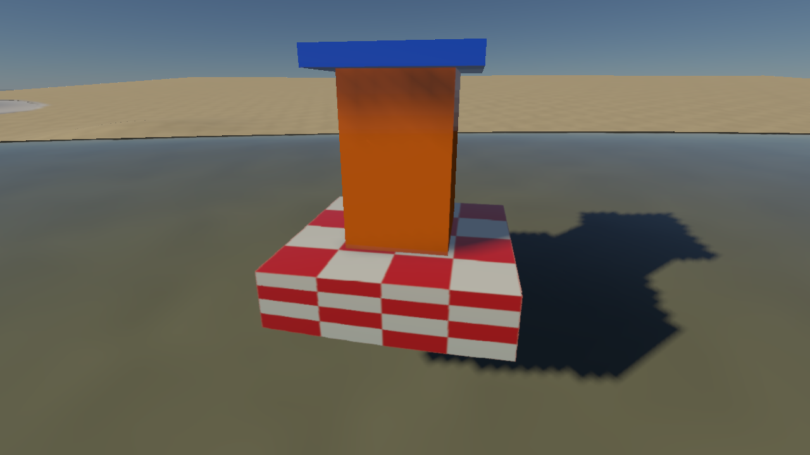
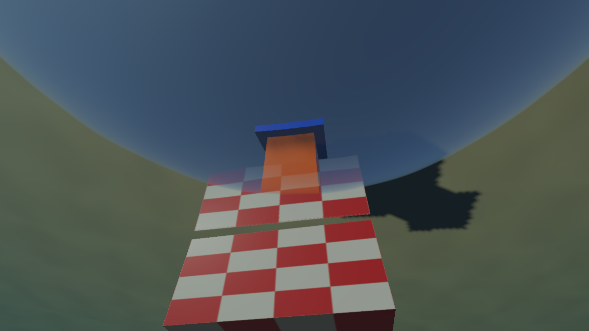
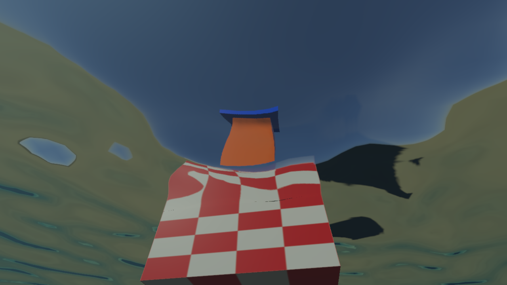
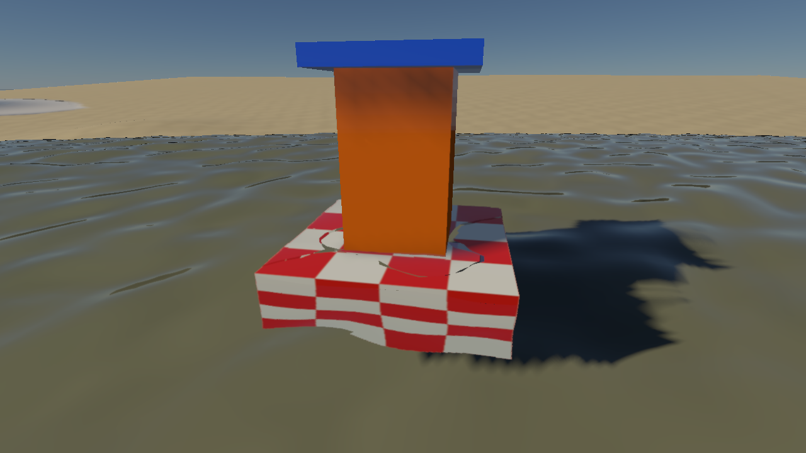
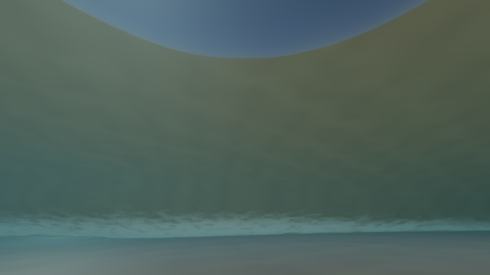
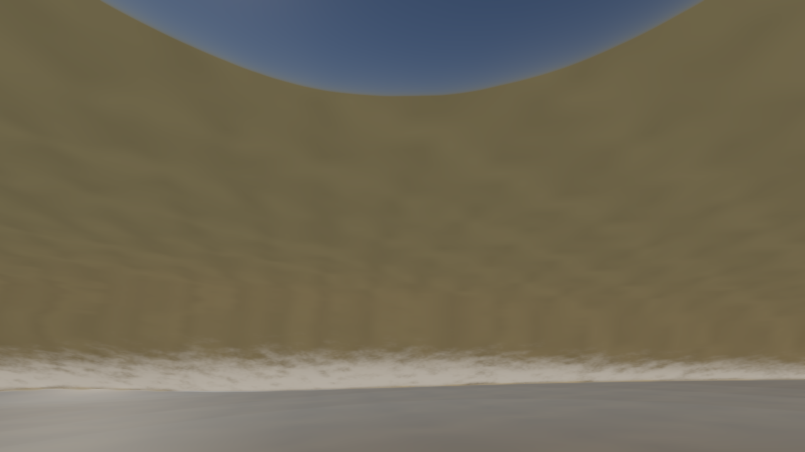
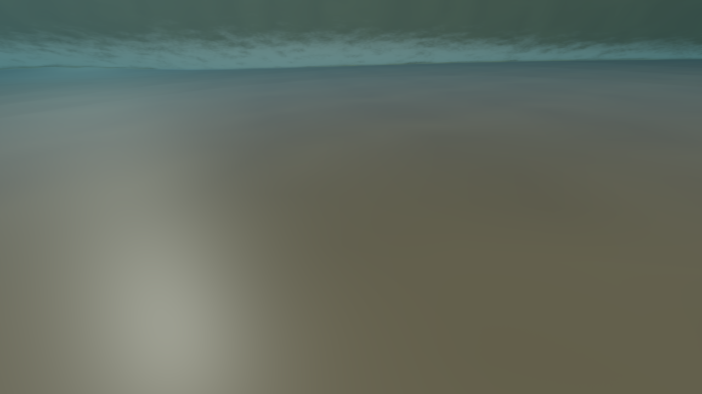
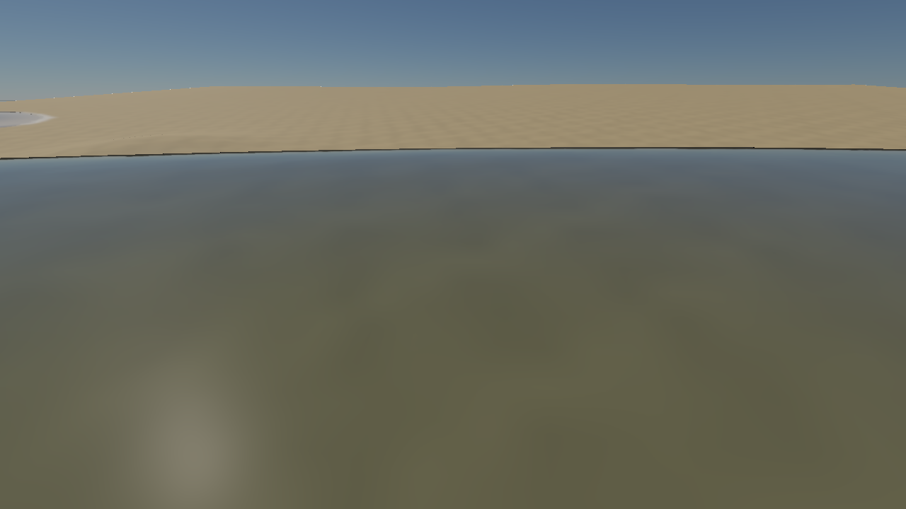

# 实时水下视角与双向水面光学

2026-10-07。原生 Metal／Vulkan 场景管线新增水下距离雾、水下看水面的折射与全反射，保留水上看水底的透射。所有图均由实时管线输出。

## 操作与开关

```sh
./build/Scene-Renderer --classic coastal-underwater --size 1280x720
```

按住右键移动鼠标改变视角；WASD 移动、Q/E 升降、Shift 加速。新预设将相机放在海岸浅水区水面下 1.2 m，可用 E 上升穿越水面。

预设现在包含红白棋盘浮台、橙色标柱和蓝色顶盖，中心位于 `(-7.4, 0, -24.6)`。浮台底部浸入水中，标柱在水面上方；初始仰角为 50°，用于同时观察水线处的轮廓变化和水上物体的折射。物体为静态演示几何，尚未接入浮力或随浪运动。

| 水下看演示物体 | 水上看同一物体 |
| --- | --- |
|  |  |

演示物体暴露了原先单层捕获的问题：相机直线看到的浸水浮台会覆盖空气侧目标的深度，但折射光线可能绕开该浸水部分。现在分别捕获水下和空气侧几何，保留各自最近深度；折射查空气层，水下反射和水上透射查水下层。颜色与位置读取同一命中像素，避免轮廓串色。原图保留用于对照：

| 修复前 | 分层捕获后 |
| --- | --- |
|  |  |

该修复增加一个空气侧捕获 pass，并扩大捕获图集与深度层级；没有宣称提高帧率。屏幕空间查询仍无法恢复同一介质中被遮住的第二层表面，也不能看到屏幕外独立物体。

Ocean 面板新增：

- **Underwater view + total reflection**：启用水下介质识别、出水折射及全反射。
- **Underwater distance fog**：控制观察段和反射段的吸收／散射。
- **Water optical range (m)**：水中最大积分／查询距离，默认 40 m。它不限制水面外空气段的可见距离。
- **Absorption / Scattering**：继续使用 RGB 的每米系数。红色吸收较强时，远处水底自然偏蓝绿。
- **Water scattering strength / Forward scattering g**：散射亮度和各向异性；关闭 Integrate water volume 时，水下仍有 Beer 吸收，但不增加观察段散射光。

Underwater view 与 fog 默认开启；空气侧已有近岸附加效果的开关保持原行为。该扩展作用于原生 RHI 实时管线，未扩展旧 OpenGL 场景渲染器，也不修改 PT。

## 近距离短波修复

水下初始镜头曾表现为平滑的圆形窗口。原有 detail FFT 使用 32 m 周期域，但仍沿用风速约 7.2 m/s 的 Phillips 长波谱，能量集中在十几米至几十米波长；近距离水面几乎是一张局部平面。增加网格密度不能补回频谱中缺少的短波。

现有 256² detail FFT 新增可选 0.5–2 m 径向频段，频段边缘平滑衰减，最短波长保留四个采样点。根据离散谱能量归一化到指定 RMS 高度，避免直接放大 Phillips 振幅同时增加长波；仅当风向／风速、波段、RMS 或高度缩放改变时重新计算归一化。时间推进继续使用深水重力波色散。没有新增 FFT 或捕获 pass。

`coastal-underwater` 默认启用 **Short wave ripples**，**Ripple RMS height (m)** 为 0.025，**Small wave detail** 为 1。关闭 Short wave ripples 回到原来的 detail 谱；关闭 Small FFT waves 关闭整个细节层。其他预设不自动启用短波。短波位移和法线共同作用于水面、双向折射和全反射，近岸仍按水深衰减，不把厘米波纹当作破碎浪花。宏观 FFT 与近岸 SWE 保持原方案。

Snell 窗口本身是水出空气的临界角结果，仍然存在；局部波面法线让其边缘、内部折射和水底反射随时间变化。体积路径仍使用宏观水面高度，毫米至厘米细节不会逐采样重复积分；这仍是非翻卷水面近似。

| 同镜头关闭短波 | 开启短波，8 s |
| --- | --- |
|  |  |

| 开启短波，8.35 s | 水上看波纹与透射 |
| --- | --- |
|  |  |

短波专项检查测得 RMS 高度 **0.0248229 m**，法线水平分量 RMS **0.126326**，频段外能量比例约 **5.4e-14**；验证波谱支持范围、非零法线斜率、8→8.35 s 相位运动和零 RMS 回到平面。另用独立 CPU AABB／Snell 光路检查平面水下标柱：排除轮廓附近像素后，52,758 个内部像素中 34 个误差超过 0.04，平均最大通道误差 0.0003974。该平面参照验证光路，不作为波浪外观参照。

Metal API／GPU Shader Validation 与 Vulkan/MoltenVK `--water-self-test` 均通过，包括既有双向透射、全反射、捕获遮挡和 TSAA 回归。[Metal 日志](../img/diagnostics/water/ripple-demo/metal-validation.log)、[Vulkan 日志](../img/diagnostics/water/ripple-demo/vulkan-validation.log)、[独立光路参照](../img/diagnostics/water/ripple-demo/reference/marker-reference.txt)。截图数据使用验证层与 GPU counters，仅用于图像验收，不作为发布帧率结论；[采集日志](../img/diagnostics/water/ripple-demo/gallery.log)和[逐视角元数据](../img/diagnostics/water/ripple-demo/coastal-underwater-water-metrics.json)保留开关、时间和波高。

## 图像对照

| 水下观察海面 | 同镜头关闭水中雾 |
| --- | --- |
|  |  |

| 抬头看 Snell 窗口 | 俯视水底 |
| --- | --- |
|  |  |

从水上看水底：



## 管线与光学路径

合成次序为不透明场景 → 原始 HDR 拷贝 → 水体捕获 → 水下观察段雾 → 水面界面 → 透明物体 → TSAA → 色调映射。雾 pass 只写 HDR，不清除场景深度或运动向量。

独立捕获层保留物体辐射和位置，尚未施加相机观察段的消光；水底太阳照明本身包含光从水面进入水底的衰减。图集左半裁掉水上几何，右半裁掉水下几何，各保持完整视口分辨率，供透射和反射按介质查询。两层复用原有纹理绑定，符合 Metal 的 16 个 sampler 限制。深度层级按图集坐标读取，射线步进仍按视口像素计算。捕获关闭后会退回当前原始场景，不读取上帧捕获状态。

水下雾使用原始场景位置计算直接观察段，水下物体读取左半捕获的辐射；水上背景保留原始场景颜色，随后由水面界面覆盖。这样，裁掉水上几何后的水下捕获不会把前景的空气侧位置替换成后面的海床。

相机介质依据 FFT 宏观高度、近岸浅水状态、有限网格范围与水域 mask 判断，不仅比较固定 sea level。湿干格可使近岸水域覆盖静态遮罩；干地或床面以下不启用水中雾。界面法线继续包含小波纹。

空气入水的折射比为 1/1.333；水出空气为 1.333/1。水下使用完整的非偏振介质 Fresnel，在约 48.6° 的临界角外将反射权重置为 1，不泄漏天空／水上背景。临界角以内形成 Snell 窗口，波面法线改变折射方向。原空气侧的 Fresnel 美术参数保留。

水上看水底仍沿折射方向查询屏幕深度和独立床面，按水面到水底的距离计算透射。水下看水面时，空气侧未命中由对应折射方向的天空补充；反射查询水下对象。反射水底统一使用稳定高度场，避免屏幕内捕获与屏幕外床面近似之间形成大块着色接缝；屏幕捕获保留床面前方物体的反射。

捕获位置的 w 通道将独立物体标为 1、VT 地形标为 2；深度链仍把所有正值视作有效几何。水上稳健折射命中地形时，复用其交点并使用与床面回退相同的颜色／照明，无需再做完整床面射线搜索。独立物体保留捕获材质，地形 LOD 与稳定床面的小误差不会被误识别为独立反射物体。

水下看普通物体，路径为相机到物体；水下看界面，路径为相机到界面；水下反射另外计算界面到反射交点的段。界面最终覆盖先前雾 pass 的像素，并从未施加观察段雾的背景重新合成，所以观察段只积分一次。

对每段距离 d，消光系数 σt = σa + σs，背景乘以 exp(-σt d)。四个分段计算单次散射，使用每段的解析消光权重、HG 相函数、入水太阳的衰减、天空近似源项和现有 CSM 阴影图集的 2×2 PCF。视野雾沿射线用 16 个检查点寻找宏观波面的首次出口，再二分细化；同时裁剪到有限海面域。

空气侧出射搜索使用相机远裁剪范围；水中段由 optical range 限制。水下界面像素的运动历史置信度设为零，避免把屏幕空间命中和快速变化的临界角边界当作可靠的材质运动；开启／关闭功能及穿越平均水位也会失效相关 TSAA 历史。

## 验证

`--water-self-test` 新增独立 GPU 回归：

- 零消光水下水底保持原背景，非零吸收符合独立 Beer 距离计算；关闭 fog 恢复，关闭捕获无旧状态残留。
- 垂直平水体对连续单次散射积分的能量误差小于 0.002 HDR；屏幕外太阳遮挡物能降低观察段散射。
- 水下看水上发光平面，Fresnel 与独立法向公式一致；相机到界面只有一段吸收，空气段不增加水中消光。
- 60 m 高的空气侧目标仍可折射看到；30° 入射透射，60° 入射全反射；稳定床面支持屏幕外的水底反射。
- 一个小空气侧目标被相机直线上的浸水物体遮住、但未被解析折射光线遮住时，分层捕获能保留目标；关闭捕获的反例必须丢失目标。空气侧位置也不会泄漏到水下层。
- 干 mask 不产生雾，正负水位相机切换、活动 TSAA、47×33 重建和功能切换均保持有限 HDR。

上述验证同时执行既有海洋 FFT、大气、水上透射／散射、SWE 和 TSAA 回归。Metal 开启 API／GPU Shader Validation；Vulkan 使用本地 MoltenVK，当前环境没有 Khronos validation layer。

[Metal 日志](../img/diagnostics/water/underwater-metal-validation.log)；[Vulkan 日志](../img/diagnostics/water/underwater-vulkan-validation.log)；[截图日志](../img/diagnostics/water/underwater-gallery.log)；[每个视角的 GPU 样本](../img/metal/coastal-underwater-water-metrics.json)。

Metal API／Shader Validation 与 Vulkan 水体验证均通过，四项 CPU 的 engine-concurrency、image-decoder、RHI contract、graphics contract 检查通过。

分层修复的 GPU 回归另外保存：[Metal](../img/diagnostics/water/object-fix/metal-validation.log)、[Vulkan](../img/diagnostics/water/object-fix/vulkan-validation.log)。原始验收与性能日志保留，不覆盖。

## 本轮 GPU 成本

Apple M4、macOS 15.3.1、Release、1280×720；开启原生 stage-boundary counters，关闭 pipeline 磁盘缓存，每个固定视角 16 帧、去掉前 4 帧。主提交包含捕获、场景、水面、雾、TSAA 和色调映射；不包含分别提交的 FFT／SWE 和呈现，不能据此声称编辑器达到相同 FPS。模拟固定在 8 s，未统计相机移动与持续推进浅水模拟的成本。

以下性能数据和本节原始截图在添加演示物体之前采集，水下初始仰角为 25°。当前预设的物体、50° 仰角及演示光照会改变开销；上方物体截图单独存放，不替换原始性能记录。

| 视角 | 主 GPU 提交中位数 | 观察段雾阶段 | 水面阶段 |
| --- | ---: | ---: | ---: |
| 水下默认 | 28.17 ms | 3.41 ms | 10.21 ms |
| 同镜头关闭雾 | 22.98 ms | 0 | 8.15 ms |
| 抬头看窗口 | 19.14 ms | 3.37 ms | 6.92 ms |
| 俯视水底 | 28.34 ms | 4.45 ms | 4.36 ms |
| 水上看水底 | 29.76 ms | 0.72 ms | 7.46 ms |

不同阶段有重叠，表中阶段不能相加得到主提交时间。关闭雾同时关闭界面眼侧与反射段的体积积分，因此主提交差值也不等于单个 fullscreen pass 的成本。空气侧雾 shader 会拒绝着色，仍有分类、编码器和附件成本。本轮保留全分辨率积分，没有以关闭效果或降低分辨率追求 60 FPS。

[性能摘要](../img/diagnostics/water/underwater-performance-summary.json)；[原生时间戳](../img/diagnostics/water/underwater-gallery-profile.json)。实际 VT 地形的捕获标签已由截图入口计数检查；这覆盖了同时带 VT／岸线特征的地形材质。

用当前预设生成新的截图与性能记录（不会覆盖原始记录）：

```sh
SCENERENDERER_GPU_PROFILE=1 \
SCENERENDERER_GPU_PROFILE_OUTPUT=img/diagnostics/water/object-demo/profile.json \
SCENERENDERER_DISABLE_PIPELINE_DISK_CACHE=1 \
./build/Scene-Renderer --render-gallery img/diagnostics/water/object-demo underwater-gallery
```

## 当前近似与范围

观察段和反射段采用单次体积散射。原有多次散射 slab LUT 继续用于空气侧水面出射，没有将其表面出射响应直接用作水下局部雾，也没有实现空间 BSSRDF。

屏幕外的独立物体仍可能缺失反射／折射；床面回退仅适用于高度场。床面反射使用已编码的床面颜色与近似照明，不含完整 PBR 法线和所有纹理细节。折叠、翻卷波不是单值高度场，该实现不追踪其多重界面。宏观体积边界和界面细波之间可能存在很薄的分类差异。

本轮雾合成覆盖不透明物体和专用水面；后续普通透明物体／粒子尚未接入同一水体观察段。四段积分与有限距离是实时近似，未宣称与完整体积 PT 图像一致。

主要代码：[界面与折射](../src/rhi/shaders/ocean-surface.frag)、[水下视野雾](../src/rhi/shaders/water-underwater.frag)、[共享介质积分](../src/rhi/shaders/water-medium.glsl)、[捕获](../src/rhi/shaders/water-capture.frag)、[调度与绑定](../src/renderer/rhi/OceanSurface.cpp)、[回归](../src/renderer/rhi/WaterValidation.cpp)。
